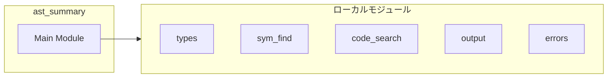
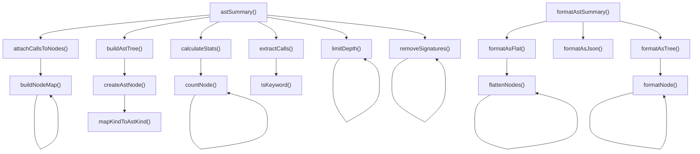
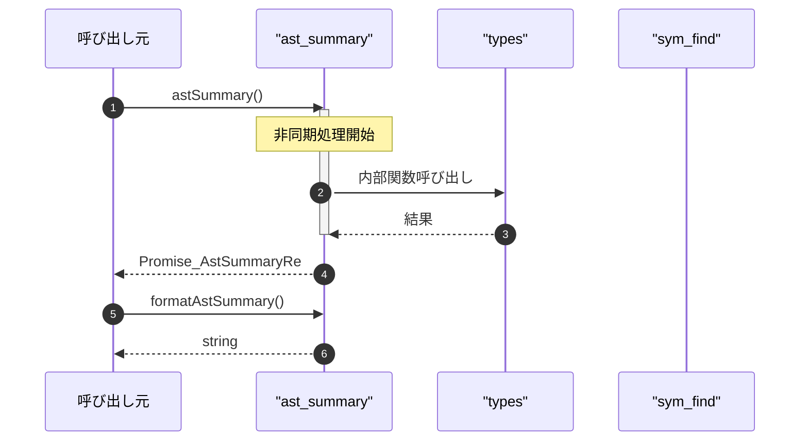

# ast_summary

## 概要

`ast_summary` モジュールのAPIリファレンス。

## インポート

```typescript
// from '../types.js': AstSummaryInput, AstSummaryResult, AstNode, ...
// from './sym_find.js': symFind
// from './code_search.js': codeSearch
// from '../utils/output.js': createErrorResponse
// from '../utils/errors.js': SearchToolError, isSearchToolError, getErrorMessage
```

## エクスポート一覧

| 種別 | 名前 | 説明 |
|------|------|------|
| 関数 | `astSummary` | AST要約を実行 |
| 関数 | `formatAstSummary` | AST要約結果をフォーマット |

## 図解

### 依存関係図



### 関数フロー



### シーケンス図



## 関数

### mapKindToAstKind

```typescript
mapKindToAstKind(kind: string): AstNodeKind | null
```

ctagsのkindをAstNodeKindに変換

**パラメータ**

| 名前 | 型 | 必須 |
|------|-----|------|
| kind | `string` | はい |

**戻り値**: `AstNodeKind | null`

### createAstNode

```typescript
createAstNode(sym: SymbolDefinition): AstNode
```

シンボル定義からASTノードを作成

**パラメータ**

| 名前 | 型 | 必須 |
|------|-----|------|
| sym | `SymbolDefinition` | はい |

**戻り値**: `AstNode`

### buildAstTree

```typescript
buildAstTree(symbols: SymbolDefinition[]): AstNode[]
```

シンボルリストからASTツリーを構築

**パラメータ**

| 名前 | 型 | 必須 |
|------|-----|------|
| symbols | `SymbolDefinition[]` | はい |

**戻り値**: `AstNode[]`

### extractCalls

```typescript
async extractCalls(file: string, symbols: SymbolDefinition[], cwd: string): Promise<void>
```

関数/メソッド内の呼び出しを抽出

**パラメータ**

| 名前 | 型 | 必須 |
|------|-----|------|
| file | `string` | はい |
| symbols | `SymbolDefinition[]` | はい |
| cwd | `string` | はい |

**戻り値**: `Promise<void>`

### isKeyword

```typescript
isKeyword(name: string): boolean
```

JavaScript/TypeScriptの予約語かどうかを判定

**パラメータ**

| 名前 | 型 | 必須 |
|------|-----|------|
| name | `string` | はい |

**戻り値**: `boolean`

### limitDepth

```typescript
limitDepth(nodes: AstNode[], maxDepth: number, currentDepth: any): void
```

ツリーの深度を制限

**パラメータ**

| 名前 | 型 | 必須 |
|------|-----|------|
| nodes | `AstNode[]` | はい |
| maxDepth | `number` | はい |
| currentDepth | `any` | はい |

**戻り値**: `void`

### calculateStats

```typescript
calculateStats(nodes: AstNode[]): { totalClasses: number; totalFunctions: number; totalMethods: number; totalVariables: number }
```

ASTノードの統計を計算

**パラメータ**

| 名前 | 型 | 必須 |
|------|-----|------|
| nodes | `AstNode[]` | はい |

**戻り値**: `{ totalClasses: number; totalFunctions: number; totalMethods: number; totalVariables: number }`

### countNode

```typescript
countNode(node: AstNode): void
```

**パラメータ**

| 名前 | 型 | 必須 |
|------|-----|------|
| node | `AstNode` | はい |

**戻り値**: `void`

### astSummary

```typescript
async astSummary(input: AstSummaryInput, cwd: string): Promise<AstSummaryResult>
```

AST要約を実行

**パラメータ**

| 名前 | 型 | 必須 |
|------|-----|------|
| input | `AstSummaryInput` | はい |
| cwd | `string` | はい |

**戻り値**: `Promise<AstSummaryResult>`

### attachCallsToNodes

```typescript
attachCallsToNodes(nodes: AstNode[], symbols: SymbolDefinition[]): void
```

呼び出し情報をノードに付加

**パラメータ**

| 名前 | 型 | 必須 |
|------|-----|------|
| nodes | `AstNode[]` | はい |
| symbols | `SymbolDefinition[]` | はい |

**戻り値**: `void`

### buildNodeMap

```typescript
buildNodeMap(nodeList: AstNode[]): void
```

**パラメータ**

| 名前 | 型 | 必須 |
|------|-----|------|
| nodeList | `AstNode[]` | はい |

**戻り値**: `void`

### removeSignatures

```typescript
removeSignatures(nodes: AstNode[]): void
```

シグネチャ情報を削除

**パラメータ**

| 名前 | 型 | 必須 |
|------|-----|------|
| nodes | `AstNode[]` | はい |

**戻り値**: `void`

### formatAstSummary

```typescript
formatAstSummary(result: AstSummaryResult): string
```

AST要約結果をフォーマット

**パラメータ**

| 名前 | 型 | 必須 |
|------|-----|------|
| result | `AstSummaryResult` | はい |

**戻り値**: `string`

### formatAsJson

```typescript
formatAsJson(result: AstSummaryResult): string
```

JSON形式でフォーマット

**パラメータ**

| 名前 | 型 | 必須 |
|------|-----|------|
| result | `AstSummaryResult` | はい |

**戻り値**: `string`

### formatAsFlat

```typescript
formatAsFlat(result: AstSummaryResult): string
```

フラット形式でフォーマット

**パラメータ**

| 名前 | 型 | 必須 |
|------|-----|------|
| result | `AstSummaryResult` | はい |

**戻り値**: `string`

### flattenNodes

```typescript
flattenNodes(nodes: AstNode[], prefix: any): void
```

**パラメータ**

| 名前 | 型 | 必須 |
|------|-----|------|
| nodes | `AstNode[]` | はい |
| prefix | `any` | はい |

**戻り値**: `void`

### formatAsTree

```typescript
formatAsTree(result: AstSummaryResult): string
```

ツリー形式でフォーマット

**パラメータ**

| 名前 | 型 | 必須 |
|------|-----|------|
| result | `AstSummaryResult` | はい |

**戻り値**: `string`

### formatNode

```typescript
formatNode(node: AstNode, prefix: any, isLast: any): void
```

**パラメータ**

| 名前 | 型 | 必須 |
|------|-----|------|
| node | `AstNode` | はい |
| prefix | `any` | はい |
| isLast | `any` | はい |

**戻り値**: `void`

---
*自動生成: 2026-02-24T17:08:02.417Z*
