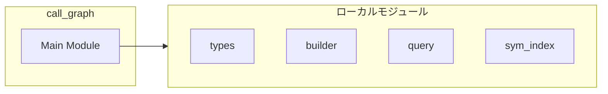
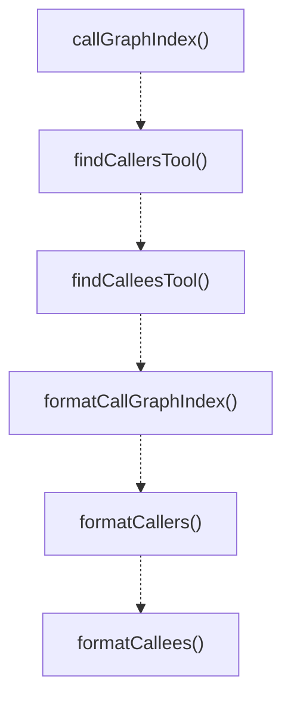
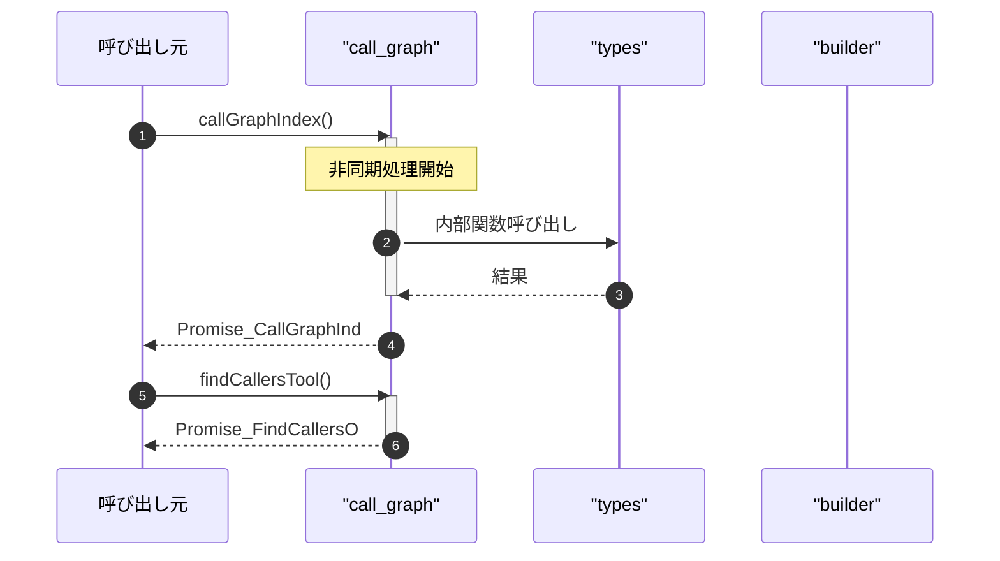

# call_graph

## 概要

`call_graph` モジュールのAPIリファレンス。

## インポート

```typescript
import { CallGraphIndexInput, CallGraphIndexOutput, FindCallersInput... } from '../call-graph/types.js';
import { buildCallGraph, saveCallGraphIndex, readCallGraphIndex... } from '../call-graph/builder.js';
import { findCallers, findCallees } from '../call-graph/query.js';
import { symIndex, readSymbolIndex } from './sym_index.js';
```

## エクスポート一覧

| 種別 | 名前 | 説明 |
|------|------|------|
| 関数 | `callGraphIndex` | 呼び出しグラフのインデックスを生成または更新 |
| 関数 | `findCallersTool` | 指定されたシンボルを呼び出す関数を検索します。 |
| 関数 | `findCalleesTool` | 指定されたシンボルが呼び出す関数を検索 |
| 関数 | `formatCallGraphIndex` | コールグラフのインデックス結果をフォーマット |
| 関数 | `formatCallers` | 呼び出し元の検索結果を整形して文字列で返す |
| 関数 | `formatCallees` | 呼び出し先の検索結果をフォーマットする |

## 図解

### 依存関係図



### 関数フロー



### シーケンス図



## 関数

### callGraphIndex

```typescript
async callGraphIndex(input: CallGraphIndexInput, cwd: string): Promise<CallGraphIndexOutput>
```

呼び出しグラフのインデックスを生成または更新

**パラメータ**

| 名前 | 型 | 必須 |
|------|-----|------|
| input | `CallGraphIndexInput` | はい |
| cwd | `string` | はい |

**戻り値**: `Promise<CallGraphIndexOutput>`

### findCallersTool

```typescript
async findCallersTool(input: FindCallersInput, cwd: string): Promise<FindCallersOutput>
```

指定されたシンボルを呼び出す関数を検索します。

**パラメータ**

| 名前 | 型 | 必須 |
|------|-----|------|
| input | `FindCallersInput` | はい |
| cwd | `string` | はい |

**戻り値**: `Promise<FindCallersOutput>`

### findCalleesTool

```typescript
async findCalleesTool(input: FindCalleesInput, cwd: string): Promise<FindCalleesOutput>
```

指定されたシンボルが呼び出す関数を検索

**パラメータ**

| 名前 | 型 | 必須 |
|------|-----|------|
| input | `FindCalleesInput` | はい |
| cwd | `string` | はい |

**戻り値**: `Promise<FindCalleesOutput>`

### formatCallGraphIndex

```typescript
formatCallGraphIndex(result: CallGraphIndexOutput): string
```

コールグラフのインデックス結果をフォーマット

**パラメータ**

| 名前 | 型 | 必須 |
|------|-----|------|
| result | `CallGraphIndexOutput` | はい |

**戻り値**: `string`

### formatCallers

```typescript
formatCallers(result: FindCallersOutput): string
```

呼び出し元の検索結果を整形して文字列で返す

**パラメータ**

| 名前 | 型 | 必須 |
|------|-----|------|
| result | `FindCallersOutput` | はい |

**戻り値**: `string`

### formatCallees

```typescript
formatCallees(result: FindCalleesOutput): string
```

呼び出し先の検索結果をフォーマットする

**パラメータ**

| 名前 | 型 | 必須 |
|------|-----|------|
| result | `FindCalleesOutput` | はい |

**戻り値**: `string`

---
*自動生成: 2026-02-18T06:37:19.665Z*
