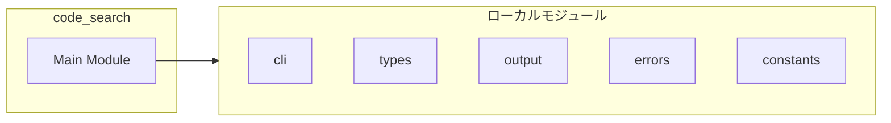
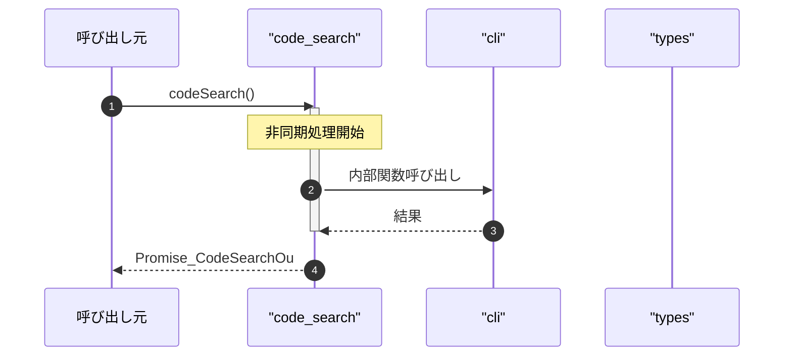

# code_search

## 概要

`code_search` モジュールのAPIリファレンス。

## インポート

```typescript
import { execute, buildRgArgs, checkToolAvailability } from '../utils/cli.js';
import { CodeSearchInput, CodeSearchOutput, CodeSearchMatch... } from '../types.js';
import { truncateResults, parseRgOutput, summarizeResults... } from '../utils/output.js';
import { SearchToolError, isSearchToolError, getErrorMessage... } from '../utils/errors.js';
import { DEFAULT_CODE_SEARCH_LIMIT, DEFAULT_IGNORE_CASE, DEFAULT_EXCLUDES } from '../utils/constants.js';
// ... and 2 more imports
```

## エクスポート一覧

| 種別 | 名前 | 説明 |
|------|------|------|
| 関数 | `codeSearch` | rgを使用したコード検索 |

## 図解

### 依存関係図



### シーケンス図



## 関数

### nativeCodeSearch

```typescript
async nativeCodeSearch(input: CodeSearchInput, cwd: string): Promise<CodeSearchOutput>
```

Pure Node.js code search fallback

**パラメータ**

| 名前 | 型 | 必須 |
|------|-----|------|
| input | `CodeSearchInput` | はい |
| cwd | `string` | はい |

**戻り値**: `Promise<CodeSearchOutput>`

### searchFile

```typescript
async searchFile(filePath: string): Promise<void>
```

**パラメータ**

| 名前 | 型 | 必須 |
|------|-----|------|
| filePath | `string` | はい |

**戻り値**: `Promise<void>`

### shouldExclude

```typescript
shouldExclude(name: string, patterns: readonly string[]): boolean
```

Check if a name matches any exclusion pattern.
Supports both exact matches and glob-style patterns (e.g., *.min.js).

**パラメータ**

| 名前 | 型 | 必須 |
|------|-----|------|
| name | `string` | はい |
| patterns | `readonly string[]` | はい |

**戻り値**: `boolean`

### scanDir

```typescript
async scanDir(dirPath: string): Promise<void>
```

**パラメータ**

| 名前 | 型 | 必須 |
|------|-----|------|
| dirPath | `string` | はい |

**戻り値**: `Promise<void>`

### useRgCommand

```typescript
async useRgCommand(input: CodeSearchInput, cwd: string): Promise<CodeSearchOutput>
```

Use ripgrep command for code search

**パラメータ**

| 名前 | 型 | 必須 |
|------|-----|------|
| input | `CodeSearchInput` | はい |
| cwd | `string` | はい |

**戻り値**: `Promise<CodeSearchOutput>`

### extractResultPaths

```typescript
extractResultPaths(results: CodeSearchMatch[]): string[]
```

Extract file paths from results for history recording.

**パラメータ**

| 名前 | 型 | 必須 |
|------|-----|------|
| results | `CodeSearchMatch[]` | はい |

**戻り値**: `string[]`

### codeSearch

```typescript
async codeSearch(input: CodeSearchInput, cwd: string): Promise<CodeSearchOutput>
```

rgを使用したコード検索

**パラメータ**

| 名前 | 型 | 必須 |
|------|-----|------|
| input | `CodeSearchInput` | はい |
| cwd | `string` | はい |

**戻り値**: `Promise<CodeSearchOutput>`

---
*自動生成: 2026-02-18T07:17:30.284Z*
