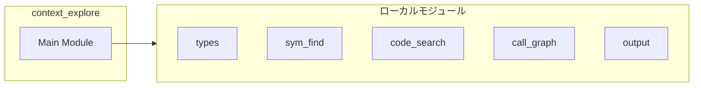
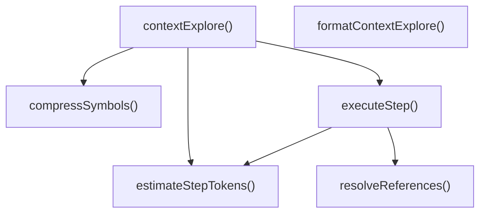
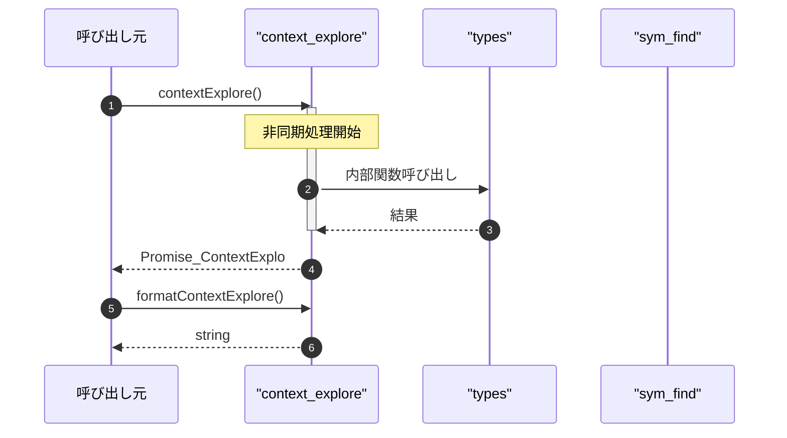

# context_explore

## 概要

`context_explore` モジュールのAPIリファレンス。

## インポート

```typescript
// from '../types.js': ContextExploreInput, ContextExploreOutput, ContextExploreStepResult, ...
// from './sym_find.js': symFind
// from './code_search.js': codeSearch
// from './call_graph.js': findCallersTool
// from '../utils/output.js': estimateTokens, estimateSymbolDefinitionTokens, estimateCodeSearchMatchTokens, ...
```

## エクスポート一覧

| 種別 | 名前 | 説明 |
|------|------|------|
| 関数 | `contextExplore` | 階層的文脈検索を実行 |
| 関数 | `formatContextExplore` | context_exploreの結果をフォーマット |

## 図解

### 依存関係図



### 関数フロー



### シーケンス図



## 関数

### compressSymbols

```typescript
compressSymbols(symbols: SymbolDefinition[], compression: "full" | "signature" | "summary"): SymbolDefinition[]
```

シンボル結果を圧縮

**パラメータ**

| 名前 | 型 | 必須 |
|------|-----|------|
| symbols | `SymbolDefinition[]` | はい |
| compression | `"full" | "signature" | "summary"` | はい |

**戻り値**: `SymbolDefinition[]`

### estimateStepTokens

```typescript
estimateStepTokens(results: unknown[], type: ContextExploreStep["type"]): number
```

結果のトークン数を推定

**パラメータ**

| 名前 | 型 | 必須 |
|------|-----|------|
| results | `unknown[]` | はい |
| type | `ContextExploreStep["type"]` | はい |

**戻り値**: `number`

### resolveReferences

```typescript
resolveReferences(value: string | undefined, previousResults: ContextExploreStepResult[]): string | undefined
```

参照を解決（$0, $1等を実際の値に置換）

**パラメータ**

| 名前 | 型 | 必須 |
|------|-----|------|
| value | `string | undefined` | はい |
| previousResults | `ContextExploreStepResult[]` | はい |

**戻り値**: `string | undefined`

### executeStep

```typescript
async executeStep(step: ContextExploreStep, previousResults: ContextExploreStepResult[], cwd: string): Promise<ContextExploreStepResult>
```

単一ステップを実行

**パラメータ**

| 名前 | 型 | 必須 |
|------|-----|------|
| step | `ContextExploreStep` | はい |
| previousResults | `ContextExploreStepResult[]` | はい |
| cwd | `string` | はい |

**戻り値**: `Promise<ContextExploreStepResult>`

### contextExplore

```typescript
async contextExplore(input: ContextExploreInput, cwd: string): Promise<ContextExploreOutput>
```

階層的文脈検索を実行

**パラメータ**

| 名前 | 型 | 必須 |
|------|-----|------|
| input | `ContextExploreInput` | はい |
| cwd | `string` | はい |

**戻り値**: `Promise<ContextExploreOutput>`

### formatContextExplore

```typescript
formatContextExplore(output: ContextExploreOutput): string
```

context_exploreの結果をフォーマット

**パラメータ**

| 名前 | 型 | 必須 |
|------|-----|------|
| output | `ContextExploreOutput` | はい |

**戻り値**: `string`

---
*自動生成: 2026-02-24T17:08:02.420Z*
