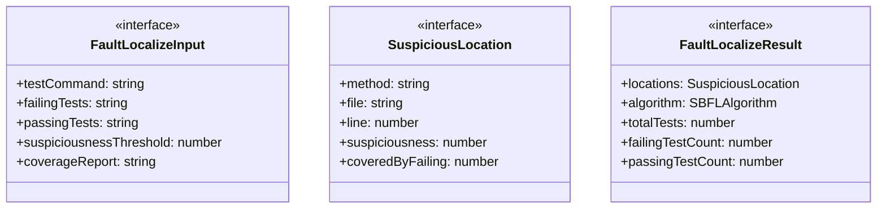
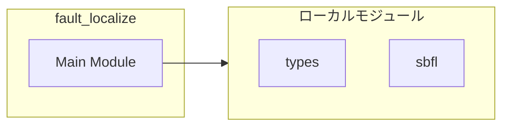
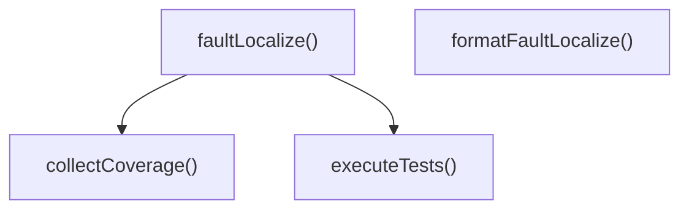
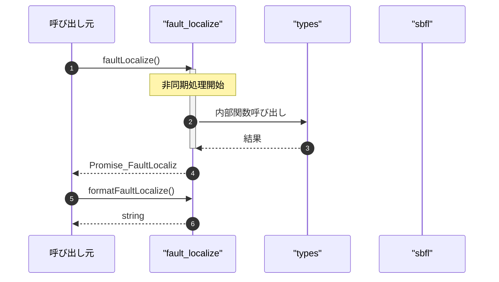

# fault_localize

## 概要

`fault_localize` モジュールのAPIリファレンス。

## インポート

```typescript
// from '../types.js': SearchDetails
// from '../../../lib/sbfl.js': SBFLAlgorithm, CoverageData, LocationSuspiciousness, ...
```

## エクスポート一覧

| 種別 | 名前 | 説明 |
|------|------|------|
| 関数 | `faultLocalize` | バグ位置を特定 |
| 関数 | `formatFaultLocalize` | バグ位置特定結果をフォーマット |
| インターフェース | `FaultLocalizeInput` | バグ位置特定の入力パラメータ |
| インターフェース | `SuspiciousLocation` | 単一の怪しいコード位置 |
| インターフェース | `FaultLocalizeResult` | バグ位置特定の出力結果 |

## 図解

### クラス図



### 依存関係図



### 関数フロー



### シーケンス図



## 関数

### executeTests

```typescript
async executeTests(testCommand: string, cwd: string): Promise<{
	passingTests: string[];
	failingTests: string[];
	executed: boolean;
	error?: string;
}>
```

テストを実行して結果を取得（プレースホルダー）

**パラメータ**

| 名前 | 型 | 必須 |
|------|-----|------|
| testCommand | `string` | はい |
| cwd | `string` | はい |

**戻り値**: `Promise<{
	passingTests: string[];
	failingTests: string[];
	executed: boolean;
	error?: string;
}>`

### collectCoverage

```typescript
async collectCoverage(testCommand: string, passingTests: string[], failingTests: string[], coverageReport: string | undefined, cwd: string): Promise<Map<string, Map<number, CoverageData & { method?: string }>>>
```

カバレッジデータを収集（プレースホルダー）

**パラメータ**

| 名前 | 型 | 必須 |
|------|-----|------|
| testCommand | `string` | はい |
| passingTests | `string[]` | はい |
| failingTests | `string[]` | はい |
| coverageReport | `string | undefined` | はい |
| cwd | `string` | はい |

**戻り値**: `Promise<Map<string, Map<number, CoverageData & { method?: string }>>>`

### faultLocalize

```typescript
async faultLocalize(input: FaultLocalizeInput, cwd: string): Promise<FaultLocalizeResult>
```

バグ位置を特定

**パラメータ**

| 名前 | 型 | 必須 |
|------|-----|------|
| input | `FaultLocalizeInput` | はい |
| cwd | `string` | はい |

**戻り値**: `Promise<FaultLocalizeResult>`

### formatFaultLocalize

```typescript
formatFaultLocalize(output: FaultLocalizeResult): string
```

バグ位置特定結果をフォーマット

**パラメータ**

| 名前 | 型 | 必須 |
|------|-----|------|
| output | `FaultLocalizeResult` | はい |

**戻り値**: `string`

## インターフェース

### FaultLocalizeInput

```typescript
interface FaultLocalizeInput {
  testCommand: string;
  failingTests?: string[];
  passingTests?: string[];
  suspiciousnessThreshold?: number;
  coverageReport?: string;
  algorithm?: SBFLAlgorithm;
}
```

バグ位置特定の入力パラメータ

### SuspiciousLocation

```typescript
interface SuspiciousLocation {
  method: string;
  file: string;
  line: number;
  suspiciousness: number;
  coveredByFailing: number;
  coveredByPassing: number;
}
```

単一の怪しいコード位置

### FaultLocalizeResult

```typescript
interface FaultLocalizeResult {
  locations: SuspiciousLocation[];
  algorithm: SBFLAlgorithm;
  totalTests: number;
  failingTestCount: number;
  passingTestCount: number;
  testExecuted: boolean;
  error?: string;
  details?: SearchDetails;
}
```

バグ位置特定の出力結果

---
*自動生成: 2026-02-24T17:08:02.421Z*
