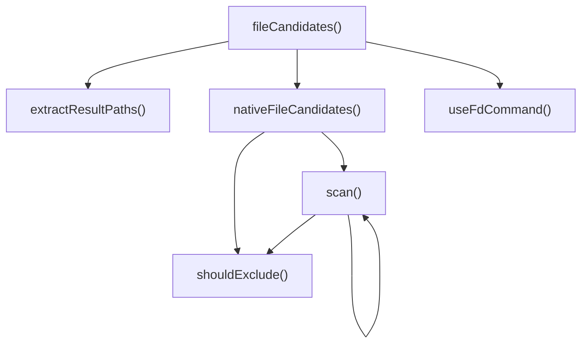

# file_candidates

## 概要

`file_candidates` モジュールのAPIリファレンス。

## インポート

```typescript
// from '../utils/cli.js': execute, buildFdArgs, checkToolAvailability
// from '../types.js': FileCandidatesInput, FileCandidatesOutput, FileCandidate
// from '../utils/output.js': truncateResults, parseFdOutput, createErrorResponse, ...
// from '../utils/errors.js': SearchToolError, isSearchToolError, getErrorMessage
// from '../utils/constants.js': DEFAULT_LIMIT, DEFAULT_EXCLUDES
// ... and 2 more imports
```

## エクスポート一覧

| 種別 | 名前 | 説明 |
|------|------|------|
| 関数 | `fileCandidates` | 候補ファイルを一覧 |

## 図解

### 依存関係図


### 関数フロー



### シーケンス図


## 関数

### shouldExclude

```typescript
shouldExclude(name: string, excludes: readonly string[]): boolean
```

Check if a name should be excluded based on exclude patterns.
Supports both exact matches and glob patterns (e.g., *.min.js).

**パラメータ**

| 名前 | 型 | 必須 |
|------|-----|------|
| name | `string` | はい |
| excludes | `readonly string[]` | はい |

**戻り値**: `boolean`

### nativeFileCandidates

```typescript
async nativeFileCandidates(input: FileCandidatesInput, cwd: string): Promise<FileCandidatesOutput>
```

Pure Node.js file enumeration fallback

**パラメータ**

| 名前 | 型 | 必須 |
|------|-----|------|
| input | `FileCandidatesInput` | はい |
| cwd | `string` | はい |

**戻り値**: `Promise<FileCandidatesOutput>`

### scan

```typescript
async scan(dirPath: string, depth: number): Promise<void>
```

**パラメータ**

| 名前 | 型 | 必須 |
|------|-----|------|
| dirPath | `string` | はい |
| depth | `number` | はい |

**戻り値**: `Promise<void>`

### useFdCommand

```typescript
async useFdCommand(input: FileCandidatesInput, cwd: string): Promise<FileCandidatesOutput>
```

Use fd command for file enumeration

**パラメータ**

| 名前 | 型 | 必須 |
|------|-----|------|
| input | `FileCandidatesInput` | はい |
| cwd | `string` | はい |

**戻り値**: `Promise<FileCandidatesOutput>`

### extractResultPaths

```typescript
extractResultPaths(results: FileCandidate[]): string[]
```

Extract file paths from results for history recording.

**パラメータ**

| 名前 | 型 | 必須 |
|------|-----|------|
| results | `FileCandidate[]` | はい |

**戻り値**: `string[]`

### fileCandidates

```typescript
async fileCandidates(input: FileCandidatesInput, cwd: string): Promise<FileCandidatesOutput>
```

候補ファイルを一覧

**パラメータ**

| 名前 | 型 | 必須 |
|------|-----|------|
| input | `FileCandidatesInput` | はい |
| cwd | `string` | はい |

**戻り値**: `Promise<FileCandidatesOutput>`

---
*自動生成: 2026-02-22T19:27:00.429Z*
