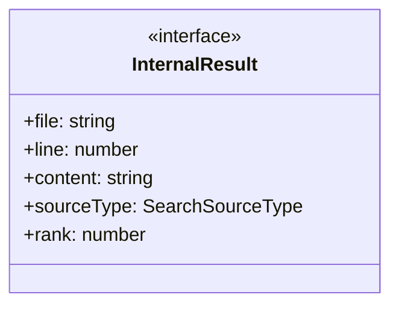
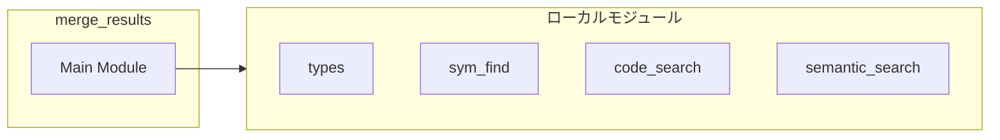
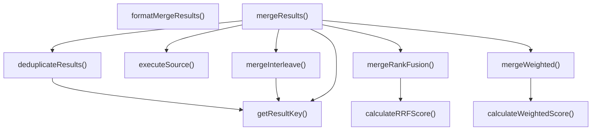
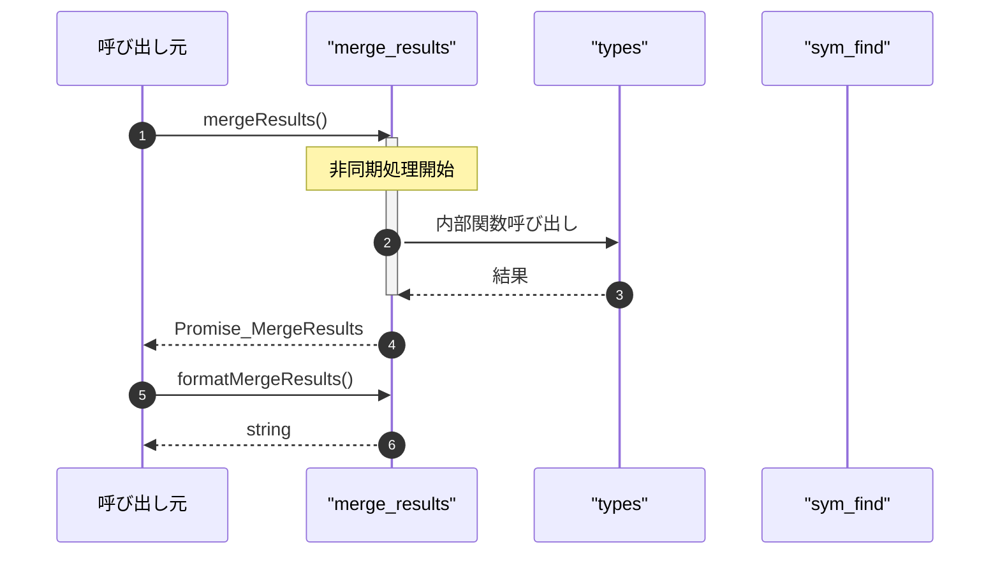

# merge_results

## 概要

`merge_results` モジュールのAPIリファレンス。

## インポート

```typescript
// from '../types.js': MergeResultsInput, MergeResultsResult, MergedResult, ...
// from './sym_find.js': symFind
// from './code_search.js': codeSearch
// from './semantic_search.js': semanticSearch
```

## エクスポート一覧

| 種別 | 名前 | 説明 |
|------|------|------|
| 関数 | `mergeResults` | 検索結果統合を実行 |
| 関数 | `formatMergeResults` | 統合検索結果をフォーマット |

## 図解

### クラス図



### 依存関係図



### 関数フロー



### シーケンス図



## 関数

### executeSource

```typescript
async executeSource(source: MergeSource, cwd: string): Promise<InternalResult[]>
```

単一ソースの検索を実行

**パラメータ**

| 名前 | 型 | 必須 |
|------|-----|------|
| source | `MergeSource` | はい |
| cwd | `string` | はい |

**戻り値**: `Promise<InternalResult[]>`

### getResultKey

```typescript
getResultKey(result: InternalResult): string
```

結果のキーを生成

**パラメータ**

| 名前 | 型 | 必須 |
|------|-----|------|
| result | `InternalResult` | はい |

**戻り値**: `string`

### deduplicateResults

```typescript
deduplicateResults(allResults: InternalResult[]): Map<string, InternalResult[]>
```

結果を重複除去

**パラメータ**

| 名前 | 型 | 必須 |
|------|-----|------|
| allResults | `InternalResult[]` | はい |

**戻り値**: `Map<string, InternalResult[]>`

### calculateWeightedScore

```typescript
calculateWeightedScore(results: InternalResult[], sourceWeights: Map<SearchSourceType, number>): number
```

加重平均でスコアを計算

**パラメータ**

| 名前 | 型 | 必須 |
|------|-----|------|
| results | `InternalResult[]` | はい |
| sourceWeights | `Map<SearchSourceType, number>` | はい |

**戻り値**: `number`

### calculateRRFScore

```typescript
calculateRRFScore(results: InternalResult[], k: any): number
```

Rank Fusion (RRF) でスコアを計算

**パラメータ**

| 名前 | 型 | 必須 |
|------|-----|------|
| results | `InternalResult[]` | はい |
| k | `any` | はい |

**戻り値**: `number`

### mergeWeighted

```typescript
mergeWeighted(grouped: Map<string, InternalResult[]>, sourceWeights: Map<SearchSourceType, number>): MergedResult[]
```

加重平均戦略でマージ

**パラメータ**

| 名前 | 型 | 必須 |
|------|-----|------|
| grouped | `Map<string, InternalResult[]>` | はい |
| sourceWeights | `Map<SearchSourceType, number>` | はい |

**戻り値**: `MergedResult[]`

### mergeRankFusion

```typescript
mergeRankFusion(grouped: Map<string, InternalResult[]>): MergedResult[]
```

Rank Fusion戦略でマージ

**パラメータ**

| 名前 | 型 | 必須 |
|------|-----|------|
| grouped | `Map<string, InternalResult[]>` | はい |

**戻り値**: `MergedResult[]`

### mergeInterleave

```typescript
mergeInterleave(allResults: InternalResult[], sourceWeights: Map<SearchSourceType, number>, limit: number): MergedResult[]
```

インターリーブ戦略でマージ

**パラメータ**

| 名前 | 型 | 必須 |
|------|-----|------|
| allResults | `InternalResult[]` | はい |
| sourceWeights | `Map<SearchSourceType, number>` | はい |
| limit | `number` | はい |

**戻り値**: `MergedResult[]`

### mergeResults

```typescript
async mergeResults(input: MergeResultsInput, cwd: string): Promise<MergeResultsResult>
```

検索結果統合を実行

**パラメータ**

| 名前 | 型 | 必須 |
|------|-----|------|
| input | `MergeResultsInput` | はい |
| cwd | `string` | はい |

**戻り値**: `Promise<MergeResultsResult>`

### formatMergeResults

```typescript
formatMergeResults(result: MergeResultsResult): string
```

統合検索結果をフォーマット

**パラメータ**

| 名前 | 型 | 必須 |
|------|-----|------|
| result | `MergeResultsResult` | はい |

**戻り値**: `string`

## インターフェース

### InternalResult

```typescript
interface InternalResult {
  file: string;
  line?: number;
  content: string;
  sourceType: SearchSourceType;
  rank: number;
  score: number;
}
```

内部検索結果

---
*自動生成: 2026-02-24T17:08:02.423Z*
