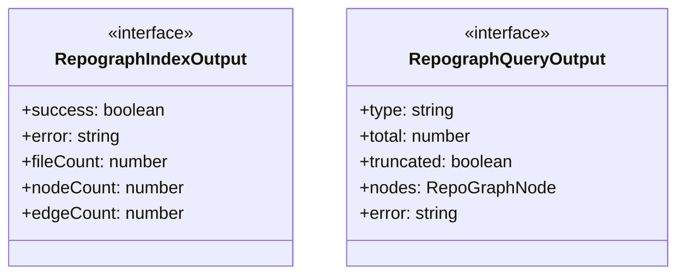
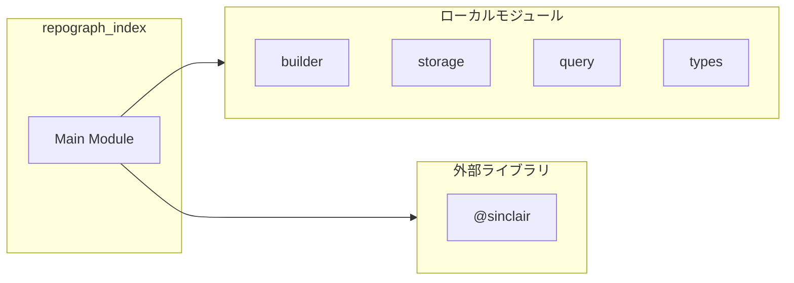
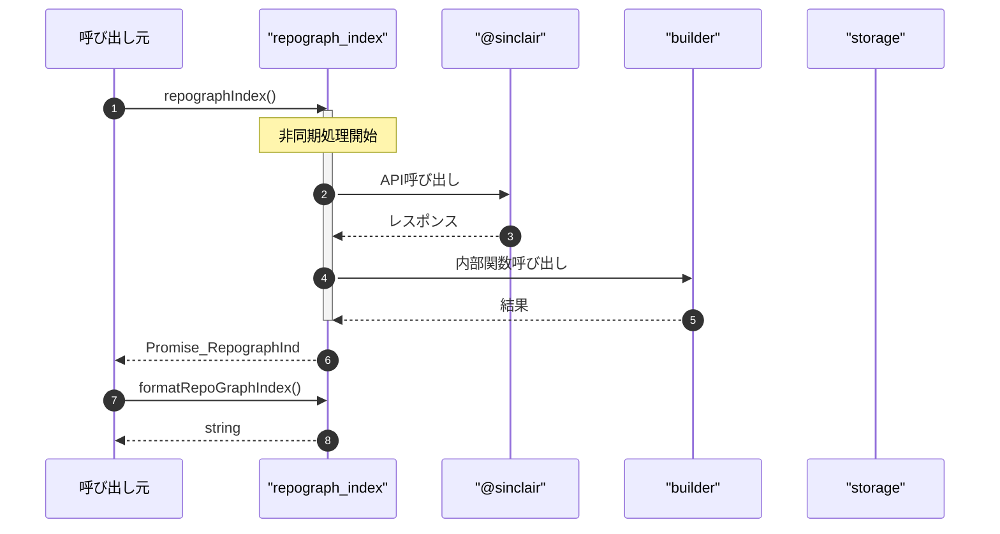

# repograph_index

## 概要

`repograph_index` モジュールのAPIリファレンス。

## インポート

```typescript
// from '@sinclair/typebox': Type
// from '@sinclair/typebox': Static
// from '../repograph/builder.js': buildRepoGraph, getSourceFiles
// from '../repograph/storage.js': saveRepoGraph, loadRepoGraph, isRepoGraphStale, ...
// from '../repograph/query.js': findNodesBySymbol, findNodesByFile, findDefinitions, ...
// ... and 1 more imports
```

## エクスポート一覧

| 種別 | 名前 | 説明 |
|------|------|------|
| 関数 | `repographIndex` | Build or update RepoGraph index |
| 関数 | `formatRepoGraphIndex` | Format index result for display |
| 関数 | `repographQuery` | Query RepoGraph index |
| 関数 | `formatRepoGraphQuery` | Format query result for display |
| インターフェース | `RepographIndexOutput` | Output schema for repograph_index tool |
| インターフェース | `RepographQueryOutput` | Output schema for repograph_query tool |
| 型 | `RepographIndexInput` | インデックス入力定義 |
| 型 | `RepographQueryInput` | クエリ入力定義 |

## 図解

### クラス図



### 依存関係図



### シーケンス図



## 関数

### repographIndex

```typescript
async repographIndex(params: RepographIndexInput, cwd: string): Promise<RepographIndexOutput>
```

Build or update RepoGraph index

**パラメータ**

| 名前 | 型 | 必須 |
|------|-----|------|
| params | `RepographIndexInput` | はい |
| cwd | `string` | はい |

**戻り値**: `Promise<RepographIndexOutput>`

### formatRepoGraphIndex

```typescript
formatRepoGraphIndex(output: RepographIndexOutput): string
```

Format index result for display

**パラメータ**

| 名前 | 型 | 必須 |
|------|-----|------|
| output | `RepographIndexOutput` | はい |

**戻り値**: `string`

### repographQuery

```typescript
async repographQuery(params: RepographQueryInput, cwd: string): Promise<RepographQueryOutput>
```

Query RepoGraph index

**パラメータ**

| 名前 | 型 | 必須 |
|------|-----|------|
| params | `RepographQueryInput` | はい |
| cwd | `string` | はい |

**戻り値**: `Promise<RepographQueryOutput>`

### formatRepoGraphQuery

```typescript
formatRepoGraphQuery(output: RepographQueryOutput): string
```

Format query result for display

**パラメータ**

| 名前 | 型 | 必須 |
|------|-----|------|
| output | `RepographQueryOutput` | はい |

**戻り値**: `string`

## インターフェース

### RepographIndexOutput

```typescript
interface RepographIndexOutput {
  success: boolean;
  error?: string;
  fileCount: number;
  nodeCount: number;
  edgeCount: number;
  outputPath: string;
}
```

Output schema for repograph_index tool

### RepographQueryOutput

```typescript
interface RepographQueryOutput {
  type: string;
  total: number;
  truncated: boolean;
  nodes: RepoGraphNode[];
  error?: string;
}
```

Output schema for repograph_query tool

## 型定義

### RepographIndexInput

```typescript
type RepographIndexInput = Static<typeof RepographIndexInput>
```

インデックス入力定義

### RepographQueryInput

```typescript
type RepographQueryInput = Static<typeof RepographQueryInput>
```

クエリ入力定義

---
*自動生成: 2026-02-28T13:55:20.085Z*
