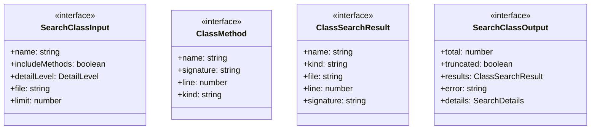
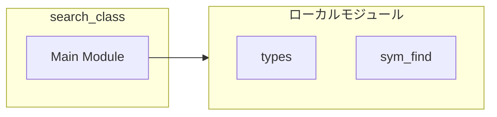
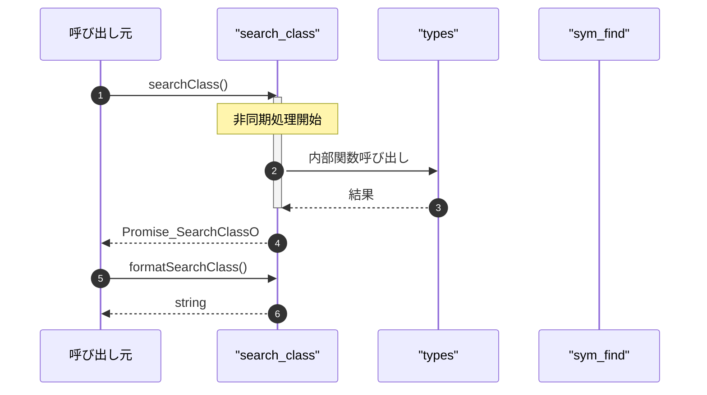

# search_class

## 概要

`search_class` モジュールのAPIリファレンス。

## インポート

```typescript
// from '../types.js': SymbolDefinition, DetailLevel, SearchDetails
// from './sym_find.js': symFind
```

## エクスポート一覧

| 種別 | 名前 | 説明 |
|------|------|------|
| 関数 | `searchClass` | クラス定義を検索 |
| 関数 | `formatSearchClass` | クラス検索結果をフォーマット |
| インターフェース | `SearchClassInput` | クラス検索の入力パラメータ |
| インターフェース | `ClassMethod` | クラス内メソッド情報 |
| インターフェース | `ClassSearchResult` | クラス検索結果の単一エントリ |
| インターフェース | `SearchClassOutput` | クラス検索の出力結果 |

## 図解

### クラス図



### 依存関係図



### シーケンス図



## 関数

### searchClass

```typescript
async searchClass(input: SearchClassInput, cwd: string): Promise<SearchClassOutput>
```

クラス定義を検索

**パラメータ**

| 名前 | 型 | 必須 |
|------|-----|------|
| input | `SearchClassInput` | はい |
| cwd | `string` | はい |

**戻り値**: `Promise<SearchClassOutput>`

### formatSearchClass

```typescript
formatSearchClass(output: SearchClassOutput): string
```

クラス検索結果をフォーマット

**パラメータ**

| 名前 | 型 | 必須 |
|------|-----|------|
| output | `SearchClassOutput` | はい |

**戻り値**: `string`

## インターフェース

### SearchClassInput

```typescript
interface SearchClassInput {
  name: string;
  includeMethods?: boolean;
  detailLevel?: DetailLevel;
  file?: string;
  limit?: number;
}
```

クラス検索の入力パラメータ

### ClassMethod

```typescript
interface ClassMethod {
  name: string;
  signature?: string;
  line: number;
  kind: string;
}
```

クラス内メソッド情報

### ClassSearchResult

```typescript
interface ClassSearchResult {
  name: string;
  kind: string;
  file: string;
  line: number;
  signature?: string;
  methods?: ClassMethod[];
}
```

クラス検索結果の単一エントリ

### SearchClassOutput

```typescript
interface SearchClassOutput {
  total: number;
  truncated: boolean;
  results: ClassSearchResult[];
  error?: string;
  details?: SearchDetails;
}
```

クラス検索の出力結果

---
*自動生成: 2026-02-28T13:55:20.086Z*
