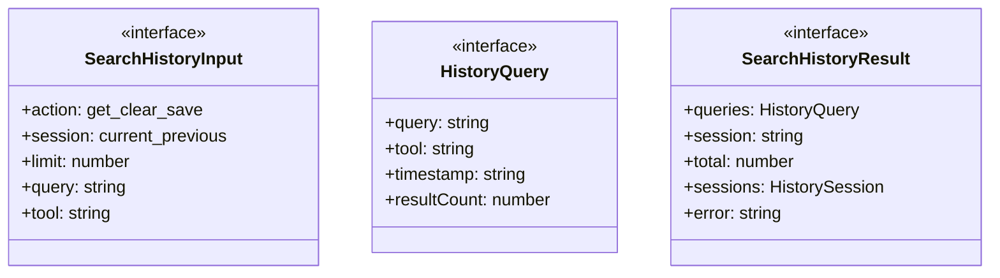
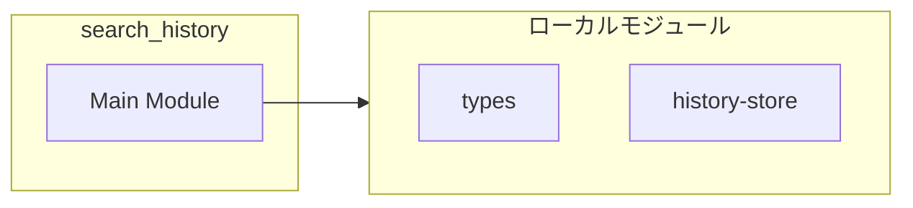
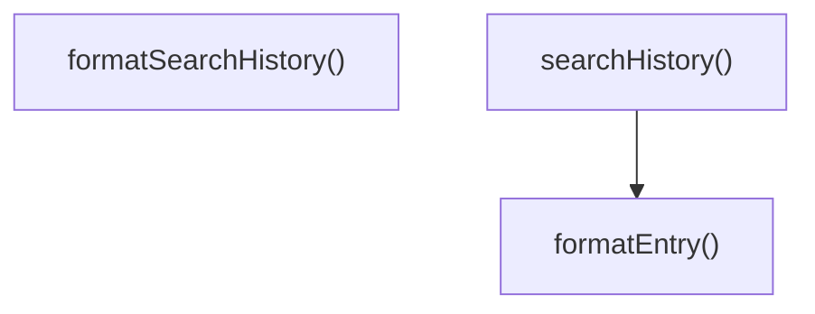
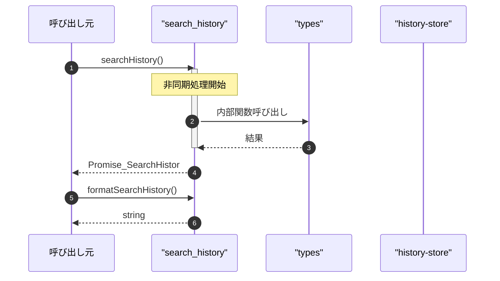

# search_history

## 概要

`search_history` モジュールのAPIリファレンス。

## インポート

```typescript
// from '../types.js': SearchDetails
// from '../utils/history-store.js': getHistoryStore, StoredHistoryEntry, HistorySession
```

## エクスポート一覧

| 種別 | 名前 | 説明 |
|------|------|------|
| 関数 | `searchHistory` | 検索履歴を管理 |
| 関数 | `formatSearchHistory` | 履歴結果をフォーマット |
| インターフェース | `SearchHistoryInput` | 検索履歴の入力パラメータ |
| インターフェース | `HistoryQuery` | 履歴クエリ情報 |
| インターフェース | `SearchHistoryResult` | 検索履歴の出力結果 |

## 図解

### クラス図



### 依存関係図



### 関数フロー



### シーケンス図



## 関数

### searchHistory

```typescript
async searchHistory(input: SearchHistoryInput, cwd: string): Promise<SearchHistoryResult>
```

検索履歴を管理

**パラメータ**

| 名前 | 型 | 必須 |
|------|-----|------|
| input | `SearchHistoryInput` | はい |
| cwd | `string` | はい |

**戻り値**: `Promise<SearchHistoryResult>`

### formatEntry

```typescript
formatEntry(entry: StoredHistoryEntry): HistoryQuery
```

エントリをフォーマット

**パラメータ**

| 名前 | 型 | 必須 |
|------|-----|------|
| entry | `StoredHistoryEntry` | はい |

**戻り値**: `HistoryQuery`

### formatSearchHistory

```typescript
formatSearchHistory(output: SearchHistoryResult): string
```

履歴結果をフォーマット

**パラメータ**

| 名前 | 型 | 必須 |
|------|-----|------|
| output | `SearchHistoryResult` | はい |

**戻り値**: `string`

## インターフェース

### SearchHistoryInput

```typescript
interface SearchHistoryInput {
  action: "get" | "clear" | "save_query";
  session?: "current" | "previous" | "all";
  limit?: number;
  query?: string;
  tool?: string;
}
```

検索履歴の入力パラメータ

### HistoryQuery

```typescript
interface HistoryQuery {
  query: string;
  tool: string;
  timestamp: string;
  resultCount: number;
}
```

履歴クエリ情報

### SearchHistoryResult

```typescript
interface SearchHistoryResult {
  queries: HistoryQuery[];
  session: string;
  total: number;
  sessions?: HistorySession[];
  error?: string;
  details?: SearchDetails;
}
```

検索履歴の出力結果

---
*自動生成: 2026-02-28T13:55:20.087Z*
