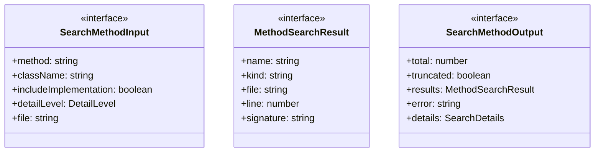
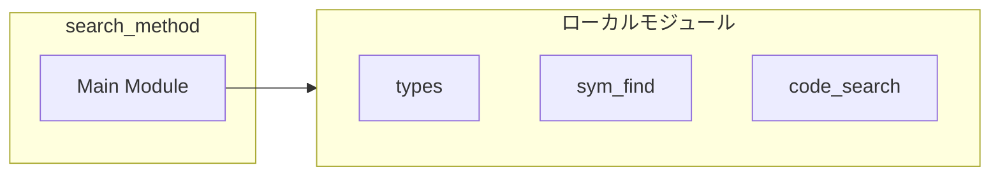
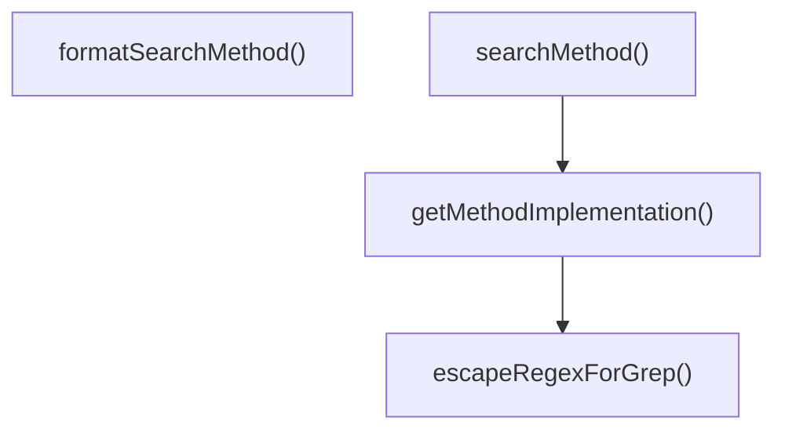
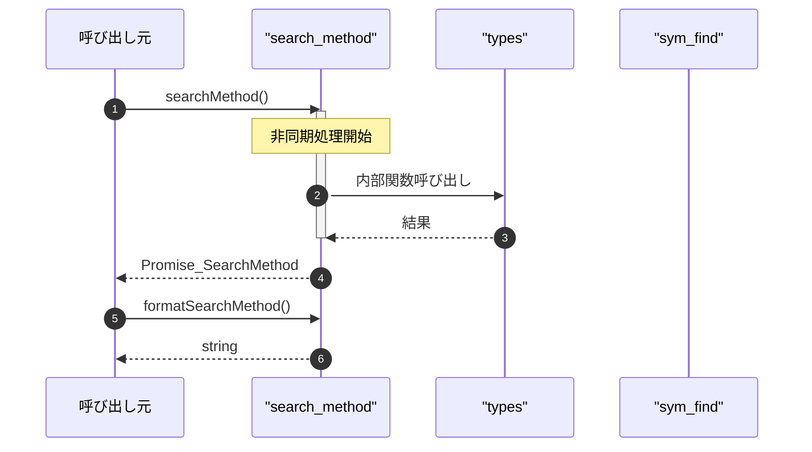

# search_method

## 概要

`search_method` モジュールのAPIリファレンス。

## インポート

```typescript
// from '../types.js': SymbolDefinition, DetailLevel, SearchDetails
// from './sym_find.js': symFind
// from './code_search.js': codeSearch
```

## エクスポート一覧

| 種別 | 名前 | 説明 |
|------|------|------|
| 関数 | `searchMethod` | メソッド定義を検索 |
| 関数 | `formatSearchMethod` | メソッド検索結果をフォーマット |
| インターフェース | `SearchMethodInput` | メソッド検索の入力パラメータ |
| インターフェース | `MethodSearchResult` | メソッド検索結果の単一エントリ |
| インターフェース | `SearchMethodOutput` | メソッド検索の出力結果 |

## 図解

### クラス図



### 依存関係図



### 関数フロー



### シーケンス図



## 関数

### searchMethod

```typescript
async searchMethod(input: SearchMethodInput, cwd: string): Promise<SearchMethodOutput>
```

メソッド定義を検索

**パラメータ**

| 名前 | 型 | 必須 |
|------|-----|------|
| input | `SearchMethodInput` | はい |
| cwd | `string` | はい |

**戻り値**: `Promise<SearchMethodOutput>`

### getMethodImplementation

```typescript
async getMethodImplementation(sym: SymbolDefinition, cwd: string): Promise<string | undefined>
```

メソッドの実装を取得

**パラメータ**

| 名前 | 型 | 必須 |
|------|-----|------|
| sym | `SymbolDefinition` | はい |
| cwd | `string` | はい |

**戻り値**: `Promise<string | undefined>`

### escapeRegexForGrep

```typescript
escapeRegexForGrep(str: string): string
```

ripgrep用に正規表現特殊文字をエスケープ

**パラメータ**

| 名前 | 型 | 必須 |
|------|-----|------|
| str | `string` | はい |

**戻り値**: `string`

### formatSearchMethod

```typescript
formatSearchMethod(output: SearchMethodOutput): string
```

メソッド検索結果をフォーマット

**パラメータ**

| 名前 | 型 | 必須 |
|------|-----|------|
| output | `SearchMethodOutput` | はい |

**戻り値**: `string`

## インターフェース

### SearchMethodInput

```typescript
interface SearchMethodInput {
  method: string;
  className?: string;
  includeImplementation?: boolean;
  detailLevel?: DetailLevel;
  file?: string;
  limit?: number;
}
```

メソッド検索の入力パラメータ

### MethodSearchResult

```typescript
interface MethodSearchResult {
  name: string;
  kind: string;
  file: string;
  line: number;
  signature?: string;
  scope?: string;
  implementation?: string;
}
```

メソッド検索結果の単一エントリ

### SearchMethodOutput

```typescript
interface SearchMethodOutput {
  total: number;
  truncated: boolean;
  results: MethodSearchResult[];
  error?: string;
  details?: SearchDetails;
}
```

メソッド検索の出力結果

---
*自動生成: 2026-02-24T17:08:02.426Z*
