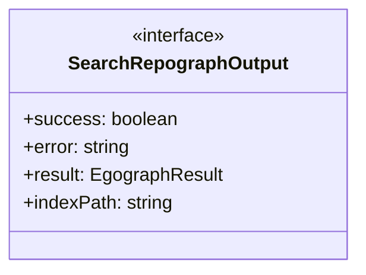
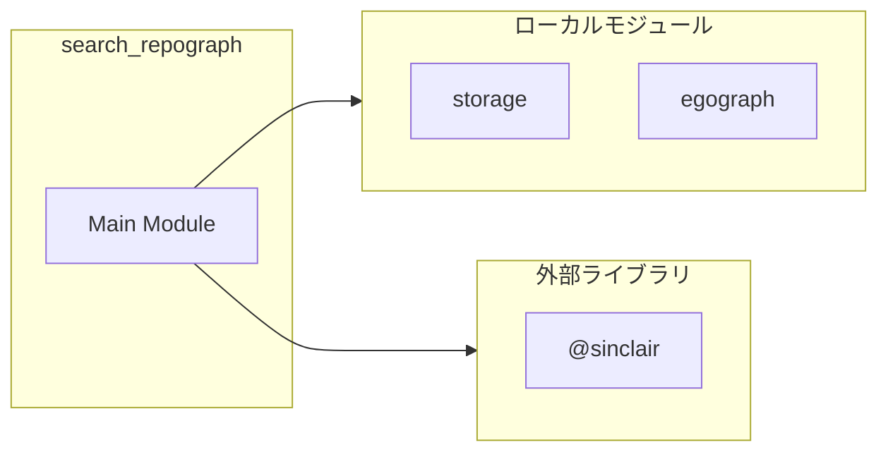
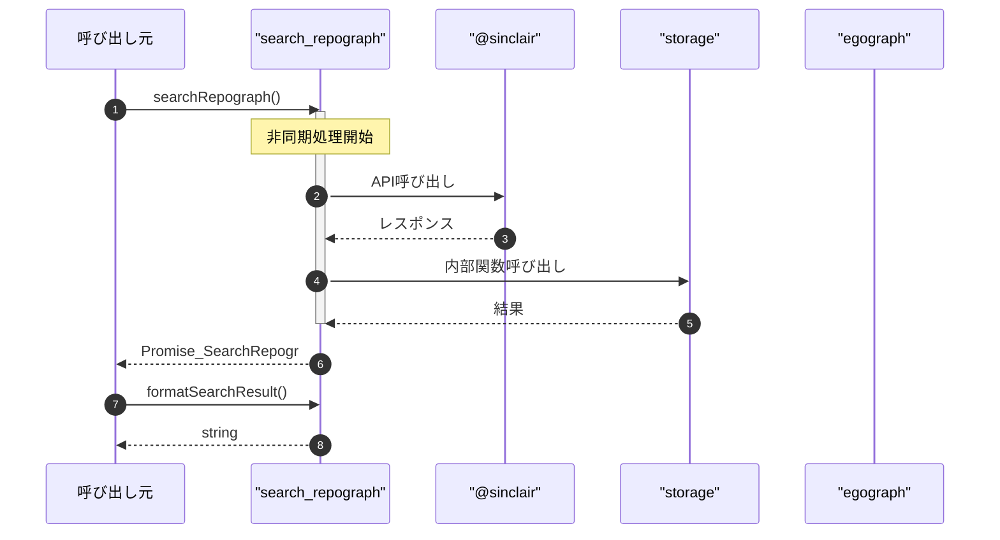

# search_repograph

## 概要

`search_repograph` モジュールのAPIリファレンス。

## インポート

```typescript
// from '@sinclair/typebox': Type
// from '@sinclair/typebox': Static
// from '../repograph/storage.js': loadRepoGraph, getRepoGraphPath
// from '../repograph/egograph.js': extractEgograph, formatEgograph
// from '../repograph/egograph.js': EgographOptions, EgographResult
```

## エクスポート一覧

| 種別 | 名前 | 説明 |
|------|------|------|
| 関数 | `searchRepograph` | Search RepoGraph with k-hop egograph extraction |
| 関数 | `formatSearchResult` | Format search result for display |
| インターフェース | `SearchRepographOutput` | Output schema for search_repograph tool |
| 型 | `SearchRepographInput` | 検索入力定義 |

## 図解

### クラス図



### 依存関係図



### シーケンス図



## 関数

### searchRepograph

```typescript
async searchRepograph(params: SearchRepographInput, cwd: string): Promise<SearchRepographOutput>
```

Search RepoGraph with k-hop egograph extraction

**パラメータ**

| 名前 | 型 | 必須 |
|------|-----|------|
| params | `SearchRepographInput` | はい |
| cwd | `string` | はい |

**戻り値**: `Promise<SearchRepographOutput>`

### formatSearchResult

```typescript
formatSearchResult(output: SearchRepographOutput): string
```

Format search result for display

**パラメータ**

| 名前 | 型 | 必須 |
|------|-----|------|
| output | `SearchRepographOutput` | はい |

**戻り値**: `string`

## インターフェース

### SearchRepographOutput

```typescript
interface SearchRepographOutput {
  success: boolean;
  error?: string;
  result?: EgographResult;
  indexPath?: string;
}
```

Output schema for search_repograph tool

## 型定義

### SearchRepographInput

```typescript
type SearchRepographInput = Static<typeof SearchRepographInput>
```

検索入力定義

---
*自動生成: 2026-02-28T13:55:20.089Z*
