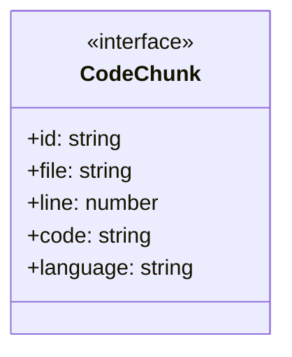
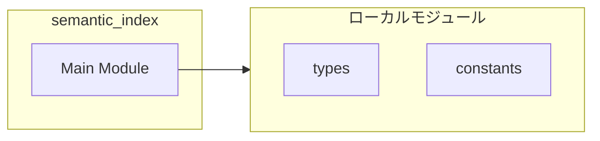
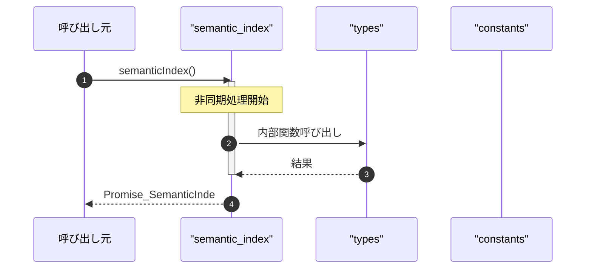

# semantic_index

## 概要

`semantic_index` モジュールのAPIリファレンス。

## インポート

```typescript
import { existsSync, mkdirSync, readdirSync... } from 'node:fs';
import { join, relative, extname } from 'node:path';
import { createHash } from 'node:crypto';
import { SemanticIndexInput, SemanticIndexOutput, SemanticIndexMetadata... } from '../types.js';
import { INDEX_DIR_NAME, DEFAULT_EXCLUDES } from '../utils/constants.js';
```

## エクスポート一覧

| 種別 | 名前 | 説明 |
|------|------|------|
| 関数 | `semanticIndex` | セマンティックインデックスを生成する |

## 図解

### クラス図



### 依存関係図



### シーケンス図



## 関数

### collectFiles

```typescript
collectFiles(dir: string, extensions: string[], excludes: string[]): string[]
```

Collect files recursively from a directory.

**パラメータ**

| 名前 | 型 | 必須 |
|------|-----|------|
| dir | `string` | はい |
| extensions | `string[]` | はい |
| excludes | `string[]` | はい |

**戻り値**: `string[]`

### walk

```typescript
walk(currentDir: string): void
```

**パラメータ**

| 名前 | 型 | 必須 |
|------|-----|------|
| currentDir | `string` | はい |

**戻り値**: `void`

### detectLanguage

```typescript
detectLanguage(filePath: string): string
```

Detect language from file extension.

**パラメータ**

| 名前 | 型 | 必須 |
|------|-----|------|
| filePath | `string` | はい |

**戻り値**: `string`

### chunkCode

```typescript
chunkCode(filePath: string, content: string, chunkSize: number, chunkOverlap: number): CodeChunk[]
```

Split code into chunks for embedding.
Uses simple line-based chunking with overlap.

**パラメータ**

| 名前 | 型 | 必須 |
|------|-----|------|
| filePath | `string` | はい |
| content | `string` | はい |
| chunkSize | `number` | はい |
| chunkOverlap | `number` | はい |

**戻り値**: `CodeChunk[]`

### buildChunkText

```typescript
buildChunkText(chunk: CodeChunk): string
```

Build text representation for embedding.
Includes file context and code content.

**パラメータ**

| 名前 | 型 | 必須 |
|------|-----|------|
| chunk | `CodeChunk` | はい |

**戻り値**: `string`

### getIndexDir

```typescript
getIndexDir(cwd: string): string
```

**パラメータ**

| 名前 | 型 | 必須 |
|------|-----|------|
| cwd | `string` | はい |

**戻り値**: `string`

### getIndexPath

```typescript
getIndexPath(cwd: string): string
```

**パラメータ**

| 名前 | 型 | 必須 |
|------|-----|------|
| cwd | `string` | はい |

**戻り値**: `string`

### getMetaPath

```typescript
getMetaPath(cwd: string): string
```

**パラメータ**

| 名前 | 型 | 必須 |
|------|-----|------|
| cwd | `string` | はい |

**戻り値**: `string`

### loadExistingIndex

```typescript
async loadExistingIndex(cwd: string): Promise<CodeEmbedding[]>
```

**パラメータ**

| 名前 | 型 | 必須 |
|------|-----|------|
| cwd | `string` | はい |

**戻り値**: `Promise<CodeEmbedding[]>`

### saveIndex

```typescript
async saveIndex(embeddings: CodeEmbedding[], cwd: string): Promise<string>
```

**パラメータ**

| 名前 | 型 | 必須 |
|------|-----|------|
| embeddings | `CodeEmbedding[]` | はい |
| cwd | `string` | はい |

**戻り値**: `Promise<string>`

### saveMetadata

```typescript
async saveMetadata(metadata: SemanticIndexMetadata, cwd: string): Promise<void>
```

**パラメータ**

| 名前 | 型 | 必須 |
|------|-----|------|
| metadata | `SemanticIndexMetadata` | はい |
| cwd | `string` | はい |

**戻り値**: `Promise<void>`

### semanticIndex

```typescript
async semanticIndex(input: SemanticIndexInput, cwd: string): Promise<SemanticIndexOutput>
```

セマンティックインデックスを生成する

**パラメータ**

| 名前 | 型 | 必須 |
|------|-----|------|
| input | `SemanticIndexInput` | はい |
| cwd | `string` | はい |

**戻り値**: `Promise<SemanticIndexOutput>`

### _getIndexDir

```typescript
_getIndexDir(cwd: string): string
```

**パラメータ**

| 名前 | 型 | 必須 |
|------|-----|------|
| cwd | `string` | はい |

**戻り値**: `string`

### _getIndexPath

```typescript
_getIndexPath(cwd: string): string
```

**パラメータ**

| 名前 | 型 | 必須 |
|------|-----|------|
| cwd | `string` | はい |

**戻り値**: `string`

### _getMetaPath

```typescript
_getMetaPath(cwd: string): string
```

**パラメータ**

| 名前 | 型 | 必須 |
|------|-----|------|
| cwd | `string` | はい |

**戻り値**: `string`

## インターフェース

### CodeChunk

```typescript
interface CodeChunk {
  id: string;
  file: string;
  line: number;
  code: string;
  language: string;
  symbol?: string;
  kind?: "function" | "class" | "variable" | "chunk";
}
```

---
*自動生成: 2026-02-18T06:37:19.672Z*
