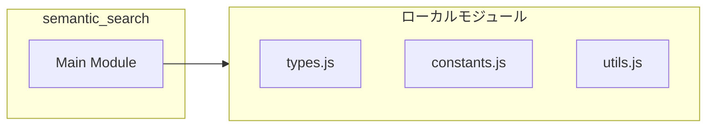
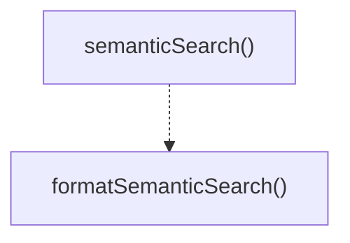
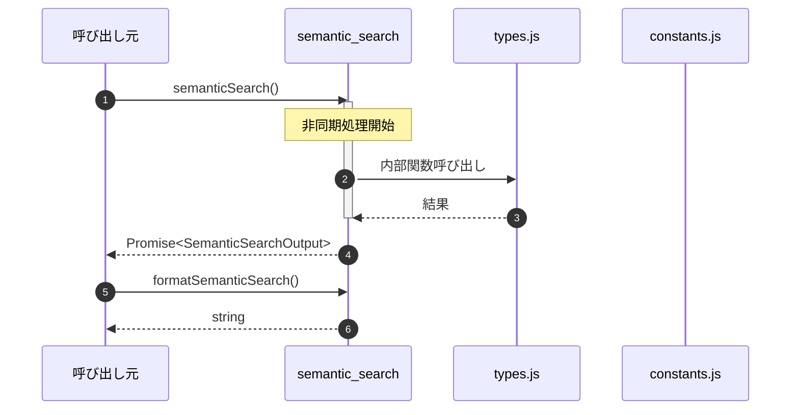

# semantic_search

## 概要

`semantic_search` モジュールのAPIリファレンス。

## インポート

```typescript
import { existsSync, readFileSync } from 'node:fs';
import { join } from 'node:path';
import { SemanticSearchInput, SemanticSearchOutput, SemanticSearchResult... } from '../types.js';
import { INDEX_DIR_NAME } from '../utils/constants.js';
import { cosineSimilarity } from '../../../lib/embeddings/utils.js';
```

## エクスポート一覧

| 種別 | 名前 | 説明 |
|------|------|------|
| 関数 | `semanticSearch` | Perform semantic search on code. |
| 関数 | `formatSemanticSearch` | Format semantic search results for display. |

## 図解

### 依存関係図



### 関数フロー



### シーケンス図



## 関数

### getIndexPath

```typescript
getIndexPath(cwd: string): string
```

**パラメータ**

| 名前 | 型 | 必須 |
|------|-----|------|
| cwd | `string` | はい |

**戻り値**: `string`

### loadIndex

```typescript
loadIndex(cwd: string): CodeEmbedding[]
```

Load the semantic index from disk.

**パラメータ**

| 名前 | 型 | 必須 |
|------|-----|------|
| cwd | `string` | はい |

**戻り値**: `CodeEmbedding[]`

### findNearestNeighbors

```typescript
findNearestNeighbors(queryVector: number[], items: CodeEmbedding[], k: number, threshold: number): Array<{ item: CodeEmbedding; similarity: number }>
```

Find the k nearest neighbors to a query vector.

**パラメータ**

| 名前 | 型 | 必須 |
|------|-----|------|
| queryVector | `number[]` | はい |
| items | `CodeEmbedding[]` | はい |
| k | `number` | はい |
| threshold | `number` | はい |

**戻り値**: `Array<{ item: CodeEmbedding; similarity: number }>`

### semanticSearch

```typescript
async semanticSearch(input: SemanticSearchInput, cwd: string): Promise<SemanticSearchOutput>
```

Perform semantic search on code.

**パラメータ**

| 名前 | 型 | 必須 |
|------|-----|------|
| input | `SemanticSearchInput` | はい |
| cwd | `string` | はい |

**戻り値**: `Promise<SemanticSearchOutput>`

### formatSemanticSearch

```typescript
formatSemanticSearch(result: SemanticSearchOutput): string
```

Format semantic search results for display.

**パラメータ**

| 名前 | 型 | 必須 |
|------|-----|------|
| result | `SemanticSearchOutput` | はい |

**戻り値**: `string`

---
*自動生成: 2026-02-17T22:16:16.533Z*
