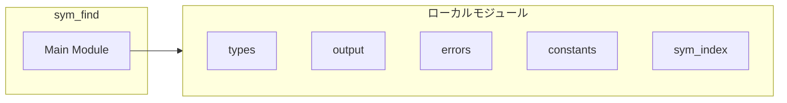
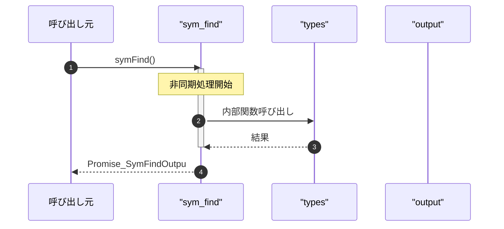

# sym_find

## 概要

`sym_find` モジュールのAPIリファレンス。

## インポート

```typescript
import { SymFindInput, SymFindOutput, SymbolDefinition... } from '../types.js';
import { truncateResults, createErrorResponse, createSimpleHints } from '../utils/output.js';
import { SearchToolError, isSearchToolError, getErrorMessage... } from '../utils/errors.js';
import { DEFAULT_SYMBOL_LIMIT } from '../utils/constants.js';
import { symIndex, readSymbolIndex } from './sym_index.js';
// ... and 2 more imports
```

## エクスポート一覧

| 種別 | 名前 | 説明 |
|------|------|------|
| 関数 | `symFind` | インデックスからシンボル定義を検索 |

## 図解

### 依存関係図



### シーケンス図



## 関数

### escapeRegex

```typescript
escapeRegex(str: string): string
```

Escape regex special characters

**パラメータ**

| 名前 | 型 | 必須 |
|------|-----|------|
| str | `string` | はい |

**戻り値**: `string`

### wildcardToRegex

```typescript
wildcardToRegex(pattern: string): RegExp
```

Convert wildcard pattern to regex

**パラメータ**

| 名前 | 型 | 必須 |
|------|-----|------|
| pattern | `string` | はい |

**戻り値**: `RegExp`

### filterSymbols

```typescript
filterSymbols(entries: SymbolIndexEntry[], input: SymFindInput): SymbolDefinition[]
```

Filter symbols by criteria

**パラメータ**

| 名前 | 型 | 必須 |
|------|-----|------|
| entries | `SymbolIndexEntry[]` | はい |
| input | `SymFindInput` | はい |

**戻り値**: `SymbolDefinition[]`

### sortSymbols

```typescript
sortSymbols(symbols: SymbolDefinition[], input: SymFindInput): void
```

Sort symbols by relevance

**パラメータ**

| 名前 | 型 | 必須 |
|------|-----|------|
| symbols | `SymbolDefinition[]` | はい |
| input | `SymFindInput` | はい |

**戻り値**: `void`

### extractResultPaths

```typescript
extractResultPaths(results: SymbolDefinition[]): string[]
```

Extract file paths from results for history recording.

**パラメータ**

| 名前 | 型 | 必須 |
|------|-----|------|
| results | `SymbolDefinition[]` | はい |

**戻り値**: `string[]`

### symFind

```typescript
async symFind(input: SymFindInput, cwd: string): Promise<SymFindOutput>
```

インデックスからシンボル定義を検索

**パラメータ**

| 名前 | 型 | 必須 |
|------|-----|------|
| input | `SymFindInput` | はい |
| cwd | `string` | はい |

**戻り値**: `Promise<SymFindOutput>`

---
*自動生成: 2026-02-18T07:17:30.290Z*
