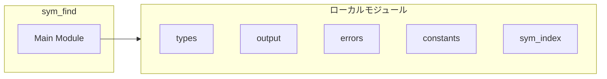
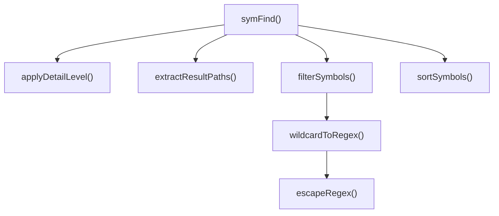
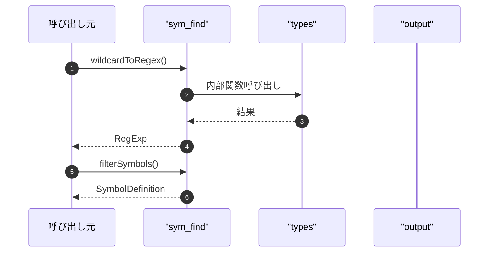

# sym_find

## 概要

`sym_find` モジュールのAPIリファレンス。

## インポート

```typescript
// from '../types.js': SymFindInput, SymFindOutput, SymbolDefinition, ...
// from '../utils/output.js': truncateResults, createErrorResponse, createSimpleHints, ...
// from '../utils/errors.js': SearchToolError, isSearchToolError, getErrorMessage, ...
// from '../utils/constants.js': DEFAULT_SYMBOL_LIMIT
// from './sym_index.js': symIndex, readSymbolIndex
// ... and 2 more imports
```

## エクスポート一覧

| 種別 | 名前 | 説明 |
|------|------|------|
| 関数 | `wildcardToRegex` | Convert wildcard pattern to regex |
| 関数 | `filterSymbols` | Filter symbols by criteria |
| 関数 | `sortSymbols` | Sort symbols by relevance |
| 関数 | `symFind` | シンボル検索を行う |

## 図解

### 依存関係図



### 関数フロー



### シーケンス図



## 関数

### escapeRegex

```typescript
escapeRegex(str: string): string
```

Escape regex special characters

**パラメータ**

| 名前 | 型 | 必須 |
|------|-----|------|
| str | `string` | はい |

**戻り値**: `string`

### wildcardToRegex

```typescript
wildcardToRegex(pattern: string, exactMatch: any): RegExp
```

Convert wildcard pattern to regex

**パラメータ**

| 名前 | 型 | 必須 |
|------|-----|------|
| pattern | `string` | はい |
| exactMatch | `any` | はい |

**戻り値**: `RegExp`

### filterSymbols

```typescript
filterSymbols(entries: SymbolIndexEntry[], input: SymFindInput): SymbolDefinition[]
```

Filter symbols by criteria

**パラメータ**

| 名前 | 型 | 必須 |
|------|-----|------|
| entries | `SymbolIndexEntry[]` | はい |
| input | `SymFindInput` | はい |

**戻り値**: `SymbolDefinition[]`

### sortSymbols

```typescript
sortSymbols(symbols: SymbolDefinition[], input: SymFindInput): void
```

Sort symbols by relevance

**パラメータ**

| 名前 | 型 | 必須 |
|------|-----|------|
| symbols | `SymbolDefinition[]` | はい |
| input | `SymFindInput` | はい |

**戻り値**: `void`

### extractResultPaths

```typescript
extractResultPaths(results: SymbolDefinition[]): string[]
```

Extract file paths from results for history recording.

**パラメータ**

| 名前 | 型 | 必須 |
|------|-----|------|
| results | `SymbolDefinition[]` | はい |

**戻り値**: `string[]`

### applyDetailLevel

```typescript
applyDetailLevel(symbols: SymbolDefinition[], detailLevel: DetailLevel): SymbolDefinition[]
```

Apply detailLevel compression to symbol definitions.

**パラメータ**

| 名前 | 型 | 必須 |
|------|-----|------|
| symbols | `SymbolDefinition[]` | はい |
| detailLevel | `DetailLevel` | はい |

**戻り値**: `SymbolDefinition[]`

### symFind

```typescript
async symFind(input: SymFindInput, cwd: string): Promise<SymFindOutput>
```

シンボル検索を行う

**パラメータ**

| 名前 | 型 | 必須 |
|------|-----|------|
| input | `SymFindInput` | はい |
| cwd | `string` | はい |

**戻り値**: `Promise<SymFindOutput>`

---
*自動生成: 2026-02-28T13:55:20.093Z*
