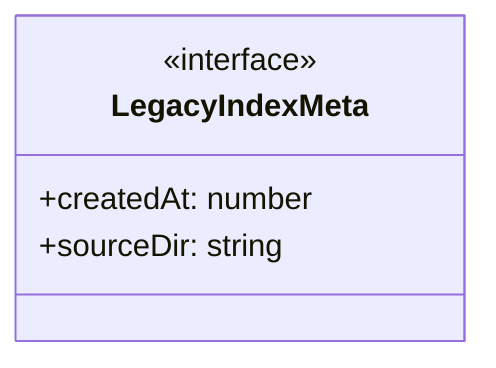
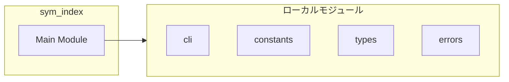
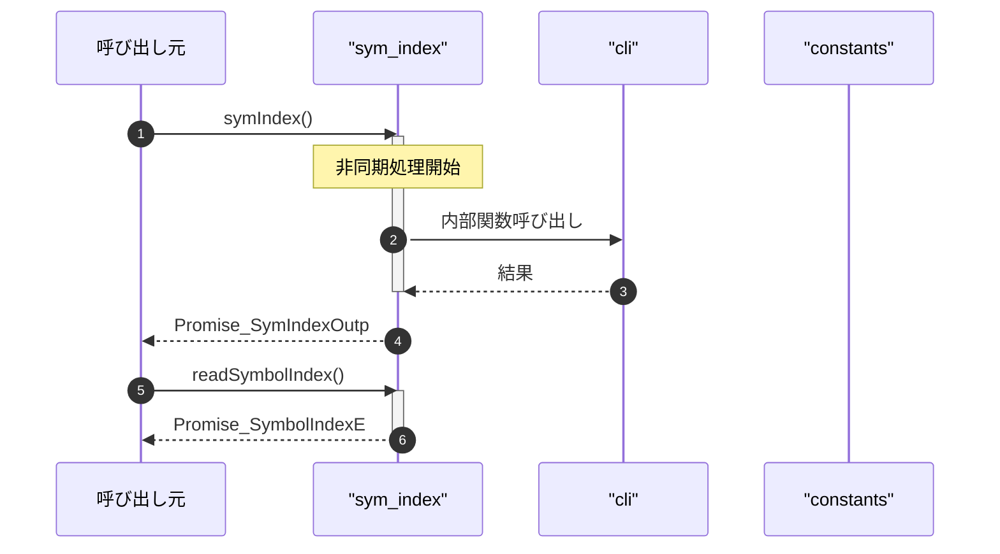

# sym_index

## 概要

`sym_index` モジュールのAPIリファレンス。

## インポート

```typescript
// from 'node:path': join, dirname, relative
// from 'node:fs/promises': mkdir, writeFile, readFile, ...
// from 'node:fs': createReadStream
// from 'node:crypto': createHash
// from '../utils/cli.js': execute, buildCtagsArgs, checkToolAvailability
// ... and 3 more imports
```

## エクスポート一覧

| 種別 | 名前 | 説明 |
|------|------|------|
| 関数 | `symIndex` | 意味的インデックスを作成 |
| 関数 | `readSymbolIndex` | シンボルインデックス読込 |
| 関数 | `getIndexMetadata` | インデックスメタデータ取得 |

## 図解

### クラス図



### 依存関係図



### 関数フロー

```mermaid
flowchart TD
  detectChangedFiles["detectChangedFiles()"]
  fileExists["fileExists()"]
  getIndexMetadata["getIndexMetadata()"]
  getLegacyIndexPath["getLegacyIndexPath()"]
  getLegacyMetaPath["getLegacyMetaPath()"]
  getMetaPath["getMetaPath()"]
  getShardDir["getShardDir()"]
  getShardPath["getShardPath()"]
  getSourceFiles["getSourceFiles()"]
  incrementalUpdate["incrementalUpdate()"]
  isIndexStale["isIndexStale()"]
  readAllShards["readAllShards()"]
  readLegacyIndex["readLegacyIndex()"]
  readLegacyMeta["readLegacyMeta()"]
  readMeta["readMeta()"]
  readSymbolIndex["readSymbolIndex()"]
  symIndex["symIndex()"]
  updateManifest["updateManifest()"]
  useCtagsCommand["useCtagsCommand()"]
  useCtagsForFiles["useCtagsForFiles()"]
  writeLegacyIndex["writeLegacyIndex()"]
  writeLegacyMeta["writeLegacyMeta()"]
  writeMeta["writeMeta()"]
  writeShardedIndex["writeShardedIndex()"]
  getIndexMetadata --> getMetaPath
  getIndexMetadata --> readMeta
  incrementalUpdate --> detectChangedFiles
  incrementalUpdate --> getSourceFiles
  incrementalUpdate --> useCtagsForFiles
  isIndexStale --> readLegacyIndex
  isIndexStale --> readLegacyMeta
  readSymbolIndex --> fileExists
  readSymbolIndex --> getLegacyIndexPath
  readSymbolIndex --> getShardDir
  readSymbolIndex --> readAllShards
  readSymbolIndex --> readLegacyIndex
  symIndex --> fileExists
  symIndex --> getLegacyIndexPath
  symIndex --> getLegacyMetaPath
  symIndex --> getMetaPath
  symIndex --> getSourceFiles
  symIndex --> incrementalUpdate
  symIndex --> isIndexStale
  symIndex --> readLegacyIndex
  symIndex --> updateManifest
  symIndex --> useCtagsCommand
  symIndex --> writeLegacyIndex
  symIndex --> writeLegacyMeta
  symIndex --> writeMeta
  symIndex --> writeShardedIndex
  writeShardedIndex --> getShardDir
  writeShardedIndex --> getShardPath
```



### シーケンス図



## 関数

### getIndexDir

```typescript
getIndexDir(cwd: string): string
```

Get the index directory path (new structure)

**パラメータ**

| 名前 | 型 | 必須 |
|------|-----|------|
| cwd | `string` | はい |

**戻り値**: `string`

### getShardDir

```typescript
getShardDir(cwd: string): string
```

Get the shard directory path

**パラメータ**

| 名前 | 型 | 必須 |
|------|-----|------|
| cwd | `string` | はい |

**戻り値**: `string`

### getLegacyIndexPath

```typescript
getLegacyIndexPath(cwd: string): string
```

Get the legacy index file path

**パラメータ**

| 名前 | 型 | 必須 |
|------|-----|------|
| cwd | `string` | はい |

**戻り値**: `string`

### getLegacyMetaPath

```typescript
getLegacyMetaPath(cwd: string): string
```

Get the legacy index metadata file path

**パラメータ**

| 名前 | 型 | 必須 |
|------|-----|------|
| cwd | `string` | はい |

**戻り値**: `string`

### getManifestPath

```typescript
getManifestPath(cwd: string): string
```

Get the new manifest file path

**パラメータ**

| 名前 | 型 | 必須 |
|------|-----|------|
| cwd | `string` | はい |

**戻り値**: `string`

### getMetaPath

```typescript
getMetaPath(cwd: string): string
```

Get the new metadata file path

**パラメータ**

| 名前 | 型 | 必須 |
|------|-----|------|
| cwd | `string` | はい |

**戻り値**: `string`

### getShardPath

```typescript
getShardPath(cwd: string, shardId: number): string
```

Get the shard file path for a given shard ID

**パラメータ**

| 名前 | 型 | 必須 |
|------|-----|------|
| cwd | `string` | はい |
| shardId | `number` | はい |

**戻り値**: `string`

### computeFileHash

```typescript
async computeFileHash(filePath: string): Promise<string>
```

Compute content hash for a file.
Uses MD5 for speed (not cryptographic security).
ストリーミングハッシュを使用してメモリ効率を改善

**パラメータ**

| 名前 | 型 | 必須 |
|------|-----|------|
| filePath | `string` | はい |

**戻り値**: `Promise<string>`

### getFileMtime

```typescript
async getFileMtime(filePath: string): Promise<number>
```

Get file modification time in milliseconds.

**パラメータ**

| 名前 | 型 | 必須 |
|------|-----|------|
| filePath | `string` | はい |

**戻り値**: `Promise<number>`

### fileExists

```typescript
async fileExists(path: string): Promise<boolean>
```

Check if a file exists

**パラメータ**

| 名前 | 型 | 必須 |
|------|-----|------|
| path | `string` | はい |

**戻り値**: `Promise<boolean>`

### readLegacyIndex

```typescript
async readLegacyIndex(indexPath: string): Promise<SymbolIndexEntry[]>
```

Read existing index (legacy single-file format)

**パラメータ**

| 名前 | 型 | 必須 |
|------|-----|------|
| indexPath | `string` | はい |

**戻り値**: `Promise<SymbolIndexEntry[]>`

### writeLegacyIndex

```typescript
async writeLegacyIndex(indexPath: string, entries: SymbolIndexEntry[]): Promise<void>
```

Write index file (legacy single-file format)

**パラメータ**

| 名前 | 型 | 必須 |
|------|-----|------|
| indexPath | `string` | はい |
| entries | `SymbolIndexEntry[]` | はい |

**戻り値**: `Promise<void>`

### readShard

```typescript
async readShard(shardPath: string): Promise<SymbolIndexEntry[]>
```

Read a shard file and return its entries.

**パラメータ**

| 名前 | 型 | 必須 |
|------|-----|------|
| shardPath | `string` | はい |

**戻り値**: `Promise<SymbolIndexEntry[]>`

### writeShard

```typescript
async writeShard(shardPath: string, shardId: number, entries: SymbolIndexEntry[]): Promise<void>
```

Write a shard file with header.

**パラメータ**

| 名前 | 型 | 必須 |
|------|-----|------|
| shardPath | `string` | はい |
| shardId | `number` | はい |
| entries | `SymbolIndexEntry[]` | はい |

**戻り値**: `Promise<void>`

### readAllShards

```typescript
async readAllShards(cwd: string): Promise<SymbolIndexEntry[]>
```

Read all shards and combine entries.

**パラメータ**

| 名前 | 型 | 必須 |
|------|-----|------|
| cwd | `string` | はい |

**戻り値**: `Promise<SymbolIndexEntry[]>`

### readManifest

```typescript
async readManifest(manifestPath: string): Promise<IndexManifest>
```

Read the index manifest.

**パラメータ**

| 名前 | 型 | 必須 |
|------|-----|------|
| manifestPath | `string` | はい |

**戻り値**: `Promise<IndexManifest>`

### writeManifest

```typescript
async writeManifest(manifestPath: string, manifest: IndexManifest): Promise<void>
```

Write the index manifest.

**パラメータ**

| 名前 | 型 | 必須 |
|------|-----|------|
| manifestPath | `string` | はい |
| manifest | `IndexManifest` | はい |

**戻り値**: `Promise<void>`

### readLegacyMeta

```typescript
async readLegacyMeta(metaPath: string): Promise<LegacyIndexMeta | null>
```

Read legacy index metadata

**パラメータ**

| 名前 | 型 | 必須 |
|------|-----|------|
| metaPath | `string` | はい |

**戻り値**: `Promise<LegacyIndexMeta | null>`

### writeLegacyMeta

```typescript
async writeLegacyMeta(metaPath: string, meta: LegacyIndexMeta): Promise<void>
```

Write legacy index metadata

**パラメータ**

| 名前 | 型 | 必須 |
|------|-----|------|
| metaPath | `string` | はい |
| meta | `LegacyIndexMeta` | はい |

**戻り値**: `Promise<void>`

### readMeta

```typescript
async readMeta(metaPath: string): Promise<IndexMetadata | null>
```

Read new index metadata

**パラメータ**

| 名前 | 型 | 必須 |
|------|-----|------|
| metaPath | `string` | はい |

**戻り値**: `Promise<IndexMetadata | null>`

### writeMeta

```typescript
async writeMeta(metaPath: string, meta: IndexMetadata): Promise<void>
```

Write new index metadata

**パラメータ**

| 名前 | 型 | 必須 |
|------|-----|------|
| metaPath | `string` | はい |
| meta | `IndexMetadata` | はい |

**戻り値**: `Promise<void>`

### detectChangedFiles

```typescript
async detectChangedFiles(cwd: string, currentFiles: string[]): Promise<{ changed: string[]; removed: string[] }>
```

Detect files that have changed since last indexing.
Returns files that need re-indexing.

**パラメータ**

| 名前 | 型 | 必須 |
|------|-----|------|
| cwd | `string` | はい |
| currentFiles | `string[]` | はい |

**戻り値**: `Promise<{ changed: string[]; removed: string[] }>`

### getSourceFiles

```typescript
getSourceFiles(entries: SymbolIndexEntry[]): string[]
```

Get list of source files from existing entries.

**パラメータ**

| 名前 | 型 | 必須 |
|------|-----|------|
| entries | `SymbolIndexEntry[]` | はい |

**戻り値**: `string[]`

### isIndexStale

```typescript
async isIndexStale(indexPath: string, metaPath: string, cwd: string): Promise<boolean>
```

Check if index is stale by comparing with source file modification times.
Samples a few files from the index to check for modifications.

**パラメータ**

| 名前 | 型 | 必須 |
|------|-----|------|
| indexPath | `string` | はい |
| metaPath | `string` | はい |
| cwd | `string` | はい |

**戻り値**: `Promise<boolean>`

### useCtagsCommand

```typescript
async useCtagsCommand(targetPath: string, cwd: string): Promise<SymbolIndexEntry[]>
```

Use ctags to generate symbol index

**パラメータ**

| 名前 | 型 | 必須 |
|------|-----|------|
| targetPath | `string` | はい |
| cwd | `string` | はい |

**戻り値**: `Promise<SymbolIndexEntry[]>`

### useCtagsForFiles

```typescript
async useCtagsForFiles(files: string[], cwd: string): Promise<SymbolIndexEntry[]>
```

Use ctags to index specific files only.

**パラメータ**

| 名前 | 型 | 必須 |
|------|-----|------|
| files | `string[]` | はい |
| cwd | `string` | はい |

**戻り値**: `Promise<SymbolIndexEntry[]>`

### incrementalUpdate

```typescript
async incrementalUpdate(cwd: string, existingEntries: SymbolIndexEntry[]): Promise<SymbolIndexEntry[] | null>
```

Perform incremental index update.
Only re-indexes changed files and updates affected shards.
Returns null if full re-index is recommended.

**パラメータ**

| 名前 | 型 | 必須 |
|------|-----|------|
| cwd | `string` | はい |
| existingEntries | `SymbolIndexEntry[]` | はい |

**戻り値**: `Promise<SymbolIndexEntry[] | null>`

### updateManifest

```typescript
async updateManifest(cwd: string, entries: SymbolIndexEntry[], shardCount: number): Promise<void>
```

Update manifest with current file states.

**パラメータ**

| 名前 | 型 | 必須 |
|------|-----|------|
| cwd | `string` | はい |
| entries | `SymbolIndexEntry[]` | はい |
| shardCount | `number` | はい |

**戻り値**: `Promise<void>`

### writeShardedIndex

```typescript
async writeShardedIndex(cwd: string, entries: SymbolIndexEntry[]): Promise<number>
```

Write entries to sharded files.

**パラメータ**

| 名前 | 型 | 必須 |
|------|-----|------|
| cwd | `string` | はい |
| entries | `SymbolIndexEntry[]` | はい |

**戻り値**: `Promise<number>`

### symIndex

```typescript
async symIndex(input: SymIndexInput, cwd: string): Promise<SymIndexOutput>
```

意味的インデックスを作成

**パラメータ**

| 名前 | 型 | 必須 |
|------|-----|------|
| input | `SymIndexInput` | はい |
| cwd | `string` | はい |

**戻り値**: `Promise<SymIndexOutput>`

### readSymbolIndex

```typescript
async readSymbolIndex(cwd: string): Promise<SymbolIndexEntry[] | null>
```

シンボルインデックス読込

**パラメータ**

| 名前 | 型 | 必須 |
|------|-----|------|
| cwd | `string` | はい |

**戻り値**: `Promise<SymbolIndexEntry[] | null>`

### getIndexMetadata

```typescript
async getIndexMetadata(cwd: string): Promise<IndexMetadata | null>
```

インデックスメタデータ取得

**パラメータ**

| 名前 | 型 | 必須 |
|------|-----|------|
| cwd | `string` | はい |

**戻り値**: `Promise<IndexMetadata | null>`

## インターフェース

### LegacyIndexMeta

```typescript
interface LegacyIndexMeta {
  createdAt: number;
  sourceDir: string;
}
```

Legacy index metadata structure

---
*自動生成: 2026-02-24T17:08:02.431Z*
