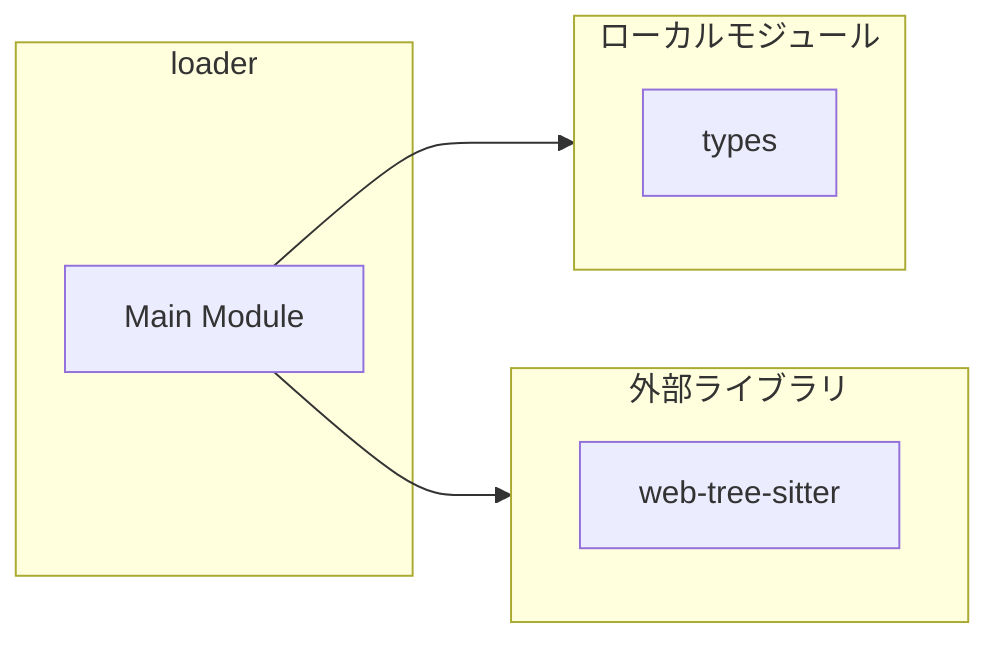
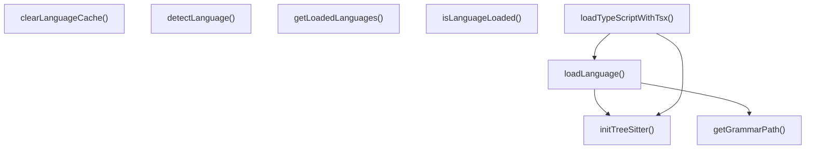
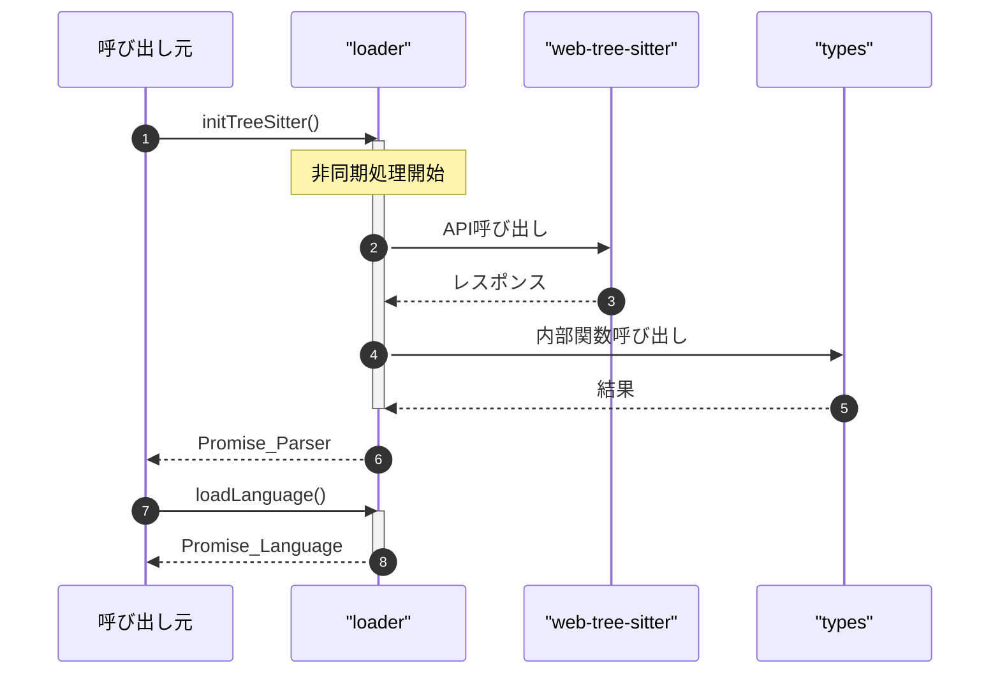

# loader

## 概要

`loader` モジュールのAPIリファレンス。

## インポート

```typescript
// from 'web-tree-sitter': Parser, Language
// from '../repograph/types.js': SupportedLanguage
```

## エクスポート一覧

| 種別 | 名前 | 説明 |
|------|------|------|
| 関数 | `initTreeSitter` | Initialize tree-sitter parser with WASM runtime |
| 関数 | `loadLanguage` | Load a language grammar from WASM |
| 関数 | `loadTypeScriptWithTsx` | Load TypeScript with TSX support |
| 関数 | `getGrammarPath` | Get the WASM URL for a language grammar |
| 関数 | `getLoadedLanguages` | Get list of currently loaded languages |
| 関数 | `isLanguageLoaded` | Check if a language grammar is loaded |
| 関数 | `clearLanguageCache` | Clear all cached languages (useful for testing) |
| 関数 | `detectLanguage` | Detect language from file extension |

## 図解

### 依存関係図



### 関数フロー



### シーケンス図



## 関数

### initTreeSitter

```typescript
async initTreeSitter(): Promise<Parser>
```

Initialize tree-sitter parser with WASM runtime

**戻り値**: `Promise<Parser>`

### loadLanguage

```typescript
async loadLanguage(lang: SupportedLanguage): Promise<Language>
```

Load a language grammar from WASM

**パラメータ**

| 名前 | 型 | 必須 |
|------|-----|------|
| lang | `SupportedLanguage` | はい |

**戻り値**: `Promise<Language>`

### loadTypeScriptWithTsx

```typescript
async loadTypeScriptWithTsx(): Promise<Language>
```

Load TypeScript with TSX support

**戻り値**: `Promise<Language>`

### getGrammarPath

```typescript
getGrammarPath(lang: SupportedLanguage): string
```

Get the WASM URL for a language grammar

**パラメータ**

| 名前 | 型 | 必須 |
|------|-----|------|
| lang | `SupportedLanguage` | はい |

**戻り値**: `string`

### getLoadedLanguages

```typescript
getLoadedLanguages(): string[]
```

Get list of currently loaded languages

**戻り値**: `string[]`

### isLanguageLoaded

```typescript
isLanguageLoaded(lang: SupportedLanguage): boolean
```

Check if a language grammar is loaded

**パラメータ**

| 名前 | 型 | 必須 |
|------|-----|------|
| lang | `SupportedLanguage` | はい |

**戻り値**: `boolean`

### clearLanguageCache

```typescript
clearLanguageCache(): void
```

Clear all cached languages (useful for testing)

**戻り値**: `void`

### detectLanguage

```typescript
detectLanguage(filePath: string): SupportedLanguage | undefined
```

Detect language from file extension

**パラメータ**

| 名前 | 型 | 必須 |
|------|-----|------|
| filePath | `string` | はい |

**戻り値**: `SupportedLanguage | undefined`

---
*自動生成: 2026-02-28T13:55:20.096Z*
