# types

## 概要

`types` モジュールのAPIリファレンス。

## エクスポート一覧

| 種別 | 名前 | 説明 |
|------|------|------|
| インターフェース | `SearchHints` | 共通で使用される型定義 |
| インターフェース | `SearchDetails` | 検索に関するヒント情報 |
| インターフェース | `SearchResponse` | 検索結果の追加詳細 |
| インターフェース | `SearchErrorResponse` | 検索エラーレスポンス |
| インターフェース | `FileCandidatesInput` | ファイル候補入力 |
| インターフェース | `FileCandidate` | - |
| インターフェース | `CodeSearchInput` | - |
| インターフェース | `CodeSearchMatch` | コード検索マッチ |
| インターフェース | `CodeSearchSummary` | コード検索サマリ |
| インターフェース | `CodeSearchOutput` | コード検索出力 |
| インターフェース | `SymIndexInput` | シンボルインデックス入力 |
| インターフェース | `SymIndexOutput` | シンボルインデックス出力 |
| インターフェース | `SymFindInput` | シンボル検索の入力パラメータ |
| インターフェース | `SymbolDefinition` | シンボルの定義情報 |
| インターフェース | `CliOptions` | CLI実行時のオプション設定 |
| インターフェース | `CliResult` | CLI実行結果を表す |
| インターフェース | `CliError` | CLIコマンド実行時のエラー情報を表します |
| インターフェース | `ToolAvailability` | 外部ツールの利用可能性を表します |
| インターフェース | `ToolVersion` | 外部ツールのバージョン情報を表します |
| インターフェース | `SymbolIndexEntry` | シンボルインデックスのエントリを表します |
| インターフェース | `RgMatch` | 正規表現マッチ結果を表します |
| インターフェース | `RgBegin` | 検索開始メッセージ型 |
| インターフェース | `RgEnd` | 検索終了メッセージ型 |
| インターフェース | `ManifestEntry` | マニフェストエントリ情報 |
| インターフェース | `IndexMetadata` | - |
| インターフェース | `ShardHeader` | シャードヘッダー定義 |
| インターフェース | `CodeEmbedding` | コード埋め込みエントリ（セマンティック検索用） |
| インターフェース | `SemanticIndexInput` | セマンティックインデックスの入力パラメータ |
| インターフェース | `SemanticIndexOutput` | セマンティックインデックスの出力 |
| インターフェース | `SemanticSearchInput` | 検索の入力設定 |
| インターフェース | `SemanticSearchResult` | 単一の検索結果 |
| インターフェース | `SemanticSearchOutput` | 検索結果の出力形式 |
| インターフェース | `SemanticIndexMetadata` | インデックスのメタデータ |
| 型 | `FileCandidatesOutput` | ファイル候補の検索レスポンス |
| 型 | `SymFindOutput` | シンボル検索の出力結果 |
| 型 | `RgOutput` | ripgrep出力の共用体型 |
| 型 | `IndexManifest` | インデックスマニフェスト型 |

## 図解

### クラス図

```mermaid
classDiagram
  class SearchHints {
    <<interface>>
    +confidence: number
    +suggestedNextAction: refine_pattern_ex
    +alternativeTools: string
    +relatedQueries: string
  }
  class SearchDetails {
    <<interface>>
    +hints: SearchHints
  }
  class SearchResponse {
    <<interface>>
    +total: number
    +truncated: boolean
    +results: T
    +error: string
    +details: SearchDetails
  }
  class SearchErrorResponse {
    <<interface>>
    +error: string
    +total: T0
    +truncated: false
    +results: any
  }
  class FileCandidatesInput {
    <<interface>>
    +pattern: string
    +type: file_dir
    +extension: string
    +exclude: string
    +maxDepth: number
  }
  class FileCandidate {
    <<interface>>
    +path: string
    +type: file_dir
  }
  class CodeSearchInput {
    <<interface>>
    +pattern: string
    +path: string
    +type: string
    +ignoreCase: boolean
    +literal: boolean
  }
  class CodeSearchMatch {
    <<interface>>
    +file: string
    +line: number
    +column: number
    +text: string
    +context: string
  }
  class CodeSearchSummary {
    <<interface>>
    +file: string
    +count: number
  }
  class CodeSearchOutput {
    <<interface>>
    +total: number
    +truncated: boolean
    +summary: CodeSearchSummary
    +results: CodeSearchMatch
    +error: string
  }
  class SymIndexInput {
    <<interface>>
    +path: string
    +force: boolean
    +cwd: string
  }
  class SymIndexOutput {
    <<interface>>
    +indexed: number
    +outputPath: string
    +error: string
  }
  class SymFindInput {
    <<interface>>
    +name: string
    +kind: string
    +file: string
    +limit: number
    +cwd: string
  }
  class SymbolDefinition {
    <<interface>>
    +name: string
    +kind: string
    +file: string
    +line: number
    +signature: string
  }
  class CliOptions {
    <<interface>>
    +cwd: string
    +timeout: number
    +signal: AbortSignal
    +maxOutputSize: number
    +env: Record_string_string
  }
  class CliResult {
    <<interface>>
    +code: number
    +stdout: string
    +stderr: string
    +timedOut: boolean
    +killed: boolean
  }
  class CliError {
    <<interface>>
    +code: number
    +stdout: string
    +stderr: string
    +command: string
  }
  class ToolAvailability {
    <<interface>>
    +fd: boolean
    +rg: boolean
    +ctags: boolean
    +ctagsJson: boolean
  }
  class ToolVersion {
    <<interface>>
    +name: string
    +version: string
    +path: string
  }
  class SymbolIndexEntry {
    <<interface>>
    +name: string
    +kind: string
    +file: string
    +line: number
    +signature: string
  }
  class RgMatch {
    <<interface>>
    +type: match
    +data: path_text_string
  }
  class RgBegin {
    <<interface>>
    +type: begin
    +data: path_text_string
  }
  class RgEnd {
    <<interface>>
    +type: end
    +data: path_text_string
  }
  class ManifestEntry {
    <<interface>>
    +hash: string
    +mtime: number
    +shardId: number
  }
  class IndexMetadata {
    <<interface>>
    +createdAt: number
    +updatedAt: number
    +sourceDir: string
    +totalSymbols: number
    +totalFiles: number
  }
  class ShardHeader {
    <<interface>>
    +id: number
    +entryCount: number
    +createdAt: number
    +updatedAt: number
  }
  class CodeEmbedding {
    <<interface>>
    +id: string
    +file: string
    +line: number
    +code: string
    +embedding: number
  }
  class SemanticIndexInput {
    <<interface>>
    +path: string
    +force: boolean
    +chunkSize: number
    +chunkOverlap: number
    +extensions: string
  }
  class SemanticIndexOutput {
    <<interface>>
    +indexed: number
    +files: number
    +outputPath: string
    +error: string
  }
  class SemanticSearchInput {
    <<interface>>
    +query: string
    +topK: number
    +threshold: number
    +language: string
    +kind: function_class
  }
  class SemanticSearchResult {
    <<interface>>
    +file: string
    +line: number
    +code: string
    +similarity: number
    +metadata: CodeEmbedding_metad
  }
  class SemanticSearchOutput {
    <<interface>>
    +total: number
    +truncated: boolean
    +results: SemanticSearchResult
    +error: string
  }
  class SemanticIndexMetadata {
    <<interface>>
    +createdAt: number
    +updatedAt: number
    +sourceDir: string
    +totalEmbeddings: number
    +totalFiles: number
  }
```



## インターフェース

### SearchHints

```typescript
interface SearchHints {
  confidence: number;
  suggestedNextAction?: "refine_pattern" | "expand_scope" | "try_different_tool" | "increase_limit" | "regenerate_index";
  alternativeTools?: string[];
  relatedQueries?: string[];
}
```

共通で使用される型定義

### SearchDetails

```typescript
interface SearchDetails {
  hints?: SearchHints;
}
```

検索に関するヒント情報

### SearchResponse

```typescript
interface SearchResponse {
  total: number;
  truncated: boolean;
  results: T[];
  error?: string;
  details?: SearchDetails;
}
```

検索結果の追加詳細

### SearchErrorResponse

```typescript
interface SearchErrorResponse {
  error: string;
  total: 0;
  truncated: false;
  results: [];
}
```

検索エラーレスポンス

### FileCandidatesInput

```typescript
interface FileCandidatesInput {
  pattern?: string;
  type?: "file" | "dir";
  extension?: string[];
  exclude?: string[];
  maxDepth?: number;
  limit?: number;
  cwd?: string;
}
```

ファイル候補入力

### FileCandidate

```typescript
interface FileCandidate {
  path: string;
  type: "file" | "dir";
}
```

### CodeSearchInput

```typescript
interface CodeSearchInput {
  pattern: string;
  path?: string;
  type?: string;
  ignoreCase?: boolean;
  literal?: boolean;
  context?: number;
  limit?: number;
  exclude?: string[];
  cwd?: string;
}
```

### CodeSearchMatch

```typescript
interface CodeSearchMatch {
  file: string;
  line: number;
  column?: number;
  text: string;
  context?: string[];
}
```

コード検索マッチ

### CodeSearchSummary

```typescript
interface CodeSearchSummary {
  file: string;
  count: number;
}
```

コード検索サマリ

### CodeSearchOutput

```typescript
interface CodeSearchOutput {
  total: number;
  truncated: boolean;
  summary: CodeSearchSummary[];
  results: CodeSearchMatch[];
  error?: string;
  details?: SearchDetails;
}
```

コード検索出力

### SymIndexInput

```typescript
interface SymIndexInput {
  path?: string;
  force?: boolean;
  cwd?: string;
}
```

シンボルインデックス入力

### SymIndexOutput

```typescript
interface SymIndexOutput {
  indexed: number;
  outputPath: string;
  error?: string;
}
```

シンボルインデックス出力

### SymFindInput

```typescript
interface SymFindInput {
  name?: string;
  kind?: string[];
  file?: string;
  limit?: number;
  cwd?: string;
}
```

シンボル検索の入力パラメータ

### SymbolDefinition

```typescript
interface SymbolDefinition {
  name: string;
  kind: string;
  file: string;
  line: number;
  signature?: string;
  scope?: string;
}
```

シンボルの定義情報

### CliOptions

```typescript
interface CliOptions {
  cwd?: string;
  timeout?: number;
  signal?: AbortSignal;
  maxOutputSize?: number;
  env?: Record<string, string>;
}
```

CLI実行時のオプション設定

### CliResult

```typescript
interface CliResult {
  code: number;
  stdout: string;
  stderr: string;
  timedOut: boolean;
  killed: boolean;
}
```

CLI実行結果を表す

### CliError

```typescript
interface CliError {
  code: number;
  stdout: string;
  stderr: string;
  command: string;
}
```

CLIコマンド実行時のエラー情報を表します

### ToolAvailability

```typescript
interface ToolAvailability {
  fd: boolean;
  rg: boolean;
  ctags: boolean;
  ctagsJson: boolean;
}
```

外部ツールの利用可能性を表します

### ToolVersion

```typescript
interface ToolVersion {
  name: string;
  version: string;
  path: string;
}
```

外部ツールのバージョン情報を表します

### SymbolIndexEntry

```typescript
interface SymbolIndexEntry {
  name: string;
  kind: string;
  file: string;
  line: number;
  signature?: string;
  scope?: string;
  pattern?: string;
}
```

シンボルインデックスのエントリを表します

### RgMatch

```typescript
interface RgMatch {
  type: "match";
  data: {
    path: { text: string };
    lines: { text: string };
    line_number: number;
    absolute_offset: number;
    submatches: Array<{
      match: { text: string };
      start: number;
      end: number;
    }>;
  };
}
```

正規表現マッチ結果を表します

### RgBegin

```typescript
interface RgBegin {
  type: "begin";
  data: {
    path: { text: string };
  };
}
```

検索開始メッセージ型

### RgEnd

```typescript
interface RgEnd {
  type: "end";
  data: {
    path: { text: string };
    stats: {
      elapsed: { secs: number; nanos: number };
      searches: number;
      searches_with_match: number;
      bytes_searched: number;
      bytes_printed: number;
      matched_lines: number;
      matches: number;
    };
  };
}
```

検索終了メッセージ型

### ManifestEntry

```typescript
interface ManifestEntry {
  hash: string;
  mtime: number;
  shardId: number;
}
```

マニフェストエントリ情報

### IndexMetadata

```typescript
interface IndexMetadata {
  createdAt: number;
  updatedAt: number;
  sourceDir: string;
  totalSymbols: number;
  totalFiles: number;
  shardCount: number;
  version: number;
}
```

### ShardHeader

```typescript
interface ShardHeader {
  id: number;
  entryCount: number;
  createdAt: number;
  updatedAt: number;
}
```

シャードヘッダー定義

### CodeEmbedding

```typescript
interface CodeEmbedding {
  id: string;
  file: string;
  line: number;
  code: string;
  embedding: number[];
  metadata: {
    /** Programming language */
    language: string;

    /** Symbol name (if applicable) */
    symbol?: string;

    /** Kind of code chunk */
    kind?: "function" | "class" | "variable" | "chunk";

    /** Embedding dimensions */
    dimensions: number;

    /** Model used for embedding */
    model: string;

    /** Token count (approximate) */
    tokens?: number;
  };
}
```

コード埋め込みエントリ（セマンティック検索用）

### SemanticIndexInput

```typescript
interface SemanticIndexInput {
  path?: string;
  force?: boolean;
  chunkSize?: number;
  chunkOverlap?: number;
  extensions?: string[];
  cwd?: string;
}
```

セマンティックインデックスの入力パラメータ

### SemanticIndexOutput

```typescript
interface SemanticIndexOutput {
  indexed: number;
  files: number;
  outputPath: string;
  error?: string;
}
```

セマンティックインデックスの出力

### SemanticSearchInput

```typescript
interface SemanticSearchInput {
  query: string;
  topK?: number;
  threshold?: number;
  language?: string;
  kind?: ("function" | "class" | "variable" | "chunk")[];
  cwd?: string;
}
```

検索の入力設定

### SemanticSearchResult

```typescript
interface SemanticSearchResult {
  file: string;
  line: number;
  code: string;
  similarity: number;
  metadata: CodeEmbedding["metadata"];
}
```

単一の検索結果

### SemanticSearchOutput

```typescript
interface SemanticSearchOutput {
  total: number;
  truncated: boolean;
  results: SemanticSearchResult[];
  error?: string;
}
```

検索結果の出力形式

### SemanticIndexMetadata

```typescript
interface SemanticIndexMetadata {
  createdAt: number;
  updatedAt: number;
  sourceDir: string;
  totalEmbeddings: number;
  totalFiles: number;
  model: string;
  dimensions: number;
  version: number;
}
```

インデックスのメタデータ

## 型定義

### FileCandidatesOutput

```typescript
type FileCandidatesOutput = SearchResponse<FileCandidate>
```

ファイル候補の検索レスポンス

### SymFindOutput

```typescript
type SymFindOutput = SearchResponse<SymbolDefinition>
```

シンボル検索の出力結果

### RgOutput

```typescript
type RgOutput = RgMatch | RgBegin | RgEnd
```

ripgrep出力の共用体型

### IndexManifest

```typescript
type IndexManifest = Record<string, ManifestEntry>
```

インデックスマニフェスト型

---
*自動生成: 2026-02-22T19:27:00.436Z*
