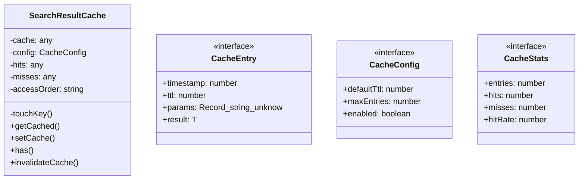
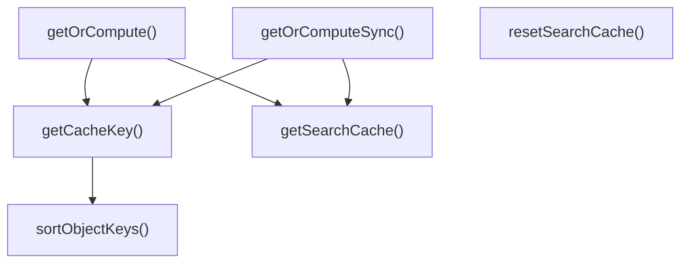
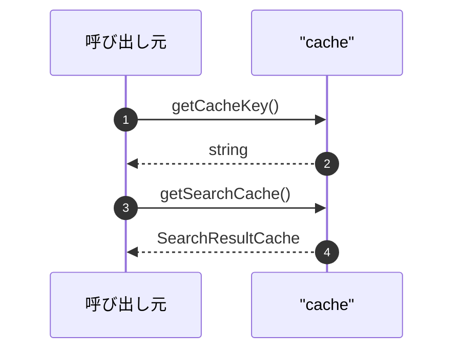

# cache

## 概要

`cache` モジュールのAPIリファレンス。

## エクスポート一覧

| 種別 | 名前 | 説明 |
|------|------|------|
| 関数 | `getCacheKey` | キャッシュキーを生成する |
| 関数 | `getSearchCache` | グローバルキャッシュインスタンスを取得する。 |
| 関数 | `resetSearchCache` | グローバルキャッシュをリセットする |
| 関数 | `getOrCompute` | キャッシュを取得または計算して返す |
| 関数 | `getOrComputeSync` | キャッシュを取得または計算して返す（同期版） |
| クラス | `SearchResultCache` | 検索結果をキャッシュする |
| インターフェース | `CacheEntry` | キャッシュエントリ定義 |
| インターフェース | `CacheConfig` | キャッシュ設定を保持する |
| インターフェース | `CacheStats` | キャッシュ統計情報を定義 |

## 図解

### クラス図



### 関数フロー



### シーケンス図



## 関数

### getCacheKey

```typescript
getCacheKey(tool: string, params: Record<string, unknown>): string
```

キャッシュキーを生成する

**パラメータ**

| 名前 | 型 | 必須 |
|------|-----|------|
| tool | `string` | はい |
| params | `Record<string, unknown>` | はい |

**戻り値**: `string`

### sortObjectKeys

```typescript
sortObjectKeys(obj: Record<string, unknown>): Record<string, unknown>
```

Sort object keys recursively for consistent serialization.

**パラメータ**

| 名前 | 型 | 必須 |
|------|-----|------|
| obj | `Record<string, unknown>` | はい |

**戻り値**: `Record<string, unknown>`

### getSearchCache

```typescript
getSearchCache(): SearchResultCache
```

グローバルキャッシュインスタンスを取得する。

**戻り値**: `SearchResultCache`

### resetSearchCache

```typescript
resetSearchCache(): void
```

グローバルキャッシュをリセットする

**戻り値**: `void`

### getOrCompute

```typescript
async getOrCompute(tool: string, params: Record<string, unknown>, factory: () => Promise<T>, ttl?: number): Promise<T>
```

キャッシュを取得または計算して返す

**パラメータ**

| 名前 | 型 | 必須 |
|------|-----|------|
| tool | `string` | はい |
| params | `Record<string, unknown>` | はい |
| factory | `() => Promise<T>` | はい |
| ttl | `number` | いいえ |

**戻り値**: `Promise<T>`

### getOrComputeSync

```typescript
getOrComputeSync(tool: string, params: Record<string, unknown>, factory: () => T, ttl?: number): T
```

キャッシュを取得または計算して返す（同期版）

**パラメータ**

| 名前 | 型 | 必須 |
|------|-----|------|
| tool | `string` | はい |
| params | `Record<string, unknown>` | はい |
| factory | `() => T` | はい |
| ttl | `number` | いいえ |

**戻り値**: `T`

## クラス

### SearchResultCache

検索結果をキャッシュする

**プロパティ**

| 名前 | 型 | 可視性 |
|------|-----|--------|
| cache | `any` | private |
| config | `CacheConfig` | private |
| hits | `any` | private |
| misses | `any` | private |
| accessOrder | `string[]` | private |

**メソッド**

| 名前 | シグネチャ |
|------|------------|
| touchKey | `touchKey(key): void` |
| getCached | `getCached(key): T | undefined` |
| setCache | `setCache(key, result, ttl, params): void` |
| has | `has(key): boolean` |
| invalidateCache | `invalidateCache(pattern): number` |
| invalidateTool | `invalidateTool(tool): number` |
| clear | `clear(): void` |
| getStats | `getStats(): CacheStats` |
| getKeys | `getKeys(): string[]` |
| isExpired | `isExpired(entry): boolean` |
| evictOldest | `evictOldest(): void` |
| patternToRegex | `patternToRegex(pattern): RegExp` |

## インターフェース

### CacheEntry

```typescript
interface CacheEntry {
  timestamp: number;
  ttl: number;
  params: Record<string, unknown>;
  result: T;
}
```

キャッシュエントリ定義

### CacheConfig

```typescript
interface CacheConfig {
  defaultTtl: number;
  maxEntries: number;
  enabled: boolean;
}
```

キャッシュ設定を保持する

### CacheStats

```typescript
interface CacheStats {
  entries: number;
  hits: number;
  misses: number;
  hitRate: number;
}
```

キャッシュ統計情報を定義

---
*自動生成: 2026-02-22T19:27:00.437Z*
