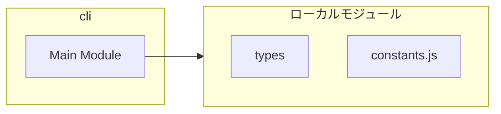
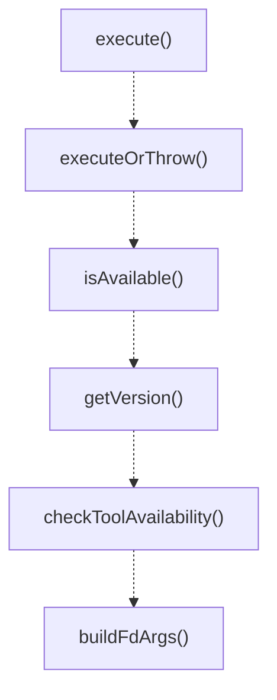

# cli

## 概要

`cli` モジュールのAPIリファレンス。

## インポート

```typescript
import { spawn } from 'node:child_process';
import { CliOptions, CliResult, CliError... } from '../types';
import { DEFAULT_EXCLUDES, DEFAULT_LIMIT, DEFAULT_CODE_SEARCH_LIMIT... } from './constants.js';
```

## エクスポート一覧

| 種別 | 名前 | 説明 |
|------|------|------|
| 関数 | `execute` | Execute a command and return structured result. |
| 関数 | `executeOrThrow` | Execute a command and throw on non-zero exit. |
| 関数 | `isAvailable` | Check if a command is available in PATH. |
| 関数 | `getVersion` | Get version info for a command. |
| 関数 | `checkToolAvailability` | - |
| 関数 | `buildFdArgs` | Build fd command arguments from input options. |
| 関数 | `buildRgArgs` | Build ripgrep command arguments from input options |
| 関数 | `buildCtagsArgs` | Build ctags command arguments for JSON output. |

## 図解

### 依存関係図



### 関数フロー



### シーケンス図


## 関数

### execute

```typescript
async execute(command: string, args: string[], options: CliOptions): Promise<CliResult>
```

Execute a command and return structured result.

**パラメータ**

| 名前 | 型 | 必須 |
|------|-----|------|
| command | `string` | はい |
| args | `string[]` | はい |
| options | `CliOptions` | はい |

**戻り値**: `Promise<CliResult>`

### abortHandler

```typescript
abortHandler(): void
```

**戻り値**: `void`

### executeOrThrow

```typescript
async executeOrThrow(command: string, args: string[], options: CliOptions): Promise<string>
```

Execute a command and throw on non-zero exit.

**パラメータ**

| 名前 | 型 | 必須 |
|------|-----|------|
| command | `string` | はい |
| args | `string[]` | はい |
| options | `CliOptions` | はい |

**戻り値**: `Promise<string>`

### isAvailable

```typescript
async isAvailable(command: string): Promise<boolean>
```

Check if a command is available in PATH.
Works on both Unix (which) and Windows (where).

**パラメータ**

| 名前 | 型 | 必須 |
|------|-----|------|
| command | `string` | はい |

**戻り値**: `Promise<boolean>`

### getVersion

```typescript
async getVersion(command: string, versionFlag: any): Promise<ToolVersion | null>
```

Get version info for a command.

**パラメータ**

| 名前 | 型 | 必須 |
|------|-----|------|
| command | `string` | はい |
| versionFlag | `any` | はい |

**戻り値**: `Promise<ToolVersion | null>`

### checkToolAvailability

```typescript
async checkToolAvailability(force: any): Promise<ToolAvailability>
```

**パラメータ**

| 名前 | 型 | 必須 |
|------|-----|------|
| force | `any` | はい |

**戻り値**: `Promise<ToolAvailability>`

### buildFdArgs

```typescript
buildFdArgs(input: import("../types").FileCandidatesInput): string[]
```

Build fd command arguments from input options.
Applies DEFAULT_EXCLUDES when no exclude patterns are specified.

**パラメータ**

| 名前 | 型 | 必須 |
|------|-----|------|
| input | `import("../types").FileCandidatesInput` | はい |

**戻り値**: `string[]`

### buildRgArgs

```typescript
buildRgArgs(input: import("../types").CodeSearchInput): string[]
```

Build ripgrep command arguments from input options.
Uses default values from constants when not specified.
Applies DEFAULT_EXCLUDES when no exclude patterns are specified.

**パラメータ**

| 名前 | 型 | 必須 |
|------|-----|------|
| input | `import("../types").CodeSearchInput` | はい |

**戻り値**: `string[]`

### buildCtagsArgs

```typescript
buildCtagsArgs(targetPath: string, cwd: string): string[]
```

Build ctags command arguments for JSON output.

**パラメータ**

| 名前 | 型 | 必須 |
|------|-----|------|
| targetPath | `string` | はい |
| cwd | `string` | はい |

**戻り値**: `string[]`

---
*自動生成: 2026-02-17T22:24:18.848Z*
