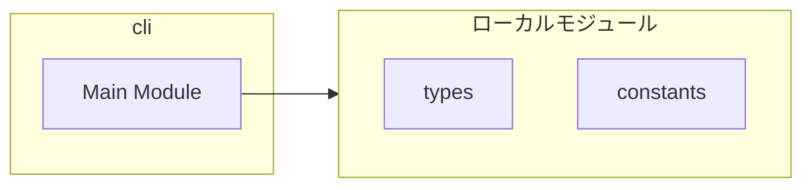
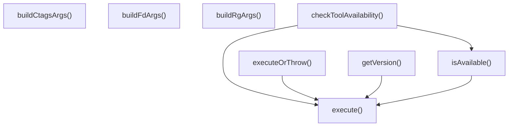
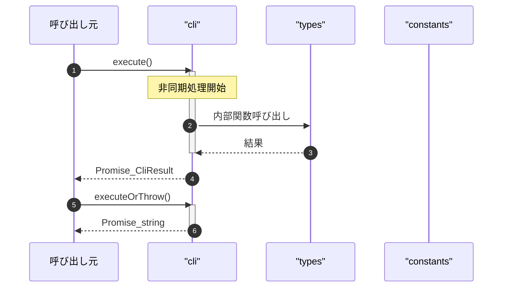

# cli

## 概要

`cli` モジュールのAPIリファレンス。

## インポート

```typescript
// from 'node:child_process': spawn
// from '../types': CliOptions, CliResult, CliError, ...
// from './constants.js': DEFAULT_EXCLUDES, DEFAULT_LIMIT, DEFAULT_CODE_SEARCH_LIMIT, ...
```

## エクスポート一覧

| 種別 | 名前 | 説明 |
|------|------|------|
| 関数 | `execute` | コマンドを実行する |
| 関数 | `executeOrThrow` | コマンド実行 |
| 関数 | `isAvailable` | コマンドの存在確認 |
| 関数 | `getVersion` | ツールバージョン取得 |
| 関数 | `checkToolAvailability` | ツール利用可否チェック |
| 関数 | `buildFdArgs` | fdコマンド引数作成 |
| 関数 | `buildRgArgs` | ripgrepコマンド引数作成 |
| 関数 | `buildCtagsArgs` | ctagsコマンド引数作成 |

## 図解

### 依存関係図



### 関数フロー



### シーケンス図



## 関数

### execute

```typescript
async execute(command: string, args: string[], options: CliOptions): Promise<CliResult>
```

コマンドを実行する

**パラメータ**

| 名前 | 型 | 必須 |
|------|-----|------|
| command | `string` | はい |
| args | `string[]` | はい |
| options | `CliOptions` | はい |

**戻り値**: `Promise<CliResult>`

### abortHandler

```typescript
abortHandler(): void
```

**戻り値**: `void`

### executeOrThrow

```typescript
async executeOrThrow(command: string, args: string[], options: CliOptions): Promise<string>
```

コマンド実行

**パラメータ**

| 名前 | 型 | 必須 |
|------|-----|------|
| command | `string` | はい |
| args | `string[]` | はい |
| options | `CliOptions` | はい |

**戻り値**: `Promise<string>`

### isAvailable

```typescript
async isAvailable(command: string): Promise<boolean>
```

コマンドの存在確認

**パラメータ**

| 名前 | 型 | 必須 |
|------|-----|------|
| command | `string` | はい |

**戻り値**: `Promise<boolean>`

### getVersion

```typescript
async getVersion(command: string, versionFlag: any): Promise<ToolVersion | null>
```

ツールバージョン取得

**パラメータ**

| 名前 | 型 | 必須 |
|------|-----|------|
| command | `string` | はい |
| versionFlag | `any` | はい |

**戻り値**: `Promise<ToolVersion | null>`

### checkToolAvailability

```typescript
async checkToolAvailability(force: any): Promise<ToolAvailability>
```

ツール利用可否チェック

**パラメータ**

| 名前 | 型 | 必須 |
|------|-----|------|
| force | `any` | はい |

**戻り値**: `Promise<ToolAvailability>`

### buildFdArgs

```typescript
buildFdArgs(input: import("../types").FileCandidatesInput): string[]
```

fdコマンド引数作成

**パラメータ**

| 名前 | 型 | 必須 |
|------|-----|------|
| input | `import("../types").FileCandidatesInput` | はい |

**戻り値**: `string[]`

### buildRgArgs

```typescript
buildRgArgs(input: import("../types").CodeSearchInput): string[]
```

ripgrepコマンド引数作成

**パラメータ**

| 名前 | 型 | 必須 |
|------|-----|------|
| input | `import("../types").CodeSearchInput` | はい |

**戻り値**: `string[]`

### buildCtagsArgs

```typescript
buildCtagsArgs(targetPath: string, cwd: string): string[]
```

ctagsコマンド引数作成

**パラメータ**

| 名前 | 型 | 必須 |
|------|-----|------|
| targetPath | `string` | はい |
| cwd | `string` | はい |

**戻り値**: `string[]`

---
*自動生成: 2026-02-28T13:55:20.104Z*
