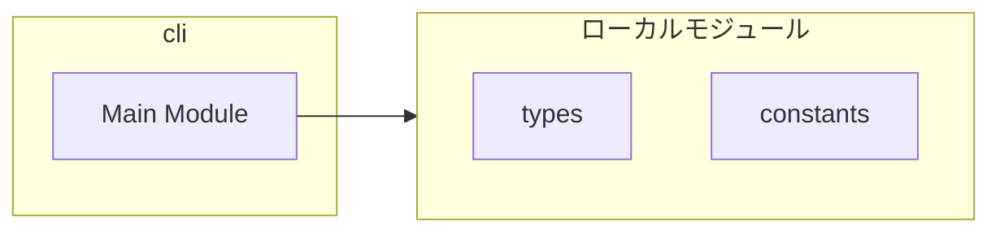
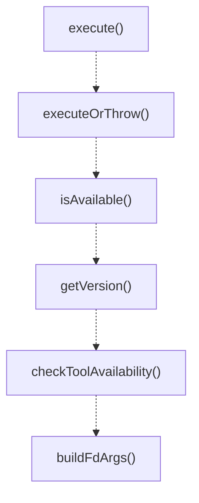
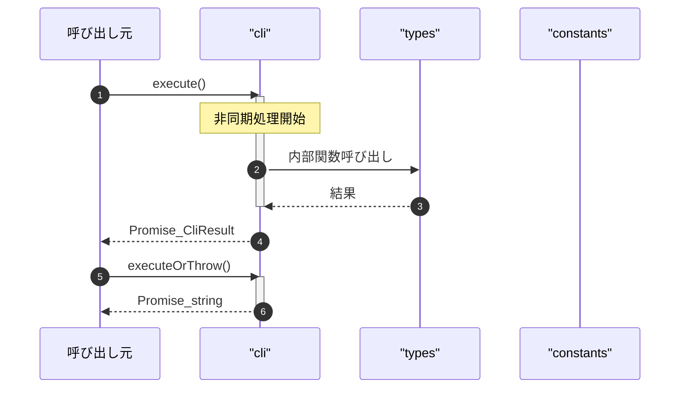

# cli

## 概要

`cli` モジュールのAPIリファレンス。

## インポート

```typescript
import { spawn } from 'node:child_process';
import { CliOptions, CliResult, CliError... } from '../types';
import { DEFAULT_EXCLUDES, DEFAULT_LIMIT, DEFAULT_CODE_SEARCH_LIMIT... } from './constants.js';
```

## エクスポート一覧

| 種別 | 名前 | 説明 |
|------|------|------|
| 関数 | `execute` | コマンドを実行し、構造化された結果を返す |
| 関数 | `executeOrThrow` | コマンドを実行し、失敗時に例外を投げる |
| 関数 | `isAvailable` | コマンドがPATHにあるかチェックする |
| 関数 | `getVersion` | 指定したコマンドのバージョン情報を取得する |
| 関数 | `checkToolAvailability` | ツールの利用可能性を確認する |
| 関数 | `buildFdArgs` | 入力オプションからfdコマンドの引数を生成 |
| 関数 | `buildRgArgs` | 入力オプションからripgrepコマンドの引数を構築 |
| 関数 | `buildCtagsArgs` | JSON出力用のctagsコマンド引数を生成する |

## 図解

### 依存関係図



### 関数フロー



### シーケンス図



## 関数

### execute

```typescript
async execute(command: string, args: string[], options: CliOptions): Promise<CliResult>
```

コマンドを実行し、構造化された結果を返す

**パラメータ**

| 名前 | 型 | 必須 |
|------|-----|------|
| command | `string` | はい |
| args | `string[]` | はい |
| options | `CliOptions` | はい |

**戻り値**: `Promise<CliResult>`

### abortHandler

```typescript
abortHandler(): void
```

**戻り値**: `void`

### executeOrThrow

```typescript
async executeOrThrow(command: string, args: string[], options: CliOptions): Promise<string>
```

コマンドを実行し、失敗時に例外を投げる

**パラメータ**

| 名前 | 型 | 必須 |
|------|-----|------|
| command | `string` | はい |
| args | `string[]` | はい |
| options | `CliOptions` | はい |

**戻り値**: `Promise<string>`

### isAvailable

```typescript
async isAvailable(command: string): Promise<boolean>
```

コマンドがPATHにあるかチェックする

**パラメータ**

| 名前 | 型 | 必須 |
|------|-----|------|
| command | `string` | はい |

**戻り値**: `Promise<boolean>`

### getVersion

```typescript
async getVersion(command: string, versionFlag: any): Promise<ToolVersion | null>
```

指定したコマンドのバージョン情報を取得する

**パラメータ**

| 名前 | 型 | 必須 |
|------|-----|------|
| command | `string` | はい |
| versionFlag | `any` | はい |

**戻り値**: `Promise<ToolVersion | null>`

### checkToolAvailability

```typescript
async checkToolAvailability(force: any): Promise<ToolAvailability>
```

ツールの利用可能性を確認する

**パラメータ**

| 名前 | 型 | 必須 |
|------|-----|------|
| force | `any` | はい |

**戻り値**: `Promise<ToolAvailability>`

### buildFdArgs

```typescript
buildFdArgs(input: import("../types").FileCandidatesInput): string[]
```

入力オプションからfdコマンドの引数を生成

**パラメータ**

| 名前 | 型 | 必須 |
|------|-----|------|
| input | `import("../types").FileCandidatesInput` | はい |

**戻り値**: `string[]`

### buildRgArgs

```typescript
buildRgArgs(input: import("../types").CodeSearchInput): string[]
```

入力オプションからripgrepコマンドの引数を構築

**パラメータ**

| 名前 | 型 | 必須 |
|------|-----|------|
| input | `import("../types").CodeSearchInput` | はい |

**戻り値**: `string[]`

### buildCtagsArgs

```typescript
buildCtagsArgs(targetPath: string, cwd: string): string[]
```

JSON出力用のctagsコマンド引数を生成する

**パラメータ**

| 名前 | 型 | 必須 |
|------|-----|------|
| targetPath | `string` | はい |
| cwd | `string` | はい |

**戻り値**: `string[]`

---
*自動生成: 2026-02-18T07:48:44.648Z*
