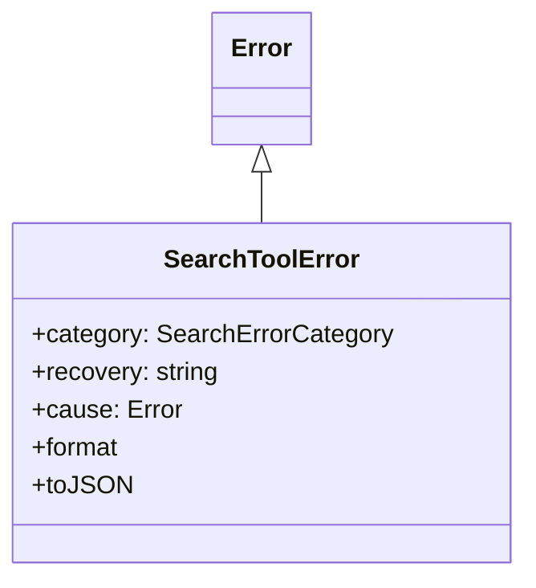
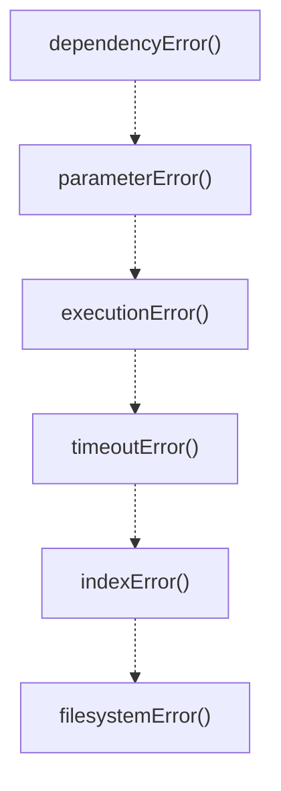

# errors

## 概要

`errors` モジュールのAPIリファレンス。

## エクスポート一覧

| 種別 | 名前 | 説明 |
|------|------|------|
| 関数 | `dependencyError` | Create a dependency error (external tool not avail |
| 関数 | `parameterError` | Create a parameter validation error. |
| 関数 | `executionError` | Create an execution error (command failed). |
| 関数 | `timeoutError` | Create a timeout error. |
| 関数 | `indexError` | Create an index-related error. |
| 関数 | `filesystemError` | Create a filesystem error. |
| 関数 | `isSearchToolError` | Check if an error is a SearchToolError. |
| 関数 | `isErrorCategory` | Check if an error is of a specific category. |
| 関数 | `getErrorMessage` | Get a user-friendly error message from any error t |
| 関数 | `ok` | Create a successful result. |
| 関数 | `err` | Create a failed result. |
| 関数 | `isOk` | Check if a result is successful. |
| 関数 | `isErr` | Check if a result is a failure. |
| クラス | `SearchToolError` | Base error class for search tools with categorizat |
| 型 | `SearchErrorCategory` | Categories for search tool errors. |
| 型 | `SearchResult` | Result type for operations that can fail. |

## 図解

### クラス図



### 関数フロー



## 関数

### dependencyError

```typescript
dependencyError(tool: string, recovery?: string): SearchToolError
```

Create a dependency error (external tool not available).

**パラメータ**

| 名前 | 型 | 必須 |
|------|-----|------|
| tool | `string` | はい |
| recovery | `string` | いいえ |

**戻り値**: `SearchToolError`

### getInstallHint

```typescript
getInstallHint(tool: string): string
```

Get installation hint for common tools.

**パラメータ**

| 名前 | 型 | 必須 |
|------|-----|------|
| tool | `string` | はい |

**戻り値**: `string`

### parameterError

```typescript
parameterError(parameter: string, reason: string, recovery?: string): SearchToolError
```

Create a parameter validation error.

**パラメータ**

| 名前 | 型 | 必須 |
|------|-----|------|
| parameter | `string` | はい |
| reason | `string` | はい |
| recovery | `string` | いいえ |

**戻り値**: `SearchToolError`

### executionError

```typescript
executionError(command: string, stderr: string, recovery?: string): SearchToolError
```

Create an execution error (command failed).

**パラメータ**

| 名前 | 型 | 必須 |
|------|-----|------|
| command | `string` | はい |
| stderr | `string` | はい |
| recovery | `string` | いいえ |

**戻り値**: `SearchToolError`

### timeoutError

```typescript
timeoutError(operation: string, timeoutMs: number, recovery?: string): SearchToolError
```

Create a timeout error.

**パラメータ**

| 名前 | 型 | 必須 |
|------|-----|------|
| operation | `string` | はい |
| timeoutMs | `number` | はい |
| recovery | `string` | いいえ |

**戻り値**: `SearchToolError`

### indexError

```typescript
indexError(message: string, recovery?: string): SearchToolError
```

Create an index-related error.

**パラメータ**

| 名前 | 型 | 必須 |
|------|-----|------|
| message | `string` | はい |
| recovery | `string` | いいえ |

**戻り値**: `SearchToolError`

### filesystemError

```typescript
filesystemError(operation: string, path: string, cause?: Error): SearchToolError
```

Create a filesystem error.

**パラメータ**

| 名前 | 型 | 必須 |
|------|-----|------|
| operation | `string` | はい |
| path | `string` | はい |
| cause | `Error` | いいえ |

**戻り値**: `SearchToolError`

### isSearchToolError

```typescript
isSearchToolError(error: unknown): error is SearchToolError
```

Check if an error is a SearchToolError.

**パラメータ**

| 名前 | 型 | 必須 |
|------|-----|------|
| error | `unknown` | はい |

**戻り値**: `error is SearchToolError`

### isErrorCategory

```typescript
isErrorCategory(error: unknown, category: SearchErrorCategory): boolean
```

Check if an error is of a specific category.

**パラメータ**

| 名前 | 型 | 必須 |
|------|-----|------|
| error | `unknown` | はい |
| category | `SearchErrorCategory` | はい |

**戻り値**: `boolean`

### getErrorMessage

```typescript
getErrorMessage(error: unknown): string
```

Get a user-friendly error message from any error type.

**パラメータ**

| 名前 | 型 | 必須 |
|------|-----|------|
| error | `unknown` | はい |

**戻り値**: `string`

### ok

```typescript
ok(value: T): SearchResult<T>
```

Create a successful result.

**パラメータ**

| 名前 | 型 | 必須 |
|------|-----|------|
| value | `T` | はい |

**戻り値**: `SearchResult<T>`

### err

```typescript
err(error: E): SearchResult<never, E>
```

Create a failed result.

**パラメータ**

| 名前 | 型 | 必須 |
|------|-----|------|
| error | `E` | はい |

**戻り値**: `SearchResult<never, E>`

### isOk

```typescript
isOk(result: SearchResult<T, E>): result is { ok: true; value: T }
```

Check if a result is successful.

**パラメータ**

| 名前 | 型 | 必須 |
|------|-----|------|
| result | `SearchResult<T, E>` | はい |

**戻り値**: `result is { ok: true; value: T }`

### isErr

```typescript
isErr(result: SearchResult<T, E>): result is { ok: false; error: E }
```

Check if a result is a failure.

**パラメータ**

| 名前 | 型 | 必須 |
|------|-----|------|
| result | `SearchResult<T, E>` | はい |

**戻り値**: `result is { ok: false; error: E }`

## クラス

### SearchToolError

Base error class for search tools with categorization and recovery hints.

**継承**: `Error`

**プロパティ**

| 名前 | 型 | 可視性 |
|------|-----|--------|
| category | `SearchErrorCategory` | public |
| recovery | `string` | public |
| cause | `Error` | public |

**メソッド**

| 名前 | シグネチャ |
|------|------------|
| format | `format(): string` |
| toJSON | `toJSON(): {
		name: string;
		message: string;
		category: SearchErrorCategory;
		recovery?: string;
	}` |

## 型定義

### SearchErrorCategory

```typescript
type SearchErrorCategory = | "dependency"   // External tool not available (rg, fd, ctags)
	| "parameter"    // Invalid input parameters
	| "execution"    // Command execution failed
	| "timeout"      // Operation timed out
	| "index"        // Index-related issues
	| "filesystem"
```

Categories for search tool errors.
Each category has different recovery strategies.

### SearchResult

```typescript
type SearchResult = | { ok: true; value: T }
	| { ok: false; error: E }
```

Result type for operations that can fail.
Provides a type-safe way to handle errors without exceptions.

---
*自動生成: 2026-02-17T22:16:16.552Z*
