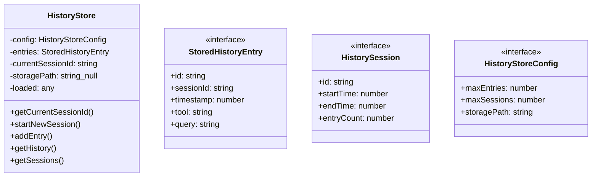
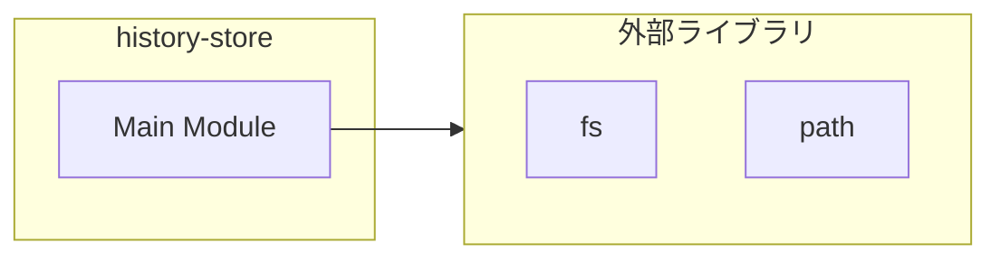
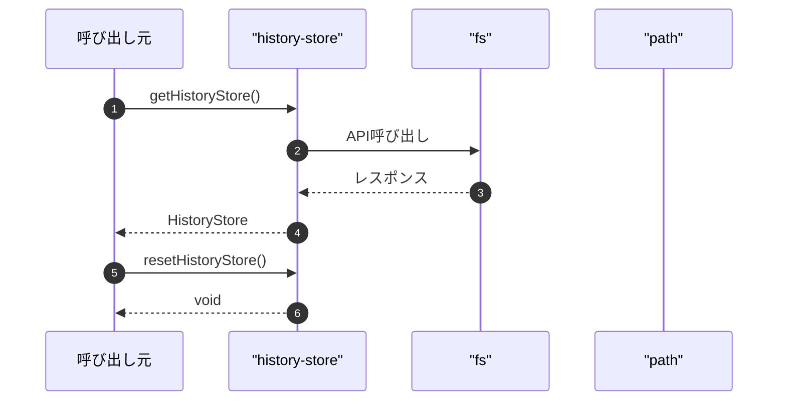

# history-store

## 概要

`history-store` モジュールのAPIリファレンス。

## インポート

```typescript
// from 'fs': fs
// from 'path': path
```

## エクスポート一覧

| 種別 | 名前 | 説明 |
|------|------|------|
| 関数 | `getHistoryStore` | グローバル履歴ストアを取得 |
| 関数 | `resetHistoryStore` | グローバル履歴ストアをリセット |
| クラス | `HistoryStore` | 検索履歴永続化ストア |
| インターフェース | `StoredHistoryEntry` | 保存された履歴エントリ |
| インターフェース | `HistorySession` | セッション情報 |
| インターフェース | `HistoryStoreConfig` | ストア設定 |

## 図解

### クラス図



### 依存関係図



### シーケンス図



## 関数

### getHistoryStore

```typescript
getHistoryStore(cwd?: string): HistoryStore
```

グローバル履歴ストアを取得

**パラメータ**

| 名前 | 型 | 必須 |
|------|-----|------|
| cwd | `string` | いいえ |

**戻り値**: `HistoryStore`

### resetHistoryStore

```typescript
resetHistoryStore(): void
```

グローバル履歴ストアをリセット

**戻り値**: `void`

## クラス

### HistoryStore

検索履歴永続化ストア

**プロパティ**

| 名前 | 型 | 可視性 |
|------|-----|--------|
| config | `HistoryStoreConfig` | private |
| entries | `StoredHistoryEntry[]` | private |
| currentSessionId | `string` | private |
| storagePath | `string | null` | private |
| loaded | `any` | private |

**メソッド**

| 名前 | シグネチャ |
|------|------------|
| getCurrentSessionId | `getCurrentSessionId(): string` |
| startNewSession | `startNewSession(): string` |
| addEntry | `addEntry(tool, query, resultCount, results): StoredHistoryEntry` |
| getHistory | `getHistory(session, limit): StoredHistoryEntry[]` |
| getSessions | `getSessions(): HistorySession[]` |
| saveQuery | `saveQuery(query, tool): StoredHistoryEntry` |
| clear | `clear(session): void` |
| load | `load(): void` |
| save | `save(): void` |
| generateSessionId | `generateSessionId(): string` |
| generateEntryId | `generateEntryId(): string` |
| finalizeCurrentSession | `finalizeCurrentSession(): void` |

## インターフェース

### StoredHistoryEntry

```typescript
interface StoredHistoryEntry {
  id: string;
  sessionId: string;
  timestamp: number;
  tool: string;
  query: string;
  resultCount: number;
  results: string[];
}
```

保存された履歴エントリ

### HistorySession

```typescript
interface HistorySession {
  id: string;
  startTime: number;
  endTime?: number;
  entryCount: number;
}
```

セッション情報

### HistoryStoreConfig

```typescript
interface HistoryStoreConfig {
  maxEntries: number;
  maxSessions: number;
  storagePath?: string;
}
```

ストア設定

---
*自動生成: 2026-02-24T17:08:02.438Z*
