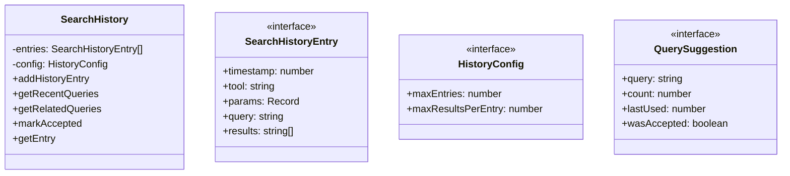
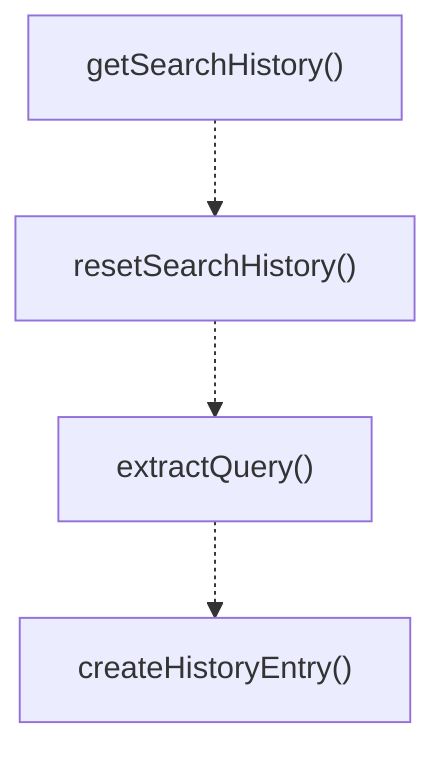

# history

## 概要

`history` モジュールのAPIリファレンス。

## エクスポート一覧

| 種別 | 名前 | 説明 |
|------|------|------|
| 関数 | `getSearchHistory` | Get the global history instance. |
| 関数 | `resetSearchHistory` | Reset the global history instance (for testing). |
| 関数 | `extractQuery` | Extract the primary query string from tool paramet |
| 関数 | `createHistoryEntry` | Create a history entry from tool execution. |
| クラス | `SearchHistory` | In-memory search history store. |
| インターフェース | `SearchHistoryEntry` | Entry in the search history. |
| インターフェース | `HistoryConfig` | Configuration for history management. |
| インターフェース | `QuerySuggestion` | Query with metadata for suggestions. |

## 図解

### クラス図



### 関数フロー



## 関数

### getSearchHistory

```typescript
getSearchHistory(): SearchHistory
```

Get the global history instance.

**戻り値**: `SearchHistory`

### resetSearchHistory

```typescript
resetSearchHistory(): void
```

Reset the global history instance (for testing).

**戻り値**: `void`

### extractQuery

```typescript
extractQuery(tool: string, params: Record<string, unknown>): string
```

Extract the primary query string from tool parameters.

**パラメータ**

| 名前 | 型 | 必須 |
|------|-----|------|
| tool | `string` | はい |
| params | `Record<string, unknown>` | はい |

**戻り値**: `string`

### createHistoryEntry

```typescript
createHistoryEntry(tool: string, params: Record<string, unknown>, results: string[]): Omit<SearchHistoryEntry, "timestamp" | "accepted">
```

Create a history entry from tool execution.

**パラメータ**

| 名前 | 型 | 必須 |
|------|-----|------|
| tool | `string` | はい |
| params | `Record<string, unknown>` | はい |
| results | `string[]` | はい |

**戻り値**: `Omit<SearchHistoryEntry, "timestamp" | "accepted">`

## クラス

### SearchHistory

In-memory search history store.
Designed for easy extension to persistent storage.

**プロパティ**

| 名前 | 型 | 可視性 |
|------|-----|--------|
| entries | `SearchHistoryEntry[]` | private |
| config | `HistoryConfig` | private |

**メソッド**

| 名前 | シグネチャ |
|------|------------|
| addHistoryEntry | `addHistoryEntry(entry): SearchHistoryEntry` |
| getRecentQueries | `getRecentQueries(limit, tool): QuerySuggestion[]` |
| getRelatedQueries | `getRelatedQueries(query, limit): QuerySuggestion[]` |
| markAccepted | `markAccepted(timestamp): boolean` |
| getEntry | `getEntry(timestamp): SearchHistoryEntry | undefined` |
| getAllEntries | `getAllEntries(): SearchHistoryEntry[]` |
| clear | `clear(): void` |
| addOrUpdateSuggestion | `addOrUpdateSuggestion(map, entry): void` |

## インターフェース

### SearchHistoryEntry

```typescript
interface SearchHistoryEntry {
  timestamp: number;
  tool: string;
  params: Record<string, unknown>;
  query: string;
  results: string[];
  accepted: boolean;
}
```

Entry in the search history.

### HistoryConfig

```typescript
interface HistoryConfig {
  maxEntries: number;
  maxResultsPerEntry: number;
}
```

Configuration for history management.

### QuerySuggestion

```typescript
interface QuerySuggestion {
  query: string;
  count: number;
  lastUsed: number;
  wasAccepted: boolean;
}
```

Query with metadata for suggestions.

---
*自動生成: 2026-02-17T21:54:59.703Z*
