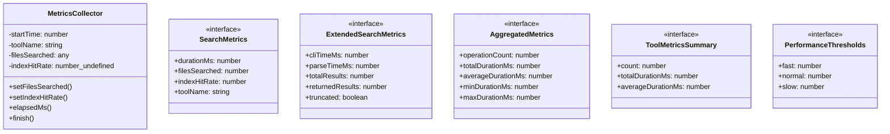
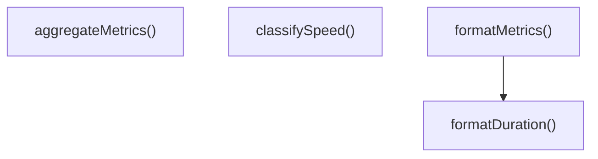

# metrics

## 概要

`metrics` モジュールのAPIリファレンス。

## エクスポート一覧

| 種別 | 名前 | 説明 |
|------|------|------|
| 関数 | `aggregateMetrics` | 検索指標を集計 |
| 関数 | `formatMetrics` | 検索指標を整形 |
| 関数 | `formatDuration` | - |
| 関数 | `classifySpeed` | 実行時間を分類する |
| クラス | `MetricsCollector` | メトリクス収集クラス |
| インターフェース | `SearchMetrics` | 検索操作のメトリクス |
| インターフェース | `ExtendedSearchMetrics` | 検索メトリクスインターフェース |
| インターフェース | `AggregatedMetrics` | 集計された検索指標 |
| インターフェース | `ToolMetricsSummary` | ツール指標の概要 |
| インターフェース | `PerformanceThresholds` | パフォーマンスしきい値定義 |

## 図解

### クラス図



### 関数フロー



## 関数

### aggregateMetrics

```typescript
aggregateMetrics(metrics: SearchMetrics[]): AggregatedMetrics
```

検索指標を集計

**パラメータ**

| 名前 | 型 | 必須 |
|------|-----|------|
| metrics | `SearchMetrics[]` | はい |

**戻り値**: `AggregatedMetrics`

### formatMetrics

```typescript
formatMetrics(metrics: SearchMetrics): string
```

検索指標を整形

**パラメータ**

| 名前 | 型 | 必須 |
|------|-----|------|
| metrics | `SearchMetrics` | はい |

**戻り値**: `string`

### formatDuration

```typescript
formatDuration(ms: number): string
```

**パラメータ**

| 名前 | 型 | 必須 |
|------|-----|------|
| ms | `number` | はい |

**戻り値**: `string`

### classifySpeed

```typescript
classifySpeed(durationMs: number, thresholds: PerformanceThresholds): "fast" | "normal" | "slow" | "very-slow"
```

実行時間を分類する

**パラメータ**

| 名前 | 型 | 必須 |
|------|-----|------|
| durationMs | `number` | はい |
| thresholds | `PerformanceThresholds` | はい |

**戻り値**: `"fast" | "normal" | "slow" | "very-slow"`

## クラス

### MetricsCollector

メトリクス収集クラス

**プロパティ**

| 名前 | 型 | 可視性 |
|------|-----|--------|
| startTime | `number` | private |
| toolName | `string` | private |
| filesSearched | `any` | private |
| indexHitRate | `number | undefined` | private |

**メソッド**

| 名前 | シグネチャ |
|------|------------|
| setFilesSearched | `setFilesSearched(count): this` |
| setIndexHitRate | `setIndexHitRate(rate): this` |
| elapsedMs | `elapsedMs(): number` |
| finish | `finish(): SearchMetrics` |

## インターフェース

### SearchMetrics

```typescript
interface SearchMetrics {
  durationMs: number;
  filesSearched: number;
  indexHitRate?: number;
  toolName: string;
}
```

検索操作のメトリクス

### ExtendedSearchMetrics

```typescript
interface ExtendedSearchMetrics {
  cliTimeMs?: number;
  parseTimeMs?: number;
  totalResults: number;
  returnedResults: number;
  truncated: boolean;
  usedFallback: boolean;
}
```

検索メトリクスインターフェース

### AggregatedMetrics

```typescript
interface AggregatedMetrics {
  operationCount: number;
  totalDurationMs: number;
  averageDurationMs: number;
  minDurationMs: number;
  maxDurationMs: number;
  totalFilesSearched: number;
  averageIndexHitRate?: number;
  byTool: Record<string, ToolMetricsSummary>;
}
```

集計された検索指標

### ToolMetricsSummary

```typescript
interface ToolMetricsSummary {
  count: number;
  totalDurationMs: number;
  averageDurationMs: number;
}
```

ツール指標の概要

### PerformanceThresholds

```typescript
interface PerformanceThresholds {
  fast: number;
  normal: number;
  slow: number;
}
```

パフォーマンスしきい値定義

---
*自動生成: 2026-02-22T19:27:00.441Z*
