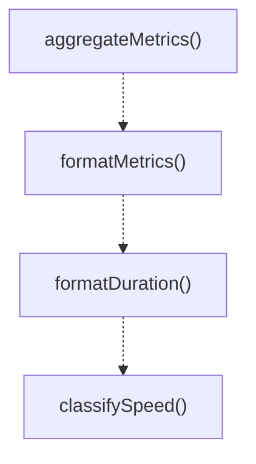

# metrics

## 概要

`metrics` モジュールのAPIリファレンス。

## エクスポート一覧

| 種別 | 名前 | 説明 |
|------|------|------|
| 関数 | `aggregateMetrics` | Aggregate multiple metrics into a summary. |
| 関数 | `formatMetrics` | Format metrics for display. |
| 関数 | `formatDuration` | Format duration in human-readable form. |
| 関数 | `classifySpeed` | Classify operation speed based on duration. |
| クラス | `MetricsCollector` | Simple metrics collector for timing operations. |
| インターフェース | `SearchMetrics` | Performance metrics for search operations. |
| インターフェース | `ExtendedSearchMetrics` | Extended metrics with additional details. |
| インターフェース | `AggregatedMetrics` | Aggregated metrics across multiple operations. |
| インターフェース | `ToolMetricsSummary` | Metrics summary for a single tool. |
| インターフェース | `PerformanceThresholds` | Performance thresholds for search operations. |

## 図解

### クラス図


### 関数フロー



## 関数

### aggregateMetrics

```typescript
aggregateMetrics(metrics: SearchMetrics[]): AggregatedMetrics
```

Aggregate multiple metrics into a summary.

**パラメータ**

| 名前 | 型 | 必須 |
|------|-----|------|
| metrics | `SearchMetrics[]` | はい |

**戻り値**: `AggregatedMetrics`

### formatMetrics

```typescript
formatMetrics(metrics: SearchMetrics): string
```

Format metrics for display.

**パラメータ**

| 名前 | 型 | 必須 |
|------|-----|------|
| metrics | `SearchMetrics` | はい |

**戻り値**: `string`

### formatDuration

```typescript
formatDuration(ms: number): string
```

Format duration in human-readable form.

**パラメータ**

| 名前 | 型 | 必須 |
|------|-----|------|
| ms | `number` | はい |

**戻り値**: `string`

### classifySpeed

```typescript
classifySpeed(durationMs: number, thresholds: PerformanceThresholds): "fast" | "normal" | "slow" | "very-slow"
```

Classify operation speed based on duration.

**パラメータ**

| 名前 | 型 | 必須 |
|------|-----|------|
| durationMs | `number` | はい |
| thresholds | `PerformanceThresholds` | はい |

**戻り値**: `"fast" | "normal" | "slow" | "very-slow"`

## クラス

### MetricsCollector

Simple metrics collector for timing operations.

**プロパティ**

| 名前 | 型 | 可視性 |
|------|-----|--------|
| startTime | `number` | private |
| toolName | `string` | private |
| filesSearched | `any` | private |
| indexHitRate | `number | undefined` | private |

**メソッド**

| 名前 | シグネチャ |
|------|------------|
| setFilesSearched | `setFilesSearched(count): this` |
| setIndexHitRate | `setIndexHitRate(rate): this` |
| elapsedMs | `elapsedMs(): number` |
| finish | `finish(): SearchMetrics` |

## インターフェース

### SearchMetrics

```typescript
interface SearchMetrics {
  durationMs: number;
  filesSearched: number;
  indexHitRate?: number;
  toolName: string;
}
```

Performance metrics for search operations.

### ExtendedSearchMetrics

```typescript
interface ExtendedSearchMetrics {
  cliTimeMs?: number;
  parseTimeMs?: number;
  totalResults: number;
  returnedResults: number;
  truncated: boolean;
  usedFallback: boolean;
}
```

Extended metrics with additional details.

### AggregatedMetrics

```typescript
interface AggregatedMetrics {
  operationCount: number;
  totalDurationMs: number;
  averageDurationMs: number;
  minDurationMs: number;
  maxDurationMs: number;
  totalFilesSearched: number;
  averageIndexHitRate?: number;
  byTool: Record<string, ToolMetricsSummary>;
}
```

Aggregated metrics across multiple operations.

### ToolMetricsSummary

```typescript
interface ToolMetricsSummary {
  count: number;
  totalDurationMs: number;
  averageDurationMs: number;
}
```

Metrics summary for a single tool.

### PerformanceThresholds

```typescript
interface PerformanceThresholds {
  fast: number;
  normal: number;
  slow: number;
}
```

Performance thresholds for search operations.
Used to identify slow operations.

---
*自動生成: 2026-02-18T00:15:35.589Z*
