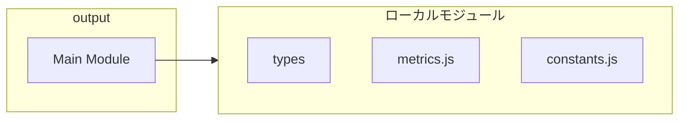
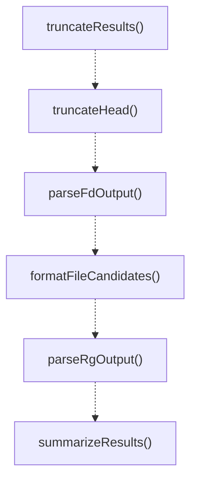
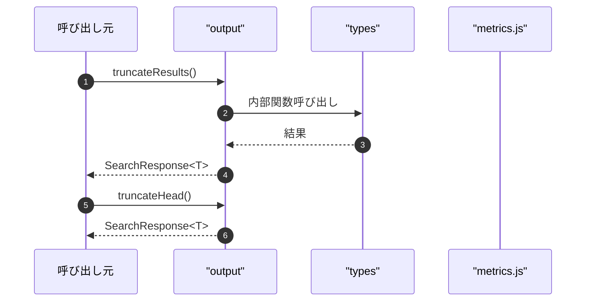

# output

## 概要

`output` モジュールのAPIリファレンス。

## インポート

```typescript
import { SearchResponse, FileCandidate, CodeSearchMatch... } from '../types';
import { SearchMetrics } from './metrics.js';
import { DEFAULT_LIMIT, DEFAULT_CODE_SEARCH_LIMIT, DEFAULT_SYMBOL_LIMIT } from './constants.js';
```

## エクスポート一覧

| 種別 | 名前 | 説明 |
|------|------|------|
| 関数 | `truncateResults` | Truncate results to limit and compute metadata. |
| 関数 | `truncateHead` | Truncate from head (keep last N items). |
| 関数 | `parseFdOutput` | Parse fd output into FileCandidate array. |
| 関数 | `formatFileCandidates` | Format file candidates for display. |
| 関数 | `parseRgOutput` | Parse ripgrep JSON output into structured matches. |
| 関数 | `summarizeResults` | Convert summary map to array and sort by count. |
| 関数 | `formatCodeSearch` | Format code search results for display. |
| 関数 | `parseCtagsOutput` | Parse ctags JSON output into SymbolDefinition arra |
| 関数 | `parseCtagsTraditional` | Parse traditional ctags format as fallback. |
| 関数 | `formatSymbols` | Format symbol search results for display. |
| 関数 | `createErrorResponse` | Create a standardized error response. |
| 関数 | `createCodeSearchError` | Create a standardized error response for code sear |
| 関数 | `formatError` | Format error for display. |
| 関数 | `escapeText` | Escape special characters for display. |
| 関数 | `truncateText` | Truncate text with ellipsis. |
| 関数 | `relativePath` | Get relative path from absolute path. |
| 関数 | `enhanceOutput` | Create an enhanced output from a basic search resp |
| 関数 | `suggestNextAction` | Determine suggested next action based on results. |
| 関数 | `createHints` | Create hints based on search results. |
| 関数 | `calculateSimpleConfidence` | Calculate confidence from simple parameters. |
| 関数 | `createSimpleHints` | Create hints from simple parameters. |
| 関数 | `formatEnhancedOutput` | Format enhanced output for display. |
| インターフェース | `SearchHints` | Agent hints for search results. |
| インターフェース | `SearchStats` | Statistics about the search operation. |
| インターフェース | `EnhancedOutput` | Enhanced output with agent hints and statistics. |
| 型 | `SuggestedNextAction` | Suggested next action for the agent. |

## 図解

### クラス図


### 依存関係図



### 関数フロー



### シーケンス図



## 関数

### truncateResults

```typescript
truncateResults(results: T[], limit: number): SearchResponse<T>
```

Truncate results to limit and compute metadata.

**パラメータ**

| 名前 | 型 | 必須 |
|------|-----|------|
| results | `T[]` | はい |
| limit | `number` | はい |

**戻り値**: `SearchResponse<T>`

### truncateHead

```typescript
truncateHead(results: T[], limit: number): SearchResponse<T>
```

Truncate from head (keep last N items).
Useful for keeping most recent/relevant results.

**パラメータ**

| 名前 | 型 | 必須 |
|------|-----|------|
| results | `T[]` | はい |
| limit | `number` | はい |

**戻り値**: `SearchResponse<T>`

### parseFdOutput

```typescript
parseFdOutput(stdout: string, type: "file" | "dir"): FileCandidate[]
```

Parse fd output into FileCandidate array.

**パラメータ**

| 名前 | 型 | 必須 |
|------|-----|------|
| stdout | `string` | はい |
| type | `"file" | "dir"` | はい |

**戻り値**: `FileCandidate[]`

### formatFileCandidates

```typescript
formatFileCandidates(output: SearchResponse<FileCandidate>): string
```

Format file candidates for display.

**パラメータ**

| 名前 | 型 | 必須 |
|------|-----|------|
| output | `SearchResponse<FileCandidate>` | はい |

**戻り値**: `string`

### parseRgOutput

```typescript
parseRgOutput(stdout: string, contextLines: number): { matches: CodeSearchMatch[]; summary: Map<string, number> }
```

Parse ripgrep JSON output into structured matches.

**パラメータ**

| 名前 | 型 | 必須 |
|------|-----|------|
| stdout | `string` | はい |
| contextLines | `number` | はい |

**戻り値**: `{ matches: CodeSearchMatch[]; summary: Map<string, number> }`

### summarizeResults

```typescript
summarizeResults(summary: Map<string, number>): CodeSearchSummary[]
```

Convert summary map to array and sort by count.

**パラメータ**

| 名前 | 型 | 必須 |
|------|-----|------|
| summary | `Map<string, number>` | はい |

**戻り値**: `CodeSearchSummary[]`

### formatCodeSearch

```typescript
formatCodeSearch(output: CodeSearchOutput): string
```

Format code search results for display.

**パラメータ**

| 名前 | 型 | 必須 |
|------|-----|------|
| output | `CodeSearchOutput` | はい |

**戻り値**: `string`

### parseCtagsOutput

```typescript
parseCtagsOutput(stdout: string): SymbolDefinition[]
```

Parse ctags JSON output into SymbolDefinition array.

**パラメータ**

| 名前 | 型 | 必須 |
|------|-----|------|
| stdout | `string` | はい |

**戻り値**: `SymbolDefinition[]`

### parseCtagsTraditional

```typescript
parseCtagsTraditional(stdout: string): SymbolDefinition[]
```

Parse traditional ctags format as fallback.

**パラメータ**

| 名前 | 型 | 必須 |
|------|-----|------|
| stdout | `string` | はい |

**戻り値**: `SymbolDefinition[]`

### formatSymbols

```typescript
formatSymbols(output: SearchResponse<SymbolDefinition>): string
```

Format symbol search results for display.

**パラメータ**

| 名前 | 型 | 必須 |
|------|-----|------|
| output | `SearchResponse<SymbolDefinition>` | はい |

**戻り値**: `string`

### createErrorResponse

```typescript
createErrorResponse(error: string): SearchResponse<T>
```

Create a standardized error response.

**パラメータ**

| 名前 | 型 | 必須 |
|------|-----|------|
| error | `string` | はい |

**戻り値**: `SearchResponse<T>`

### createCodeSearchError

```typescript
createCodeSearchError(error: string): CodeSearchOutput
```

Create a standardized error response for code search.

**パラメータ**

| 名前 | 型 | 必須 |
|------|-----|------|
| error | `string` | はい |

**戻り値**: `CodeSearchOutput`

### formatError

```typescript
formatError(tool: string, error: unknown): string
```

Format error for display.

**パラメータ**

| 名前 | 型 | 必須 |
|------|-----|------|
| tool | `string` | はい |
| error | `unknown` | はい |

**戻り値**: `string`

### escapeText

```typescript
escapeText(text: string): string
```

Escape special characters for display.

**パラメータ**

| 名前 | 型 | 必須 |
|------|-----|------|
| text | `string` | はい |

**戻り値**: `string`

### truncateText

```typescript
truncateText(text: string, maxLength: number): string
```

Truncate text with ellipsis.

**パラメータ**

| 名前 | 型 | 必須 |
|------|-----|------|
| text | `string` | はい |
| maxLength | `number` | はい |

**戻り値**: `string`

### relativePath

```typescript
relativePath(absolute: string, cwd: string): string
```

Get relative path from absolute path.

**パラメータ**

| 名前 | 型 | 必須 |
|------|-----|------|
| absolute | `string` | はい |
| cwd | `string` | はい |

**戻り値**: `string`

### enhanceOutput

```typescript
enhanceOutput(response: SearchResponse<T>, metrics: SearchMetrics, hints?: Partial<SearchHints>): EnhancedOutput<T>
```

Create an enhanced output from a basic search response.

**パラメータ**

| 名前 | 型 | 必須 |
|------|-----|------|
| response | `SearchResponse<T>` | はい |
| metrics | `SearchMetrics` | はい |
| hints | `Partial<SearchHints>` | いいえ |

**戻り値**: `EnhancedOutput<T>`

### calculateConfidence

```typescript
calculateConfidence(response: SearchResponse<T>, metrics: SearchMetrics): number
```

Calculate confidence score based on results and metrics.

**パラメータ**

| 名前 | 型 | 必須 |
|------|-----|------|
| response | `SearchResponse<T>` | はい |
| metrics | `SearchMetrics` | はい |

**戻り値**: `number`

### suggestNextAction

```typescript
suggestNextAction(response: SearchResponse<T>, pattern?: string): SuggestedNextAction | undefined
```

Determine suggested next action based on results.

**パラメータ**

| 名前 | 型 | 必須 |
|------|-----|------|
| response | `SearchResponse<T>` | はい |
| pattern | `string` | いいえ |

**戻り値**: `SuggestedNextAction | undefined`

### createHints

```typescript
createHints(response: SearchResponse<T>, metrics: SearchMetrics, toolName: string): SearchHints
```

Create hints based on search results.

**パラメータ**

| 名前 | 型 | 必須 |
|------|-----|------|
| response | `SearchResponse<T>` | はい |
| metrics | `SearchMetrics` | はい |
| toolName | `string` | はい |

**戻り値**: `SearchHints`

### getAlternativeTools

```typescript
getAlternativeTools(toolName: string): string[]
```

Get alternative tools for a given tool.

**パラメータ**

| 名前 | 型 | 必須 |
|------|-----|------|
| toolName | `string` | はい |

**戻り値**: `string[]`

### calculateSimpleConfidence

```typescript
calculateSimpleConfidence(count: number, truncated: boolean): number
```

Calculate confidence from simple parameters.
Used when full SearchResponse/Metrics are not available.

**パラメータ**

| 名前 | 型 | 必須 |
|------|-----|------|
| count | `number` | はい |
| truncated | `boolean` | はい |

**戻り値**: `number`

### createSimpleHints

```typescript
createSimpleHints(toolName: string, resultCount: number, truncated: boolean, queryPattern?: string): SearchHints
```

Create hints from simple parameters.
Lightweight version for quick hint generation without full metrics.

**パラメータ**

| 名前 | 型 | 必須 |
|------|-----|------|
| toolName | `string` | はい |
| resultCount | `number` | はい |
| truncated | `boolean` | はい |
| queryPattern | `string` | いいえ |

**戻り値**: `SearchHints`

### generateRelatedQueries

```typescript
generateRelatedQueries(query: string): string[]
```

Generate related query suggestions based on the original query.

**パラメータ**

| 名前 | 型 | 必須 |
|------|-----|------|
| query | `string` | はい |

**戻り値**: `string[]`

### formatEnhancedOutput

```typescript
formatEnhancedOutput(output: EnhancedOutput<T>, formatResult: (result: T) => string): string
```

Format enhanced output for display.

**パラメータ**

| 名前 | 型 | 必須 |
|------|-----|------|
| output | `EnhancedOutput<T>` | はい |
| formatResult | `(result: T) => string` | はい |

**戻り値**: `string`

### formatSuggestedAction

```typescript
formatSuggestedAction(action: SuggestedNextAction): string
```

Format suggested action for display.

**パラメータ**

| 名前 | 型 | 必須 |
|------|-----|------|
| action | `SuggestedNextAction` | はい |

**戻り値**: `string`

## インターフェース

### SearchHints

```typescript
interface SearchHints {
  confidence: number;
  suggestedNextAction?: SuggestedNextAction;
  alternativeTools?: string[];
  relatedQueries?: string[];
}
```

Agent hints for search results.
Provides guidance on how to interpret and use the results.

### SearchStats

```typescript
interface SearchStats {
  filesSearched: number;
  durationMs: number;
  indexHitRate?: number;
}
```

Statistics about the search operation.

### EnhancedOutput

```typescript
interface EnhancedOutput {
  results: T[];
  total: number;
  truncated: boolean;
  error?: string;
  hints: SearchHints;
  stats: SearchStats;
}
```

Enhanced output with agent hints and statistics.
Wraps the standard SearchResponse with additional metadata.

## 型定義

### SuggestedNextAction

```typescript
type SuggestedNextAction = | "refine_pattern"      // Pattern too broad, narrow it down
  | "expand_scope"        // Pattern too narrow, broaden search
  | "try_different_tool"  // Current tool not optimal
  | "increase_limit"      // Results truncated, may need more
  | "regenerate_index"
```

Suggested next action for the agent.
Helps guide the agent towards more effective searches.

---
*自動生成: 2026-02-17T22:24:18.856Z*
