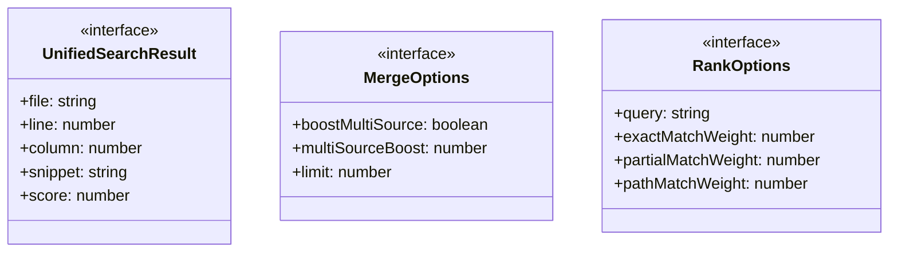
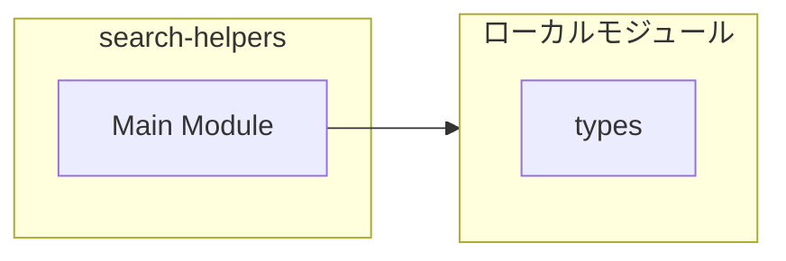
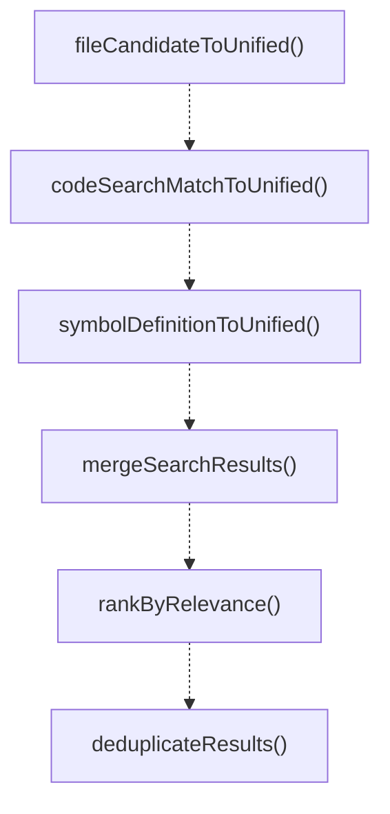
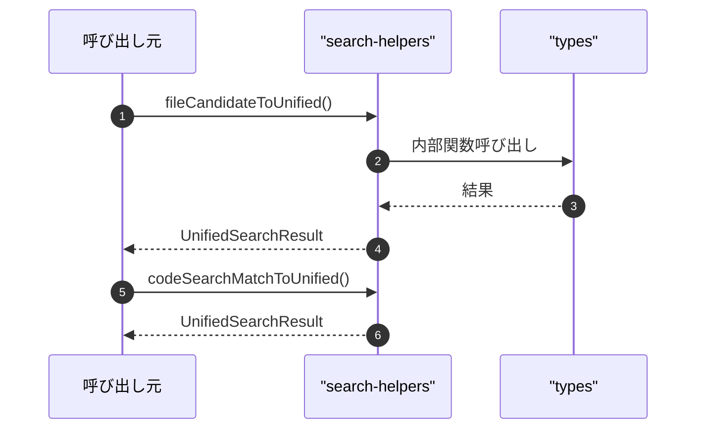

# search-helpers

## 概要

`search-helpers` モジュールのAPIリファレンス。

## インポート

```typescript
import { CodeSearchMatch, SymbolDefinition, FileCandidate } from '../types';
```

## エクスポート一覧

| 種別 | 名前 | 説明 |
|------|------|------|
| 関数 | `fileCandidateToUnified` | FileCandidateをUnifiedSearchResultに変換する。 |
| 関数 | `codeSearchMatchToUnified` | CodeSearchMatchをUnifiedSearchResultに変換する |
| 関数 | `symbolDefinitionToUnified` | SymbolDefinitionをUnifiedSearchResultに変換 |
| 関数 | `mergeSearchResults` | 複数の検索結果をマージする |
| 関数 | `rankByRelevance` | クエリに関連性で検索結果をランク付けする |
| 関数 | `deduplicateResults` | 重複を削除しスコアが高い結果を保持 |
| 関数 | `integrateSearchResults` | 検索結果を統合してソート済みリストを返す |
| 関数 | `groupByFile` | Group results by file. |
| 関数 | `filterByType` | 検索結果をタイプで絞り込む |
| 関数 | `filterByFilePattern` | ファイルパスのパターンで結果をフィルタする。 |
| 関数 | `formatUnifiedResult` | 検索結果を表示用にフォーマットします。 |
| 関数 | `formatUnifiedResults` | 統合検索結果をフォーマットします |
| インターフェース | `UnifiedSearchResult` | 全ツール共通の検索結果形式 |
| インターフェース | `MergeOptions` | 結果をマージするためのオプション |
| インターフェース | `RankOptions` | 検索結果のランク付けオプション |

## 図解

### クラス図



### 依存関係図



### 関数フロー



### シーケンス図



## 関数

### fileCandidateToUnified

```typescript
fileCandidateToUnified(candidate: FileCandidate, source: string): UnifiedSearchResult
```

FileCandidateをUnifiedSearchResultに変換する。

**パラメータ**

| 名前 | 型 | 必須 |
|------|-----|------|
| candidate | `FileCandidate` | はい |
| source | `string` | はい |

**戻り値**: `UnifiedSearchResult`

### codeSearchMatchToUnified

```typescript
codeSearchMatchToUnified(match: CodeSearchMatch, source: string): UnifiedSearchResult
```

CodeSearchMatchをUnifiedSearchResultに変換する

**パラメータ**

| 名前 | 型 | 必須 |
|------|-----|------|
| match | `CodeSearchMatch` | はい |
| source | `string` | はい |

**戻り値**: `UnifiedSearchResult`

### symbolDefinitionToUnified

```typescript
symbolDefinitionToUnified(symbol: SymbolDefinition, source: string): UnifiedSearchResult
```

SymbolDefinitionをUnifiedSearchResultに変換

**パラメータ**

| 名前 | 型 | 必須 |
|------|-----|------|
| symbol | `SymbolDefinition` | はい |
| source | `string` | はい |

**戻り値**: `UnifiedSearchResult`

### mergeSearchResults

```typescript
mergeSearchResults(resultArrays: UnifiedSearchResult[][], options: Partial<MergeOptions>): UnifiedSearchResult[]
```

複数の検索結果をマージする

**パラメータ**

| 名前 | 型 | 必須 |
|------|-----|------|
| resultArrays | `UnifiedSearchResult[][]` | はい |
| options | `Partial<MergeOptions>` | はい |

**戻り値**: `UnifiedSearchResult[]`

### createResultKey

```typescript
createResultKey(result: UnifiedSearchResult): string
```

Create a unique key for a result.
Uses file + line + column for uniqueness.

**パラメータ**

| 名前 | 型 | 必須 |
|------|-----|------|
| result | `UnifiedSearchResult` | はい |

**戻り値**: `string`

### rankByRelevance

```typescript
rankByRelevance(results: UnifiedSearchResult[], query: string): UnifiedSearchResult[]
```

クエリに関連性で検索結果をランク付けする

**パラメータ**

| 名前 | 型 | 必須 |
|------|-----|------|
| results | `UnifiedSearchResult[]` | はい |
| query | `string` | はい |

**戻り値**: `UnifiedSearchResult[]`

### calculateRelevanceScore

```typescript
calculateRelevanceScore(result: UnifiedSearchResult, normalizedQuery: string, queryTerms: string[]): number
```

Calculate relevance score for a result.

**パラメータ**

| 名前 | 型 | 必須 |
|------|-----|------|
| result | `UnifiedSearchResult` | はい |
| normalizedQuery | `string` | はい |
| queryTerms | `string[]` | はい |

**戻り値**: `number`

### deduplicateResults

```typescript
deduplicateResults(results: UnifiedSearchResult[]): UnifiedSearchResult[]
```

重複を削除しスコアが高い結果を保持

**パラメータ**

| 名前 | 型 | 必須 |
|------|-----|------|
| results | `UnifiedSearchResult[]` | はい |

**戻り値**: `UnifiedSearchResult[]`

### integrateSearchResults

```typescript
integrateSearchResults(fileCandidates: FileCandidate[], codeMatches: CodeSearchMatch[], symbols: SymbolDefinition[], query: string, options: Partial<MergeOptions>): UnifiedSearchResult[]
```

検索結果を統合してソート済みリストを返す

**パラメータ**

| 名前 | 型 | 必須 |
|------|-----|------|
| fileCandidates | `FileCandidate[]` | はい |
| codeMatches | `CodeSearchMatch[]` | はい |
| symbols | `SymbolDefinition[]` | はい |
| query | `string` | はい |
| options | `Partial<MergeOptions>` | はい |

**戻り値**: `UnifiedSearchResult[]`

### groupByFile

```typescript
groupByFile(results: UnifiedSearchResult[]): Map<string, UnifiedSearchResult[]>
```

Group results by file.

**パラメータ**

| 名前 | 型 | 必須 |
|------|-----|------|
| results | `UnifiedSearchResult[]` | はい |

**戻り値**: `Map<string, UnifiedSearchResult[]>`

### filterByType

```typescript
filterByType(results: UnifiedSearchResult[], type: "file" | "match" | "symbol"): UnifiedSearchResult[]
```

検索結果をタイプで絞り込む

**パラメータ**

| 名前 | 型 | 必須 |
|------|-----|------|
| results | `UnifiedSearchResult[]` | はい |
| type | `"file" | "match" | "symbol"` | はい |

**戻り値**: `UnifiedSearchResult[]`

### filterByFilePattern

```typescript
filterByFilePattern(results: UnifiedSearchResult[], pattern: string): UnifiedSearchResult[]
```

ファイルパスのパターンで結果をフィルタする。

**パラメータ**

| 名前 | 型 | 必須 |
|------|-----|------|
| results | `UnifiedSearchResult[]` | はい |
| pattern | `string` | はい |

**戻り値**: `UnifiedSearchResult[]`

### formatUnifiedResult

```typescript
formatUnifiedResult(result: UnifiedSearchResult): string
```

検索結果を表示用にフォーマットします。

**パラメータ**

| 名前 | 型 | 必須 |
|------|-----|------|
| result | `UnifiedSearchResult` | はい |

**戻り値**: `string`

### formatUnifiedResults

```typescript
formatUnifiedResults(results: UnifiedSearchResult[]): string
```

統合検索結果をフォーマットします

**パラメータ**

| 名前 | 型 | 必須 |
|------|-----|------|
| results | `UnifiedSearchResult[]` | はい |

**戻り値**: `string`

## インターフェース

### UnifiedSearchResult

```typescript
interface UnifiedSearchResult {
  file: string;
  line?: number;
  column?: number;
  snippet?: string;
  score: number;
  sources: string[];
  type: "file" | "match" | "symbol";
  metadata?: Record<string, unknown>;
}
```

全ツール共通の検索結果形式

### MergeOptions

```typescript
interface MergeOptions {
  boostMultiSource: boolean;
  multiSourceBoost: number;
  limit: number;
}
```

結果をマージするためのオプション

### RankOptions

```typescript
interface RankOptions {
  query: string;
  exactMatchWeight: number;
  partialMatchWeight: number;
  pathMatchWeight: number;
}
```

検索結果のランク付けオプション

---
*自動生成: 2026-02-18T06:37:19.720Z*
