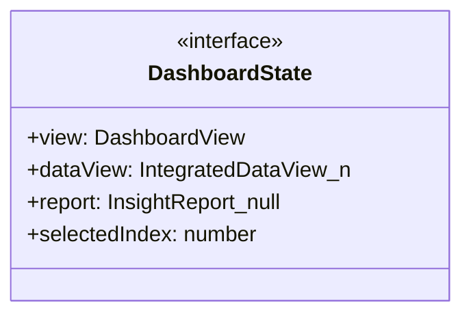
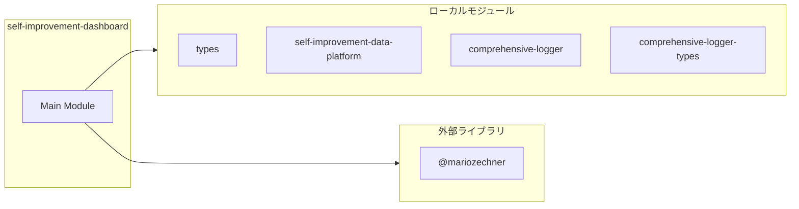
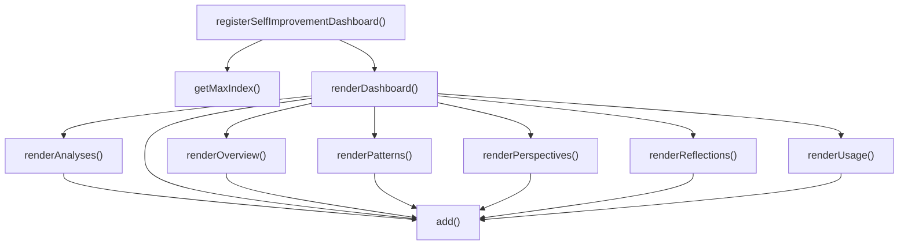

# self-improvement-dashboard

## 概要

`self-improvement-dashboard` モジュールのAPIリファレンス。

## インポート

```typescript
// from '@mariozechner/pi-coding-agent': ExtensionAPI
// from '@mariozechner/pi-tui': truncateToWidth
// from '../lib/tui/types.js': Theme
// from '../lib/self-improvement-data-platform.js': buildIntegratedDataView, generateInsightReport, loadLatestInsightReport, ...
// from '../lib/comprehensive-logger': getLogger
// ... and 1 more imports
```

## エクスポート一覧

| 種別 | 名前 | 説明 |
|------|------|------|
| 関数 | `registerSelfImprovementDashboard` | ダッシュボード登録 |

## 図解

### クラス図



### 依存関係図



### 関数フロー



## 関数

### renderDashboard

```typescript
renderDashboard(state: DashboardState, w: number, theme: Theme): string[]
```

**パラメータ**

| 名前 | 型 | 必須 |
|------|-----|------|
| state | `DashboardState` | はい |
| w | `number` | はい |
| theme | `Theme` | はい |

**戻り値**: `string[]`

### add

```typescript
add(s: string): void
```

**パラメータ**

| 名前 | 型 | 必須 |
|------|-----|------|
| s | `string` | はい |

**戻り値**: `void`

### renderOverview

```typescript
renderOverview(state: DashboardState, add: (s: string) => void, theme: Theme): void
```

**パラメータ**

| 名前 | 型 | 必須 |
|------|-----|------|
| state | `DashboardState` | はい |
| add | `(s: string) => void` | はい |
| theme | `Theme` | はい |

**戻り値**: `void`

### renderAnalyses

```typescript
renderAnalyses(state: DashboardState, add: (s: string) => void, theme: Theme, width: number): void
```

**パラメータ**

| 名前 | 型 | 必須 |
|------|-----|------|
| state | `DashboardState` | はい |
| add | `(s: string) => void` | はい |
| theme | `Theme` | はい |
| width | `number` | はい |

**戻り値**: `void`

### renderReflections

```typescript
renderReflections(state: DashboardState, add: (s: string) => void, theme: Theme, width: number): void
```

**パラメータ**

| 名前 | 型 | 必須 |
|------|-----|------|
| state | `DashboardState` | はい |
| add | `(s: string) => void` | はい |
| theme | `Theme` | はい |
| width | `number` | はい |

**戻り値**: `void`

### renderPatterns

```typescript
renderPatterns(state: DashboardState, add: (s: string) => void, theme: Theme): void
```

**パラメータ**

| 名前 | 型 | 必須 |
|------|-----|------|
| state | `DashboardState` | はい |
| add | `(s: string) => void` | はい |
| theme | `Theme` | はい |

**戻り値**: `void`

### renderUsage

```typescript
renderUsage(state: DashboardState, add: (s: string) => void, theme: Theme, width: number): void
```

**パラメータ**

| 名前 | 型 | 必須 |
|------|-----|------|
| state | `DashboardState` | はい |
| add | `(s: string) => void` | はい |
| theme | `Theme` | はい |
| width | `number` | はい |

**戻り値**: `void`

### renderPerspectives

```typescript
renderPerspectives(state: DashboardState, add: (s: string) => void, theme: Theme, width: number): void
```

**パラメータ**

| 名前 | 型 | 必須 |
|------|-----|------|
| state | `DashboardState` | はい |
| add | `(s: string) => void` | はい |
| theme | `Theme` | はい |
| width | `number` | はい |

**戻り値**: `void`

### registerSelfImprovementDashboard

```typescript
registerSelfImprovementDashboard(pi: ExtensionAPI): void
```

ダッシュボード登録

**パラメータ**

| 名前 | 型 | 必須 |
|------|-----|------|
| pi | `ExtensionAPI` | はい |

**戻り値**: `void`

### getMaxIndex

```typescript
getMaxIndex(state: DashboardState): number
```

**パラメータ**

| 名前 | 型 | 必須 |
|------|-----|------|
| state | `DashboardState` | はい |

**戻り値**: `number`

## インターフェース

### DashboardState

```typescript
interface DashboardState {
  view: DashboardView;
  dataView: IntegratedDataView | null;
  report: InsightReport | null;
  selectedIndex: number;
}
```

## 型定義

### DashboardView

```typescript
type DashboardView = | "overview"
  | "analyses"
  | "reflections"
  | "patterns"
  | "usage"
  | "perspectives"
```

---
*自動生成: 2026-02-28T13:55:20.128Z*
