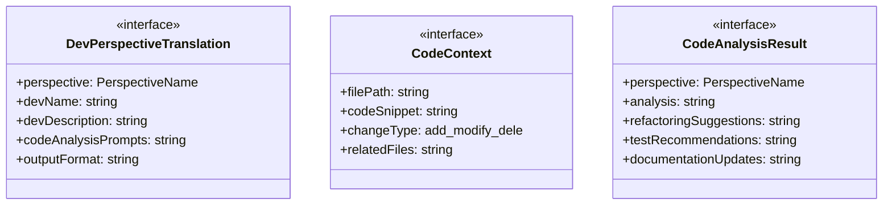
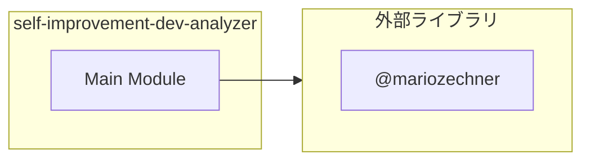
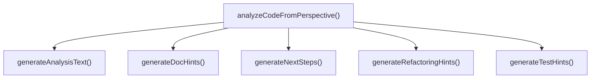

# self-improvement-dev-analyzer

## 概要

`self-improvement-dev-analyzer` モジュールのAPIリファレンス。

## インポート

```typescript
// from '@mariozechner/pi-coding-agent': ExtensionAPI
```

## エクスポート一覧

| 種別 | 名前 | 説明 |
|------|------|------|
| 関数 | `analyzeCodeFromPerspective` | コードを特定の視座から分析する |
| インターフェース | `DevPerspectiveTranslation` | 開発者向け視座翻訳定義 |
| インターフェース | `CodeContext` | コードコンテキストの定義 |
| インターフェース | `CodeAnalysisResult` | コード分析結果 |
| 型 | `PerspectiveName` | 哲学的視座の名称（self-improvement-loop.tsと同期） |

## 図解

### クラス図



### 依存関係図



### 関数フロー



## 関数

### analyzeCodeFromPerspective

```typescript
analyzeCodeFromPerspective(perspective: PerspectiveName, codeContext: CodeContext): CodeAnalysisResult
```

コードを特定の視座から分析する

指定された哲学的視座を開発者向けの概念に翻訳し、
コードを分析して実践的な改善提案を生成する。

**パラメータ**

| 名前 | 型 | 必須 |
|------|-----|------|
| perspective | `PerspectiveName` | はい |
| codeContext | `CodeContext` | はい |

**戻り値**: `CodeAnalysisResult`

### generateAnalysisText

```typescript
generateAnalysisText(translation: DevPerspectiveTranslation, codeContext: CodeContext): string
```

分析テキストを生成する

**パラメータ**

| 名前 | 型 | 必須 |
|------|-----|------|
| translation | `DevPerspectiveTranslation` | はい |
| codeContext | `CodeContext` | はい |

**戻り値**: `string`

### generateRefactoringHints

```typescript
generateRefactoringHints(translation: DevPerspectiveTranslation, codeContext: CodeContext): string[]
```

リファクタリングヒントを生成する

**パラメータ**

| 名前 | 型 | 必須 |
|------|-----|------|
| translation | `DevPerspectiveTranslation` | はい |
| codeContext | `CodeContext` | はい |

**戻り値**: `string[]`

### generateTestHints

```typescript
generateTestHints(translation: DevPerspectiveTranslation, codeContext: CodeContext): string[]
```

テストヒントを生成する

**パラメータ**

| 名前 | 型 | 必須 |
|------|-----|------|
| translation | `DevPerspectiveTranslation` | はい |
| codeContext | `CodeContext` | はい |

**戻り値**: `string[]`

### generateDocHints

```typescript
generateDocHints(translation: DevPerspectiveTranslation, codeContext: CodeContext): string[]
```

ドキュメントヒントを生成する

**パラメータ**

| 名前 | 型 | 必須 |
|------|-----|------|
| translation | `DevPerspectiveTranslation` | はい |
| codeContext | `CodeContext` | はい |

**戻り値**: `string[]`

### generateNextSteps

```typescript
generateNextSteps(translation: DevPerspectiveTranslation, codeContext: CodeContext): string[]
```

次のステップを生成する

**パラメータ**

| 名前 | 型 | 必須 |
|------|-----|------|
| translation | `DevPerspectiveTranslation` | はい |
| codeContext | `CodeContext` | はい |

**戻り値**: `string[]`

## インターフェース

### DevPerspectiveTranslation

```typescript
interface DevPerspectiveTranslation {
  perspective: PerspectiveName;
  devName: string;
  devDescription: string;
  codeAnalysisPrompts: string[];
  outputFormat: string;
  metrics?: string[];
}
```

開発者向け視座翻訳定義

### CodeContext

```typescript
interface CodeContext {
  filePath: string;
  codeSnippet: string;
  changeType: "add" | "modify" | "delete";
  relatedFiles: string[];
}
```

コードコンテキストの定義

### CodeAnalysisResult

```typescript
interface CodeAnalysisResult {
  perspective: PerspectiveName;
  analysis: string;
  refactoringSuggestions: string[];
  testRecommendations: string[];
  documentationUpdates: string[];
  nextSteps: string[];
}
```

コード分析結果

## 型定義

### PerspectiveName

```typescript
type PerspectiveName = | "deconstruction"
  | "schizoanalysis"
  | "eudaimonia"
  | "utopia_dystopia"
  | "thinking_philosophy"
  | "thinking_taxonomy"
  | "logic"
```

哲学的視座の名称（self-improvement-loop.tsと同期）

---
*自動生成: 2026-02-28T13:55:20.133Z*
