# self-improvement-loop

## 概要

`self-improvement-loop` モジュールのAPIリファレンス。

## インポート

```typescript
// from 'node:fs': appendFileSync, existsSync, mkdirSync, ...
// from 'node:path': join, resolve
// from 'node:child_process': spawn
// from '@mariozechner/pi-ai': Type
// from '@mariozechner/pi-coding-agent': ExtensionAPI
// ... and 9 more imports
```

## エクスポート一覧

| 種別 | 名前 | 説明 |
|------|------|------|

## 図解

### クラス図

```mermaid
classDiagram
  class RateLimitConfig {
    <<interface>>
    +maxRetries: number
    +initialDelayMs: number
    +maxDelayMs: number
    +multiplier: number
    +jitter: full_partial_no
  }
  class PerspectiveState {
    <<interface>>
    +name: PerspectiveName
    +displayName: string
    +description: string
    +lastAppliedAt: string_null
    +findings: string
  }
  class SelfImprovementLoopState {
    <<interface>>
    +runId: string
    +startedAt: string
    +task: string
    +currentCycle: number
    +currentPerspectiveIndex: number
  }
  class CycleResult {
    <<interface>>
    +cycleNumber: number
    +perspectiveResults: PerspectiveResult
    +improvements: string
    +commitHash: string_null
    +summary: string
  }
  class PerspectiveResult {
    <<interface>>
    +perspective: PerspectiveName
    +findings: string
    +questions: string
    +improvements: string
    +score: number
  }
  class SelfImprovementLoopConfig {
    <<interface>>
    +maxCycles: number
    +stopSignalPath: string
    +logDir: string
    +autoCommit: boolean
    +stagnationThreshold: number
  }
  class SelfImprovementLoopParams {
    <<interface>>
    +task: string
    +max_cycles: number
    +auto_commit: boolean
  }
  class SelfImprovementModel {
    <<interface>>
    +provider: string
    +id: string
    +thinkingLevel: ThinkingLevel
  }
  class ActiveAutonomousRun {
    <<interface>>
    +runId: string
    +task: string
    +startedAt: string
    +maxCycles: number
    +autoCommit: boolean
  }
  class SuccessfulPattern {
    <<interface>>
    +cycle: number
    +averageScore: number
    +actionSummary: string
    +appliedPerspectives: string
  }
  class ParsedPerspectiveScores {
    <<interface>>
    +deconstruction: number
    +schizoanalysis: number
    +eudaimonia: number
    +utopia_dystopia: number
    +thinking_philosophy: number
  }
  class CommitContext {
    <<interface>>
    +cycleNumber: number
    +runId: string
    +taskSummary: string
    +perspectiveResults: Array_perspective_s
  }
```



### 依存関係図


### シーケンス図


## 関数

### loadRateLimitConfig

```typescript
loadRateLimitConfig(): RateLimitConfig
```

環境変数から設定を読み込む

**戻り値**: `RateLimitConfig`

### parseIntEnv

```typescript
parseIntEnv(key: string, defaultValue: number, min?: number, max?: number): number
```

**パラメータ**

| 名前 | 型 | 必須 |
|------|-----|------|
| key | `string` | はい |
| defaultValue | `number` | はい |
| min | `number` | いいえ |
| max | `number` | いいえ |

**戻り値**: `number`

### parseJitterEnv

```typescript
parseJitterEnv(key: string, defaultValue: "full" | "partial" | "none"): "full" | "partial" | "none"
```

**パラメータ**

| 名前 | 型 | 必須 |
|------|-----|------|
| key | `string` | はい |
| defaultValue | `"full" | "partial" | "none"` | はい |

**戻り値**: `"full" | "partial" | "none"`

### loadGitWorkflowSkill

```typescript
loadGitWorkflowSkill(): string
```

git-workflowスキルを読み込む
キャッシュ機能付きで、複数回呼び出し時はキャッシュを返す

**戻り値**: `string`

### loadSelfImprovementSkill

```typescript
loadSelfImprovementSkill(): string
```

self-improvementスキルを読み込む
キャッシュ機能付きで、複数回呼び出し時はキャッシュを返す

**戻り値**: `string`

### extractPerspectivesSection

```typescript
extractPerspectivesSection(skillContent: string): string
```

self-improvementスキルから7つの視座の説明セクションを抽出する

**パラメータ**

| 名前 | 型 | 必須 |
|------|-----|------|
| skillContent | `string` | はい |

**戻り値**: `string`

### extractChecklistSection

```typescript
extractChecklistSection(skillContent: string): string
```

self-improvementスキルから自己点検チェックリストを抽出する

**パラメータ**

| 名前 | 型 | 必須 |
|------|-----|------|
| skillContent | `string` | はい |

**戻り値**: `string`

### getDiffSummary

```typescript
async getDiffSummary(cwd: string): Promise<{ stats: string; changes: string }>
```

変更差分の詳細を取得する
コミットメッセージ生成のために変更内容を分析する

**パラメータ**

| 名前 | 型 | 必須 |
|------|-----|------|
| cwd | `string` | はい |

**戻り値**: `Promise<{ stats: string; changes: string }>`

### generateCommitMessage

```typescript
async generateCommitMessage(cycleNumber: number, runId: string, taskSummary: string, diffSummary: { stats: string; changes: string }, perspectiveResults: Array<{ perspective: string; score: number; improvements: string[] }>, model: SelfImprovementModel): Promise<string>
```

LLMがgit-workflowスキルに準拠したコミットメッセージを生成する

スキル準拠ルール:
- 日本語で詳細に書く
- Body（本文）を必ず書く
- Type: feat, fix, docs, refactor, test, chore, perf, ci

**パラメータ**

| 名前 | 型 | 必須 |
|------|-----|------|
| cycleNumber | `number` | はい |
| runId | `string` | はい |
| taskSummary | `string` | はい |
| diffSummary | `object` | はい |
| &nbsp;&nbsp;↳ stats | `string` | はい |
| &nbsp;&nbsp;↳ changes | `string` | はい |
| perspectiveResults | `Array<{ perspective: string; score: number; imp...` | はい |
| model | `SelfImprovementModel` | はい |

**戻り値**: `Promise<string>`

### createRunId

```typescript
createRunId(): string
```

**戻り値**: `string`

### initializePerspectiveStates

```typescript
initializePerspectiveStates(): PerspectiveState[]
```

**戻り値**: `PerspectiveState[]`

### initializeLoopState

```typescript
initializeLoopState(task: string): SelfImprovementLoopState
```

**パラメータ**

| 名前 | 型 | 必須 |
|------|-----|------|
| task | `string` | はい |

**戻り値**: `SelfImprovementLoopState`

### checkStopSignal

```typescript
checkStopSignal(config: Required<SelfImprovementLoopConfig>): boolean
```

**パラメータ**

| 名前 | 型 | 必須 |
|------|-----|------|
| config | `Required<SelfImprovementLoopConfig>` | はい |

**戻り値**: `boolean`

### clearStopSignal

```typescript
clearStopSignal(config: Required<SelfImprovementLoopConfig>): void
```

**パラメータ**

| 名前 | 型 | 必須 |
|------|-----|------|
| config | `Required<SelfImprovementLoopConfig>` | はい |

**戻り値**: `void`

### parseModelFromEnv

```typescript
parseModelFromEnv(): Pick<SelfImprovementModel, "provider" | "id"> | null
```

**戻り値**: `Pick<SelfImprovementModel, "provider" | "id"> | null`

### resolveActiveModel

```typescript
resolveActiveModel(ctx?: unknown): SelfImprovementModel
```

**パラメータ**

| 名前 | 型 | 必須 |
|------|-----|------|
| ctx | `unknown` | いいえ |

**戻り値**: `SelfImprovementModel`

### buildLoopMarker

```typescript
buildLoopMarker(runId: string, cycle: number): string
```

**パラメータ**

| 名前 | 型 | 必須 |
|------|-----|------|
| runId | `string` | はい |
| cycle | `number` | はい |

**戻り値**: `string`

### parseLoopCycleMarker

```typescript
parseLoopCycleMarker(text: string): { runId: string; cycle: number } | null
```

**パラメータ**

| 名前 | 型 | 必須 |
|------|-----|------|
| text | `string` | はい |

**戻り値**: `{ runId: string; cycle: number } | null`

### generateStrategyHint

```typescript
generateStrategyHint(run: ActiveAutonomousRun, recommendedAction: "continue" | "pivot" | "early_stop"): string | null
```

視座スコア履歴と推奨アクションに基づいて戦略ヒントを生成

**パラメータ**

| 名前 | 型 | 必須 |
|------|-----|------|
| run | `ActiveAutonomousRun` | はい |
| recommendedAction | `"continue" | "pivot" | "early_stop"` | はい |

**戻り値**: `string | null`

### generateSuccessPatternsSection

```typescript
generateSuccessPatternsSection(run: ActiveAutonomousRun): string
```

成功パターンセクションを生成

**パラメータ**

| 名前 | 型 | 必須 |
|------|-----|------|
| run | `ActiveAutonomousRun` | はい |

**戻り値**: `string`

### buildAutonomousCyclePrompt

```typescript
buildAutonomousCyclePrompt(run: ActiveAutonomousRun, cycle: number): string
```

**パラメータ**

| 名前 | 型 | 必須 |
|------|-----|------|
| run | `ActiveAutonomousRun` | はい |
| cycle | `number` | はい |

**戻り値**: `string`

### parsePerspectiveScores

```typescript
parsePerspectiveScores(output: string): ParsedPerspectiveScores | null
```

LLM出力から視座スコアをパースする

**パラメータ**

| 名前 | 型 | 必須 |
|------|-----|------|
| output | `string` | はい |

**戻り値**: `ParsedPerspectiveScores | null`

### parseNextFocus

```typescript
parseNextFocus(output: string): string | null
```

LLM出力からNEXT_FOCUSを抽出する

**パラメータ**

| 名前 | 型 | 必須 |
|------|-----|------|
| output | `string` | はい |

**戻り値**: `string | null`

### parseLoopStatus

```typescript
parseLoopStatus(output: string): "continue" | "done" | null
```

LLM出力からLOOP_STATUSを抽出する

**パラメータ**

| 名前 | 型 | 必須 |
|------|-----|------|
| output | `string` | はい |

**戻り値**: `"continue" | "done" | null`

### appendAutonomousLoopLog

```typescript
appendAutonomousLoopLog(path: string, line: string): void
```

**パラメータ**

| 名前 | 型 | 必須 |
|------|-----|------|
| path | `string` | はい |
| line | `string` | はい |

**戻り値**: `void`

### initializeAutonomousLoopLog

```typescript
initializeAutonomousLoopLog(path: string, run: ActiveAutonomousRun): void
```

**パラメータ**

| 名前 | 型 | 必須 |
|------|-----|------|
| path | `string` | はい |
| run | `ActiveAutonomousRun` | はい |

**戻り値**: `void`

### extractInputText

```typescript
extractInputText(event: unknown): string
```

**パラメータ**

| 名前 | 型 | 必須 |
|------|-----|------|
| event | `unknown` | はい |

**戻り値**: `string`

### runGitCommand

```typescript
async runGitCommand(args: string[], cwd: string): Promise<{ stdout: string; stderr: string; code: number }>
```

**パラメータ**

| 名前 | 型 | 必須 |
|------|-----|------|
| args | `string[]` | はい |
| cwd | `string` | はい |

**戻り値**: `Promise<{ stdout: string; stderr: string; code: number }>`

### getChangedFiles

```typescript
async getChangedFiles(cwd: string): Promise<string[]>
```

変更されたファイル一覧を取得する
git-workflowスキル準拠: 自分が編集したファイルのみをステージングするため

**パラメータ**

| 名前 | 型 | 必須 |
|------|-----|------|
| cwd | `string` | はい |

**戻り値**: `Promise<string[]>`

### shouldStageFile

```typescript
shouldStageFile(filePath: string): boolean
```

ファイルがステージング対象かどうかを判定

**パラメータ**

| 名前 | 型 | 必須 |
|------|-----|------|
| filePath | `string` | はい |

**戻り値**: `boolean`

### createGitCommit

```typescript
async createGitCommit(message: string, cwd: string): Promise<string | null>
```

git-workflowスキル準拠のコミット作成

ルール:
- git add -A / git add . は使用せず、変更ファイルを個別にステージング
- コミットメッセージは日本語
- 機密情報・ビルド成果物は除外

**パラメータ**

| 名前 | 型 | 必須 |
|------|-----|------|
| message | `string` | はい |
| cwd | `string` | はい |

**戻り値**: `Promise<string | null>`

### createGitCommitWithLLM

```typescript
async createGitCommitWithLLM(cwd: string, context: CommitContext, model: SelfImprovementModel): Promise<{ hash: string | null; message: string }>
```

**パラメータ**

| 名前 | 型 | 必須 |
|------|-----|------|
| cwd | `string` | はい |
| context | `CommitContext` | はい |
| model | `SelfImprovementModel` | はい |

**戻り値**: `Promise<{ hash: string | null; message: string }>`

### ensureLogDir

```typescript
ensureLogDir(config: Required<SelfImprovementLoopConfig>): string
```

**パラメータ**

| 名前 | 型 | 必須 |
|------|-----|------|
| config | `Required<SelfImprovementLoopConfig>` | はい |

**戻り値**: `string`

### createLogFilePath

```typescript
createLogFilePath(config: Required<SelfImprovementLoopConfig>, runId: string): string
```

**パラメータ**

| 名前 | 型 | 必須 |
|------|-----|------|
| config | `Required<SelfImprovementLoopConfig>` | はい |
| runId | `string` | はい |

**戻り値**: `string`

### writeLogHeader

```typescript
writeLogHeader(path: string, state: SelfImprovementLoopState): void
```

**パラメータ**

| 名前 | 型 | 必須 |
|------|-----|------|
| path | `string` | はい |
| state | `SelfImprovementLoopState` | はい |

**戻り値**: `void`

### appendCycleLog

```typescript
appendCycleLog(path: string, state: SelfImprovementLoopState, result: CycleResult): void
```

**パラメータ**

| 名前 | 型 | 必須 |
|------|-----|------|
| path | `string` | はい |
| state | `SelfImprovementLoopState` | はい |
| result | `CycleResult` | はい |

**戻り値**: `void`

### writeLogFooter

```typescript
writeLogFooter(path: string, state: SelfImprovementLoopState): void
```

**パラメータ**

| 名前 | 型 | 必須 |
|------|-----|------|
| path | `string` | はい |
| state | `SelfImprovementLoopState` | はい |

**戻り値**: `void`

### buildPerspectivePrompt

```typescript
buildPerspectivePrompt(perspective: PerspectiveState, task: string, previousResults: PerspectiveResult[], previousMetacognitiveCheck?: MetacognitiveCheck): string
```

**パラメータ**

| 名前 | 型 | 必須 |
|------|-----|------|
| perspective | `PerspectiveState` | はい |
| task | `string` | はい |
| previousResults | `PerspectiveResult[]` | はい |
| previousMetacognitiveCheck | `MetacognitiveCheck` | いいえ |

**戻り値**: `string`

### getDefaultRetryConfig

```typescript
getDefaultRetryConfig(): RetryWithBackoffOverrides
```

429エラー対応付きのリトライ設定（環境変数でオーバーライド可能）

**戻り値**: `RetryWithBackoffOverrides`

### computeAdaptiveCycleDelay

```typescript
computeAdaptiveCycleDelay(model: SelfImprovementModel): number
```

適応的サイクル間待機時間を計算する
429確率とレート制限状態に基づいて動的に調整

**パラメータ**

| 名前 | 型 | 必須 |
|------|-----|------|
| model | `SelfImprovementModel` | はい |

**戻り値**: `number`

### sleepWithAbort

```typescript
async sleepWithAbort(delayMs: number, signal?: AbortSignal): Promise<void>
```

指定ミリ秒待機する（AbortSignal対応）

**パラメータ**

| 名前 | 型 | 必須 |
|------|-----|------|
| delayMs | `number` | はい |
| signal | `AbortSignal` | いいえ |

**戻り値**: `Promise<void>`

### onAbort

```typescript
onAbort(): void
```

**戻り値**: `void`

### callModel

```typescript
async callModel(prompt: string, model: SelfImprovementModel, baseTimeoutMs: number, signal?: AbortSignal, retryOverrides?: RetryWithBackoffOverrides): Promise<string>
```

**パラメータ**

| 名前 | 型 | 必須 |
|------|-----|------|
| prompt | `string` | はい |
| model | `SelfImprovementModel` | はい |
| baseTimeoutMs | `number` | はい |
| signal | `AbortSignal` | いいえ |
| retryOverrides | `RetryWithBackoffOverrides` | いいえ |

**戻り値**: `Promise<string>`

### runSelfImprovementLoop

```typescript
async runSelfImprovementLoop(task: string, config: Required<SelfImprovementLoopConfig>, model: SelfImprovementModel, signal?: AbortSignal): Promise<SelfImprovementLoopState>
```

**パラメータ**

| 名前 | 型 | 必須 |
|------|-----|------|
| task | `string` | はい |
| config | `Required<SelfImprovementLoopConfig>` | はい |
| model | `SelfImprovementModel` | はい |
| signal | `AbortSignal` | いいえ |

**戻り値**: `Promise<SelfImprovementLoopState>`

### runCycle

```typescript
async runCycle(state: SelfImprovementLoopState, config: Required<SelfImprovementLoopConfig>, model: SelfImprovementModel, signal?: AbortSignal): Promise<CycleResult>
```

**パラメータ**

| 名前 | 型 | 必須 |
|------|-----|------|
| state | `SelfImprovementLoopState` | はい |
| config | `Required<SelfImprovementLoopConfig>` | はい |
| model | `SelfImprovementModel` | はい |
| signal | `AbortSignal` | いいえ |

**戻り値**: `Promise<CycleResult>`

### parsePerspectiveResult

```typescript
parsePerspectiveResult(perspective: PerspectiveName, output: string): PerspectiveResult
```

**パラメータ**

| 名前 | 型 | 必須 |
|------|-----|------|
| perspective | `PerspectiveName` | はい |
| output | `string` | はい |

**戻り値**: `PerspectiveResult`

### calculateInferenceDepthScore

```typescript
calculateInferenceDepthScore(check: MetacognitiveCheck, results: PerspectiveResult[]): number
```

推論深度スコアを計算する
メタ認知チェック結果と視座結果から、推論の深さを客観的に評価する

**パラメータ**

| 名前 | 型 | 必須 |
|------|-----|------|
| check | `MetacognitiveCheck` | はい |
| results | `PerspectiveResult[]` | はい |

**戻り値**: `number`

### calculateMetacognitiveDepthScore

```typescript
calculateMetacognitiveDepthScore(check: MetacognitiveCheck): number
```

自律ループ用の簡易推論深度スコア計算
視座結果がない場合でも、メタ認知チェックのみから推論深度を評価

**パラメータ**

| 名前 | 型 | 必須 |
|------|-----|------|
| check | `MetacognitiveCheck` | はい |

**戻り値**: `number`

### resolveStopPath

```typescript
resolveStopPath(): string
```

**戻り値**: `string`

### requestStop

```typescript
requestStop(): string
```

**戻り値**: `string`

### dispatchNextCycle

```typescript
dispatchNextCycle(run: ActiveAutonomousRun, deliverAs?: "followUp"): void
```

**パラメータ**

| 名前 | 型 | 必須 |
|------|-----|------|
| run | `ActiveAutonomousRun` | はい |
| deliverAs | `"followUp"` | いいえ |

**戻り値**: `void`

### finishRun

```typescript
finishRun(reason: SelfImprovementLoopState["stopReason"], note?: string): void
```

**パラメータ**

| 名前 | 型 | 必須 |
|------|-----|------|
| reason | `SelfImprovementLoopState["stopReason"]` | はい |
| note | `string` | いいえ |

**戻り値**: `void`

### startAutonomousLoop

```typescript
startAutonomousLoop(input: {
    task: string;
    maxCycles: number;
    autoCommit: boolean;
    model: SelfImprovementModel;
    deliverAs?: "followUp";
  }): { ok: true; run: ActiveAutonomousRun } | { ok: false; error: string }
```

**パラメータ**

| 名前 | 型 | 必須 |
|------|-----|------|
| input | `object` | はい |
| &nbsp;&nbsp;↳ task | `string` | はい |
| &nbsp;&nbsp;↳ maxCycles | `number` | はい |
| &nbsp;&nbsp;↳ autoCommit | `boolean` | はい |
| &nbsp;&nbsp;↳ model | `SelfImprovementModel` | はい |
| &nbsp;&nbsp;↳ deliverAs | `"followUp"` | いいえ |

**戻り値**: `{ ok: true; run: ActiveAutonomousRun } | { ok: false; error: string }`

## インターフェース

### RateLimitConfig

```typescript
interface RateLimitConfig {
  maxRetries: number;
  initialDelayMs: number;
  maxDelayMs: number;
  multiplier: number;
  jitter: "full" | "partial" | "none";
  maxRateLimitRetries: number;
  maxRateLimitWaitMs: number;
  minCycleIntervalMs: number;
  maxCycleIntervalMs: number;
  perspectiveDelayMs: number;
  high429Threshold: number;
}
```

429エラー対応設定（環境変数でオーバーライド可能）

### PerspectiveState

```typescript
interface PerspectiveState {
  name: PerspectiveName;
  displayName: string;
  description: string;
  lastAppliedAt: string | null;
  findings: string[];
  questions: string[];
  improvements: string[];
  score: number;
}
```

視座の状態

### SelfImprovementLoopState

```typescript
interface SelfImprovementLoopState {
  runId: string;
  startedAt: string;
  task: string;
  currentCycle: number;
  currentPerspectiveIndex: number;
  perspectiveStates: PerspectiveState[];
  stopRequested: boolean;
  stopReason: "user_request" | "completed" | "error" | "stagnation" | null;
  lastCommitHash: string | null;
  lastUpdatedAt: string;
  totalImprovements: number;
  summary: string;
  lastMetacognitiveCheck?: MetacognitiveCheck;
  lastInferenceDepthScore?: number;
}
```

ループ全体の状態

### CycleResult

```typescript
interface CycleResult {
  cycleNumber: number;
  perspectiveResults: PerspectiveResult[];
  improvements: string[];
  commitHash: string | null;
  summary: string;
  shouldContinue: boolean;
  stopReason: SelfImprovementLoopState["stopReason"];
  metacognitiveCheck?: MetacognitiveCheck;
  inferenceDepthScore?: number;
}
```

サイクルの実行結果

### PerspectiveResult

```typescript
interface PerspectiveResult {
  perspective: PerspectiveName;
  findings: string[];
  questions: string[];
  improvements: string[];
  score: number;
  output: string;
}
```

個別視座の実行結果

### SelfImprovementLoopConfig

```typescript
interface SelfImprovementLoopConfig {
  maxCycles?: number;
  stopSignalPath?: string;
  logDir?: string;
  autoCommit?: boolean;
  stagnationThreshold?: number;
  maxStagnationCount?: number;
}
```

設定

### SelfImprovementLoopParams

```typescript
interface SelfImprovementLoopParams {
  task: string;
  max_cycles?: number;
  auto_commit?: boolean;
}
```

ツールパラメータ

### SelfImprovementModel

```typescript
interface SelfImprovementModel {
  provider: string;
  id: string;
  thinkingLevel: ThinkingLevel;
}
```

### ActiveAutonomousRun

```typescript
interface ActiveAutonomousRun {
  runId: string;
  task: string;
  startedAt: string;
  maxCycles: number;
  autoCommit: boolean;
  cycle: number;
  inFlightCycle: number | null;
  stopRequested: boolean;
  stopReason: SelfImprovementLoopState["stopReason"];
  logPath: string;
  model: SelfImprovementModel;
  lastCommitHash: string | null;
  trajectoryTracker: TrajectoryTracker;
  cycleSummaries: string[];
  perspectiveScoreHistory: ParsedPerspectiveScores[];
  lastMetacognitiveCheck?: MetacognitiveCheck;
  lastInferenceDepthScore?: number;
  lastImprovementActions?: ImprovementAction[];
  lastIntegratedDetection?: IntegratedVerificationResult;
  successfulPatterns: SuccessfulPattern[];
}
```

自律ループ実行中のランタイム状態

### SuccessfulPattern

```typescript
interface SuccessfulPattern {
  cycle: number;
  averageScore: number;
  actionSummary: string;
  appliedPerspectives: string[];
}
```

成功パターンの記録

### ParsedPerspectiveScores

```typescript
interface ParsedPerspectiveScores {
  deconstruction: number;
  schizoanalysis: number;
  eudaimonia: number;
  utopia_dystopia: number;
  thinking_philosophy: number;
  thinking_taxonomy: number;
  logic: number;
  average: number;
}
```

視座スコアのパース結果

### CommitContext

```typescript
interface CommitContext {
  cycleNumber: number;
  runId: string;
  taskSummary: string;
  perspectiveResults: Array<{ perspective: string; score: number; improvements: string[] }>;
}
```

LLMがコミットメッセージを生成してコミットを作成する
git-workflowスキル準拠

## 型定義

### PerspectiveName

```typescript
type PerspectiveName = | "deconstruction"       // 脱構築
  | "schizoanalysis"       // スキゾ分析
  | "eudaimonia"          // 幸福論
  | "utopia_dystopia"     // ユートピア/ディストピア論
  | "thinking_philosophy"  // 思考哲学
  | "thinking_taxonomy"    // 思考分類学
  | "logic"
```

7つの哲学的視座

---
*自動生成: 2026-02-22T18:55:28.716Z*
