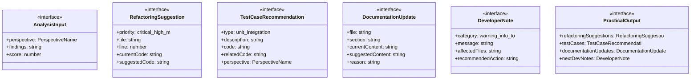

# self-improvement-output

## 概要

`self-improvement-output` モジュールのAPIリファレンス。

## インポート

```typescript
// from './self-improvement-dev-analyzer.js': PerspectiveName
// from '@mariozechner/pi-coding-agent': ExtensionAPI
```

## エクスポート一覧

| 種別 | 名前 | 説明 |
|------|------|------|
| 関数 | `generateRefactoringSuggestions` | 分析結果からリファクタリング提案を生成する |
| 関数 | `generateTestCases` | 分析結果からテストケース推奨を生成する |
| 関数 | `generateDocUpdates` | 分析結果からドキュメント更新ポイントを生成する |
| 関数 | `generatePracticalOutput` | 全ての実践的出力を生成する |
| インターフェース | `AnalysisInput` | 分析入力の型定義 |
| インターフェース | `RefactoringSuggestion` | リファクタリング提案 |
| インターフェース | `TestCaseRecommendation` | テストケース推奨 |
| インターフェース | `DocumentationUpdate` | ドキュメント更新 |
| インターフェース | `DeveloperNote` | 開発者ノート |
| インターフェース | `PracticalOutput` | 実践的出力のまとめ |

## 図解

### クラス図



### 依存関係図


### 関数フロー


### シーケンス図


## 関数

### generateRefactoringSuggestions

```typescript
generateRefactoringSuggestions(analyses: AnalysisInput[]): RefactoringSuggestion[]
```

分析結果からリファクタリング提案を生成する

低スコアの視座を特定し、具体的なリファクタリング提案を生成する。
提案は優先度順にソートされる。

**パラメータ**

| 名前 | 型 | 必須 |
|------|-----|------|
| analyses | `AnalysisInput[]` | はい |

**戻り値**: `RefactoringSuggestion[]`

### generateTestCases

```typescript
generateTestCases(analyses: AnalysisInput[]): TestCaseRecommendation[]
```

分析結果からテストケース推奨を生成する

特にロジック視座とスキゾ分析視座から、
エッジケーステストと副作用テストを生成する。

**パラメータ**

| 名前 | 型 | 必須 |
|------|-----|------|
| analyses | `AnalysisInput[]` | はい |

**戻り値**: `TestCaseRecommendation[]`

### generateDocUpdates

```typescript
generateDocUpdates(analyses: AnalysisInput[]): DocumentationUpdate[]
```

分析結果からドキュメント更新ポイントを生成する

Deconstruction視座から前提の文書化を提案し、
Eudaimonia視座からDXノートの追加を提案する。

**パラメータ**

| 名前 | 型 | 必須 |
|------|-----|------|
| analyses | `AnalysisInput[]` | はい |

**戻り値**: `DocumentationUpdate[]`

### generatePracticalOutput

```typescript
generatePracticalOutput(analyses: AnalysisInput[]): PracticalOutput
```

全ての実践的出力を生成する

**パラメータ**

| 名前 | 型 | 必須 |
|------|-----|------|
| analyses | `AnalysisInput[]` | はい |

**戻り値**: `PracticalOutput`

### generateSuggestedCode

```typescript
generateSuggestedCode(perspective: PerspectiveName, finding: string): string
```

視座に応じた提案コードを生成する

**パラメータ**

| 名前 | 型 | 必須 |
|------|-----|------|
| perspective | `PerspectiveName` | はい |
| finding | `string` | はい |

**戻り値**: `string`

### generateEdgeCaseTest

```typescript
generateEdgeCaseTest(finding: string): string
```

エッジケーステストを生成する

**パラメータ**

| 名前 | 型 | 必須 |
|------|-----|------|
| finding | `string` | はい |

**戻り値**: `string`

### generateLogicTest

```typescript
generateLogicTest(findings: string[]): string
```

ロジックテストを生成する

**パラメータ**

| 名前 | 型 | 必須 |
|------|-----|------|
| findings | `string[]` | はい |

**戻り値**: `string`

### generateSideEffectTest

```typescript
generateSideEffectTest(findings: string[]): string
```

副作用テストを生成する

**パラメータ**

| 名前 | 型 | 必須 |
|------|-----|------|
| findings | `string[]` | はい |

**戻り値**: `string`

### generateScalabilityTest

```typescript
generateScalabilityTest(): string
```

スケーラビリティテストを生成する

**戻り値**: `string`

### sortSuggestionsByPriority

```typescript
sortSuggestionsByPriority(suggestions: RefactoringSuggestion[]): RefactoringSuggestion[]
```

提案を優先度順にソートする

**パラメータ**

| 名前 | 型 | 必須 |
|------|-----|------|
| suggestions | `RefactoringSuggestion[]` | はい |

**戻り値**: `RefactoringSuggestion[]`

## インターフェース

### AnalysisInput

```typescript
interface AnalysisInput {
  perspective: PerspectiveName;
  findings: string[];
  score: number;
}
```

分析入力の型定義

### RefactoringSuggestion

```typescript
interface RefactoringSuggestion {
  priority: "critical" | "high" | "medium" | "low";
  file: string;
  line?: number;
  currentCode: string;
  suggestedCode: string;
  reason: string;
  perspective: PerspectiveName;
}
```

リファクタリング提案

### TestCaseRecommendation

```typescript
interface TestCaseRecommendation {
  type: "unit" | "integration" | "edge_case" | "property";
  description: string;
  code: string;
  relatedCode: string;
  perspective: PerspectiveName;
}
```

テストケース推奨

### DocumentationUpdate

```typescript
interface DocumentationUpdate {
  file: string;
  section: string;
  currentContent?: string;
  suggestedContent: string;
  reason: string;
}
```

ドキュメント更新

### DeveloperNote

```typescript
interface DeveloperNote {
  category: "warning" | "info" | "todo";
  message: string;
  affectedFiles: string[];
  recommendedAction: string;
}
```

開発者ノート

### PracticalOutput

```typescript
interface PracticalOutput {
  refactoringSuggestions: RefactoringSuggestion[];
  testCases: TestCaseRecommendation[];
  documentationUpdates: DocumentationUpdate[];
  nextDevNotes: DeveloperNote[];
}
```

実践的出力のまとめ

---
*自動生成: 2026-02-28T13:55:22.389Z*
