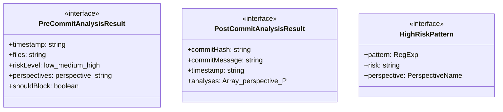
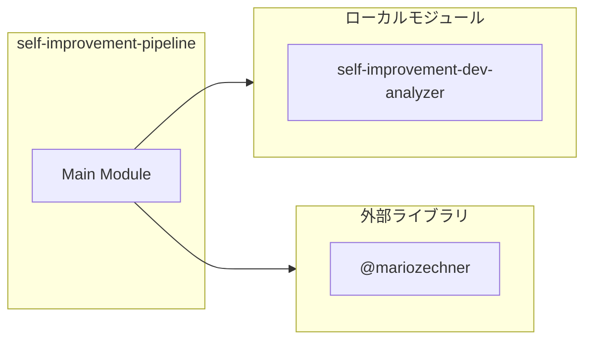
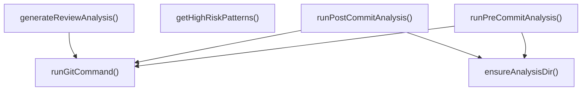
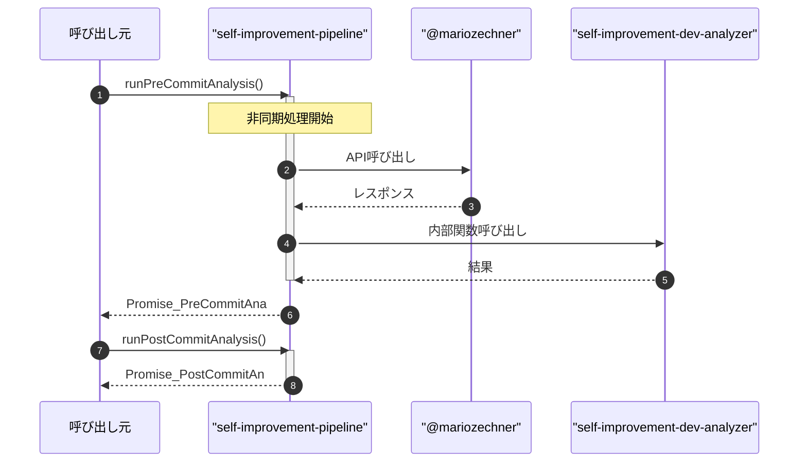

# self-improvement-pipeline

## 概要

`self-improvement-pipeline` モジュールのAPIリファレンス。

## インポート

```typescript
// from 'node:child_process': execSync
// from 'node:fs': existsSync, mkdirSync, writeFileSync
// from 'node:path': join
// from '@mariozechner/pi-coding-agent': ExtensionAPI
// from './self-improvement-dev-analyzer.js': DEV_PERSPECTIVE_TRANSLATIONS, analyzeCodeFromPerspective, PerspectiveName, ...
```

## エクスポート一覧

| 種別 | 名前 | 説明 |
|------|------|------|
| 関数 | `runPreCommitAnalysis` | Pre-commit分析を実行する |
| 関数 | `runPostCommitAnalysis` | Post-commit分析を実行する |
| 関数 | `generateReviewAnalysis` | PRレビュー用分析を生成する |
| 関数 | `getHighRiskPatterns` | 高リスクパターンの一覧を取得する（デバッグ用） |
| インターフェース | `PreCommitAnalysisResult` | Pre-commit分析結果 |
| インターフェース | `PostCommitAnalysisResult` | Post-commit分析結果 |

## 図解

### クラス図



### 依存関係図



### 関数フロー



### シーケンス図



## 関数

### runGitCommand

```typescript
runGitCommand(args: string[], cwd: string): string
```

Gitコマンドを安全に実行する

**パラメータ**

| 名前 | 型 | 必須 |
|------|-----|------|
| args | `string[]` | はい |
| cwd | `string` | はい |

**戻り値**: `string`

### ensureAnalysisDir

```typescript
ensureAnalysisDir(): string
```

分析結果の保存ディレクトリを確保する

**戻り値**: `string`

### runPreCommitAnalysis

```typescript
async runPreCommitAnalysis(): Promise<PreCommitAnalysisResult>
```

Pre-commit分析を実行する

ステージングされたファイルを分析し、高リスクパターンを検出する。
結果は `.pi/analyses/` ディレクトリにJSON形式で保存される。

**重要**: この分析は「advisory only」であり、コミットをブロックしない。

**戻り値**: `Promise<PreCommitAnalysisResult>`

### runPostCommitAnalysis

```typescript
async runPostCommitAnalysis(commitHash: string): Promise<PostCommitAnalysisResult>
```

Post-commit分析を実行する

指定されたコミットの変更を7つの視座から分析し、
品質レポートを生成する。

**パラメータ**

| 名前 | 型 | 必須 |
|------|-----|------|
| commitHash | `string` | はい |

**戻り値**: `Promise<PostCommitAnalysisResult>`

### generateReviewAnalysis

```typescript
async generateReviewAnalysis(baseBranch: string): Promise<string>
```

PRレビュー用分析を生成する

現在のブランチとベースブランチの差分を分析し、
レビュー用のMarkdownレポートを生成する。

**パラメータ**

| 名前 | 型 | 必須 |
|------|-----|------|
| baseBranch | `string` | はい |

**戻り値**: `Promise<string>`

### getHighRiskPatterns

```typescript
getHighRiskPatterns(): Array<{ risk: string; perspective: string }>
```

高リスクパターンの一覧を取得する（デバッグ用）

**戻り値**: `Array<{ risk: string; perspective: string }>`

## インターフェース

### PreCommitAnalysisResult

```typescript
interface PreCommitAnalysisResult {
  timestamp: string;
  files: string[];
  riskLevel: "low" | "medium" | "high";
  perspectives: {
    perspective: string;
    warnings: string[];
    suggestions: string[];
  }[];
  shouldBlock: boolean;
}
```

Pre-commit分析結果

### PostCommitAnalysisResult

```typescript
interface PostCommitAnalysisResult {
  commitHash: string;
  commitMessage: string;
  timestamp: string;
  analyses: Array<{
    perspective: PerspectiveName;
    analysis: string;
    refactoringSuggestions: string[];
    testRecommendations: string[];
  }>;
}
```

Post-commit分析結果

### HighRiskPattern

```typescript
interface HighRiskPattern {
  pattern: RegExp;
  risk: string;
  perspective: PerspectiveName;
}
```

高リスクパターンの定義

---
*自動生成: 2026-02-28T13:55:22.615Z*
