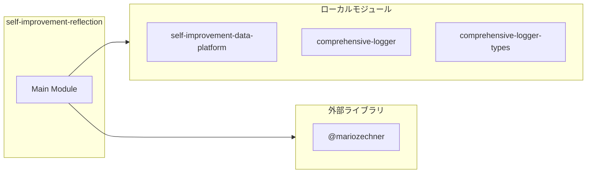
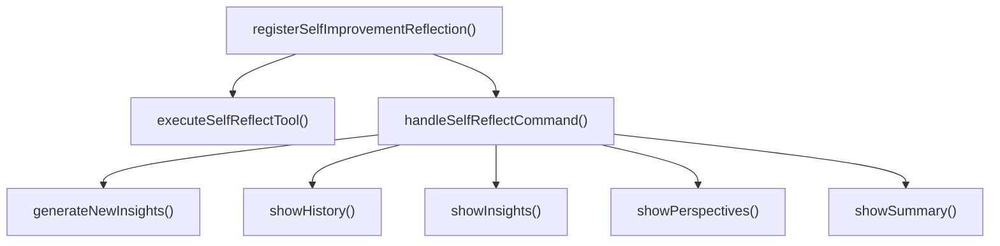
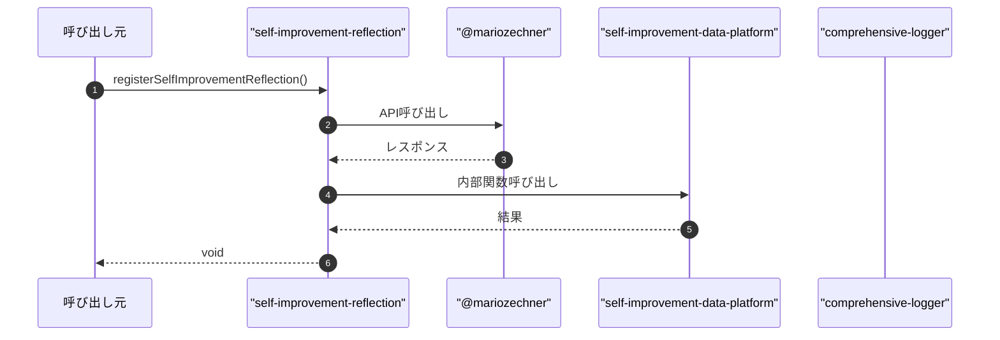

# self-improvement-reflection

## 概要

`self-improvement-reflection` モジュールのAPIリファレンス。

## インポート

```typescript
// from '@mariozechner/pi-ai': Type
// from '@mariozechner/pi-coding-agent': ExtensionAPI
// from '../lib/self-improvement-data-platform.js': buildIntegratedDataView, generateInsightReport, saveInsightReport, ...
// from '@mariozechner/pi-coding-agent': ExtensionContext
// from '../lib/comprehensive-logger': getLogger
// ... and 1 more imports
```

## エクスポート一覧

| 種別 | 名前 | 説明 |
|------|------|------|
| 関数 | `registerSelfImprovementReflection` | - |

## 図解

### 依存関係図



### 関数フロー



### シーケンス図



## 関数

### handleSelfReflectCommand

```typescript
async handleSelfReflectCommand(args: string, ctx: ExtensionContext): Promise<void>
```

**パラメータ**

| 名前 | 型 | 必須 |
|------|-----|------|
| args | `string` | はい |
| ctx | `ExtensionContext` | はい |

**戻り値**: `Promise<void>`

### showSummary

```typescript
async showSummary(ctx: ExtensionContext): Promise<void>
```

**パラメータ**

| 名前 | 型 | 必須 |
|------|-----|------|
| ctx | `ExtensionContext` | はい |

**戻り値**: `Promise<void>`

### showInsights

```typescript
async showInsights(ctx: ExtensionContext): Promise<void>
```

**パラメータ**

| 名前 | 型 | 必須 |
|------|-----|------|
| ctx | `ExtensionContext` | はい |

**戻り値**: `Promise<void>`

### generateNewInsights

```typescript
async generateNewInsights(ctx: ExtensionContext): Promise<void>
```

**パラメータ**

| 名前 | 型 | 必須 |
|------|-----|------|
| ctx | `ExtensionContext` | はい |

**戻り値**: `Promise<void>`

### showPerspectives

```typescript
async showPerspectives(ctx: ExtensionContext): Promise<void>
```

**パラメータ**

| 名前 | 型 | 必須 |
|------|-----|------|
| ctx | `ExtensionContext` | はい |

**戻り値**: `Promise<void>`

### showHistory

```typescript
async showHistory(ctx: ExtensionContext, limitRaw?: string): Promise<void>
```

**パラメータ**

| 名前 | 型 | 必須 |
|------|-----|------|
| ctx | `ExtensionContext` | はい |
| limitRaw | `string` | いいえ |

**戻り値**: `Promise<void>`

### executeSelfReflectTool

```typescript
async executeSelfReflectTool(_toolCallId: string, params: {
    action?: "summary" | "insights" | "generate" | "perspectives" | "analyze";
    perspective?: PhilosophicalPerspective;
    focus_area?: string;
    config?: Partial<PlatformConfig>;
  }, _signal: AbortSignal, _onUpdate: (partialResult: { content: Array<{ type: "text"; text: string }> }) => void, ctx: ExtensionContext): Promise<{
  content: Array<{ type: "text"; text: string }>;
  details?: Record<string, unknown>;
}>
```

**パラメータ**

| 名前 | 型 | 必須 |
|------|-----|------|
| _toolCallId | `string` | はい |
| params | `object` | はい |
| &nbsp;&nbsp;↳ action | `"summary" | "insights" | "generate" | "perspectives" | "analyze"` | いいえ |
| &nbsp;&nbsp;↳ perspective | `PhilosophicalPerspective` | いいえ |
| &nbsp;&nbsp;↳ focus_area | `string` | いいえ |
| &nbsp;&nbsp;↳ config | `Partial<PlatformConfig>` | いいえ |
| _signal | `AbortSignal` | はい |
| _onUpdate | `(partialResult: { content: Array<{ type: "text"...` | はい |
| ctx | `ExtensionContext` | はい |

**戻り値**: `Promise<{
  content: Array<{ type: "text"; text: string }>;
  details?: Record<string, unknown>;
}>`

### registerSelfImprovementReflection

```typescript
registerSelfImprovementReflection(pi: ExtensionAPI): void
```

**パラメータ**

| 名前 | 型 | 必須 |
|------|-----|------|
| pi | `ExtensionAPI` | はい |

**戻り値**: `void`

## 型定義

### ReflectionAction

```typescript
type ReflectionAction = "summary" | "insights" | "generate" | "perspectives" | "history"
```

---
*自動生成: 2026-02-24T17:08:02.471Z*
