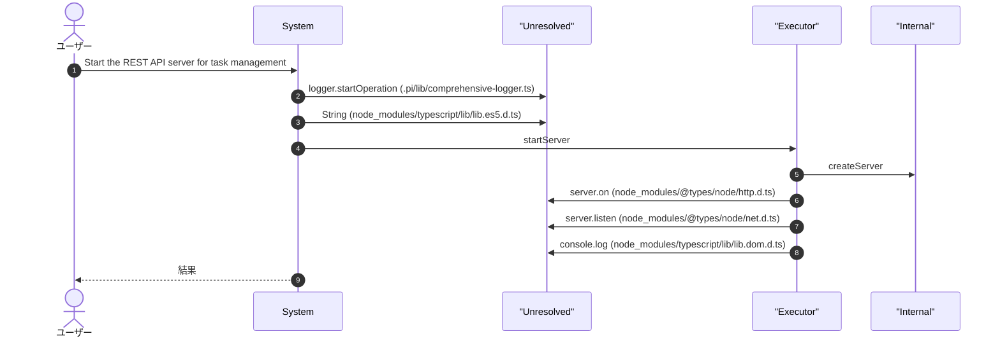
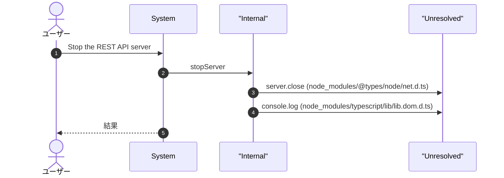
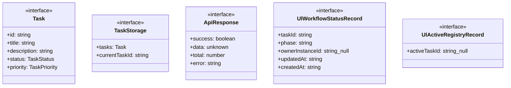
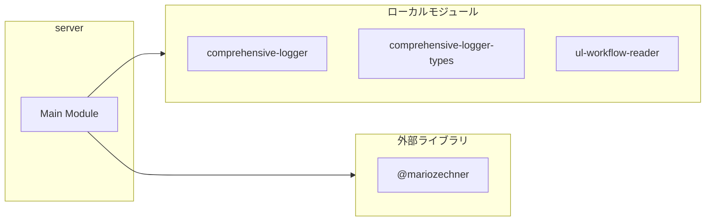
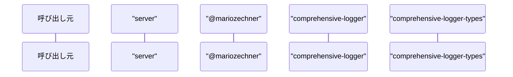

# server

## 概要

`server` モジュールのAPIリファレンス。

## インポート

```typescript
// from 'node:http': createServer, IncomingMessage, ServerResponse, ...
// from '@mariozechner/pi-ai': Type
// from '@mariozechner/pi-coding-agent': ExtensionAPI
// from '../lib/comprehensive-logger': getLogger
// from '../lib/comprehensive-logger-types': OperationType
// ... and 3 more imports
```

## エクスポート一覧

| 種別 | 名前 | 説明 |
|------|------|------|

## ユーザーフロー

このモジュールが提供するツールと、その実行フローを示します。

### api_start

Start the REST API server for task management



### api_stop

Stop the REST API server



## 図解

### クラス図



### 依存関係図



### シーケンス図



## 関数

### ensureTaskDir

```typescript
ensureTaskDir(): void
```

**戻り値**: `void`

### loadStorage

```typescript
loadStorage(): TaskStorage
```

**戻り値**: `TaskStorage`

### saveStorage

```typescript
saveStorage(storage: TaskStorage): void
```

**パラメータ**

| 名前 | 型 | 必須 |
|------|-----|------|
| storage | `TaskStorage` | はい |

**戻り値**: `void`

### generateId

```typescript
generateId(): string
```

**戻り値**: `string`

### sendJson

```typescript
sendJson(res: ServerResponse, status: number, data: ApiResponse): void
```

**パラメータ**

| 名前 | 型 | 必須 |
|------|-----|------|
| res | `ServerResponse` | はい |
| status | `number` | はい |
| data | `ApiResponse` | はい |

**戻り値**: `void`

### parseUrl

```typescript
parseUrl(url: string): { path: string; query: Record<string, string> }
```

**パラメータ**

| 名前 | 型 | 必須 |
|------|-----|------|
| url | `string` | はい |

**戻り値**: `{ path: string; query: Record<string, string> }`

### readBody

```typescript
async readBody(req: IncomingMessage): Promise<string>
```

**パラメータ**

| 名前 | 型 | 必須 |
|------|-----|------|
| req | `IncomingMessage` | はい |

**戻り値**: `Promise<string>`

### serveStatic

```typescript
async serveStatic(urlPath: string, publicDir: string, res: ServerResponse): Promise<boolean>
```

**パラメータ**

| 名前 | 型 | 必須 |
|------|-----|------|
| urlPath | `string` | はい |
| publicDir | `string` | はい |
| res | `ServerResponse` | はい |

**戻り値**: `Promise<boolean>`

### handleGetTasks

```typescript
handleGetTasks(query: Record<string, string>): ApiResponse
```

**パラメータ**

| 名前 | 型 | 必須 |
|------|-----|------|
| query | `Record<string, string>` | はい |

**戻り値**: `ApiResponse`

### handleGetTask

```typescript
handleGetTask(id: string): ApiResponse
```

**パラメータ**

| 名前 | 型 | 必須 |
|------|-----|------|
| id | `string` | はい |

**戻り値**: `ApiResponse`

### handleCreateTask

```typescript
handleCreateTask(body: Record<string, unknown>): ApiResponse
```

**パラメータ**

| 名前 | 型 | 必須 |
|------|-----|------|
| body | `Record<string, unknown>` | はい |

**戻り値**: `ApiResponse`

### handleUpdateTask

```typescript
handleUpdateTask(id: string, body: Record<string, unknown>): ApiResponse
```

**パラメータ**

| 名前 | 型 | 必須 |
|------|-----|------|
| id | `string` | はい |
| body | `Record<string, unknown>` | はい |

**戻り値**: `ApiResponse`

### handleDeleteTask

```typescript
handleDeleteTask(id: string): ApiResponse
```

**パラメータ**

| 名前 | 型 | 必須 |
|------|-----|------|
| id | `string` | はい |

**戻り値**: `ApiResponse`

### handleCompleteTask

```typescript
handleCompleteTask(id: string): ApiResponse
```

**パラメータ**

| 名前 | 型 | 必須 |
|------|-----|------|
| id | `string` | はい |

**戻り値**: `ApiResponse`

### handleGetStats

```typescript
handleGetStats(): ApiResponse
```

**戻り値**: `ApiResponse`

### extractPidFromOwnerInstanceId

```typescript
extractPidFromOwnerInstanceId(ownerInstanceId: string | null | undefined): number | null
```

ownerInstanceId から PID を抽出する

**パラメータ**

| 名前 | 型 | 必須 |
|------|-----|------|
| ownerInstanceId | `string | null | undefined` | はい |

**戻り値**: `number | null`

### isProcessAlive

```typescript
isProcessAlive(pid: number): boolean
```

プロセスが生存しているか確認する

**パラメータ**

| 名前 | 型 | 必須 |
|------|-----|------|
| pid | `number` | はい |

**戻り値**: `boolean`

### cleanupDeadOwnerUlWorkflowTasks

```typescript
cleanupDeadOwnerUlWorkflowTasks(): number
```

ULタスクの孤立データを掃除する
- owner が死んでいる
- owner が null で長時間放置されている

**戻り値**: `number`

### handleGetUlWorkflowTasks

```typescript
handleGetUlWorkflowTasks(): ApiResponse
```

**戻り値**: `ApiResponse`

### handleGetUlWorkflowTask

```typescript
handleGetUlWorkflowTask(id: string): ApiResponse
```

**パラメータ**

| 名前 | 型 | 必須 |
|------|-----|------|
| id | `string` | はい |

**戻り値**: `ApiResponse`

### handleGetActiveUlWorkflowTask

```typescript
handleGetActiveUlWorkflowTask(): ApiResponse
```

**戻り値**: `ApiResponse`

### handleRequest

```typescript
async handleRequest(req: IncomingMessage, res: ServerResponse): Promise<void>
```

**パラメータ**

| 名前 | 型 | 必須 |
|------|-----|------|
| req | `IncomingMessage` | はい |
| res | `ServerResponse` | はい |

**戻り値**: `Promise<void>`

### startServer

```typescript
startServer(port: number): Promise<number>
```

**パラメータ**

| 名前 | 型 | 必須 |
|------|-----|------|
| port | `number` | はい |

**戻り値**: `Promise<number>`

### stopServer

```typescript
stopServer(): Promise<void>
```

**戻り値**: `Promise<void>`

### isApiServerRunning

```typescript
isApiServerRunning(): boolean
```

**戻り値**: `boolean`

### getApiServerPort

```typescript
getApiServerPort(): number | null
```

**戻り値**: `number | null`

## インターフェース

### Task

```typescript
interface Task {
  id: string;
  title: string;
  description?: string;
  status: TaskStatus;
  priority: TaskPriority;
  tags: string[];
  dueDate?: string;
  assignee?: string;
  createdAt: string;
  updatedAt: string;
  completedAt?: string;
  parentTaskId?: string;
}
```

### TaskStorage

```typescript
interface TaskStorage {
  tasks: Task[];
  currentTaskId?: string;
}
```

### ApiResponse

```typescript
interface ApiResponse {
  success: boolean;
  data?: unknown;
  total?: number;
  error?: string;
}
```

### UlWorkflowStatusRecord

```typescript
interface UlWorkflowStatusRecord {
  taskId?: string;
  phase?: string;
  ownerInstanceId?: string | null;
  updatedAt?: string;
  createdAt?: string;
}
```

### UlActiveRegistryRecord

```typescript
interface UlActiveRegistryRecord {
  activeTaskId?: string | null;
}
```

## 型定義

### TaskPriority

```typescript
type TaskPriority = "low" | "medium" | "high" | "urgent"
```

### TaskStatus

```typescript
type TaskStatus = "todo" | "in_progress" | "completed" | "cancelled" | "failed"
```

---
*自動生成: 2026-02-28T13:55:22.793Z*
