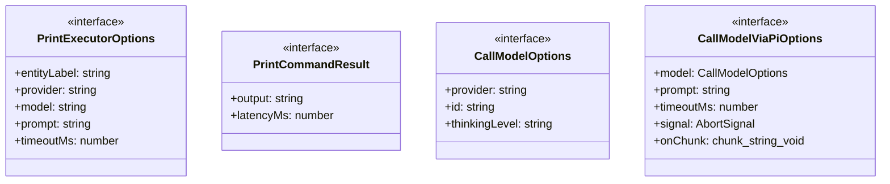
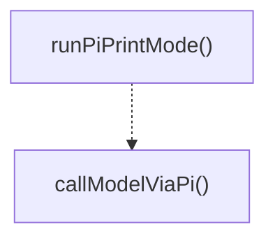
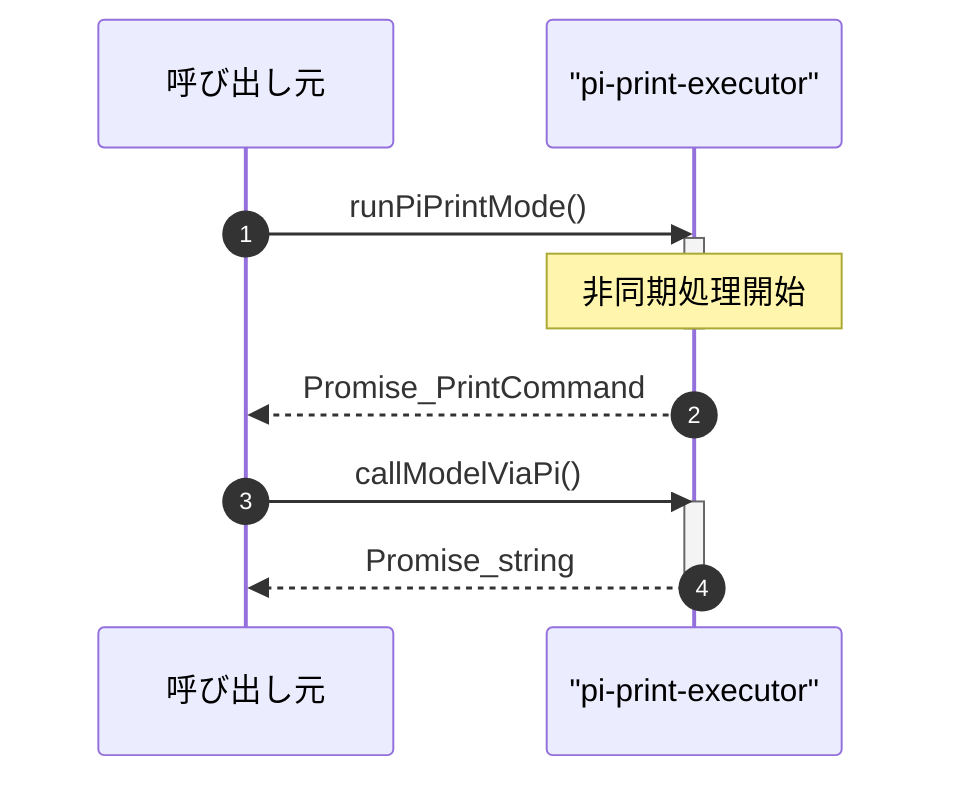

# pi-print-executor

## 概要

`pi-print-executor` モジュールのAPIリファレンス。

## インポート

```typescript
import { spawn } from 'node:child_process';
```

## エクスポート一覧

| 種別 | 名前 | 説明 |
|------|------|------|
| 関数 | `runPiPrintMode` | Piプリントモードを実行します |
| 関数 | `callModelViaPi` | piを介してモデルを呼び出す |
| インターフェース | `PrintExecutorOptions` | プリント実行のオプション |
| インターフェース | `PrintCommandResult` | 印刷コマンドの実行結果 |
| インターフェース | `CallModelOptions` | モデル呼び出しのオプション |
| インターフェース | `CallModelViaPiOptions` | pi経由でモデルを呼び出すためのオプション |

## 図解

### クラス図



### 関数フロー



### シーケンス図



## 関数

### trimForError

```typescript
trimForError(text: string, maxLength: any): string
```

Trims error messages to a reasonable length for display.

**パラメータ**

| 名前 | 型 | 必須 |
|------|-----|------|
| text | `string` | はい |
| maxLength | `any` | はい |

**戻り値**: `string`

### parseJsonStreamLine

```typescript
parseJsonStreamLine(line: string): { type: string; textDelta?: string; thinkingDelta?: string; isEnd?: boolean } | null
```

Parse JSON stream lines and extract text content.
Handles both complete JSON objects and partial lines.

**パラメータ**

| 名前 | 型 | 必須 |
|------|-----|------|
| line | `string` | はい |

**戻り値**: `{ type: string; textDelta?: string; thinkingDelta?: string; isEnd?: boolean } | null`

### extractFinalText

```typescript
extractFinalText(line: string): { text: string | null; thinking: string | null }
```

Extract final text from agent_end message.

**パラメータ**

| 名前 | 型 | 必須 |
|------|-----|------|
| line | `string` | はい |

**戻り値**: `{ text: string | null; thinking: string | null }`

### formatThinkingBlock

```typescript
formatThinkingBlock(thinking: string): string
```

Format thinking block with indentation for distinct display.

**パラメータ**

| 名前 | 型 | 必須 |
|------|-----|------|
| thinking | `string` | はい |

**戻り値**: `string`

### combineTextAndThinking

```typescript
combineTextAndThinking(text: string, thinking: string): string
```

Combine text and thinking content with proper formatting.

**パラメータ**

| 名前 | 型 | 必須 |
|------|-----|------|
| text | `string` | はい |
| thinking | `string` | はい |

**戻り値**: `string`

### runPiPrintMode

```typescript
async runPiPrintMode(input: PrintExecutorOptions): Promise<PrintCommandResult>
```

Piプリントモードを実行します

**パラメータ**

| 名前 | 型 | 必須 |
|------|-----|------|
| input | `PrintExecutorOptions` | はい |

**戻り値**: `Promise<PrintCommandResult>`

### finish

```typescript
finish(fn: () => void): void
```

**パラメータ**

| 名前 | 型 | 必須 |
|------|-----|------|
| fn | `() => void` | はい |

**戻り値**: `void`

### killSafely

```typescript
killSafely(sig: NodeJS.Signals): void
```

**パラメータ**

| 名前 | 型 | 必須 |
|------|-----|------|
| sig | `NodeJS.Signals` | はい |

**戻り値**: `void`

### resetIdleTimeout

```typescript
resetIdleTimeout(): void
```

**戻り値**: `void`

### onAbort

```typescript
onAbort(): void
```

**戻り値**: `void`

### cleanup

```typescript
cleanup(): void
```

**戻り値**: `void`

### callModelViaPi

```typescript
async callModelViaPi(options: CallModelViaPiOptions): Promise<string>
```

piを介してモデルを呼び出す

**パラメータ**

| 名前 | 型 | 必須 |
|------|-----|------|
| options | `CallModelViaPiOptions` | はい |

**戻り値**: `Promise<string>`

### finish

```typescript
finish(fn: () => void): void
```

**パラメータ**

| 名前 | 型 | 必須 |
|------|-----|------|
| fn | `() => void` | はい |

**戻り値**: `void`

### killSafely

```typescript
killSafely(sig: NodeJS.Signals): void
```

**パラメータ**

| 名前 | 型 | 必須 |
|------|-----|------|
| sig | `NodeJS.Signals` | はい |

**戻り値**: `void`

### resetIdleTimeout

```typescript
resetIdleTimeout(): void
```

**戻り値**: `void`

### onAbort

```typescript
onAbort(): void
```

**戻り値**: `void`

### cleanup

```typescript
cleanup(): void
```

**戻り値**: `void`

## インターフェース

### PrintExecutorOptions

```typescript
interface PrintExecutorOptions {
  entityLabel: string;
  provider?: string;
  model?: string;
  prompt: string;
  timeoutMs: number;
  signal?: AbortSignal;
  onStdoutChunk?: (chunk: string) => void;
  onStderrChunk?: (chunk: string) => void;
  onTextDelta?: (delta: string) => void;
  onThinkingDelta?: (delta: string) => void;
}
```

プリント実行のオプション

### PrintCommandResult

```typescript
interface PrintCommandResult {
  output: string;
  latencyMs: number;
}
```

印刷コマンドの実行結果

### CallModelOptions

```typescript
interface CallModelOptions {
  provider: string;
  id: string;
  thinkingLevel?: string;
}
```

モデル呼び出しのオプション

### CallModelViaPiOptions

```typescript
interface CallModelViaPiOptions {
  model: CallModelOptions;
  prompt: string;
  timeoutMs: number;
  signal?: AbortSignal;
  onChunk?: (chunk: string) => void;
  onTextDelta?: (delta: string) => void;
  entityLabel?: string;
}
```

pi経由でモデルを呼び出すためのオプション

---
*自動生成: 2026-02-18T07:48:44.690Z*
