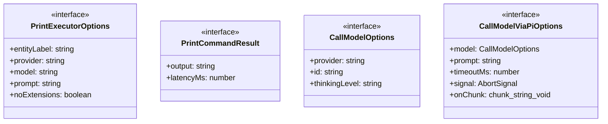
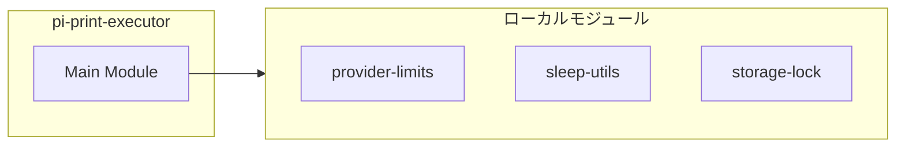
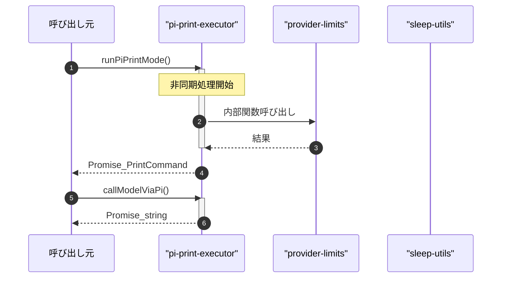

# pi-print-executor

## 概要

`pi-print-executor` モジュールのAPIリファレンス。

## インポート

```typescript
// from 'node:child_process': spawn
// from 'node:fs': existsSync, mkdirSync, readFileSync, ...
// from 'node:os': homedir
// from 'node:path': join
// from '../../lib/provider-limits.js': detectTier, getRpmLimit
// ... and 2 more imports
```

## エクスポート一覧

| 種別 | 名前 | 説明 |
|------|------|------|
| 関数 | `runPiPrintMode` | Pi印刷モード実行 |
| 関数 | `callModelViaPi` | PI経由でLLMを呼び出す |
| インターフェース | `PrintExecutorOptions` | 印刷実行オプション |
| インターフェース | `PrintCommandResult` | 印刷コマンド結果 |
| インターフェース | `CallModelOptions` | モデル呼び出し共通オプション |
| インターフェース | `CallModelViaPiOptions` | PI呼び出しオプション |

## 図解

### クラス図



### 依存関係図



### 関数フロー

```mermaid
flowchart TD
  appendWithCap["appendWithCap()"]
  callModelViaPi["callModelViaPi()"]
  cleanup["cleanup()"]
  combineTextAndThinking["combineTextAndThinking()"]
  extractFinalText["extractFinalText()"]
  extractRetryAfterMs["extractRetryAfterMs()"]
  finish["finish()"]
  getPrintThrottleKey["getPrintThrottleKey()"]
  isRateLimitMessage["isRateLimitMessage()"]
  isUnhandledAbortStopReasonMessage["isUnhandledAbortStopReasonMessage()"]
  killSafely["killSafely()"]
  parseBooleanEnv["parseBooleanEnv()"]
  parseJsonStreamLine["parseJsonStreamLine()"]
  parseNumberEnv["parseNumberEnv()"]
  prunePrintThrottleStates["prunePrintThrottleStates()"]
  prunePrintThrottleWindow["prunePrintThrottleWindow()"]
  recordPrintRateLimitCooldown["recordPrintRateLimitCooldown()"]
  resetIdleTimeout["resetIdleTimeout()"]
  resolveEffectivePrintRpm["resolveEffectivePrintRpm()"]
  runPiPrintMode["runPiPrintMode()"]
  sleepWithAbort["sleepWithAbort()"]
  trimForError["trimForError()"]
  waitForPrintThrottleSlot["waitForPrintThrottleSlot()"]
  withPrintThrottleMutation["withPrintThrottleMutation()"]
  callModelViaPi --> appendWithCap
  callModelViaPi --> cleanup
  callModelViaPi --> combineTextAndThinking
  callModelViaPi --> extractFinalText
  callModelViaPi --> finish
  callModelViaPi --> isUnhandledAbortStopReasonMessage
  callModelViaPi --> killSafely
  callModelViaPi --> parseJsonStreamLine
  callModelViaPi --> recordPrintRateLimitCooldown
  callModelViaPi --> resetIdleTimeout
  callModelViaPi --> waitForPrintThrottleSlot
  finish --> cleanup
  recordPrintRateLimitCooldown --> extractRetryAfterMs
  recordPrintRateLimitCooldown --> getPrintThrottleKey
  recordPrintRateLimitCooldown --> isRateLimitMessage
  resetIdleTimeout --> killSafely
  runPiPrintMode --> appendWithCap
  runPiPrintMode --> cleanup
  runPiPrintMode --> combineTextAndThinking
  runPiPrintMode --> extractFinalText
  runPiPrintMode --> finish
  runPiPrintMode --> isUnhandledAbortStopReasonMessage
  runPiPrintMode --> killSafely
  runPiPrintMode --> parseJsonStreamLine
  runPiPrintMode --> recordPrintRateLimitCooldown
  runPiPrintMode --> resetIdleTimeout
  runPiPrintMode --> trimForError
  runPiPrintMode --> waitForPrintThrottleSlot
  waitForPrintThrottleSlot --> getPrintThrottleKey
  waitForPrintThrottleSlot --> parseBooleanEnv
  waitForPrintThrottleSlot --> parseNumberEnv
  waitForPrintThrottleSlot --> prunePrintThrottleStates
  waitForPrintThrottleSlot --> prunePrintThrottleWindow
  waitForPrintThrottleSlot --> resolveEffectivePrintRpm
  waitForPrintThrottleSlot --> sleepWithAbort
  waitForPrintThrottleSlot --> withPrintThrottleMutation
```



### シーケンス図



## 関数

### sleepWithAbort

```typescript
async sleepWithAbort(delayMs: number, signal?: AbortSignal): Promise<void>
```

**パラメータ**

| 名前 | 型 | 必須 |
|------|-----|------|
| delayMs | `number` | はい |
| signal | `AbortSignal` | いいえ |

**戻り値**: `Promise<void>`

### onAbort

```typescript
onAbort(): void
```

**戻り値**: `void`

### parseNumberEnv

```typescript
parseNumberEnv(name: string, fallback: number): number
```

**パラメータ**

| 名前 | 型 | 必須 |
|------|-----|------|
| name | `string` | はい |
| fallback | `number` | はい |

**戻り値**: `number`

### parseBooleanEnv

```typescript
parseBooleanEnv(name: string, fallback: boolean): boolean
```

**パラメータ**

| 名前 | 型 | 必須 |
|------|-----|------|
| name | `string` | はい |
| fallback | `boolean` | はい |

**戻り値**: `boolean`

### getPrintThrottleKey

```typescript
getPrintThrottleKey(provider: string, model: string): string
```

**パラメータ**

| 名前 | 型 | 必須 |
|------|-----|------|
| provider | `string` | はい |
| model | `string` | はい |

**戻り値**: `string`

### ensurePrintThrottleRuntimeDir

```typescript
ensurePrintThrottleRuntimeDir(): void
```

**戻り値**: `void`

### prunePrintThrottleWindow

```typescript
prunePrintThrottleWindow(state: PrintThrottleBucketState, nowMs: number, windowMs: number): void
```

**パラメータ**

| 名前 | 型 | 必須 |
|------|-----|------|
| state | `PrintThrottleBucketState` | はい |
| nowMs | `number` | はい |
| windowMs | `number` | はい |

**戻り値**: `void`

### prunePrintThrottleStates

```typescript
prunePrintThrottleStates(nowMs: number): void
```

**パラメータ**

| 名前 | 型 | 必須 |
|------|-----|------|
| nowMs | `number` | はい |

**戻り値**: `void`

### loadPrintThrottleStatesIntoMemory

```typescript
loadPrintThrottleStatesIntoMemory(nowMs: number): void
```

**パラメータ**

| 名前 | 型 | 必須 |
|------|-----|------|
| nowMs | `number` | はい |

**戻り値**: `void`

### savePrintThrottleStates

```typescript
savePrintThrottleStates(nowMs: number): void
```

**パラメータ**

| 名前 | 型 | 必須 |
|------|-----|------|
| nowMs | `number` | はい |

**戻り値**: `void`

### withPrintThrottleMutation

```typescript
withPrintThrottleMutation(nowMs: number, mutator: () => T): T
```

**パラメータ**

| 名前 | 型 | 必須 |
|------|-----|------|
| nowMs | `number` | はい |
| mutator | `() => T` | はい |

**戻り値**: `T`

### fallback

```typescript
fallback(): void
```

**戻り値**: `void`

### resolveEffectivePrintRpm

```typescript
resolveEffectivePrintRpm(provider: string, model: string): number
```

**パラメータ**

| 名前 | 型 | 必須 |
|------|-----|------|
| provider | `string` | はい |
| model | `string` | はい |

**戻り値**: `number`

### isRateLimitMessage

```typescript
isRateLimitMessage(text: string): boolean
```

**パラメータ**

| 名前 | 型 | 必須 |
|------|-----|------|
| text | `string` | はい |

**戻り値**: `boolean`

### isUnhandledAbortStopReasonMessage

```typescript
isUnhandledAbortStopReasonMessage(text: string): boolean
```

**パラメータ**

| 名前 | 型 | 必須 |
|------|-----|------|
| text | `string` | はい |

**戻り値**: `boolean`

### extractRetryAfterMs

```typescript
extractRetryAfterMs(text: string): number | undefined
```

**パラメータ**

| 名前 | 型 | 必須 |
|------|-----|------|
| text | `string` | はい |

**戻り値**: `number | undefined`

### waitForPrintThrottleSlot

```typescript
async waitForPrintThrottleSlot(input: {
  provider?: string;
  model?: string;
  signal?: AbortSignal;
}): Promise<void>
```

**パラメータ**

| 名前 | 型 | 必須 |
|------|-----|------|
| input | `object` | はい |
| &nbsp;&nbsp;↳ provider | `string` | いいえ |
| &nbsp;&nbsp;↳ model | `string` | いいえ |
| &nbsp;&nbsp;↳ signal | `AbortSignal` | いいえ |

**戻り値**: `Promise<void>`

### recordPrintRateLimitCooldown

```typescript
recordPrintRateLimitCooldown(input: {
  provider?: string;
  model?: string;
  stderr: string;
}): void
```

**パラメータ**

| 名前 | 型 | 必須 |
|------|-----|------|
| input | `object` | はい |
| &nbsp;&nbsp;↳ provider | `string` | いいえ |
| &nbsp;&nbsp;↳ model | `string` | いいえ |
| &nbsp;&nbsp;↳ stderr | `string` | はい |

**戻り値**: `void`

### trimForError

```typescript
trimForError(text: string, maxLength: any): string
```

Trims error messages to a reasonable length for display.

**パラメータ**

| 名前 | 型 | 必須 |
|------|-----|------|
| text | `string` | はい |
| maxLength | `any` | はい |

**戻り値**: `string`

### appendWithCap

```typescript
appendWithCap(current: string, next: string, maxChars: number): string
```

Append text with hard length cap to avoid RangeError from unbounded buffering.

**パラメータ**

| 名前 | 型 | 必須 |
|------|-----|------|
| current | `string` | はい |
| next | `string` | はい |
| maxChars | `number` | はい |

**戻り値**: `string`

### parseJsonStreamLine

```typescript
parseJsonStreamLine(line: string): { type: string; textDelta?: string; thinkingDelta?: string; isEnd?: boolean } | null
```

Parse JSON stream lines and extract text content.
Handles both complete JSON objects and partial lines.

**パラメータ**

| 名前 | 型 | 必須 |
|------|-----|------|
| line | `string` | はい |

**戻り値**: `{ type: string; textDelta?: string; thinkingDelta?: string; isEnd?: boolean } | null`

### extractFinalText

```typescript
extractFinalText(line: string): { text: string | null; thinking: string | null }
```

Extract final text from agent_end message.

**パラメータ**

| 名前 | 型 | 必須 |
|------|-----|------|
| line | `string` | はい |

**戻り値**: `{ text: string | null; thinking: string | null }`

### formatThinkingBlock

```typescript
formatThinkingBlock(thinking: string): string
```

Format thinking block with indentation for distinct display.

**パラメータ**

| 名前 | 型 | 必須 |
|------|-----|------|
| thinking | `string` | はい |

**戻り値**: `string`

### combineTextAndThinking

```typescript
combineTextAndThinking(text: string, thinking: string): string
```

Combine text and thinking content with proper formatting.

**パラメータ**

| 名前 | 型 | 必須 |
|------|-----|------|
| text | `string` | はい |
| thinking | `string` | はい |

**戻り値**: `string`

### runPiPrintMode

```typescript
async runPiPrintMode(input: PrintExecutorOptions): Promise<PrintCommandResult>
```

Pi印刷モード実行

**パラメータ**

| 名前 | 型 | 必須 |
|------|-----|------|
| input | `PrintExecutorOptions` | はい |

**戻り値**: `Promise<PrintCommandResult>`

### finish

```typescript
finish(fn: () => void): void
```

**パラメータ**

| 名前 | 型 | 必須 |
|------|-----|------|
| fn | `() => void` | はい |

**戻り値**: `void`

### killSafely

```typescript
killSafely(sig: NodeJS.Signals): void
```

**パラメータ**

| 名前 | 型 | 必須 |
|------|-----|------|
| sig | `NodeJS.Signals` | はい |

**戻り値**: `void`

### resetIdleTimeout

```typescript
resetIdleTimeout(): void
```

**戻り値**: `void`

### onAbort

```typescript
onAbort(): void
```

**戻り値**: `void`

### cleanup

```typescript
cleanup(): void
```

**戻り値**: `void`

### callModelViaPi

```typescript
async callModelViaPi(options: CallModelViaPiOptions): Promise<string>
```

PI経由でLLMを呼び出す

**パラメータ**

| 名前 | 型 | 必須 |
|------|-----|------|
| options | `CallModelViaPiOptions` | はい |

**戻り値**: `Promise<string>`

### finish

```typescript
finish(fn: () => void): void
```

**パラメータ**

| 名前 | 型 | 必須 |
|------|-----|------|
| fn | `() => void` | はい |

**戻り値**: `void`

### killSafely

```typescript
killSafely(sig: NodeJS.Signals): void
```

**パラメータ**

| 名前 | 型 | 必須 |
|------|-----|------|
| sig | `NodeJS.Signals` | はい |

**戻り値**: `void`

### resetIdleTimeout

```typescript
resetIdleTimeout(): void
```

**戻り値**: `void`

### onAbort

```typescript
onAbort(): void
```

**戻り値**: `void`

### cleanup

```typescript
cleanup(): void
```

**戻り値**: `void`

## インターフェース

### PrintExecutorOptions

```typescript
interface PrintExecutorOptions {
  entityLabel: string;
  provider?: string;
  model?: string;
  prompt: string;
  noExtensions?: boolean;
  envOverrides?: NodeJS.ProcessEnv;
  timeoutMs: number;
  signal?: AbortSignal;
  onStdoutChunk?: (chunk: string) => void;
  onStderrChunk?: (chunk: string) => void;
  onTextDelta?: (delta: string) => void;
  onThinkingDelta?: (delta: string) => void;
}
```

印刷実行オプション

### PrintCommandResult

```typescript
interface PrintCommandResult {
  output: string;
  latencyMs: number;
}
```

印刷コマンド結果

### CallModelOptions

```typescript
interface CallModelOptions {
  provider: string;
  id: string;
  thinkingLevel?: string;
}
```

モデル呼び出し共通オプション

### CallModelViaPiOptions

```typescript
interface CallModelViaPiOptions {
  model: CallModelOptions;
  prompt: string;
  timeoutMs: number;
  signal?: AbortSignal;
  onChunk?: (chunk: string) => void;
  onTextDelta?: (delta: string) => void;
  entityLabel?: string;
}
```

PI呼び出しオプション

## 型定義

### PrintThrottleBucketState

```typescript
type PrintThrottleBucketState = {
  requestStartsMs: number[];
  cooldownUntilMs: number;
  lastAccessedMs: number;
}
```

### PrintThrottleSharedStateRecord

```typescript
type PrintThrottleSharedStateRecord = {
  version: number;
  updatedAt: string;
  states: Record<string, PrintThrottleBucketState>;
}
```

---
*自動生成: 2026-02-23T06:29:42.176Z*
