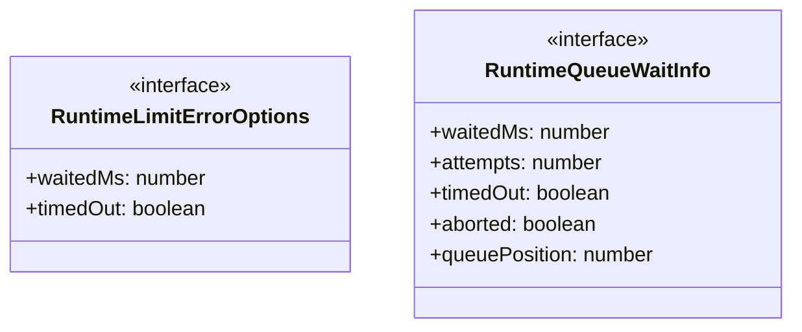
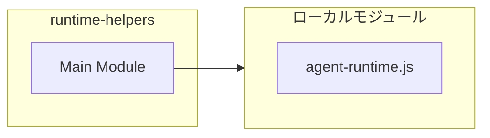
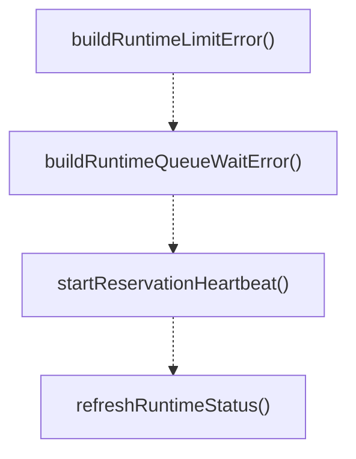

# runtime-helpers

## 概要

`runtime-helpers` モジュールのAPIリファレンス。

## インポート

```typescript
import { getRuntimeSnapshot, RuntimeCapacityReservationLease } from '../agent-runtime.js';
```

## エクスポート一覧

| 種別 | 名前 | 説明 |
|------|------|------|
| 関数 | `buildRuntimeLimitError` | Build an error message for runtime limit reached c |
| 関数 | `buildRuntimeQueueWaitError` | Build an error message for orchestration queue wai |
| 関数 | `startReservationHeartbeat` | Start a heartbeat timer to keep a reservation aliv |
| 関数 | `refreshRuntimeStatus` | Refresh runtime status display in the UI. |
| インターフェース | `RuntimeLimitErrorOptions` | Options for building runtime limit error messages. |
| インターフェース | `RuntimeQueueWaitInfo` | Queue wait information for building queue wait err |

## 図解

### クラス図



### 依存関係図



### 関数フロー



### シーケンス図


## 関数

### buildRuntimeLimitError

```typescript
buildRuntimeLimitError(toolName: string, reasons: string[], options?: RuntimeLimitErrorOptions): string
```

Build an error message for runtime limit reached conditions.

**パラメータ**

| 名前 | 型 | 必須 |
|------|-----|------|
| toolName | `string` | はい |
| reasons | `string[]` | はい |
| options | `RuntimeLimitErrorOptions` | いいえ |

**戻り値**: `string`

### buildRuntimeQueueWaitError

```typescript
buildRuntimeQueueWaitError(toolName: string, queueWait: RuntimeQueueWaitInfo): string
```

Build an error message for orchestration queue wait conditions.

**パラメータ**

| 名前 | 型 | 必須 |
|------|-----|------|
| toolName | `string` | はい |
| queueWait | `RuntimeQueueWaitInfo` | はい |

**戻り値**: `string`

### startReservationHeartbeat

```typescript
startReservationHeartbeat(reservation: RuntimeCapacityReservationLease): () => void
```

Start a heartbeat timer to keep a reservation alive during long-running operations.

**パラメータ**

| 名前 | 型 | 必須 |
|------|-----|------|
| reservation | `RuntimeCapacityReservationLease` | はい |

**戻り値**: `() => void`

### refreshRuntimeStatus

```typescript
refreshRuntimeStatus(ctx: any, statusKey: "subagent-runtime" | "agent-team-runtime", primaryLabel: string, primaryActive: number, secondaryLabel: string, secondaryActive: number): void
```

Refresh runtime status display in the UI.

**パラメータ**

| 名前 | 型 | 必須 |
|------|-----|------|
| ctx | `any` | はい |
| statusKey | `"subagent-runtime" | "agent-team-runtime"` | はい |
| primaryLabel | `string` | はい |
| primaryActive | `number` | はい |
| secondaryLabel | `string` | はい |
| secondaryActive | `number` | はい |

**戻り値**: `void`

## インターフェース

### RuntimeLimitErrorOptions

```typescript
interface RuntimeLimitErrorOptions {
  waitedMs?: number;
  timedOut?: boolean;
}
```

Options for building runtime limit error messages.

### RuntimeQueueWaitInfo

```typescript
interface RuntimeQueueWaitInfo {
  waitedMs: number;
  attempts: number;
  timedOut: boolean;
  aborted: boolean;
  queuePosition: number;
  queuedAhead: number;
}
```

Queue wait information for building queue wait error messages.

---
*自動生成: 2026-02-17T22:24:18.862Z*
