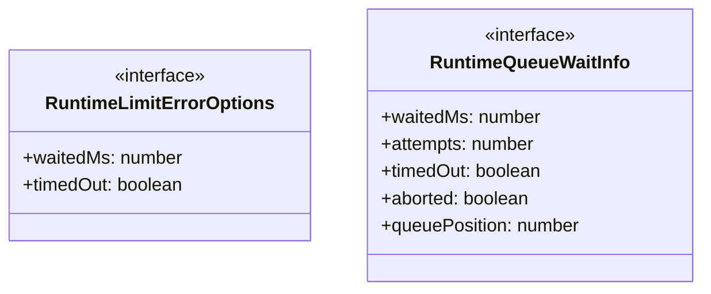
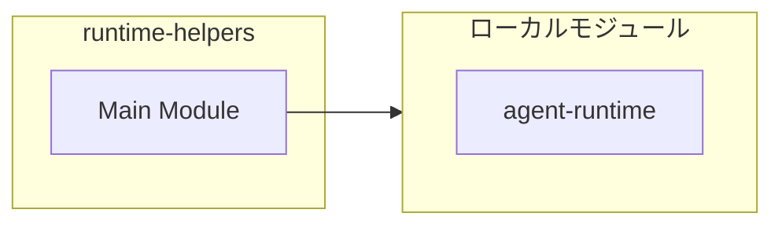
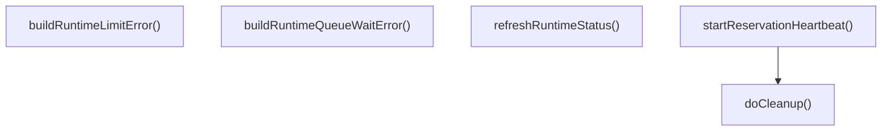
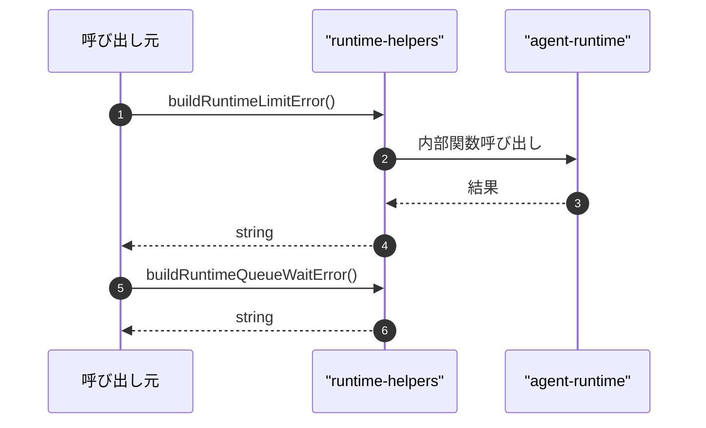

# runtime-helpers

## 概要

`runtime-helpers` モジュールのAPIリファレンス。

## インポート

```typescript
// from '../agent-runtime.js': getRuntimeSnapshot, RuntimeCapacityReservationLease
```

## エクスポート一覧

| 種別 | 名前 | 説明 |
|------|------|------|
| 関数 | `buildRuntimeLimitError` | 実行制限エラーメッセージ生成 |
| 関数 | `buildRuntimeQueueWaitError` | キューウェイトエラーを生成 |
| 関数 | `startReservationHeartbeat` | 予約ハートビート開始 |
| 関数 | `refreshRuntimeStatus` | ランタイムステータス更新 |
| インターフェース | `RuntimeLimitErrorOptions` | 実行時制限エラーオプション |
| インターフェース | `RuntimeQueueWaitInfo` | 実行時キューウェイト情報 |

## 図解

### クラス図



### 依存関係図



### 関数フロー



### シーケンス図



## 関数

### buildRuntimeLimitError

```typescript
buildRuntimeLimitError(toolName: string, reasons: string[], options?: RuntimeLimitErrorOptions): string
```

実行制限エラーメッセージ生成

**パラメータ**

| 名前 | 型 | 必須 |
|------|-----|------|
| toolName | `string` | はい |
| reasons | `string[]` | はい |
| options | `RuntimeLimitErrorOptions` | いいえ |

**戻り値**: `string`

### buildRuntimeQueueWaitError

```typescript
buildRuntimeQueueWaitError(toolName: string, queueWait: RuntimeQueueWaitInfo): string
```

キューウェイトエラーを生成

**パラメータ**

| 名前 | 型 | 必須 |
|------|-----|------|
| toolName | `string` | はい |
| queueWait | `RuntimeQueueWaitInfo` | はい |

**戻り値**: `string`

### startReservationHeartbeat

```typescript
startReservationHeartbeat(reservation: RuntimeCapacityReservationLease): () => void
```

予約ハートビート開始

**パラメータ**

| 名前 | 型 | 必須 |
|------|-----|------|
| reservation | `RuntimeCapacityReservationLease` | はい |

**戻り値**: `() => void`

### doCleanup

```typescript
doCleanup(): void
```

**戻り値**: `void`

### refreshRuntimeStatus

```typescript
refreshRuntimeStatus(ctx: any, statusKey: "subagent-runtime" | "agent-team-runtime", primaryLabel: string, primaryActive: number, secondaryLabel: string, secondaryActive: number): void
```

ランタイムステータス更新

**パラメータ**

| 名前 | 型 | 必須 |
|------|-----|------|
| ctx | `any` | はい |
| statusKey | `"subagent-runtime" | "agent-team-runtime"` | はい |
| primaryLabel | `string` | はい |
| primaryActive | `number` | はい |
| secondaryLabel | `string` | はい |
| secondaryActive | `number` | はい |

**戻り値**: `void`

## インターフェース

### RuntimeLimitErrorOptions

```typescript
interface RuntimeLimitErrorOptions {
  waitedMs?: number;
  timedOut?: boolean;
}
```

実行時制限エラーオプション

### RuntimeQueueWaitInfo

```typescript
interface RuntimeQueueWaitInfo {
  waitedMs: number;
  attempts: number;
  timedOut: boolean;
  aborted: boolean;
  queuePosition: number;
  queuedAhead: number;
}
```

実行時キューウェイト情報

---
*自動生成: 2026-02-22T19:27:00.470Z*
