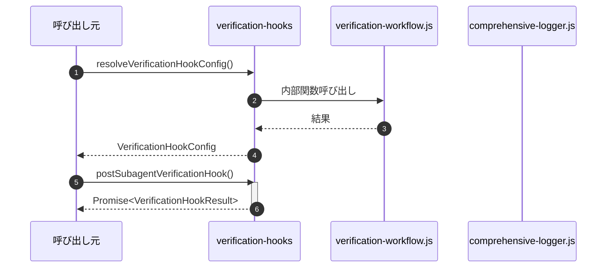

# verification-hooks

## 概要

`verification-hooks` モジュールのAPIリファレンス。

## インポート

```typescript
import { shouldTriggerVerification, buildInspectorPrompt, buildChallengerPrompt... } from '../../lib/verification-workflow.js';
import { getLogger } from '../../lib/comprehensive-logger.js';
import { OperationType } from '../../lib/comprehensive-logger-types.js';
```

## エクスポート一覧

| 種別 | 名前 | 説明 |
|------|------|------|
| 関数 | `resolveVerificationHookConfig` | 検証フック設定を解決 |
| 関数 | `postSubagentVerificationHook` | サブエージェント実行後の検証フック |
| 関数 | `postTeamVerificationHook` | チーム実行後の検証フック |
| 関数 | `formatVerificationResult` | 検証結果をログ出力用にフォーマット |
| インターフェース | `VerificationHookConfig` | 検証フック設定 |
| インターフェース | `VerificationHookResult` | 検証フックの結果 |

## 図解

### クラス図


### 依存関係図


### 関数フロー


### シーケンス図



## 関数

### resolveVerificationHookConfig

```typescript
resolveVerificationHookConfig(): VerificationHookConfig
```

検証フック設定を解決

**戻り値**: `VerificationHookConfig`

### postSubagentVerificationHook

```typescript
async postSubagentVerificationHook(output: string, confidence: number, context: {
    agentId: string;
    task: string;
  }, runVerificationAgent: (agentId: string, prompt: string) => Promise<string>): Promise<VerificationHookResult>
```

サブエージェント実行後の検証フック
subagents.tsから呼び出される

**パラメータ**

| 名前 | 型 | 必須 |
|------|-----|------|
| output | `string` | はい |
| confidence | `number` | はい |
| context | `{
    agentId: string;
    task: string;
  }` | はい |
| runVerificationAgent | `(agentId: string, prompt: string) => Promise<string>` | はい |

**戻り値**: `Promise<VerificationHookResult>`

### postTeamVerificationHook

```typescript
async postTeamVerificationHook(aggregatedOutput: string, confidence: number, context: {
    teamId: string;
    task: string;
    memberOutputs: Array<{ agentId: string; output: string }>;
  }, runVerificationAgent: (agentId: string, prompt: string) => Promise<string>): Promise<VerificationHookResult>
```

チーム実行後の検証フック
agent-teams.tsから呼び出される

**パラメータ**

| 名前 | 型 | 必須 |
|------|-----|------|
| aggregatedOutput | `string` | はい |
| confidence | `number` | はい |
| context | `{
    teamId: string;
    task: string;
    memberOutputs: Array<{ agentId: string; output: string }>;
  }` | はい |
| runVerificationAgent | `(agentId: string, prompt: string) => Promise<string>` | はい |

**戻り値**: `Promise<VerificationHookResult>`

### buildTeamVerificationContext

```typescript
buildTeamVerificationContext(aggregatedOutput: string, memberOutputs: Array<{ agentId: string; output: string }>): string
```

チーム検証コンテキストを構築

**パラメータ**

| 名前 | 型 | 必須 |
|------|-----|------|
| aggregatedOutput | `string` | はい |
| memberOutputs | `Array<{ agentId: string; output: string }>` | はい |

**戻り値**: `string`

### truncateOutput

```typescript
truncateOutput(output: string, maxLength: number): string
```

出力を切り詰め

**パラメータ**

| 名前 | 型 | 必須 |
|------|-----|------|
| output | `string` | はい |
| maxLength | `number` | はい |

**戻り値**: `string`

### parseInspectorOutput

```typescript
parseInspectorOutput(rawOutput: string): InspectorOutput
```

Inspector出力をパース

**パラメータ**

| 名前 | 型 | 必須 |
|------|-----|------|
| rawOutput | `string` | はい |

**戻り値**: `InspectorOutput`

### parseChallengerOutput

```typescript
parseChallengerOutput(rawOutput: string): ChallengerOutput
```

Challenger出力をパース

**パラメータ**

| 名前 | 型 | 必須 |
|------|-----|------|
| rawOutput | `string` | はい |

**戻り値**: `ChallengerOutput`

### formatVerificationResult

```typescript
formatVerificationResult(result: VerificationHookResult): string
```

検証結果をログ出力用にフォーマット

**パラメータ**

| 名前 | 型 | 必須 |
|------|-----|------|
| result | `VerificationHookResult` | はい |

**戻り値**: `string`

## インターフェース

### VerificationHookConfig

```typescript
interface VerificationHookConfig {
  enabled: boolean;
  mode: "disabled" | "minimal" | "auto" | "strict";
  runInspector: boolean;
  runChallenger: boolean;
  logResults: boolean;
}
```

検証フック設定

### VerificationHookResult

```typescript
interface VerificationHookResult {
  triggered: boolean;
  result?: VerificationResult;
  inspectorRun?: boolean;
  challengerRun?: boolean;
  error?: string;
}
```

検証フックの結果

---
*自動生成: 2026-02-17T21:54:59.716Z*
