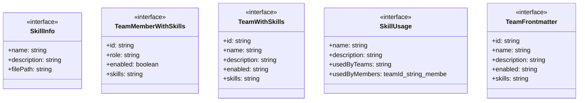
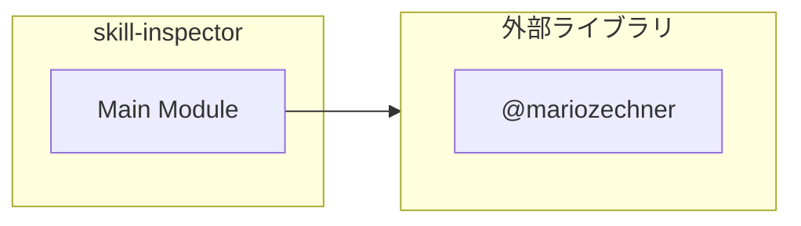

# skill-inspector

## 概要

`skill-inspector` モジュールのAPIリファレンス。

## インポート

```typescript
import { readdirSync, existsSync, readFileSync } from 'node:fs';
import { join, basename } from 'node:path';
import { parseFrontmatter } from '@mariozechner/pi-coding-agent';
import { ExtensionAPI } from '@mariozechner/pi-coding-agent';
import { ExtensionAPI } from '@mariozechner/pi-coding-agent';
```

## エクスポート一覧

| 種別 | 名前 | 説明 |
|------|------|------|

## 図解

### クラス図



### 依存関係図



## 関数

### loadAvailableSkills

```typescript
loadAvailableSkills(): Map<string, SkillInfo>
```

Load all available skills from .pi/lib/skills/

**戻り値**: `Map<string, SkillInfo>`

### loadTeamDefinitions

```typescript
loadTeamDefinitions(): TeamWithSkills[]
```

Load team definitions with skill assignments

**戻り値**: `TeamWithSkills[]`

### calculateSkillUsage

```typescript
calculateSkillUsage(skills: Map<string, SkillInfo>, teams: TeamWithSkills[]): Map<string, SkillUsage>
```

Calculate skill usage across all teams

**パラメータ**

| 名前 | 型 | 必須 |
|------|-----|------|
| skills | `Map<string, SkillInfo>` | はい |
| teams | `TeamWithSkills[]` | はい |

**戻り値**: `Map<string, SkillUsage>`

### formatSkillsOverviewPlain

```typescript
formatSkillsOverviewPlain(skills: Map<string, SkillInfo>, usage: Map<string, SkillUsage>): string
```

Format skills overview - Plain text version for command output

**パラメータ**

| 名前 | 型 | 必須 |
|------|-----|------|
| skills | `Map<string, SkillInfo>` | はい |
| usage | `Map<string, SkillUsage>` | はい |

**戻り値**: `string`

### formatTeamDetailPlain

```typescript
formatTeamDetailPlain(team: TeamWithSkills): string
```

Format team detail - Plain text version for command output

**パラメータ**

| 名前 | 型 | 必須 |
|------|-----|------|
| team | `TeamWithSkills` | はい |

**戻り値**: `string`

### formatSkillDetailPlain

```typescript
formatSkillDetailPlain(skill: SkillInfo, usage: SkillUsage): string
```

Format skill detail - Plain text version for command output

**パラメータ**

| 名前 | 型 | 必須 |
|------|-----|------|
| skill | `SkillInfo` | はい |
| usage | `SkillUsage` | はい |

**戻り値**: `string`

### formatTeamsViewPlain

```typescript
formatTeamsViewPlain(teams: TeamWithSkills[]): string
```

Format teams view - Plain text version for command output

**パラメータ**

| 名前 | 型 | 必須 |
|------|-----|------|
| teams | `TeamWithSkills[]` | はい |

**戻り値**: `string`

### formatSkillsOverview

```typescript
formatSkillsOverview(skills: Map<string, SkillInfo>, usage: Map<string, SkillUsage>): string
```

Format skills overview (markdown for tool output)

**パラメータ**

| 名前 | 型 | 必須 |
|------|-----|------|
| skills | `Map<string, SkillInfo>` | はい |
| usage | `Map<string, SkillUsage>` | はい |

**戻り値**: `string`

### formatTeamsView

```typescript
formatTeamsView(teams: TeamWithSkills[]): string
```

Format team skills view

**パラメータ**

| 名前 | 型 | 必須 |
|------|-----|------|
| teams | `TeamWithSkills[]` | はい |

**戻り値**: `string`

### formatTeamDetail

```typescript
formatTeamDetail(team: TeamWithSkills): string
```

Format single team detail

**パラメータ**

| 名前 | 型 | 必須 |
|------|-----|------|
| team | `TeamWithSkills` | はい |

**戻り値**: `string`

### formatSkillDetail

```typescript
formatSkillDetail(skill: SkillInfo, usage: SkillUsage): string
```

Format skill detail

**パラメータ**

| 名前 | 型 | 必須 |
|------|-----|------|
| skill | `SkillInfo` | はい |
| usage | `SkillUsage` | はい |

**戻り値**: `string`

## インターフェース

### SkillInfo

```typescript
interface SkillInfo {
  name: string;
  description: string;
  filePath: string;
}
```

### TeamMemberWithSkills

```typescript
interface TeamMemberWithSkills {
  id: string;
  role: string;
  enabled: boolean;
  skills: string[];
}
```

### TeamWithSkills

```typescript
interface TeamWithSkills {
  id: string;
  name: string;
  description: string;
  enabled: string;
  skills: string[];
  members: TeamMemberWithSkills[];
  hasSkills?: boolean;
}
```

### SkillUsage

```typescript
interface SkillUsage {
  name: string;
  description: string;
  usedByTeams: string[];
  usedByMembers: { teamId: string; memberId: string }[];
}
```

### TeamFrontmatter

```typescript
interface TeamFrontmatter {
  id?: string;
  name?: string;
  description?: string;
  enabled?: string;
  skills?: string[];
  members?: Array<{
    id?: string;
    role?: string;
    enabled?: boolean;
    skills?: string[];
  }>;
}
```

---
*自動生成: 2026-02-18T07:48:44.722Z*
