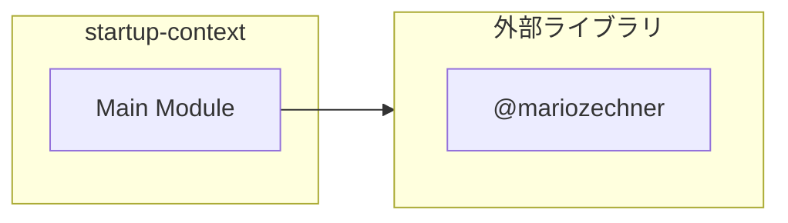

# startup-context

## 概要

`startup-context` モジュールのAPIリファレンス。

## インポート

```typescript
// from 'node:child_process': execSync
// from 'node:fs': existsSync, readFileSync
// from '@mariozechner/pi-coding-agent': ExtensionAPI
```

## エクスポート一覧

| 種別 | 名前 | 説明 |
|------|------|------|

## 図解

### 依存関係図



---
*自動生成: 2026-02-24T17:08:02.486Z*
