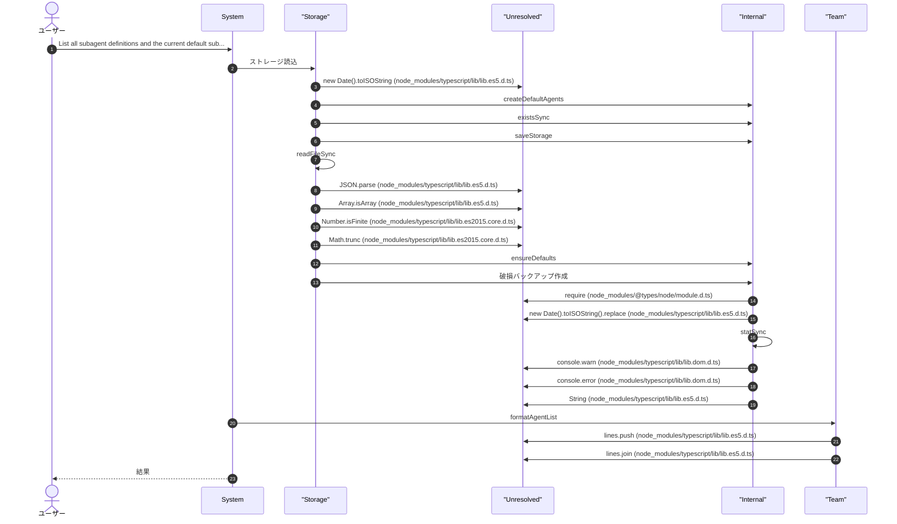
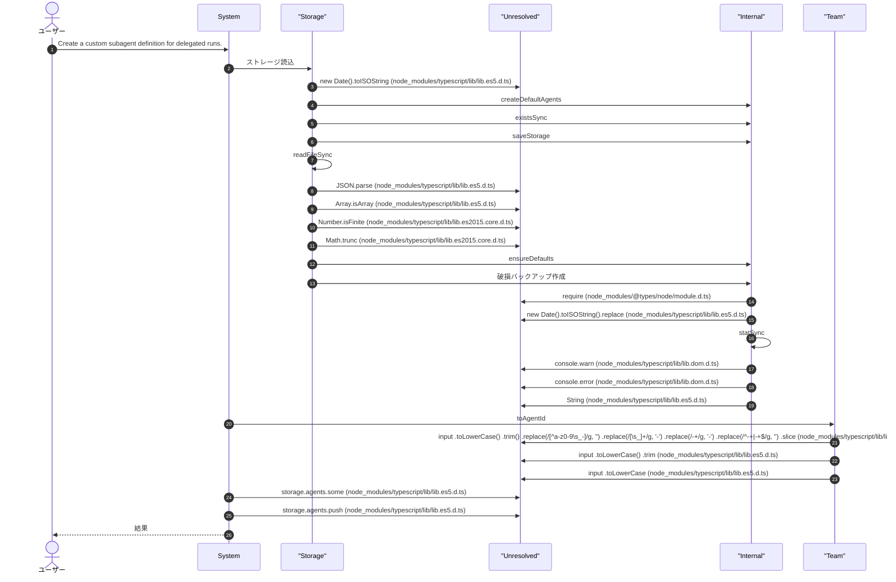
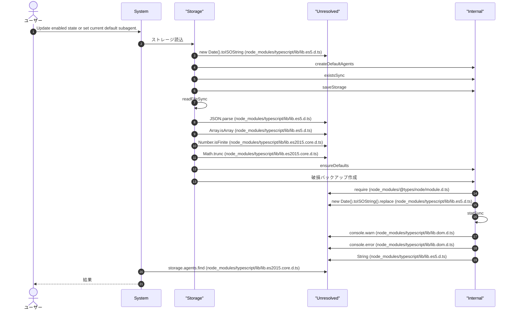
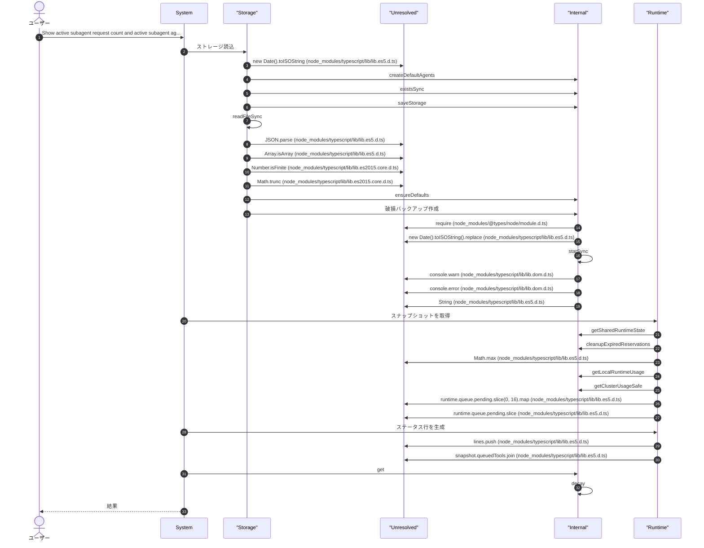
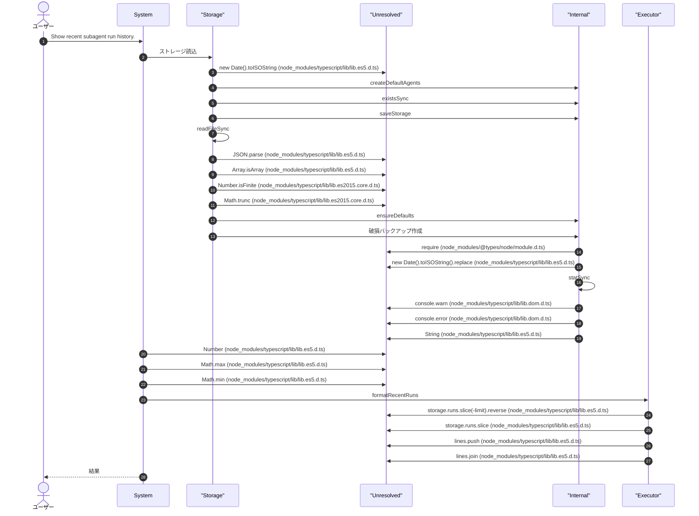
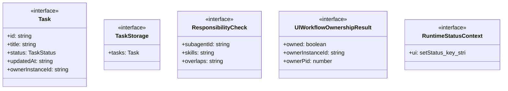
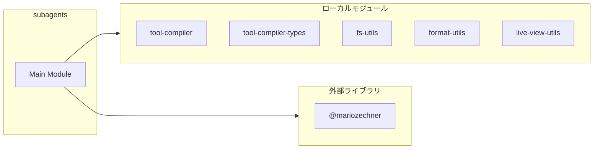
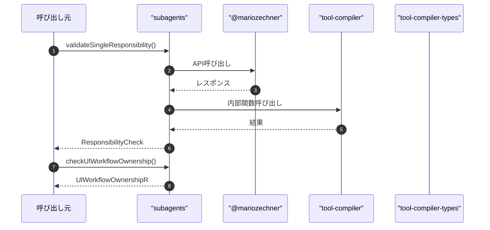

# subagents

## 概要

`subagents` モジュールのAPIリファレンス。

## インポート

```typescript
// from 'node:fs': readdirSync, unlinkSync, writeFileSync, ...
// from 'node:path': basename, join
// from '@mariozechner/pi-ai': Type
// from './tool-compiler.js': integrateWithSubagents
// from '../lib/tool-compiler-types.js': ToolCall
// ... and 40 more imports
```

## エクスポート一覧

| 種別 | 名前 | 説明 |
|------|------|------|
| 関数 | `validateSingleResponsibility` | サブエージェント間でスキル（責任）の重複を検出する |
| 関数 | `checkUlWorkflowOwnership` | ULワークフローの所有権を確認する |
| 関数 | `resetForTesting` | テスト用のリセット関数 |
| 関数 | `registerSubagentExtension` | - |
| インターフェース | `ResponsibilityCheck` | 責任重複チェック結果 |
| インターフェース | `UlWorkflowOwnershipResult` | ULワークフローの所有権チェック結果 |

## ユーザーフロー

このモジュールが提供するツールと、その実行フローを示します。

### subagent_list

List all subagent definitions and the current default subagent.



### subagent_create

Create a custom subagent definition for delegated runs.



### subagent_configure

Update enabled state or set current default subagent.



### subagent_run

Run one focused delegated task with one subagent. Use this as a single-specialist fallback when subagent_run_parallel with 2+ specialists is not needed.

```mermaid
sequenceDiagram
  autonumber
  actor User as ユーザー
  participant System as System
  participant Judge as "Judge"
  participant Storage as "Storage"
  participant Internal as "Internal"
  participant Unresolved as "Unresolved"
  participant LLM as "LLM"
  participant Executor as "Executor"
  participant Runtime as "Runtime"
  participant Team as "Team"

  User->>System: Run one focused delegated task with one subagent. Use thi...
  System->>Judge: UL所有権確認
  Judge->>Storage: 状態を読み込む
  Storage->>Internal: join
  Storage->>Internal: getTaskDir
  Storage->>Storage: readFileSync
  Storage->>Unresolved: JSON.parse (node_modules/typescript/lib/lib.es5.d.ts)
  Judge->>Internal: ID取得
  Judge->>LLM: PID抽出
  LLM->>Unresolved: instanceId.match (node_modules/typescript/lib/lib.es5.d.ts)
  LLM->>Unresolved: Number (node_modules/typescript/lib/lib.es5.d.ts)
  LLM->>Unresolved: Number.isInteger (node_modules/typescript/lib/lib.es2015.core.d.ts)
  Judge->>Executor: プロセス生存確認
  Executor->>Unresolved: process.kill (node_modules/@types/node/process.d.ts)
  System->>Internal: タスク進行中設定
  Internal->>Storage: タスクストレージ読込
  Storage->>Internal: existsSync
  Internal->>Unresolved: storage.tasks.find (node_modules/typescript/lib/lib.es2015.core.d.ts)
  Internal->>Unresolved: new Date().toISOString (node_modules/typescript/lib/lib.es5.d.ts)
  Internal->>Storage: タスクストレージ保存
  Storage->>Unresolved: process.cwd (node_modules/@types/node/process.d.ts)
  Storage->>Internal: mkdirSync
  Storage->>Storage: writeFileSync
  Storage->>Unresolved: JSON.stringify (node_modules/typescript/lib/lib.es5.d.ts)
  Storage->>Unresolved: console.error (node_modules/typescript/lib/lib.dom.d.ts)
  System->>Storage: ストレージ読込
  Storage->>Internal: createDefaultAgents
  Storage->>Internal: saveStorage
  Storage->>Unresolved: Array.isArray (node_modules/typescript/lib/lib.es5.d.ts)
  Storage->>Unresolved: Number.isFinite (node_modules/typescript/lib/lib.es2015.core.d.ts)
  Storage->>Unresolved: Math.trunc (node_modules/typescript/lib/lib.es2015.core.d.ts)
  Storage->>Internal: ensureDefaults
  Storage->>Internal: 破損バックアップ作成
  Internal->>Unresolved: require (node_modules/@types/node/module.d.ts)
  Internal->>Unresolved: new Date().toISOString().replace (node_modules/typescript/lib/lib.es5.d.ts)
  Internal->>Internal: statSync
  Internal->>Unresolved: console.warn (node_modules/typescript/lib/lib.dom.d.ts)
  Internal->>Unresolved: String (node_modules/typescript/lib/lib.es5.d.ts)
  System->>LLM: pickAgent
  System->>Internal: toRetryOverrides
  System->>Unresolved: logger.startOperation (.pi/lib/comprehensive-logger.ts)
  System->>Internal: セッションID生成
  Internal->>Unresolved: Date.now (node_modules/typescript/lib/lib.es5.d.ts)
  System->>Runtime: スナップショットを取得
  Runtime->>Internal: getSharedRuntimeState
  Runtime->>Internal: cleanupExpiredReservations
  Runtime->>Unresolved: Math.max (node_modules/typescript/lib/lib.es5.d.ts)
  Runtime->>Internal: getLocalRuntimeUsage
  Runtime->>Internal: getClusterUsageSafe
  Runtime->>Unresolved: runtime.queue.pending.slice(0, 16).map (node_modules/typescript/lib/lib.es5.d.ts)
  Runtime->>Unresolved: runtime.queue.pending.slice (node_modules/typescript/lib/lib.es5.d.ts)
  System->>Runtime: acquireRuntimeDispatchPermit
  Runtime->>Internal: normalizePositiveInt
  Runtime->>Internal: clampPlannedCount
  Runtime->>Internal: createRuntimeQueueEntryId
  Runtime->>Internal: runtimeNow
  Runtime->>Internal: 優先度推論
  Internal->>Unresolved: toolName.toLowerCase().trim (node_modules/typescript/lib/lib.es5.d.ts)
  Internal->>Unresolved: toolName.toLowerCase (node_modules/typescript/lib/lib.es5.d.ts)
  Internal->>Unresolved: normalized.startsWith (node_modules/typescript/lib/lib.es2015.core.d.ts)
  Runtime->>Internal: validateToolName
  Runtime->>Internal: toQueueClass
  Runtime->>Internal: trimPendingQueueToLimit
  Runtime->>Unresolved: runtime.queue.pending.push (node_modules/typescript/lib/lib.es5.d.ts)
  Runtime->>Internal: sortQueueByPriority
  Runtime->>Internal: updatePriorityStats
  Runtime->>Internal: notifyRuntimeCapacityChanged
  Runtime->>Unresolved: runtime.queue.pending.findIndex (node_modules/typescript/lib/lib.es2015.core.d.ts)
  Runtime->>Internal: findDispatchableQueueEntry
  Runtime->>Internal: tryReserveRuntimeCapacity
  Runtime->>Internal: removeQueuedEntry
  Runtime->>Unresolved: reservationAttempt.reservation?.consume (.pi/lib/runtime-types.ts)
  Runtime->>Unresolved: reservationAttempt.reservation?.heartbeat (.pi/lib/runtime-types.ts)
  Runtime->>Unresolved: reservationAttempt.reservation?.release (.pi/lib/runtime-types.ts)
  Runtime->>Internal: promoteStarvingEntries
  Runtime->>Internal: checkRuntimeCapacity
  Runtime->>Internal: computeBackoffDelay
  Runtime->>Unresolved: Math.min (node_modules/typescript/lib/lib.es5.d.ts)
  Runtime->>Internal: waitForRuntimeCapacityEvent
  Runtime->>Internal: wait
  System->>Runtime: 実行制限エラー生成
  Runtime->>Unresolved: [     `${toolName} blocked: runtime limit reached.`,     ...reasons.map((reason) => `- ${reason}`),     `現在: requests=${snapshot.totalActiveRequests}, llm=${snapshot.totalActiveLlm}`,     `上限: requests=${snapshot.limits.maxTotalActiveRequests}, llm=${snapshot.limits.maxTotalActiveLlm}`,     waitLine,     'ヒント: 対象数を減らすか、実行中ジョブの完了を待って再実行してください。',   ]     .filter (node_modules/typescript/lib/lib.es5.d.ts)
  Runtime->>Unresolved: Boolean (node_modules/typescript/lib/lib.es5.d.ts)
  System->>Unresolved: logger.endOperation (.pi/lib/comprehensive-logger.ts)
  System->>Executor: ハートビート開始
  Executor->>Internal: setInterval
  Executor->>Internal: clearInterval
  Executor->>Unresolved: timer.unref (node_modules/@types/node/timers.d.ts)
  Executor->>Unresolved: registry.unregister (node_modules/typescript/lib/lib.es2021.weakref.d.ts)
  Executor->>Internal: doCleanup
  Executor->>Unresolved: registry.register (node_modules/typescript/lib/lib.es2021.weakref.d.ts)
  System->>Judge: タイムアウト時間を解決
  Judge->>Internal: モデル別タイムアウト
  Internal->>Internal: getModelBaseTimeoutMs
  Internal->>Unresolved: Math.floor (node_modules/typescript/lib/lib.es5.d.ts)
  Judge->>Internal: タイムアウトを正規化
  Internal->>Internal: toFiniteNumber
  System->>Unresolved: getCostEstimator().estimate (.pi/lib/cost-estimator.ts)
  System->>Internal: コスト推定インスタンス取得
  System->>Internal: debugCostEstimation
  Internal->>Unresolved: Object.entries (node_modules/typescript/lib/lib.es2017.object.d.ts)
  System->>Unresolved: costEstimate.confidence.toFixed (node_modules/typescript/lib/lib.es5.d.ts)
  System->>Team: 監視コントローラ作成
  Team->>Internal: clearTimeout
  Team->>Unresolved: items.some (node_modules/typescript/lib/lib.es5.d.ts)
  Team->>Internal: clearPollTimer
  Team->>Internal: hasRunningItems
  Team->>Internal: queueRender
  Team->>Internal: setTimeout
  Team->>Internal: clearRenderTimer
  Team->>Unresolved: ctx.ui     .custom((tui: TuiInstance, theme: Theme, _keybindings: KeybindingMap, done: () => void) => {       doneUi = done;       requestRender = () => {         if (!closed) {           tui.requestRender();         }       };        // 初期レンダリングとポーリング開始を即座に行う       // UIセットアップ完了後、メンバー実行開始を待たずにポーリングを開始       // これにより経過時間の秒数更新や状態表示が遅延なく行われる       setTimeout(() => {         if (!closed) {           queueRender();           startPolling();         }       }, 0);        return {         render: (width: number) =>           renderSubagentLiveView({             title: input.title,             items,             cursor,             mode,             stream,             width,             height: tui.terminal.rows,             theme,           }),         invalidate: () => {},         handleInput: (rawInput: string) => {           if (matchesKey(rawInput, 'q')) {             close();             return;           }            if (matchesKey(rawInput, Key.escape)) {             if (mode === 'detail' || mode === 'timeline') {               mode = 'list';               queueRender();               return;             }             close();             return;           }            if (rawInput === 'j' || matchesKey(rawInput, Key.down)) {             cursor = Math.min(items.length - 1, cursor + 1);             queueRender();             return;           }            if (rawInput === 'k' || matchesKey(rawInput, Key.up)) {             cursor = Math.max(0, cursor - 1);             queueRender();             return;           }            if (rawInput === 'g') {             cursor = 0;             queueRender();             return;           }            if (rawInput === 'G') {             cursor = Math.max(0, items.length - 1);             queueRender();             return;           }            if (mode === 'list' && isEnterInput(rawInput)) {             mode = 'detail';             queueRender();             return;           }            if ((mode === 'list' || mode === 'detail') && (rawInput === 't' || rawInput === 'T')) {             mode = 'timeline';             queueRender();             return;           }            if ((mode === 'list' || mode === 'detail' || mode === 'timeline') && (rawInput === 'v' || rawInput === 'V')) {             mode = 'gantt';             queueRender();             return;           }            if (mode === 'timeline' && (rawInput === 'b' || rawInput === 'B')) {             mode = 'list';             queueRender();             return;           }            if (mode === 'detail' && (rawInput === 'b' || rawInput === 'B')) {             mode = 'list';             queueRender();             return;           }            if (mode === 'timeline' && matchesKey(rawInput, Key.escape)) {             mode = 'list';             queueRender();             return;           }            if (mode === 'gantt' && (rawInput === 'b' || rawInput === 'B')) {             mode = 'list';             queueRender();             return;           }            if (mode === 'gantt' && (rawInput === 't' || rawInput === 'T')) {             mode = 'timeline';             queueRender();             return;           }            if (mode === 'gantt' && matchesKey(rawInput, Key.escape)) {             mode = 'list';             queueRender();             return;           }            if (rawInput === '\t' || rawInput === 'tab') {             stream = stream === 'stdout' ? 'stderr' : 'stdout';             queueRender();             return;           }         },       };     }, {       overlay: true,       overlayOptions: () => ({         width: '100%',         maxHeight: '100%',         row: 0,         col: 0,         margin: 0,       }),     })     .catch(() => undefined)     .finally (node_modules/typescript/lib/lib.es2018.promise.d.ts)
  Team->>Unresolved: ctx.ui     .custom((tui: TuiInstance, theme: Theme, _keybindings: KeybindingMap, done: () => void) => {       doneUi = done;       requestRender = () => {         if (!closed) {           tui.requestRender();         }       };        // 初期レンダリングとポーリング開始を即座に行う       // UIセットアップ完了後、メンバー実行開始を待たずにポーリングを開始       // これにより経過時間の秒数更新や状態表示が遅延なく行われる       setTimeout(() => {         if (!closed) {           queueRender();           startPolling();         }       }, 0);        return {         render: (width: number) =>           renderSubagentLiveView({             title: input.title,             items,             cursor,             mode,             stream,             width,             height: tui.terminal.rows,             theme,           }),         invalidate: () => {},         handleInput: (rawInput: string) => {           if (matchesKey(rawInput, 'q')) {             close();             return;           }            if (matchesKey(rawInput, Key.escape)) {             if (mode === 'detail' || mode === 'timeline') {               mode = 'list';               queueRender();               return;             }             close();             return;           }            if (rawInput === 'j' || matchesKey(rawInput, Key.down)) {             cursor = Math.min(items.length - 1, cursor + 1);             queueRender();             return;           }            if (rawInput === 'k' || matchesKey(rawInput, Key.up)) {             cursor = Math.max(0, cursor - 1);             queueRender();             return;           }            if (rawInput === 'g') {             cursor = 0;             queueRender();             return;           }            if (rawInput === 'G') {             cursor = Math.max(0, items.length - 1);             queueRender();             return;           }            if (mode === 'list' && isEnterInput(rawInput)) {             mode = 'detail';             queueRender();             return;           }            if ((mode === 'list' || mode === 'detail') && (rawInput === 't' || rawInput === 'T')) {             mode = 'timeline';             queueRender();             return;           }            if ((mode === 'list' || mode === 'detail' || mode === 'timeline') && (rawInput === 'v' || rawInput === 'V')) {             mode = 'gantt';             queueRender();             return;           }            if (mode === 'timeline' && (rawInput === 'b' || rawInput === 'B')) {             mode = 'list';             queueRender();             return;           }            if (mode === 'detail' && (rawInput === 'b' || rawInput === 'B')) {             mode = 'list';             queueRender();             return;           }            if (mode === 'timeline' && matchesKey(rawInput, Key.escape)) {             mode = 'list';             queueRender();             return;           }            if (mode === 'gantt' && (rawInput === 'b' || rawInput === 'B')) {             mode = 'list';             queueRender();             return;           }            if (mode === 'gantt' && (rawInput === 't' || rawInput === 'T')) {             mode = 'timeline';             queueRender();             return;           }            if (mode === 'gantt' && matchesKey(rawInput, Key.escape)) {             mode = 'list';             queueRender();             return;           }            if (rawInput === '\t' || rawInput === 'tab') {             stream = stream === 'stdout' ? 'stderr' : 'stdout';             queueRender();             return;           }         },       };     }, {       overlay: true,       overlayOptions: () => ({         width: '100%',         maxHeight: '100%',         row: 0,         col: 0,         margin: 0,       }),     })     .catch (node_modules/typescript/lib/lib.es5.d.ts)
  Team->>Unresolved: ctx.ui     .custom (.pi/lib/tui-types.ts)
  Team->>Unresolved: tui.requestRender (.pi/lib/tui-types.ts)
  Team->>Internal: startPolling
  Team->>Internal: renderSubagentLiveView
  Team->>Internal: matchesKey
  Team->>Internal: close
  Team->>Internal: Enterキー判定
  Team->>Unresolved: byId.get (node_modules/typescript/lib/lib.es2015.collection.d.ts)
  Team->>Internal: pushStateTransition
  Team->>Internal: 末尾にチャンク追加
  Team->>Unresolved: Buffer.byteLength (node_modules/@types/node/buffer.d.ts)
  Team->>Internal: 出現回数を数える
  Internal->>Unresolved: input.indexOf (node_modules/typescript/lib/lib.es5.d.ts)
  Team->>Unresolved: chunk.endsWith (node_modules/typescript/lib/lib.es2015.core.d.ts)
  Team->>Internal: classifyActivityFromChunk
  System->>Internal: セッション追加
  Internal->>Unresolved: activeSessions.set (node_modules/typescript/lib/lib.es2015.collection.d.ts)
  Internal->>Internal: emitSessionEvent
  System->>Runtime: refreshRuntimeStatus
  System->>Team: サブエージェントタスク実行
  Team->>Executor: 一意な実行IDを生成します。
  Executor->>Unresolved: now.getFullYear (node_modules/typescript/lib/lib.es5.d.ts)
  Executor->>Unresolved: String(now.getMonth() + 1).padStart (node_modules/typescript/lib/lib.es2017.string.d.ts)
  Executor->>Unresolved: now.getMonth (node_modules/typescript/lib/lib.es5.d.ts)
  Executor->>Unresolved: now.getDate (node_modules/typescript/lib/lib.es5.d.ts)
  Executor->>Unresolved: now.getHours (node_modules/typescript/lib/lib.es5.d.ts)
  Executor->>Unresolved: now.getMinutes (node_modules/typescript/lib/lib.es5.d.ts)
  Executor->>Unresolved: now.getSeconds (node_modules/typescript/lib/lib.es5.d.ts)
  Executor->>Unresolved: randomBytes(3).toString (node_modules/@types/node/buffer.d.ts)
  Executor->>Internal: randomBytes
  Team->>Unresolved: ensurePaths (.pi/extensions/subagents/storage.ts)
  Team->>Internal: プランモード判定
  Internal->>Internal: validatePlanModeState
  Team->>Internal: 関連パターンを検索
  Internal->>Internal: loadPatternStorage
  Internal->>Internal: キーワード抽出
  Internal->>Unresolved: stopWords.has (node_modules/typescript/lib/lib.es2015.collection.d.ts)
  Internal->>Unresolved: keywords.add (node_modules/typescript/lib/lib.es2015.collection.d.ts)
  Internal->>Unresolved: Array.from (node_modules/typescript/lib/lib.es2015.core.d.ts)
  Internal->>Internal: タスク分類
  Internal->>Unresolved: keywords.reduce (node_modules/typescript/lib/lib.es5.d.ts)
  Internal->>Unresolved: text.includes (node_modules/typescript/lib/lib.es2015.core.d.ts)
  Internal->>Unresolved: scored     .filter((s) => s.score > 0)     .sort (node_modules/typescript/lib/lib.es5.d.ts)
  Team->>Internal: buildSubagentPrompt
  Team->>Runtime: レート制限キー生成
  Team->>Unresolved: /429|rate\s*limit|too many requests/i.test (node_modules/typescript/lib/lib.es5.d.ts)
  Team->>Internal: isHighRiskTask
  Team->>Internal: バックオフ再試行実行
  Internal->>Internal: resolveRetryWithBackoffConfig
  Internal->>Internal: toOptionalNonNegativeInt
  Internal->>Internal: toOptionalPositiveInt
  Internal->>Internal: normalizeRateLimitKey
  Internal->>Internal: createRateLimitKeyScope
  Internal->>Internal: createAbortError
  Internal->>Judge: サーキットブレーカーをチェック
  Judge->>Internal: normalizeConfig
  Judge->>Internal: transitionTo
  Internal->>Runtime: 観測データを記録
  Runtime->>Internal: isAdaptiveEnabled
  Runtime->>Internal: withStateWriteLock
  Runtime->>Internal: nowMs
  Runtime->>Internal: updateBaseConstraints
  Runtime->>Internal: getDefaultBaseLimit
  Runtime->>Internal: toSafeObservation
  Runtime->>Internal: trimWindow
  Runtime->>Internal: maybeRunDecision
  Internal->>Unresolved: Promise.all (node_modules/typescript/lib/lib.es2015.iterable.d.ts)
  Internal->>Internal: getRateLimitGateSnapshot
  Internal->>Internal: selectLongestRateLimitGate
  Internal->>Internal: createRateLimitFastFailError
  Internal->>Internal: sleepWithAbort
  Internal->>Internal: registerRateLimitGateSuccess
  Internal->>Internal: 成功を記録
  Internal->>Internal: extractRetryStatusCode
  Internal->>Internal: isNetworkErrorRetryable
  Internal->>Internal: 失敗を記録
  Internal->>Internal: computeBackoffDelayMs
  Internal->>Internal: registerRateLimitGateHit
  Team->>Internal: スキーマ強制生成
  Internal->>Internal: parseStructuredOutput
  Internal->>Internal: validateAgainstSchema
  Internal->>Internal: sleep
  Team->>LLM: runPiPrintMode
  Team->>Internal: emitStderrChunk
  Team->>Internal: processOutputWithThreeLayerPipeline
  Team->>Internal: normalizeSubagentOutput
  Team->>Internal: isRetryableSubagentError
  Team->>Internal: エラーメッセージを整形
  Team->>Internal: エラーメッセージを抽出
  Team->>Internal: extractSummary
  Team->>Unresolved: console.log (node_modules/typescript/lib/lib.dom.d.ts)
  Team->>Team: Agent Run 失敗再評価
  Team->>Internal: parseToolFailureCount
  Team->>Internal: buildFailureSummary
  System->>Unresolved: liveMonitor?.markStarted (.pi/lib/subagent-types.ts)
  System->>Internal: セッション更新
  System->>Unresolved: liveMonitor?.appendChunk (.pi/lib/subagent-types.ts)
  System->>Unresolved: liveMonitor?.markFinished (.pi/lib/subagent-types.ts)
  System->>Storage: ストレージ保存
  System->>Unresolved: pi.appendEntry (node_modules/@mariozechner/pi-coding-agent/dist/core/extensions/types.d.ts)
  System->>Internal: メッセージから圧力エラーの種別を分類
  Internal->>Internal: extractStatusCodeFromMessage
  System->>Internal: raise
  Internal->>Internal: raiseWithReason
  System->>Internal: lower
  Internal->>Internal: decay
  System-->>User: 結果

```

### subagent_run_parallel

Run selected subagents in parallel. Strongly recommended when using subagents; pass explicit subagentIds with 2+ specialists for meaningful fan-out.

```mermaid
sequenceDiagram
  autonumber
  actor User as ユーザー
  participant System as System
  participant Judge as "Judge"
  participant Storage as "Storage"
  participant Internal as "Internal"
  participant Unresolved as "Unresolved"
  participant LLM as "LLM"
  participant Executor as "Executor"
  participant Runtime as "Runtime"
  participant Team as "Team"

  User->>System: Run selected subagents in parallel. Strongly recommended ...
  System->>Judge: UL所有権確認
  Judge->>Storage: 状態を読み込む
  Storage->>Internal: join
  Storage->>Internal: getTaskDir
  Storage->>Storage: readFileSync
  Storage->>Unresolved: JSON.parse (node_modules/typescript/lib/lib.es5.d.ts)
  Judge->>Internal: ID取得
  Judge->>LLM: PID抽出
  LLM->>Unresolved: instanceId.match (node_modules/typescript/lib/lib.es5.d.ts)
  LLM->>Unresolved: Number (node_modules/typescript/lib/lib.es5.d.ts)
  LLM->>Unresolved: Number.isInteger (node_modules/typescript/lib/lib.es2015.core.d.ts)
  Judge->>Executor: プロセス生存確認
  Executor->>Unresolved: process.kill (node_modules/@types/node/process.d.ts)
  System->>Internal: タスク進行中設定
  Internal->>Storage: タスクストレージ読込
  Storage->>Internal: existsSync
  Internal->>Unresolved: storage.tasks.find (node_modules/typescript/lib/lib.es2015.core.d.ts)
  Internal->>Unresolved: new Date().toISOString (node_modules/typescript/lib/lib.es5.d.ts)
  Internal->>Storage: タスクストレージ保存
  Storage->>Unresolved: process.cwd (node_modules/@types/node/process.d.ts)
  Storage->>Internal: mkdirSync
  Storage->>Storage: writeFileSync
  Storage->>Unresolved: JSON.stringify (node_modules/typescript/lib/lib.es5.d.ts)
  Storage->>Unresolved: console.error (node_modules/typescript/lib/lib.dom.d.ts)
  System->>Storage: ストレージ読込
  Storage->>Internal: createDefaultAgents
  Storage->>Internal: saveStorage
  Storage->>Unresolved: Array.isArray (node_modules/typescript/lib/lib.es5.d.ts)
  Storage->>Unresolved: Number.isFinite (node_modules/typescript/lib/lib.es2015.core.d.ts)
  Storage->>Unresolved: Math.trunc (node_modules/typescript/lib/lib.es2015.core.d.ts)
  Storage->>Internal: ensureDefaults
  Storage->>Internal: 破損バックアップ作成
  Internal->>Unresolved: require (node_modules/@types/node/module.d.ts)
  Internal->>Unresolved: new Date().toISOString().replace (node_modules/typescript/lib/lib.es5.d.ts)
  Internal->>Internal: statSync
  Internal->>Unresolved: console.warn (node_modules/typescript/lib/lib.dom.d.ts)
  Internal->>Unresolved: String (node_modules/typescript/lib/lib.es5.d.ts)
  System->>Internal: toRetryOverrides
  System->>Unresolved: Array.from (node_modules/typescript/lib/lib.es2015.core.d.ts)
  System->>Unresolved: params.subagentIds.map((id) => String(id).trim()).filter (node_modules/typescript/lib/lib.es5.d.ts)
  System->>Unresolved: params.subagentIds.map (node_modules/typescript/lib/lib.es5.d.ts)
  System->>Unresolved: String(id).trim (node_modules/typescript/lib/lib.es5.d.ts)
  System->>Unresolved: Boolean (node_modules/typescript/lib/lib.es5.d.ts)
  System->>LLM: pickDefaultParallelAgents
  LLM->>Unresolved: String(process.env.PI_SUBAGENT_PARALLEL_DEFAULT || 'all')     .trim()     .toLowerCase (node_modules/typescript/lib/lib.es5.d.ts)
  LLM->>Unresolved: enabledAgents.slice (node_modules/typescript/lib/lib.es5.d.ts)
  System->>Unresolved: storage.agents.some (node_modules/typescript/lib/lib.es5.d.ts)
  System->>Unresolved: logger.startOperation (.pi/lib/comprehensive-logger.ts)
  System->>Runtime: スナップショットを取得
  Runtime->>Internal: getSharedRuntimeState
  Runtime->>Internal: cleanupExpiredReservations
  Runtime->>Unresolved: Math.max (node_modules/typescript/lib/lib.es5.d.ts)
  Runtime->>Internal: getLocalRuntimeUsage
  Runtime->>Internal: getClusterUsageSafe
  System->>Runtime: 並行数リミットを取得
  Runtime->>Internal: toFiniteNumber
  System->>Unresolved: Math.min (node_modules/typescript/lib/lib.es5.d.ts)
  System->>Judge: resolveProviderConcurrencyCap
  Judge->>Internal: ティア特定
  Internal->>Unresolved: provider.toUpperCase (node_modules/typescript/lib/lib.es5.d.ts)
  Judge->>Runtime: プロバイダーとモデルの並列処理数上限を取得
  Runtime->>Internal: resolveLimits
  System->>Runtime: applyLimit
  Runtime->>Internal: get
  Runtime->>Unresolved: Math.floor (node_modules/typescript/lib/lib.es5.d.ts)
  System->>Runtime: acquireRuntimeDispatchPermit
  Runtime->>Internal: normalizePositiveInt
  Runtime->>Internal: clampPlannedCount
  Runtime->>Internal: createRuntimeQueueEntryId
  Runtime->>Internal: runtimeNow
  Runtime->>Internal: 優先度推論
  Internal->>Unresolved: normalized.startsWith (node_modules/typescript/lib/lib.es2015.core.d.ts)
  Runtime->>Internal: validateToolName
  Runtime->>Internal: toQueueClass
  Runtime->>Internal: trimPendingQueueToLimit
  Runtime->>Unresolved: runtime.queue.pending.push (node_modules/typescript/lib/lib.es5.d.ts)
  Runtime->>Internal: sortQueueByPriority
  Runtime->>Internal: updatePriorityStats
  Runtime->>Internal: notifyRuntimeCapacityChanged
  Runtime->>Unresolved: runtime.queue.pending.findIndex (node_modules/typescript/lib/lib.es2015.core.d.ts)
  Runtime->>Internal: findDispatchableQueueEntry
  Runtime->>Internal: tryReserveRuntimeCapacity
  Runtime->>Internal: removeQueuedEntry
  Runtime->>Unresolved: reservationAttempt.reservation?.consume (.pi/lib/runtime-types.ts)
  Runtime->>Unresolved: reservationAttempt.reservation?.heartbeat (.pi/lib/runtime-types.ts)
  Runtime->>Unresolved: reservationAttempt.reservation?.release (.pi/lib/runtime-types.ts)
  Runtime->>Internal: promoteStarvingEntries
  Runtime->>Internal: checkRuntimeCapacity
  Runtime->>Internal: computeBackoffDelay
  Runtime->>Internal: waitForRuntimeCapacityEvent
  Runtime->>Internal: wait
  System->>Internal: raise
  Internal->>Internal: raiseWithReason
  System->>Runtime: 実行制限エラー生成
  System->>Unresolved: logger.endOperation (.pi/lib/comprehensive-logger.ts)
  System->>Executor: ハートビート開始
  Executor->>Internal: setInterval
  Executor->>Internal: clearInterval
  Executor->>Unresolved: timer.unref (node_modules/@types/node/timers.d.ts)
  Executor->>Unresolved: registry.unregister (node_modules/typescript/lib/lib.es2021.weakref.d.ts)
  Executor->>Internal: doCleanup
  Executor->>Unresolved: registry.register (node_modules/typescript/lib/lib.es2021.weakref.d.ts)
  Executor->>Unresolved: Date.now (node_modules/typescript/lib/lib.es5.d.ts)
  System->>Judge: タイムアウト時間を解決
  Judge->>Internal: モデル別タイムアウト
  Internal->>Internal: getModelBaseTimeoutMs
  Judge->>Internal: タイムアウトを正規化
  System->>Unresolved: getCostEstimator().estimate (.pi/lib/cost-estimator.ts)
  System->>Internal: コスト推定インスタンス取得
  System->>Internal: debugCostEstimation
  Internal->>Unresolved: Object.entries (node_modules/typescript/lib/lib.es2017.object.d.ts)
  System->>Unresolved: costEstimate.confidence.toFixed (node_modules/typescript/lib/lib.es5.d.ts)
  System->>Team: 監視コントローラ作成
  Team->>Internal: clearTimeout
  Team->>Internal: clearPollTimer
  Team->>Internal: hasRunningItems
  Team->>Internal: queueRender
  Team->>Internal: setTimeout
  Team->>Internal: clearRenderTimer
  Team->>Unresolved: ctx.ui     .custom((tui: TuiInstance, theme: Theme, _keybindings: KeybindingMap, done: () => void) => {       doneUi = done;       requestRender = () => {         if (!closed) {           tui.requestRender();         }       };        // 初期レンダリングとポーリング開始を即座に行う       // UIセットアップ完了後、メンバー実行開始を待たずにポーリングを開始       // これにより経過時間の秒数更新や状態表示が遅延なく行われる       setTimeout(() => {         if (!closed) {           queueRender();           startPolling();         }       }, 0);        return {         render: (width: number) =>           renderSubagentLiveView({             title: input.title,             items,             cursor,             mode,             stream,             width,             height: tui.terminal.rows,             theme,           }),         invalidate: () => {},         handleInput: (rawInput: string) => {           if (matchesKey(rawInput, 'q')) {             close();             return;           }            if (matchesKey(rawInput, Key.escape)) {             if (mode === 'detail' || mode === 'timeline') {               mode = 'list';               queueRender();               return;             }             close();             return;           }            if (rawInput === 'j' || matchesKey(rawInput, Key.down)) {             cursor = Math.min(items.length - 1, cursor + 1);             queueRender();             return;           }            if (rawInput === 'k' || matchesKey(rawInput, Key.up)) {             cursor = Math.max(0, cursor - 1);             queueRender();             return;           }            if (rawInput === 'g') {             cursor = 0;             queueRender();             return;           }            if (rawInput === 'G') {             cursor = Math.max(0, items.length - 1);             queueRender();             return;           }            if (mode === 'list' && isEnterInput(rawInput)) {             mode = 'detail';             queueRender();             return;           }            if ((mode === 'list' || mode === 'detail') && (rawInput === 't' || rawInput === 'T')) {             mode = 'timeline';             queueRender();             return;           }            if ((mode === 'list' || mode === 'detail' || mode === 'timeline') && (rawInput === 'v' || rawInput === 'V')) {             mode = 'gantt';             queueRender();             return;           }            if (mode === 'timeline' && (rawInput === 'b' || rawInput === 'B')) {             mode = 'list';             queueRender();             return;           }            if (mode === 'detail' && (rawInput === 'b' || rawInput === 'B')) {             mode = 'list';             queueRender();             return;           }            if (mode === 'timeline' && matchesKey(rawInput, Key.escape)) {             mode = 'list';             queueRender();             return;           }            if (mode === 'gantt' && (rawInput === 'b' || rawInput === 'B')) {             mode = 'list';             queueRender();             return;           }            if (mode === 'gantt' && (rawInput === 't' || rawInput === 'T')) {             mode = 'timeline';             queueRender();             return;           }            if (mode === 'gantt' && matchesKey(rawInput, Key.escape)) {             mode = 'list';             queueRender();             return;           }            if (rawInput === '\t' || rawInput === 'tab') {             stream = stream === 'stdout' ? 'stderr' : 'stdout';             queueRender();             return;           }         },       };     }, {       overlay: true,       overlayOptions: () => ({         width: '100%',         maxHeight: '100%',         row: 0,         col: 0,         margin: 0,       }),     })     .catch(() => undefined)     .finally (node_modules/typescript/lib/lib.es2018.promise.d.ts)
  Team->>Unresolved: ctx.ui     .custom((tui: TuiInstance, theme: Theme, _keybindings: KeybindingMap, done: () => void) => {       doneUi = done;       requestRender = () => {         if (!closed) {           tui.requestRender();         }       };        // 初期レンダリングとポーリング開始を即座に行う       // UIセットアップ完了後、メンバー実行開始を待たずにポーリングを開始       // これにより経過時間の秒数更新や状態表示が遅延なく行われる       setTimeout(() => {         if (!closed) {           queueRender();           startPolling();         }       }, 0);        return {         render: (width: number) =>           renderSubagentLiveView({             title: input.title,             items,             cursor,             mode,             stream,             width,             height: tui.terminal.rows,             theme,           }),         invalidate: () => {},         handleInput: (rawInput: string) => {           if (matchesKey(rawInput, 'q')) {             close();             return;           }            if (matchesKey(rawInput, Key.escape)) {             if (mode === 'detail' || mode === 'timeline') {               mode = 'list';               queueRender();               return;             }             close();             return;           }            if (rawInput === 'j' || matchesKey(rawInput, Key.down)) {             cursor = Math.min(items.length - 1, cursor + 1);             queueRender();             return;           }            if (rawInput === 'k' || matchesKey(rawInput, Key.up)) {             cursor = Math.max(0, cursor - 1);             queueRender();             return;           }            if (rawInput === 'g') {             cursor = 0;             queueRender();             return;           }            if (rawInput === 'G') {             cursor = Math.max(0, items.length - 1);             queueRender();             return;           }            if (mode === 'list' && isEnterInput(rawInput)) {             mode = 'detail';             queueRender();             return;           }            if ((mode === 'list' || mode === 'detail') && (rawInput === 't' || rawInput === 'T')) {             mode = 'timeline';             queueRender();             return;           }            if ((mode === 'list' || mode === 'detail' || mode === 'timeline') && (rawInput === 'v' || rawInput === 'V')) {             mode = 'gantt';             queueRender();             return;           }            if (mode === 'timeline' && (rawInput === 'b' || rawInput === 'B')) {             mode = 'list';             queueRender();             return;           }            if (mode === 'detail' && (rawInput === 'b' || rawInput === 'B')) {             mode = 'list';             queueRender();             return;           }            if (mode === 'timeline' && matchesKey(rawInput, Key.escape)) {             mode = 'list';             queueRender();             return;           }            if (mode === 'gantt' && (rawInput === 'b' || rawInput === 'B')) {             mode = 'list';             queueRender();             return;           }            if (mode === 'gantt' && (rawInput === 't' || rawInput === 'T')) {             mode = 'timeline';             queueRender();             return;           }            if (mode === 'gantt' && matchesKey(rawInput, Key.escape)) {             mode = 'list';             queueRender();             return;           }            if (rawInput === '\t' || rawInput === 'tab') {             stream = stream === 'stdout' ? 'stderr' : 'stdout';             queueRender();             return;           }         },       };     }, {       overlay: true,       overlayOptions: () => ({         width: '100%',         maxHeight: '100%',         row: 0,         col: 0,         margin: 0,       }),     })     .catch (node_modules/typescript/lib/lib.es5.d.ts)
  Team->>Unresolved: ctx.ui     .custom (.pi/lib/tui-types.ts)
  Team->>Unresolved: tui.requestRender (.pi/lib/tui-types.ts)
  Team->>Internal: startPolling
  Team->>Internal: renderSubagentLiveView
  Team->>Internal: matchesKey
  Team->>Internal: close
  Team->>Internal: Enterキー判定
  Team->>Internal: pushStateTransition
  Team->>Internal: 末尾にチャンク追加
  Team->>Unresolved: Buffer.byteLength (node_modules/@types/node/buffer.d.ts)
  Team->>Internal: 出現回数を数える
  Internal->>Unresolved: input.indexOf (node_modules/typescript/lib/lib.es5.d.ts)
  Team->>Unresolved: chunk.endsWith (node_modules/typescript/lib/lib.es2015.core.d.ts)
  Team->>Internal: classifyActivityFromChunk
  System->>Team: サブエージェント依存関係推論
  Team->>Unresolved: agentIds.has (node_modules/typescript/lib/lib.es2015.collection.d.ts)
  Team->>Unresolved: implAgents.forEach (node_modules/typescript/lib/lib.es5.d.ts)
  Team->>Unresolved: deps.set (node_modules/typescript/lib/lib.es2015.collection.d.ts)
  System->>Unresolved: console.log (node_modules/typescript/lib/lib.dom.d.ts)
  System->>Internal: Task-to-DAG変換
  Internal->>Internal: analyzeTaskSignals
  Internal->>Internal: generateSubtasks
  Internal->>Internal: inferDependencies
  Internal->>Internal: assignAgentsAndPriorities
  Internal->>Internal: hashTask
  Internal->>Internal: estimateTotalDuration
  Internal->>Internal: calculateMaxDepth
  Internal->>Judge: プラン検証
  Judge->>Unresolved: ids.add (node_modules/typescript/lib/lib.es2015.collection.d.ts)
  Judge->>Internal: detectCycleInPlan
  Judge->>Internal: analyzeWarnings
  Judge->>Internal: calculateStats
  System->>Internal: セッションID生成
  System->>Internal: セッション追加
  Internal->>Internal: emitSessionEvent
  System->>Executor: DAG実行
  System->>LLM: pickAgent
  System->>Unresolved: liveMonitor?.markStarted (.pi/lib/subagent-types.ts)
  System->>Team: サブエージェントタスク実行
  Team->>Executor: 一意な実行IDを生成します。
  Executor->>Unresolved: now.getFullYear (node_modules/typescript/lib/lib.es5.d.ts)
  Executor->>Unresolved: String(now.getMonth() + 1).padStart (node_modules/typescript/lib/lib.es2017.string.d.ts)
  Executor->>Unresolved: now.getMonth (node_modules/typescript/lib/lib.es5.d.ts)
  Executor->>Unresolved: now.getDate (node_modules/typescript/lib/lib.es5.d.ts)
  Executor->>Unresolved: now.getHours (node_modules/typescript/lib/lib.es5.d.ts)
  Executor->>Unresolved: now.getMinutes (node_modules/typescript/lib/lib.es5.d.ts)
  Executor->>Unresolved: now.getSeconds (node_modules/typescript/lib/lib.es5.d.ts)
  Executor->>Unresolved: randomBytes(3).toString (node_modules/@types/node/buffer.d.ts)
  Executor->>Internal: randomBytes
  Team->>Unresolved: ensurePaths (.pi/extensions/subagents/storage.ts)
  Team->>Internal: プランモード判定
  Internal->>Internal: validatePlanModeState
  Team->>Internal: 関連パターンを検索
  Internal->>Internal: loadPatternStorage
  Internal->>Internal: キーワード抽出
  Internal->>Internal: タスク分類
  Internal->>Unresolved: keywords.reduce (node_modules/typescript/lib/lib.es5.d.ts)
  Internal->>Unresolved: text.includes (node_modules/typescript/lib/lib.es2015.core.d.ts)
  Internal->>Unresolved: scored     .filter((s) => s.score > 0)     .sort (node_modules/typescript/lib/lib.es5.d.ts)
  Team->>Internal: buildSubagentPrompt
  Team->>Runtime: レート制限キー生成
  Team->>Unresolved: /429|rate\s*limit|too many requests/i.test (node_modules/typescript/lib/lib.es5.d.ts)
  Team->>Internal: isHighRiskTask
  Team->>Internal: バックオフ再試行実行
  Internal->>Internal: resolveRetryWithBackoffConfig
  Internal->>Internal: toOptionalNonNegativeInt
  Internal->>Internal: toOptionalPositiveInt
  Internal->>Internal: normalizeRateLimitKey
  Internal->>Internal: createRateLimitKeyScope
  Internal->>Internal: createAbortError
  Internal->>Judge: サーキットブレーカーをチェック
  Judge->>Internal: normalizeConfig
  Judge->>Internal: transitionTo
  Internal->>Runtime: 観測データを記録
  Runtime->>Internal: isAdaptiveEnabled
  Runtime->>Internal: withStateWriteLock
  Runtime->>Internal: nowMs
  Runtime->>Internal: updateBaseConstraints
  Runtime->>Internal: getDefaultBaseLimit
  Runtime->>Internal: toSafeObservation
  Runtime->>Internal: trimWindow
  Runtime->>Internal: maybeRunDecision
  Internal->>Unresolved: Promise.all (node_modules/typescript/lib/lib.es2015.iterable.d.ts)
  Internal->>Internal: getRateLimitGateSnapshot
  Internal->>Internal: selectLongestRateLimitGate
  Internal->>Internal: createRateLimitFastFailError
  Internal->>Internal: sleepWithAbort
  Internal->>Internal: registerRateLimitGateSuccess
  Internal->>Internal: 成功を記録
  Internal->>Internal: extractRetryStatusCode
  Internal->>Internal: isNetworkErrorRetryable
  Internal->>Internal: 失敗を記録
  Internal->>Internal: computeBackoffDelayMs
  Internal->>Internal: registerRateLimitGateHit
  Team->>Internal: スキーマ強制生成
  Internal->>Internal: parseStructuredOutput
  Internal->>Internal: validateAgainstSchema
  Internal->>Internal: sleep
  Team->>LLM: runPiPrintMode
  Team->>Internal: emitStderrChunk
  Team->>Internal: processOutputWithThreeLayerPipeline
  Team->>Internal: normalizeSubagentOutput
  Team->>Internal: isRetryableSubagentError
  Team->>Internal: エラーメッセージを整形
  Team->>Internal: エラーメッセージを抽出
  Team->>Internal: extractSummary
  Team->>Team: Agent Run 失敗再評価
  Team->>Internal: parseToolFailureCount
  Team->>Internal: buildFailureSummary
  System->>Unresolved: liveMonitor?.appendChunk (.pi/lib/subagent-types.ts)
  System->>Unresolved: liveMonitor?.markFinished (.pi/lib/subagent-types.ts)
  System->>Unresolved: dagResult.taskResults.values (node_modules/typescript/lib/lib.es2015.iterable.d.ts)
  System->>Unresolved: pi.appendEntry (node_modules/@mariozechner/pi-coding-agent/dist/core/extensions/types.d.ts)
  System->>Storage: ストレージ保存
  System->>Internal: セッション更新
  System->>Runtime: refreshRuntimeStatus
  System->>Team: エージェント専門化重み取得
  Team->>Internal: getAgentSpecializationFactor
  System->>Runtime: 指定した並行数制限で非同期タスクを実行する
  Runtime->>Unresolved: console.debug (node_modules/typescript/lib/lib.dom.d.ts)
  Runtime->>Internal: toPositiveLimit
  Runtime->>Internal: 親に連動する中止制御
  Internal->>Unresolved: controller.abort (node_modules/typescript/lib/lib.dom.d.ts)
  Internal->>Internal: addEventListener
  Internal->>Internal: removeEventListener
  Runtime->>Internal: ensureNotAborted
  Runtime->>Internal: isPoolAbortError
  Runtime->>Internal: runWorker
  System->>Internal: メッセージから圧力エラーの種別を分類
  Internal->>Internal: extractStatusCodeFromMessage
  System->>Internal: lower
  Internal->>Internal: decay
  System-->>User: 結果

```

### subagent_run_dag

Run tasks with dependency-aware parallel execution. Decomposes a task into a DAG of subtasks and executes them in parallel where dependencies allow. Plan auto-generated when omitted.

```mermaid
sequenceDiagram
  autonumber
  actor User as ユーザー
  participant System as System
  participant Judge as "Judge"
  participant Storage as "Storage"
  participant Internal as "Internal"
  participant Unresolved as "Unresolved"
  participant LLM as "LLM"
  participant Executor as "Executor"
  participant Runtime as "Runtime"
  participant Team as "Team"

  User->>System: Run tasks with dependency-aware parallel execution. Decom...
  System->>Judge: UL所有権確認
  Judge->>Storage: 状態を読み込む
  Storage->>Internal: join
  Storage->>Internal: getTaskDir
  Storage->>Storage: readFileSync
  Storage->>Unresolved: JSON.parse (node_modules/typescript/lib/lib.es5.d.ts)
  Judge->>Internal: ID取得
  Judge->>LLM: PID抽出
  LLM->>Unresolved: instanceId.match (node_modules/typescript/lib/lib.es5.d.ts)
  LLM->>Unresolved: Number (node_modules/typescript/lib/lib.es5.d.ts)
  LLM->>Unresolved: Number.isInteger (node_modules/typescript/lib/lib.es2015.core.d.ts)
  Judge->>Executor: プロセス生存確認
  Executor->>Unresolved: process.kill (node_modules/@types/node/process.d.ts)
  System->>Internal: タスク進行中設定
  Internal->>Storage: タスクストレージ読込
  Storage->>Internal: existsSync
  Internal->>Unresolved: storage.tasks.find (node_modules/typescript/lib/lib.es2015.core.d.ts)
  Internal->>Unresolved: new Date().toISOString (node_modules/typescript/lib/lib.es5.d.ts)
  Internal->>Storage: タスクストレージ保存
  Storage->>Unresolved: process.cwd (node_modules/@types/node/process.d.ts)
  Storage->>Internal: mkdirSync
  Storage->>Storage: writeFileSync
  Storage->>Unresolved: JSON.stringify (node_modules/typescript/lib/lib.es5.d.ts)
  Storage->>Unresolved: console.error (node_modules/typescript/lib/lib.dom.d.ts)
  System->>Storage: ストレージ読込
  Storage->>Internal: createDefaultAgents
  Storage->>Internal: saveStorage
  Storage->>Unresolved: Array.isArray (node_modules/typescript/lib/lib.es5.d.ts)
  Storage->>Unresolved: Number.isFinite (node_modules/typescript/lib/lib.es2015.core.d.ts)
  Storage->>Unresolved: Math.trunc (node_modules/typescript/lib/lib.es2015.core.d.ts)
  Storage->>Internal: ensureDefaults
  Storage->>Internal: 破損バックアップ作成
  Internal->>Unresolved: require (node_modules/@types/node/module.d.ts)
  Internal->>Unresolved: new Date().toISOString().replace (node_modules/typescript/lib/lib.es5.d.ts)
  Internal->>Internal: statSync
  Internal->>Unresolved: console.warn (node_modules/typescript/lib/lib.dom.d.ts)
  Internal->>Unresolved: String (node_modules/typescript/lib/lib.es5.d.ts)
  System->>Runtime: スナップショットを取得
  Runtime->>Internal: getSharedRuntimeState
  Runtime->>Internal: cleanupExpiredReservations
  Runtime->>Unresolved: Math.max (node_modules/typescript/lib/lib.es5.d.ts)
  Runtime->>Internal: getLocalRuntimeUsage
  Runtime->>Internal: getClusterUsageSafe
  Runtime->>Unresolved: runtime.queue.pending.slice(0, 16).map (node_modules/typescript/lib/lib.es5.d.ts)
  Runtime->>Unresolved: runtime.queue.pending.slice (node_modules/typescript/lib/lib.es5.d.ts)
  System->>Unresolved: Math.min (node_modules/typescript/lib/lib.es5.d.ts)
  System->>Judge: タイムアウト時間を解決
  Judge->>Internal: モデル別タイムアウト
  Internal->>Internal: getModelBaseTimeoutMs
  Internal->>Unresolved: Math.floor (node_modules/typescript/lib/lib.es5.d.ts)
  Judge->>Internal: タイムアウトを正規化
  Internal->>Internal: toFiniteNumber
  System->>Unresolved: Date.now (node_modules/typescript/lib/lib.es5.d.ts)
  System->>Internal: Task-to-DAG変換
  Internal->>Internal: analyzeTaskSignals
  Internal->>Internal: generateSubtasks
  Internal->>Internal: inferDependencies
  Internal->>Internal: assignAgentsAndPriorities
  Internal->>Internal: hashTask
  Internal->>Internal: estimateTotalDuration
  Internal->>Internal: calculateMaxDepth
  Internal->>Judge: プラン検証
  Judge->>Unresolved: warnings.push (node_modules/typescript/lib/lib.es5.d.ts)
  Judge->>Unresolved: ids.has (node_modules/typescript/lib/lib.es2015.collection.d.ts)
  Judge->>Unresolved: ids.add (node_modules/typescript/lib/lib.es2015.collection.d.ts)
  Judge->>Internal: detectCycleInPlan
  Judge->>Internal: analyzeWarnings
  Judge->>Internal: calculateStats
  System->>Unresolved: console.log (node_modules/typescript/lib/lib.dom.d.ts)
  System->>Unresolved: logger.startOperation (.pi/lib/comprehensive-logger.ts)
  System->>Runtime: acquireRuntimeDispatchPermit
  Runtime->>Internal: normalizePositiveInt
  Runtime->>Internal: clampPlannedCount
  Runtime->>Internal: createRuntimeQueueEntryId
  Runtime->>Internal: runtimeNow
  Runtime->>Internal: 優先度推論
  Internal->>Unresolved: toolName.toLowerCase().trim (node_modules/typescript/lib/lib.es5.d.ts)
  Internal->>Unresolved: toolName.toLowerCase (node_modules/typescript/lib/lib.es5.d.ts)
  Internal->>Unresolved: normalized.startsWith (node_modules/typescript/lib/lib.es2015.core.d.ts)
  Runtime->>Internal: validateToolName
  Runtime->>Internal: toQueueClass
  Runtime->>Internal: trimPendingQueueToLimit
  Runtime->>Internal: sortQueueByPriority
  Runtime->>Internal: updatePriorityStats
  Runtime->>Internal: notifyRuntimeCapacityChanged
  Runtime->>Unresolved: runtime.queue.pending.findIndex (node_modules/typescript/lib/lib.es2015.core.d.ts)
  Runtime->>Internal: findDispatchableQueueEntry
  Runtime->>Internal: tryReserveRuntimeCapacity
  Runtime->>Internal: removeQueuedEntry
  Runtime->>Unresolved: reservationAttempt.reservation?.consume (.pi/lib/runtime-types.ts)
  Runtime->>Unresolved: reservationAttempt.reservation?.heartbeat (.pi/lib/runtime-types.ts)
  Runtime->>Unresolved: reservationAttempt.reservation?.release (.pi/lib/runtime-types.ts)
  Runtime->>Internal: promoteStarvingEntries
  Runtime->>Internal: checkRuntimeCapacity
  Runtime->>Internal: computeBackoffDelay
  Runtime->>Internal: waitForRuntimeCapacityEvent
  Runtime->>Internal: wait
  System->>Runtime: 実行制限エラー生成
  Runtime->>Unresolved: [     `${toolName} blocked: runtime limit reached.`,     ...reasons.map((reason) => `- ${reason}`),     `現在: requests=${snapshot.totalActiveRequests}, llm=${snapshot.totalActiveLlm}`,     `上限: requests=${snapshot.limits.maxTotalActiveRequests}, llm=${snapshot.limits.maxTotalActiveLlm}`,     waitLine,     'ヒント: 対象数を減らすか、実行中ジョブの完了を待って再実行してください。',   ]     .filter (node_modules/typescript/lib/lib.es5.d.ts)
  Runtime->>Unresolved: Boolean (node_modules/typescript/lib/lib.es5.d.ts)
  System->>Unresolved: logger.endOperation (.pi/lib/comprehensive-logger.ts)
  System->>Executor: ハートビート開始
  Executor->>Internal: setInterval
  Executor->>Internal: clearInterval
  Executor->>Unresolved: timer.unref (node_modules/@types/node/timers.d.ts)
  Executor->>Unresolved: registry.unregister (node_modules/typescript/lib/lib.es2021.weakref.d.ts)
  Executor->>Internal: doCleanup
  Executor->>Unresolved: registry.register (node_modules/typescript/lib/lib.es2021.weakref.d.ts)
  System->>Team: 監視コントローラ作成
  Team->>Internal: clearTimeout
  Team->>Unresolved: items.some (node_modules/typescript/lib/lib.es5.d.ts)
  Team->>Internal: clearPollTimer
  Team->>Internal: hasRunningItems
  Team->>Internal: queueRender
  Team->>Internal: setTimeout
  Team->>Internal: clearRenderTimer
  Team->>Unresolved: ctx.ui     .custom((tui: TuiInstance, theme: Theme, _keybindings: KeybindingMap, done: () => void) => {       doneUi = done;       requestRender = () => {         if (!closed) {           tui.requestRender();         }       };        // 初期レンダリングとポーリング開始を即座に行う       // UIセットアップ完了後、メンバー実行開始を待たずにポーリングを開始       // これにより経過時間の秒数更新や状態表示が遅延なく行われる       setTimeout(() => {         if (!closed) {           queueRender();           startPolling();         }       }, 0);        return {         render: (width: number) =>           renderSubagentLiveView({             title: input.title,             items,             cursor,             mode,             stream,             width,             height: tui.terminal.rows,             theme,           }),         invalidate: () => {},         handleInput: (rawInput: string) => {           if (matchesKey(rawInput, 'q')) {             close();             return;           }            if (matchesKey(rawInput, Key.escape)) {             if (mode === 'detail' || mode === 'timeline') {               mode = 'list';               queueRender();               return;             }             close();             return;           }            if (rawInput === 'j' || matchesKey(rawInput, Key.down)) {             cursor = Math.min(items.length - 1, cursor + 1);             queueRender();             return;           }            if (rawInput === 'k' || matchesKey(rawInput, Key.up)) {             cursor = Math.max(0, cursor - 1);             queueRender();             return;           }            if (rawInput === 'g') {             cursor = 0;             queueRender();             return;           }            if (rawInput === 'G') {             cursor = Math.max(0, items.length - 1);             queueRender();             return;           }            if (mode === 'list' && isEnterInput(rawInput)) {             mode = 'detail';             queueRender();             return;           }            if ((mode === 'list' || mode === 'detail') && (rawInput === 't' || rawInput === 'T')) {             mode = 'timeline';             queueRender();             return;           }            if ((mode === 'list' || mode === 'detail' || mode === 'timeline') && (rawInput === 'v' || rawInput === 'V')) {             mode = 'gantt';             queueRender();             return;           }            if (mode === 'timeline' && (rawInput === 'b' || rawInput === 'B')) {             mode = 'list';             queueRender();             return;           }            if (mode === 'detail' && (rawInput === 'b' || rawInput === 'B')) {             mode = 'list';             queueRender();             return;           }            if (mode === 'timeline' && matchesKey(rawInput, Key.escape)) {             mode = 'list';             queueRender();             return;           }            if (mode === 'gantt' && (rawInput === 'b' || rawInput === 'B')) {             mode = 'list';             queueRender();             return;           }            if (mode === 'gantt' && (rawInput === 't' || rawInput === 'T')) {             mode = 'timeline';             queueRender();             return;           }            if (mode === 'gantt' && matchesKey(rawInput, Key.escape)) {             mode = 'list';             queueRender();             return;           }            if (rawInput === '\t' || rawInput === 'tab') {             stream = stream === 'stdout' ? 'stderr' : 'stdout';             queueRender();             return;           }         },       };     }, {       overlay: true,       overlayOptions: () => ({         width: '100%',         maxHeight: '100%',         row: 0,         col: 0,         margin: 0,       }),     })     .catch(() => undefined)     .finally (node_modules/typescript/lib/lib.es2018.promise.d.ts)
  Team->>Unresolved: ctx.ui     .custom((tui: TuiInstance, theme: Theme, _keybindings: KeybindingMap, done: () => void) => {       doneUi = done;       requestRender = () => {         if (!closed) {           tui.requestRender();         }       };        // 初期レンダリングとポーリング開始を即座に行う       // UIセットアップ完了後、メンバー実行開始を待たずにポーリングを開始       // これにより経過時間の秒数更新や状態表示が遅延なく行われる       setTimeout(() => {         if (!closed) {           queueRender();           startPolling();         }       }, 0);        return {         render: (width: number) =>           renderSubagentLiveView({             title: input.title,             items,             cursor,             mode,             stream,             width,             height: tui.terminal.rows,             theme,           }),         invalidate: () => {},         handleInput: (rawInput: string) => {           if (matchesKey(rawInput, 'q')) {             close();             return;           }            if (matchesKey(rawInput, Key.escape)) {             if (mode === 'detail' || mode === 'timeline') {               mode = 'list';               queueRender();               return;             }             close();             return;           }            if (rawInput === 'j' || matchesKey(rawInput, Key.down)) {             cursor = Math.min(items.length - 1, cursor + 1);             queueRender();             return;           }            if (rawInput === 'k' || matchesKey(rawInput, Key.up)) {             cursor = Math.max(0, cursor - 1);             queueRender();             return;           }            if (rawInput === 'g') {             cursor = 0;             queueRender();             return;           }            if (rawInput === 'G') {             cursor = Math.max(0, items.length - 1);             queueRender();             return;           }            if (mode === 'list' && isEnterInput(rawInput)) {             mode = 'detail';             queueRender();             return;           }            if ((mode === 'list' || mode === 'detail') && (rawInput === 't' || rawInput === 'T')) {             mode = 'timeline';             queueRender();             return;           }            if ((mode === 'list' || mode === 'detail' || mode === 'timeline') && (rawInput === 'v' || rawInput === 'V')) {             mode = 'gantt';             queueRender();             return;           }            if (mode === 'timeline' && (rawInput === 'b' || rawInput === 'B')) {             mode = 'list';             queueRender();             return;           }            if (mode === 'detail' && (rawInput === 'b' || rawInput === 'B')) {             mode = 'list';             queueRender();             return;           }            if (mode === 'timeline' && matchesKey(rawInput, Key.escape)) {             mode = 'list';             queueRender();             return;           }            if (mode === 'gantt' && (rawInput === 'b' || rawInput === 'B')) {             mode = 'list';             queueRender();             return;           }            if (mode === 'gantt' && (rawInput === 't' || rawInput === 'T')) {             mode = 'timeline';             queueRender();             return;           }            if (mode === 'gantt' && matchesKey(rawInput, Key.escape)) {             mode = 'list';             queueRender();             return;           }            if (rawInput === '\t' || rawInput === 'tab') {             stream = stream === 'stdout' ? 'stderr' : 'stdout';             queueRender();             return;           }         },       };     }, {       overlay: true,       overlayOptions: () => ({         width: '100%',         maxHeight: '100%',         row: 0,         col: 0,         margin: 0,       }),     })     .catch (node_modules/typescript/lib/lib.es5.d.ts)
  Team->>Unresolved: ctx.ui     .custom (.pi/lib/tui-types.ts)
  Team->>Unresolved: tui.requestRender (.pi/lib/tui-types.ts)
  Team->>Internal: startPolling
  Team->>Internal: renderSubagentLiveView
  Team->>Internal: matchesKey
  Team->>Internal: close
  Team->>Internal: Enterキー判定
  Team->>Unresolved: byId.get (node_modules/typescript/lib/lib.es2015.collection.d.ts)
  Team->>Internal: pushStateTransition
  Team->>Internal: 末尾にチャンク追加
  Team->>Unresolved: Buffer.byteLength (node_modules/@types/node/buffer.d.ts)
  Team->>Internal: 出現回数を数える
  Internal->>Unresolved: input.indexOf (node_modules/typescript/lib/lib.es5.d.ts)
  Team->>Unresolved: chunk.endsWith (node_modules/typescript/lib/lib.es2015.core.d.ts)
  Team->>Internal: classifyActivityFromChunk
  System->>Internal: セッションID生成
  System->>Internal: セッション追加
  Internal->>Unresolved: activeSessions.set (node_modules/typescript/lib/lib.es2015.collection.d.ts)
  Internal->>Internal: emitSessionEvent
  System->>Runtime: refreshRuntimeStatus
  System->>Executor: DAG実行
  System->>LLM: pickAgent
  System->>Team: プロンプト構築
  System->>Unresolved: liveMonitor?.markStarted (.pi/lib/subagent-types.ts)
  System->>Team: サブエージェントタスク実行
  Team->>Executor: 一意な実行IDを生成します。
  Executor->>Unresolved: now.getFullYear (node_modules/typescript/lib/lib.es5.d.ts)
  Executor->>Unresolved: String(now.getMonth() + 1).padStart (node_modules/typescript/lib/lib.es2017.string.d.ts)
  Executor->>Unresolved: now.getMonth (node_modules/typescript/lib/lib.es5.d.ts)
  Executor->>Unresolved: now.getDate (node_modules/typescript/lib/lib.es5.d.ts)
  Executor->>Unresolved: now.getHours (node_modules/typescript/lib/lib.es5.d.ts)
  Executor->>Unresolved: now.getMinutes (node_modules/typescript/lib/lib.es5.d.ts)
  Executor->>Unresolved: now.getSeconds (node_modules/typescript/lib/lib.es5.d.ts)
  Executor->>Unresolved: randomBytes(3).toString (node_modules/@types/node/buffer.d.ts)
  Executor->>Internal: randomBytes
  Team->>Unresolved: ensurePaths (.pi/extensions/subagents/storage.ts)
  Team->>Internal: プランモード判定
  Internal->>Internal: validatePlanModeState
  Team->>Internal: 関連パターンを検索
  Internal->>Internal: loadPatternStorage
  Internal->>Internal: キーワード抽出
  Internal->>Unresolved: Array.from (node_modules/typescript/lib/lib.es2015.core.d.ts)
  Internal->>Internal: タスク分類
  Internal->>Unresolved: Object.entries (node_modules/typescript/lib/lib.es2017.object.d.ts)
  Internal->>Unresolved: keywords.reduce (node_modules/typescript/lib/lib.es5.d.ts)
  Internal->>Unresolved: text.includes (node_modules/typescript/lib/lib.es2015.core.d.ts)
  Internal->>Unresolved: scored     .filter((s) => s.score > 0)     .sort (node_modules/typescript/lib/lib.es5.d.ts)
  Team->>Runtime: レート制限キー生成
  Team->>Unresolved: /429|rate\s*limit|too many requests/i.test (node_modules/typescript/lib/lib.es5.d.ts)
  Team->>Internal: isHighRiskTask
  Team->>Internal: バックオフ再試行実行
  Internal->>Internal: resolveRetryWithBackoffConfig
  Internal->>Internal: toOptionalNonNegativeInt
  Internal->>Internal: toOptionalPositiveInt
  Internal->>Internal: normalizeRateLimitKey
  Internal->>Internal: createRateLimitKeyScope
  Internal->>Internal: createAbortError
  Internal->>Judge: サーキットブレーカーをチェック
  Judge->>Internal: normalizeConfig
  Judge->>Internal: transitionTo
  Internal->>Runtime: 観測データを記録
  Runtime->>Internal: isAdaptiveEnabled
  Runtime->>Internal: withStateWriteLock
  Runtime->>Internal: nowMs
  Runtime->>Internal: updateBaseConstraints
  Runtime->>Internal: getDefaultBaseLimit
  Runtime->>Internal: toSafeObservation
  Runtime->>Internal: trimWindow
  Runtime->>Internal: maybeRunDecision
  Internal->>Unresolved: Promise.all (node_modules/typescript/lib/lib.es2015.iterable.d.ts)
  Internal->>Internal: getRateLimitGateSnapshot
  Internal->>Internal: selectLongestRateLimitGate
  Internal->>Internal: createRateLimitFastFailError
  Internal->>Internal: sleepWithAbort
  Internal->>Internal: registerRateLimitGateSuccess
  Internal->>Internal: 成功を記録
  Internal->>Internal: extractRetryStatusCode
  Internal->>Internal: isNetworkErrorRetryable
  Internal->>Internal: 失敗を記録
  Internal->>Internal: computeBackoffDelayMs
  Internal->>Internal: registerRateLimitGateHit
  Team->>Internal: スキーマ強制生成
  Internal->>Internal: parseStructuredOutput
  Internal->>Internal: validateAgainstSchema
  Internal->>Internal: sleep
  Team->>LLM: runPiPrintMode
  Team->>Internal: emitStderrChunk
  Team->>Internal: processOutputWithThreeLayerPipeline
  Team->>Internal: normalizeSubagentOutput
  Team->>Internal: isRetryableSubagentError
  Team->>Internal: エラーメッセージを整形
  Team->>Internal: エラーメッセージを抽出
  Team->>Internal: extractSummary
  Team->>Team: Agent Run 失敗再評価
  Team->>Internal: parseToolFailureCount
  Team->>Internal: buildFailureSummary
  Team->>Unresolved: ((failed / total) * 100).toFixed (node_modules/typescript/lib/lib.es5.d.ts)
  System->>Unresolved: liveMonitor?.appendChunk (.pi/lib/subagent-types.ts)
  System->>Unresolved: liveMonitor?.markFinished (.pi/lib/subagent-types.ts)
  System->>Unresolved: pi.appendEntry (node_modules/@mariozechner/pi-coding-agent/dist/core/extensions/types.d.ts)
  System->>Storage: ストレージ保存
  System->>Internal: セッション更新
  System->>Unresolved: result.status.toUpperCase (node_modules/typescript/lib/lib.es5.d.ts)
  System-->>User: 結果

```

### subagent_status

Show active subagent request count and active subagent agent count.



### subagent_runs

Show recent subagent run history.



## 図解

### クラス図



### 依存関係図



### 関数フロー

```mermaid
flowchart TD
  checkUlWorkflowOwnership["checkUlWorkflowOwnership()"]
  debugCostEstimation["debugCostEstimation()"]
  formatAgentList["formatAgentList()"]
  formatRecentRuns["formatRecentRuns()"]
  inferSubagentDependencies["inferSubagentDependencies()"]
  loadTaskStorage["loadTaskStorage()"]
  pickAgent["pickAgent()"]
  pickDefaultParallelAgents["pickDefaultParallelAgents()"]
  refreshRuntimeStatus["refreshRuntimeStatus()"]
  registerSubagentExtension["registerSubagentExtension()"]
  resetForTesting["resetForTesting()"]
  resolveProviderConcurrencyCap["resolveProviderConcurrencyCap()"]
  saveTaskStorage["saveTaskStorage()"]
  setTaskInProgress["setTaskInProgress()"]
  toAgentId["toAgentId()"]
  toRetryOverrides["toRetryOverrides()"]
  validateSingleResponsibility["validateSingleResponsibility()"]
  refreshRuntimeStatus --> refreshRuntimeStatus
  registerSubagentExtension --> checkUlWorkflowOwnership
  registerSubagentExtension --> debugCostEstimation
  registerSubagentExtension --> formatAgentList
  registerSubagentExtension --> formatRecentRuns
  registerSubagentExtension --> inferSubagentDependencies
  registerSubagentExtension --> pickAgent
  registerSubagentExtension --> pickDefaultParallelAgents
  registerSubagentExtension --> refreshRuntimeStatus
  registerSubagentExtension --> resolveProviderConcurrencyCap
  registerSubagentExtension --> setTaskInProgress
  registerSubagentExtension --> toAgentId
  registerSubagentExtension --> toRetryOverrides
  setTaskInProgress --> loadTaskStorage
  setTaskInProgress --> saveTaskStorage
```



### シーケンス図



## 関数

### loadTaskStorage

```typescript
loadTaskStorage(): TaskStorage
```

タスクストレージを読み込む

**戻り値**: `TaskStorage`

### saveTaskStorage

```typescript
saveTaskStorage(storage: TaskStorage): void
```

タスクストレージを保存

**パラメータ**

| 名前 | 型 | 必須 |
|------|-----|------|
| storage | `TaskStorage` | はい |

**戻り値**: `void`

### setTaskInProgress

```typescript
setTaskInProgress(taskId: string): boolean
```

タスクを in_progress に設定

**パラメータ**

| 名前 | 型 | 必須 |
|------|-----|------|
| taskId | `string` | はい |

**戻り値**: `boolean`

### isToolCompilerEnabled

```typescript
isToolCompilerEnabled(): boolean
```

Check if Tool Compiler is enabled via environment variable

**戻り値**: `boolean`

### fuseToolsIfEnabled

```typescript
fuseToolsIfEnabled(tools: Array<{ name: string; arguments: Record<string, unknown> }>): Array<{ name: string; description: string; parameters: Record<string, unknown> }>
```

Fuse tools if Tool Compiler is enabled and beneficial

**パラメータ**

| 名前 | 型 | 必須 |
|------|-----|------|
| tools | `Array<{ name: string; arguments: Record<string,...` | はい |

**戻り値**: `Array<{ name: string; description: string; parameters: Record<string, unknown> }>`

### validateSingleResponsibility

```typescript
validateSingleResponsibility(subagents: SubagentDefinition[]): ResponsibilityCheck[]
```

サブエージェント間でスキル（責任）の重複を検出する

**パラメータ**

| 名前 | 型 | 必須 |
|------|-----|------|
| subagents | `SubagentDefinition[]` | はい |

**戻り値**: `ResponsibilityCheck[]`

### checkUlWorkflowOwnership

```typescript
checkUlWorkflowOwnership(taskId: string): UlWorkflowOwnershipResult
```

ULワークフローの所有権を確認する
委任ツールがULワークフローの所有権を尊重するために使用

**パラメータ**

| 名前 | 型 | 必須 |
|------|-----|------|
| taskId | `string` | はい |

**戻り値**: `UlWorkflowOwnershipResult`

### inferSubagentDependencies

```typescript
inferSubagentDependencies(agents: SubagentDefinition[], task: string): { hasDependencies: boolean; dependencies: Map<string, string[]>; description: string }
```

Infer dependencies between subagents for DAG-based execution

**パラメータ**

| 名前 | 型 | 必須 |
|------|-----|------|
| agents | `SubagentDefinition[]` | はい |
| task | `string` | はい |

**戻り値**: `{ hasDependencies: boolean; dependencies: Map<string, string[]>; description: string }`

### refreshRuntimeStatus

```typescript
refreshRuntimeStatus(ctx: RuntimeStatusContext): void
```

**パラメータ**

| 名前 | 型 | 必須 |
|------|-----|------|
| ctx | `RuntimeStatusContext` | はい |

**戻り値**: `void`

### debugCostEstimation

```typescript
debugCostEstimation(scope: string, fields: Record<string, unknown>): void
```

**パラメータ**

| 名前 | 型 | 必須 |
|------|-----|------|
| scope | `string` | はい |
| fields | `Record<string, unknown>` | はい |

**戻り値**: `void`

### resolveProviderConcurrencyCap

```typescript
resolveProviderConcurrencyCap(agents: SubagentDefinition[], fallbackProvider?: string, fallbackModel?: string): number
```

**パラメータ**

| 名前 | 型 | 必須 |
|------|-----|------|
| agents | `SubagentDefinition[]` | はい |
| fallbackProvider | `string` | いいえ |
| fallbackModel | `string` | いいえ |

**戻り値**: `number`

### toRetryOverrides

```typescript
toRetryOverrides(value: unknown): RetryWithBackoffOverrides | undefined
```

**パラメータ**

| 名前 | 型 | 必須 |
|------|-----|------|
| value | `unknown` | はい |

**戻り値**: `RetryWithBackoffOverrides | undefined`

### toAgentId

```typescript
toAgentId(input: string): string
```

**パラメータ**

| 名前 | 型 | 必須 |
|------|-----|------|
| input | `string` | はい |

**戻り値**: `string`

### formatAgentList

```typescript
formatAgentList(storage: SubagentStorage): string
```

**パラメータ**

| 名前 | 型 | 必須 |
|------|-----|------|
| storage | `SubagentStorage` | はい |

**戻り値**: `string`

### formatRecentRuns

```typescript
formatRecentRuns(storage: SubagentStorage, limit: any): string
```

**パラメータ**

| 名前 | 型 | 必須 |
|------|-----|------|
| storage | `SubagentStorage` | はい |
| limit | `any` | はい |

**戻り値**: `string`

### runPiPrintMode

```typescript
async runPiPrintMode(input: {
  provider?: string;
  model?: string;
  prompt: string;
  timeoutMs: number;
  signal?: AbortSignal;
  onTextDelta?: (delta: string) => void;
  onStderrChunk?: (chunk: string) => void;
}): Promise<PrintCommandResult>
```

Merge skill arrays following inheritance rules.
- Empty array [] is treated as unspecified (ignored)
- Non-empty arrays are merged with deduplication

**パラメータ**

| 名前 | 型 | 必須 |
|------|-----|------|
| input | `object` | はい |
| &nbsp;&nbsp;↳ provider | `string` | いいえ |
| &nbsp;&nbsp;↳ model | `string` | いいえ |
| &nbsp;&nbsp;↳ prompt | `string` | はい |
| &nbsp;&nbsp;↳ timeoutMs | `number` | はい |
| &nbsp;&nbsp;↳ signal | `AbortSignal` | いいえ |
| &nbsp;&nbsp;↳ onTextDelta | `(delta: string) => void;  onStderrChunk?: (chunk: string) => void;` | いいえ |

**戻り値**: `Promise<PrintCommandResult>`

### pickAgent

```typescript
pickAgent(storage: SubagentStorage, requestedId?: string): SubagentDefinition | undefined
```

**パラメータ**

| 名前 | 型 | 必須 |
|------|-----|------|
| storage | `SubagentStorage` | はい |
| requestedId | `string` | いいえ |

**戻り値**: `SubagentDefinition | undefined`

### pickDefaultParallelAgents

```typescript
pickDefaultParallelAgents(storage: SubagentStorage): SubagentDefinition[]
```

**パラメータ**

| 名前 | 型 | 必須 |
|------|-----|------|
| storage | `SubagentStorage` | はい |

**戻り値**: `SubagentDefinition[]`

### resetForTesting

```typescript
resetForTesting(): void
```

テスト用のリセット関数

**戻り値**: `void`

### registerSubagentExtension

```typescript
registerSubagentExtension(pi: ExtensionAPI): void
```

**パラメータ**

| 名前 | 型 | 必須 |
|------|-----|------|
| pi | `ExtensionAPI` | はい |

**戻り値**: `void`

## インターフェース

### Task

```typescript
interface Task {
  id: string;
  title: string;
  status: TaskStatus;
  updatedAt: string;
  ownerInstanceId?: string;
  claimedAt?: string;
}
```

### TaskStorage

```typescript
interface TaskStorage {
  tasks: Task[];
}
```

### ResponsibilityCheck

```typescript
interface ResponsibilityCheck {
  subagentId: string;
  skills: string[];
  overlaps: string[];
}
```

責任重複チェック結果

### UlWorkflowOwnershipResult

```typescript
interface UlWorkflowOwnershipResult {
  owned: boolean;
  ownerInstanceId?: string;
  ownerPid?: number;
}
```

ULワークフローの所有権チェック結果

### RuntimeStatusContext

```typescript
interface RuntimeStatusContext {
  ui: {
		setStatus: (key: string, value: string) => void;
	};
}
```

Refresh runtime status display in the UI with subagent-specific parameters.

## 型定義

### TaskStatus

```typescript
type TaskStatus = "todo" | "in_progress" | "completed" | "cancelled" | "failed"
```

### SubagentTaskResult

```typescript
type SubagentTaskResult = { runRecord: SubagentRunRecord; output: string; prompt: string }
```

### SettledTaskResult

```typescript
type SettledTaskResult = { status: 'fulfilled' | 'rejected'; value?: SubagentTaskResult; reason?: unknown; index: number }
```

---
*自動生成: 2026-02-28T13:55:22.936Z*
