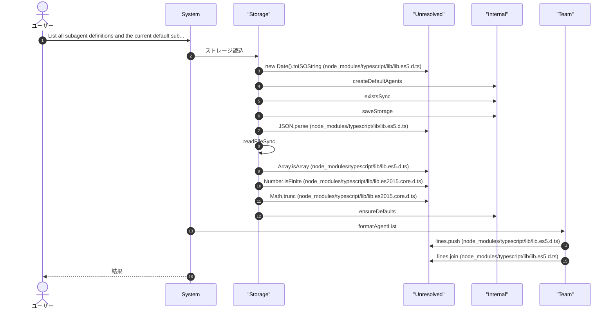
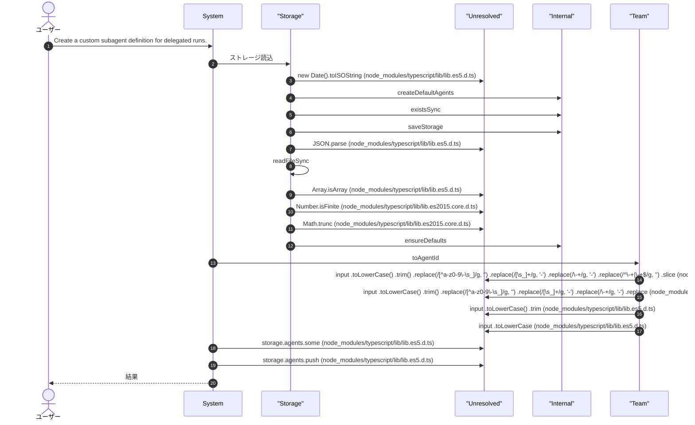
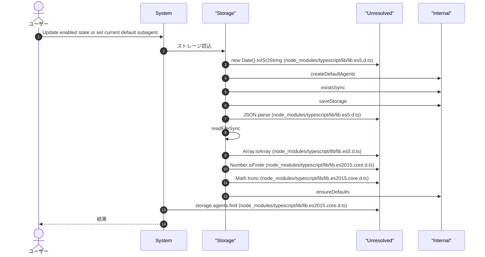
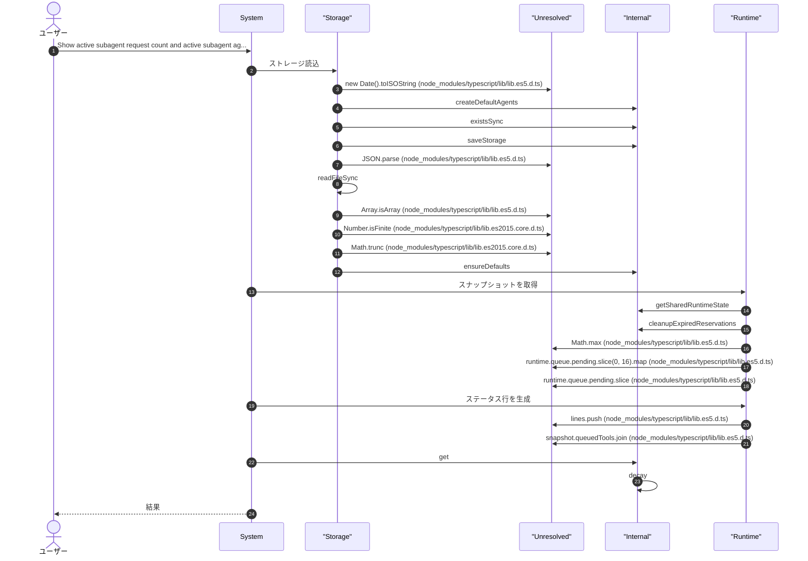
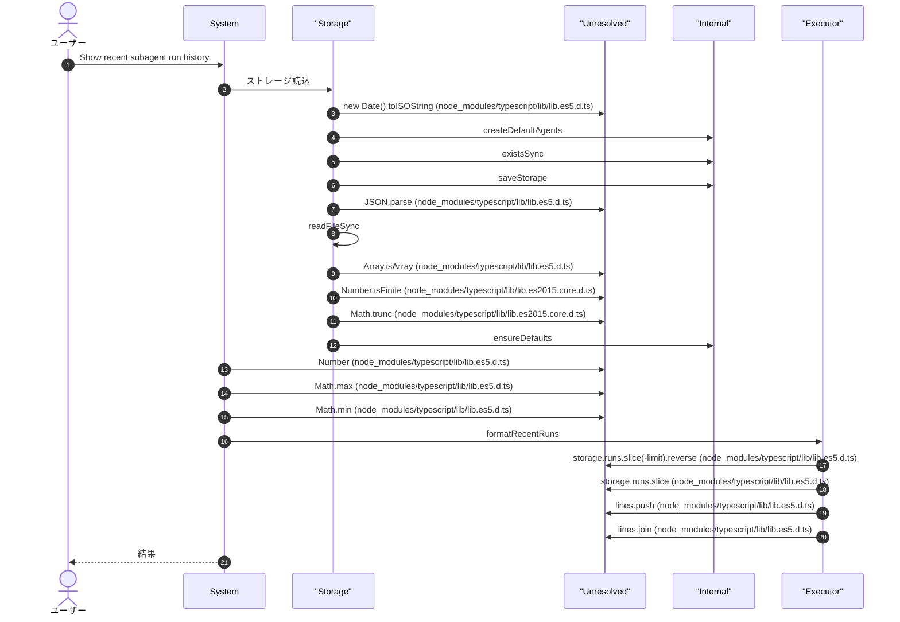
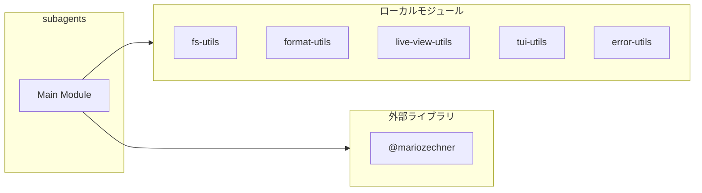
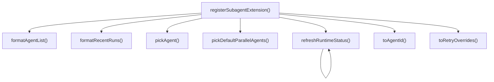
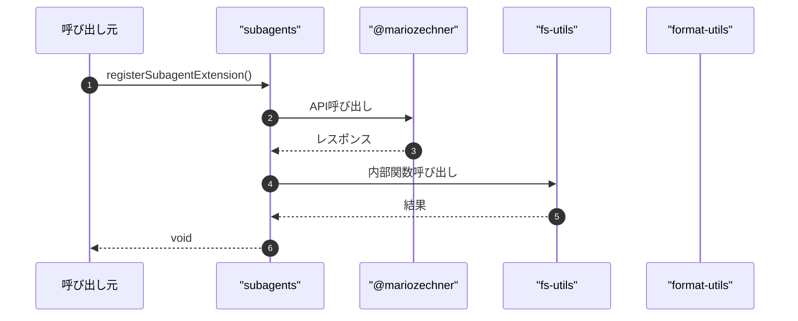

# subagents

## 概要

`subagents` モジュールのAPIリファレンス。

## インポート

```typescript
// from 'node:fs': readdirSync, unlinkSync, writeFileSync
// from 'node:path': basename, join
// from '@mariozechner/pi-ai': Type
// from '@mariozechner/pi-coding-agent': getMarkdownTheme, isToolCallEventType, ExtensionAPI, ...
// from '@mariozechner/pi-tui': Key, Markdown, matchesKey, ...
// ... and 31 more imports
```

## エクスポート一覧

| 種別 | 名前 | 説明 |
|------|------|------|
| 関数 | `registerSubagentExtension` | サブエージェント拡張を登録 |

## ユーザーフロー

このモジュールが提供するツールと、その実行フローを示します。

### subagent_list

List all subagent definitions and the current default subagent.



### subagent_create

Create a custom subagent definition for delegated runs.



### subagent_configure

Update enabled state or set current default subagent.



### subagent_run

Run one focused delegated task with one subagent. Use this as a single-specialist fallback when subagent_run_parallel with 2+ specialists is not needed.

```mermaid
sequenceDiagram
  autonumber
  actor User as ユーザー
  participant System as System
  participant Storage as "Storage"
  participant Unresolved as "Unresolved"
  participant Internal as "Internal"
  participant LLM as "LLM"
  participant Runtime as "Runtime"
  participant Executor as "Executor"
  participant Judge as "Judge"
  participant Team as "Team"

  User->>System: Run one focused delegated task with one subagent. Use thi...
  System->>Storage: ストレージ読込
  Storage->>Unresolved: new Date().toISOString (node_modules/typescript/lib/lib.es5.d.ts)
  Storage->>Internal: createDefaultAgents
  Storage->>Internal: existsSync
  Storage->>Internal: saveStorage
  Storage->>Unresolved: JSON.parse (node_modules/typescript/lib/lib.es5.d.ts)
  Storage->>Storage: readFileSync
  Storage->>Unresolved: Array.isArray (node_modules/typescript/lib/lib.es5.d.ts)
  Storage->>Unresolved: Number.isFinite (node_modules/typescript/lib/lib.es2015.core.d.ts)
  Storage->>Unresolved: Math.trunc (node_modules/typescript/lib/lib.es2015.core.d.ts)
  Storage->>Internal: ensureDefaults
  System->>LLM: pickAgent
  LLM->>Unresolved: storage.agents.find (node_modules/typescript/lib/lib.es2015.core.d.ts)
  System->>Internal: toRetryOverrides
  System->>Unresolved: logger.startOperation (.pi/lib/comprehensive-logger.ts)
  System->>Runtime: スナップショットを取得
  Runtime->>Internal: getSharedRuntimeState
  Runtime->>Internal: cleanupExpiredReservations
  Runtime->>Unresolved: Math.max (node_modules/typescript/lib/lib.es5.d.ts)
  Runtime->>Unresolved: runtime.queue.pending.slice(0, 16).map (node_modules/typescript/lib/lib.es5.d.ts)
  Runtime->>Unresolved: runtime.queue.pending.slice (node_modules/typescript/lib/lib.es5.d.ts)
  System->>Runtime: ランタイムのオーケストレーション実行を待機する
  Runtime->>Internal: normalizePositiveInt
  Runtime->>Internal: createRuntimeQueueEntryId
  Runtime->>Unresolved: Date.now (node_modules/typescript/lib/lib.es5.d.ts)
  Runtime->>Internal: 優先度を推論
  Internal->>Unresolved: toolName.toLowerCase (node_modules/typescript/lib/lib.es5.d.ts)
  Internal->>Unresolved: lowerToolName.includes (node_modules/typescript/lib/lib.es2015.core.d.ts)
  Internal->>Unresolved: lowerToolName.startsWith (node_modules/typescript/lib/lib.es2015.core.d.ts)
  Runtime->>Unresolved: String (node_modules/typescript/lib/lib.es5.d.ts)
  Runtime->>Unresolved: runtime.queue.pending.push (node_modules/typescript/lib/lib.es5.d.ts)
  Runtime->>Internal: sortQueueByPriority
  Runtime->>Internal: updatePriorityStats
  Runtime->>Internal: notifyRuntimeCapacityChanged
  Runtime->>Unresolved: runtime.queue.pending.findIndex (node_modules/typescript/lib/lib.es2015.core.d.ts)
  Runtime->>Internal: removeQueuedEntry
  Runtime->>Internal: promoteStarvingEntries
  Runtime->>Internal: computeBackoffDelay
  Runtime->>Unresolved: Math.min (node_modules/typescript/lib/lib.es5.d.ts)
  Runtime->>Internal: waitForRuntimeCapacityEvent
  Runtime->>Internal: wait
  System->>Runtime: キューウェイトエラー生成
  Runtime->>Unresolved: snapshot.queuedTools.join (node_modules/typescript/lib/lib.es5.d.ts)
  System->>Runtime: 容量予約を実行
  Runtime->>Internal: checkRuntimeCapacity
  Runtime->>Internal: tryReserveRuntimeCapacity
  System->>Internal: raise
  Internal->>Internal: raiseWithReason
  System->>Runtime: 実行制限エラー生成
  Runtime->>Unresolved: [     `${toolName} blocked: runtime limit reached.`,     ...reasons.map((reason) => `- ${reason}`),     `現在: requests=${snapshot.totalActiveRequests}, llm=${snapshot.totalActiveLlm}`,     `上限: requests=${snapshot.limits.maxTotalActiveRequests}, llm=${snapshot.limits.maxTotalActiveLlm}`,     waitLine,     'ヒント: 対象数を減らすか、実行中ジョブの完了を待って再実行してください。',   ]     .filter (node_modules/typescript/lib/lib.es5.d.ts)
  Runtime->>Unresolved: Boolean (node_modules/typescript/lib/lib.es5.d.ts)
  System->>Internal: get
  Internal->>Internal: decay
  System->>Executor: ハートビート開始
  Executor->>Internal: setInterval
  Executor->>Unresolved: reservation.heartbeat (.pi/extensions/agent-runtime.ts)
  Executor->>Unresolved: timer.unref (node_modules/@types/node/timers.d.ts)
  Executor->>Internal: clearInterval
  System->>Judge: タイムアウト時間を解決
  Judge->>Internal: モデル別タイムアウト
  Internal->>Internal: getModelBaseTimeoutMs
  Internal->>Unresolved: Math.floor (node_modules/typescript/lib/lib.es5.d.ts)
  Judge->>Internal: タイムアウトを正規化
  Internal->>Unresolved: Number (node_modules/typescript/lib/lib.es5.d.ts)
  System->>Unresolved: getCostEstimator().estimate (.pi/lib/cost-estimator.ts)
  System->>Internal: コスト推定インスタンス取得
  System->>Unresolved: console.log (node_modules/typescript/lib/lib.dom.d.ts)
  System->>Unresolved: costEstimate.confidence.toFixed (node_modules/typescript/lib/lib.es5.d.ts)
  System->>Team: 監視コントローラ作成
  Team->>Internal: clearTimeout
  Team->>Internal: setTimeout
  Team->>Internal: clearRenderTimer
  Team->>Internal: renderSubagentLiveView
  Team->>Internal: matchesKey
  Team->>Internal: close
  Team->>Internal: queueRender
  Team->>Internal: Enterキー判定
  Team->>Internal: 末尾にチャンク追加
  Team->>Unresolved: Buffer.byteLength (node_modules/@types/node/buffer.d.ts)
  Team->>Internal: 出現回数を数える
  Internal->>Unresolved: input.indexOf (node_modules/typescript/lib/lib.es5.d.ts)
  Team->>Unresolved: chunk.endsWith (node_modules/typescript/lib/lib.es2015.core.d.ts)
  System->>Runtime: refreshRuntimeStatus
  System->>Unresolved: capacityReservation.consume (.pi/extensions/agent-runtime.ts)
  System->>Team: サブエージェントタスク実行
  Team->>Executor: 一意な実行IDを生成します。
  Executor->>Unresolved: now.getFullYear (node_modules/typescript/lib/lib.es5.d.ts)
  Executor->>Unresolved: String(now.getMonth() + 1).padStart (node_modules/typescript/lib/lib.es2017.string.d.ts)
  Executor->>Unresolved: now.getMonth (node_modules/typescript/lib/lib.es5.d.ts)
  Executor->>Unresolved: now.getDate (node_modules/typescript/lib/lib.es5.d.ts)
  Executor->>Unresolved: now.getHours (node_modules/typescript/lib/lib.es5.d.ts)
  Executor->>Unresolved: now.getMinutes (node_modules/typescript/lib/lib.es5.d.ts)
  Executor->>Unresolved: now.getSeconds (node_modules/typescript/lib/lib.es5.d.ts)
  Executor->>Unresolved: randomBytes(3).toString (node_modules/@types/node/buffer.d.ts)
  Executor->>Internal: randomBytes
  Team->>Unresolved: ensurePaths (.pi/extensions/subagents/storage.ts)
  Team->>Internal: プランモード判定
  Internal->>Unresolved: process.cwd (node_modules/@types/node/process.d.ts)
  Internal->>Internal: validatePlanModeState
  Team->>Internal: buildSubagentPrompt
  Team->>Runtime: レート制限キー生成
  Team->>Unresolved: /429|rate\s*limit|too many requests/i.test (node_modules/typescript/lib/lib.es5.d.ts)
  Team->>Internal: バックオフ再試行実行
  Internal->>Internal: resolveRetryWithBackoffConfig
  Internal->>Internal: toOptionalNonNegativeInt
  Internal->>Internal: toOptionalPositiveInt
  Internal->>Unresolved: options.rateLimitKey.trim (node_modules/typescript/lib/lib.es5.d.ts)
  Internal->>Internal: normalizeRateLimitKey
  Internal->>Internal: createRateLimitKeyScope
  Internal->>Internal: createAbortError
  Internal->>Internal: selectLongestRateLimitGate
  Internal->>Internal: getRateLimitGateSnapshot
  Internal->>Internal: createRateLimitFastFailError
  Internal->>Internal: sleepWithAbort
  Internal->>Internal: registerRateLimitGateSuccess
  Internal->>Internal: extractRetryStatusCode
  Internal->>Internal: isRetryableError
  Internal->>Internal: computeBackoffDelayMs
  Internal->>Internal: registerRateLimitGateHit
  Team->>LLM: runPiPrintMode
  Team->>Internal: normalizeSubagentOutput
  Team->>Internal: emitStderrChunk
  Team->>Internal: isRetryableSubagentError
  Team->>Internal: エラーメッセージを整形
  Internal->>Unresolved: message.replace (node_modules/typescript/lib/lib.es5.d.ts)
  Team->>Internal: メッセージを文字列化
  Team->>Internal: extractSummary
  Team->>Storage: writeFileSync
  Team->>Unresolved: JSON.stringify (node_modules/typescript/lib/lib.es5.d.ts)
  Team->>Internal: buildFailureSummary
  System->>Unresolved: liveMonitor?.markStarted (.pi/lib/subagent-types.ts)
  System->>Unresolved: liveMonitor?.appendChunk (.pi/lib/subagent-types.ts)
  System->>Unresolved: liveMonitor?.markFinished (.pi/lib/subagent-types.ts)
  System->>Storage: ストレージ保存
  Storage->>Unresolved: console.error (node_modules/typescript/lib/lib.dom.d.ts)
  System->>Unresolved: pi.appendEntry (node_modules/@mariozechner/pi-coding-agent/dist/core/extensions/types.d.ts)
  System->>Internal: エラーを圧力関連のカテゴリに分類する
  Internal->>Internal: extractStatusCodeFromMessage
  System->>Team: エラー種別を判定
  Team->>Internal: エラー判定
  Team->>Internal: タイムアウト判定
  System->>Unresolved: logger.endOperation (.pi/lib/comprehensive-logger.ts)
  System->>Internal: トレースIDを生成
  System->>Internal: lower
  System->>Unresolved: capacityReservation.release (.pi/extensions/agent-runtime.ts)
  System-->>User: 結果

```



### subagent_run_parallel

Run selected subagents in parallel. Strongly recommended when using subagents; pass explicit subagentIds with 2+ specialists for meaningful fan-out.

```mermaid
sequenceDiagram
  autonumber
  actor User as ユーザー
  participant System as System
  participant Storage as "Storage"
  participant Unresolved as "Unresolved"
  participant Internal as "Internal"
  participant LLM as "LLM"
  participant Runtime as "Runtime"
  participant Executor as "Executor"
  participant Judge as "Judge"
  participant Team as "Team"

  User->>System: Run selected subagents in parallel. Strongly recommended ...
  System->>Storage: ストレージ読込
  Storage->>Unresolved: new Date().toISOString (node_modules/typescript/lib/lib.es5.d.ts)
  Storage->>Internal: createDefaultAgents
  Storage->>Internal: existsSync
  Storage->>Internal: saveStorage
  Storage->>Unresolved: JSON.parse (node_modules/typescript/lib/lib.es5.d.ts)
  Storage->>Storage: readFileSync
  Storage->>Unresolved: Array.isArray (node_modules/typescript/lib/lib.es5.d.ts)
  Storage->>Unresolved: Number.isFinite (node_modules/typescript/lib/lib.es2015.core.d.ts)
  Storage->>Unresolved: Math.trunc (node_modules/typescript/lib/lib.es2015.core.d.ts)
  Storage->>Internal: ensureDefaults
  System->>Internal: toRetryOverrides
  System->>Unresolved: Array.from (node_modules/typescript/lib/lib.es2015.core.d.ts)
  System->>Unresolved: String(id).trim (node_modules/typescript/lib/lib.es5.d.ts)
  System->>Unresolved: String (node_modules/typescript/lib/lib.es5.d.ts)
  System->>Unresolved: requestedIds               .map((id) => storage.agents.find((agent) => agent.id === id))               .filter (node_modules/typescript/lib/lib.es5.d.ts)
  System->>Unresolved: requestedIds               .map (node_modules/typescript/lib/lib.es5.d.ts)
  System->>Unresolved: storage.agents.find (node_modules/typescript/lib/lib.es2015.core.d.ts)
  System->>Unresolved: Boolean (node_modules/typescript/lib/lib.es5.d.ts)
  System->>LLM: pickDefaultParallelAgents
  LLM->>Unresolved: String(process.env.PI_SUBAGENT_PARALLEL_DEFAULT || 'current')     .trim()     .toLowerCase (node_modules/typescript/lib/lib.es5.d.ts)
  LLM->>Unresolved: enabledAgents.slice (node_modules/typescript/lib/lib.es5.d.ts)
  System->>Unresolved: storage.agents.some (node_modules/typescript/lib/lib.es5.d.ts)
  System->>Unresolved: missingIds.join (node_modules/typescript/lib/lib.es5.d.ts)
  System->>Unresolved: logger.startOperation (.pi/lib/comprehensive-logger.ts)
  System->>Runtime: スナップショットを取得
  Runtime->>Internal: getSharedRuntimeState
  Runtime->>Internal: cleanupExpiredReservations
  Runtime->>Unresolved: Math.max (node_modules/typescript/lib/lib.es5.d.ts)
  System->>Runtime: ランタイムのオーケストレーション実行を待機する
  Runtime->>Internal: normalizePositiveInt
  Runtime->>Internal: createRuntimeQueueEntryId
  Runtime->>Unresolved: Date.now (node_modules/typescript/lib/lib.es5.d.ts)
  Runtime->>Internal: 優先度を推論
  Internal->>Unresolved: lowerToolName.includes (node_modules/typescript/lib/lib.es2015.core.d.ts)
  Internal->>Unresolved: lowerToolName.startsWith (node_modules/typescript/lib/lib.es2015.core.d.ts)
  Runtime->>Unresolved: runtime.queue.pending.push (node_modules/typescript/lib/lib.es5.d.ts)
  Runtime->>Internal: sortQueueByPriority
  Runtime->>Internal: updatePriorityStats
  Runtime->>Internal: notifyRuntimeCapacityChanged
  Runtime->>Unresolved: runtime.queue.pending.findIndex (node_modules/typescript/lib/lib.es2015.core.d.ts)
  Runtime->>Internal: removeQueuedEntry
  Runtime->>Internal: promoteStarvingEntries
  Runtime->>Internal: computeBackoffDelay
  Runtime->>Unresolved: Math.min (node_modules/typescript/lib/lib.es5.d.ts)
  Runtime->>Internal: waitForRuntimeCapacityEvent
  Runtime->>Internal: wait
  System->>Runtime: キューウェイトエラー生成
  System->>Runtime: 並行数リミットを取得
  Runtime->>Unresolved: Number (node_modules/typescript/lib/lib.es5.d.ts)
  System->>Internal: get
  Internal->>Internal: decay
  System->>Runtime: applyLimit
  Runtime->>Unresolved: Math.floor (node_modules/typescript/lib/lib.es5.d.ts)
  System->>Runtime: 容量解決
  Runtime->>Runtime: 容量予約を試行
  Runtime->>Internal: createCapacityCheck
  Runtime->>Internal: createRuntimeReservationId
  Runtime->>Internal: sanitizePlannedCount
  Runtime->>Internal: normalizeReservationTtlMs
  Runtime->>Internal: createReservationLease
  Runtime->>Runtime: 容量予約を実行
  Runtime->>Internal: checkRuntimeCapacity
  System->>Internal: raise
  Internal->>Internal: raiseWithReason
  System->>Runtime: 実行制限エラー生成
  System->>Executor: ハートビート開始
  Executor->>Internal: setInterval
  Executor->>Unresolved: reservation.heartbeat (.pi/extensions/agent-runtime.ts)
  Executor->>Unresolved: timer.unref (node_modules/@types/node/timers.d.ts)
  Executor->>Internal: clearInterval
  System->>Judge: タイムアウト時間を解決
  Judge->>Internal: モデル別タイムアウト
  Internal->>Internal: getModelBaseTimeoutMs
  Judge->>Internal: タイムアウトを正規化
  System->>Unresolved: getCostEstimator().estimate (.pi/lib/cost-estimator.ts)
  System->>Internal: コスト推定インスタンス取得
  System->>Unresolved: console.log (node_modules/typescript/lib/lib.dom.d.ts)
  System->>Unresolved: costEstimate.confidence.toFixed (node_modules/typescript/lib/lib.es5.d.ts)
  System->>Team: 監視コントローラ作成
  Team->>Internal: clearTimeout
  Team->>Internal: setTimeout
  Team->>Internal: clearRenderTimer
  Team->>Internal: renderSubagentLiveView
  Team->>Internal: matchesKey
  Team->>Internal: close
  Team->>Internal: queueRender
  Team->>Internal: Enterキー判定
  Team->>Internal: 末尾にチャンク追加
  Team->>Unresolved: Buffer.byteLength (node_modules/@types/node/buffer.d.ts)
  Team->>Internal: 出現回数を数える
  Internal->>Unresolved: input.indexOf (node_modules/typescript/lib/lib.es5.d.ts)
  Team->>Unresolved: chunk.endsWith (node_modules/typescript/lib/lib.es2015.core.d.ts)
  System->>Runtime: refreshRuntimeStatus
  System->>Unresolved: capacityReservation.consume (.pi/extensions/agent-runtime.ts)
  System->>Runtime: アイテム並列処理
  Runtime->>Internal: toPositiveLimit
  Runtime->>Internal: ensureNotAborted
  Runtime->>Unresolved: Promise.all (node_modules/typescript/lib/lib.es2015.iterable.d.ts)
  Runtime->>Internal: runWorker
  System->>Internal: 親に連動する中止制御
  Internal->>Unresolved: controller.abort (node_modules/typescript/lib/lib.dom.d.ts)
  Internal->>Internal: addEventListener
  Internal->>Internal: removeEventListener
  System->>Team: サブエージェントタスク実行
  Team->>Executor: 一意な実行IDを生成します。
  Executor->>Unresolved: now.getFullYear (node_modules/typescript/lib/lib.es5.d.ts)
  Executor->>Unresolved: String(now.getMonth() + 1).padStart (node_modules/typescript/lib/lib.es2017.string.d.ts)
  Executor->>Unresolved: now.getMonth (node_modules/typescript/lib/lib.es5.d.ts)
  Executor->>Unresolved: now.getDate (node_modules/typescript/lib/lib.es5.d.ts)
  Executor->>Unresolved: now.getHours (node_modules/typescript/lib/lib.es5.d.ts)
  Executor->>Unresolved: now.getMinutes (node_modules/typescript/lib/lib.es5.d.ts)
  Executor->>Unresolved: now.getSeconds (node_modules/typescript/lib/lib.es5.d.ts)
  Executor->>Unresolved: randomBytes(3).toString (node_modules/@types/node/buffer.d.ts)
  Executor->>Internal: randomBytes
  Team->>Unresolved: ensurePaths (.pi/extensions/subagents/storage.ts)
  Team->>Internal: プランモード判定
  Internal->>Unresolved: process.cwd (node_modules/@types/node/process.d.ts)
  Internal->>Internal: validatePlanModeState
  Team->>Internal: buildSubagentPrompt
  Team->>Runtime: レート制限キー生成
  Team->>Unresolved: /429|rate\s*limit|too many requests/i.test (node_modules/typescript/lib/lib.es5.d.ts)
  Team->>Internal: バックオフ再試行実行
  Internal->>Internal: resolveRetryWithBackoffConfig
  Internal->>Internal: toOptionalNonNegativeInt
  Internal->>Internal: toOptionalPositiveInt
  Internal->>Internal: normalizeRateLimitKey
  Internal->>Internal: createRateLimitKeyScope
  Internal->>Internal: createAbortError
  Internal->>Internal: selectLongestRateLimitGate
  Internal->>Internal: getRateLimitGateSnapshot
  Internal->>Internal: createRateLimitFastFailError
  Internal->>Internal: sleepWithAbort
  Internal->>Internal: registerRateLimitGateSuccess
  Internal->>Internal: extractRetryStatusCode
  Internal->>Internal: isRetryableError
  Internal->>Internal: computeBackoffDelayMs
  Internal->>Internal: registerRateLimitGateHit
  Team->>LLM: runPiPrintMode
  Team->>Internal: normalizeSubagentOutput
  Team->>Internal: emitStderrChunk
  Team->>Internal: isRetryableSubagentError
  Team->>Internal: エラーメッセージを整形
  Internal->>Unresolved: message.replace (node_modules/typescript/lib/lib.es5.d.ts)
  Team->>Internal: メッセージを文字列化
  Team->>Internal: extractSummary
  Team->>Storage: writeFileSync
  Team->>Unresolved: JSON.stringify (node_modules/typescript/lib/lib.es5.d.ts)
  Team->>Internal: buildFailureSummary
  System->>Unresolved: liveMonitor?.markStarted (.pi/lib/subagent-types.ts)
  System->>Unresolved: liveMonitor?.appendChunk (.pi/lib/subagent-types.ts)
  System->>Unresolved: liveMonitor?.markFinished (.pi/lib/subagent-types.ts)
  System->>Unresolved: pi.appendEntry (node_modules/@mariozechner/pi-coding-agent/dist/core/extensions/types.d.ts)
  System->>Storage: ストレージ保存
  Storage->>Unresolved: console.error (node_modules/typescript/lib/lib.dom.d.ts)
  System->>Internal: エラーを圧力関連のカテゴリに分類する
  Internal->>Internal: extractStatusCodeFromMessage
  System->>Internal: lower
  System->>Runtime: 並列結果集計
  Runtime->>Internal: resolveAggregateOutcome
  System->>Unresolved: logger.endOperation (.pi/lib/comprehensive-logger.ts)
  System->>Internal: トレースIDを生成
  System->>Unresolved: capacityReservation.release (.pi/extensions/agent-runtime.ts)
  System-->>User: 結果

```



### subagent_status

Show active subagent request count and active subagent agent count.



### subagent_runs

Show recent subagent run history.



## 図解

### 依存関係図



### 関数フロー



### シーケンス図



## 関数

### refreshRuntimeStatus

```typescript
refreshRuntimeStatus(ctx: any): void
```

Refresh runtime status display in the UI with subagent-specific parameters.

**パラメータ**

| 名前 | 型 | 必須 |
|------|-----|------|
| ctx | `any` | はい |

**戻り値**: `void`

### toRetryOverrides

```typescript
toRetryOverrides(value: unknown): RetryWithBackoffOverrides | undefined
```

**パラメータ**

| 名前 | 型 | 必須 |
|------|-----|------|
| value | `unknown` | はい |

**戻り値**: `RetryWithBackoffOverrides | undefined`

### toAgentId

```typescript
toAgentId(input: string): string
```

**パラメータ**

| 名前 | 型 | 必須 |
|------|-----|------|
| input | `string` | はい |

**戻り値**: `string`

### formatAgentList

```typescript
formatAgentList(storage: SubagentStorage): string
```

**パラメータ**

| 名前 | 型 | 必須 |
|------|-----|------|
| storage | `SubagentStorage` | はい |

**戻り値**: `string`

### formatRecentRuns

```typescript
formatRecentRuns(storage: SubagentStorage, limit: any): string
```

**パラメータ**

| 名前 | 型 | 必須 |
|------|-----|------|
| storage | `SubagentStorage` | はい |
| limit | `any` | はい |

**戻り値**: `string`

### runPiPrintMode

```typescript
async runPiPrintMode(input: {
  provider?: string;
  model?: string;
  prompt: string;
  timeoutMs: number;
  signal?: AbortSignal;
  onTextDelta?: (delta: string) => void;
  onStderrChunk?: (chunk: string) => void;
}): Promise<PrintCommandResult>
```

Merge skill arrays following inheritance rules.
- Empty array [] is treated as unspecified (ignored)
- Non-empty arrays are merged with deduplication

**パラメータ**

| 名前 | 型 | 必須 |
|------|-----|------|
| input | `object` | はい |
| &nbsp;&nbsp;↳ provider | `string` | いいえ |
| &nbsp;&nbsp;↳ model | `string` | いいえ |
| &nbsp;&nbsp;↳ prompt | `string` | はい |
| &nbsp;&nbsp;↳ timeoutMs | `number` | はい |
| &nbsp;&nbsp;↳ signal | `AbortSignal` | いいえ |
| &nbsp;&nbsp;↳ onTextDelta | `(delta: string) => void;  onStderrChunk?: (chunk: string) => void;` | いいえ |

**戻り値**: `Promise<PrintCommandResult>`

### pickAgent

```typescript
pickAgent(storage: SubagentStorage, requestedId?: string): SubagentDefinition | undefined
```

**パラメータ**

| 名前 | 型 | 必須 |
|------|-----|------|
| storage | `SubagentStorage` | はい |
| requestedId | `string` | いいえ |

**戻り値**: `SubagentDefinition | undefined`

### pickDefaultParallelAgents

```typescript
pickDefaultParallelAgents(storage: SubagentStorage): SubagentDefinition[]
```

**パラメータ**

| 名前 | 型 | 必須 |
|------|-----|------|
| storage | `SubagentStorage` | はい |

**戻り値**: `SubagentDefinition[]`

### registerSubagentExtension

```typescript
registerSubagentExtension(pi: ExtensionAPI): void
```

サブエージェント拡張を登録

**パラメータ**

| 名前 | 型 | 必須 |
|------|-----|------|
| pi | `ExtensionAPI` | はい |

**戻り値**: `void`

---
*自動生成: 2026-02-18T18:06:17.460Z*
