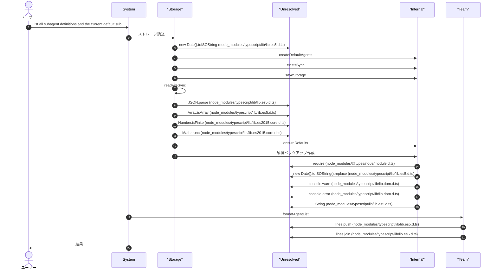
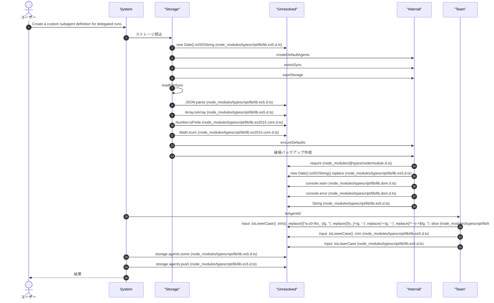
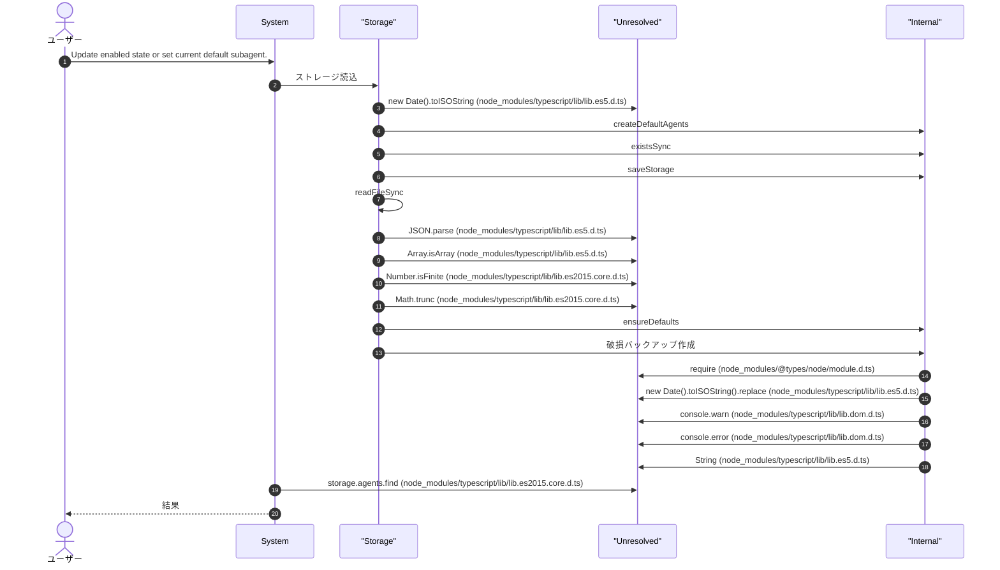
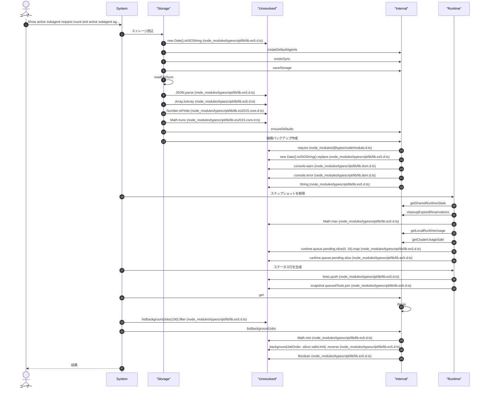
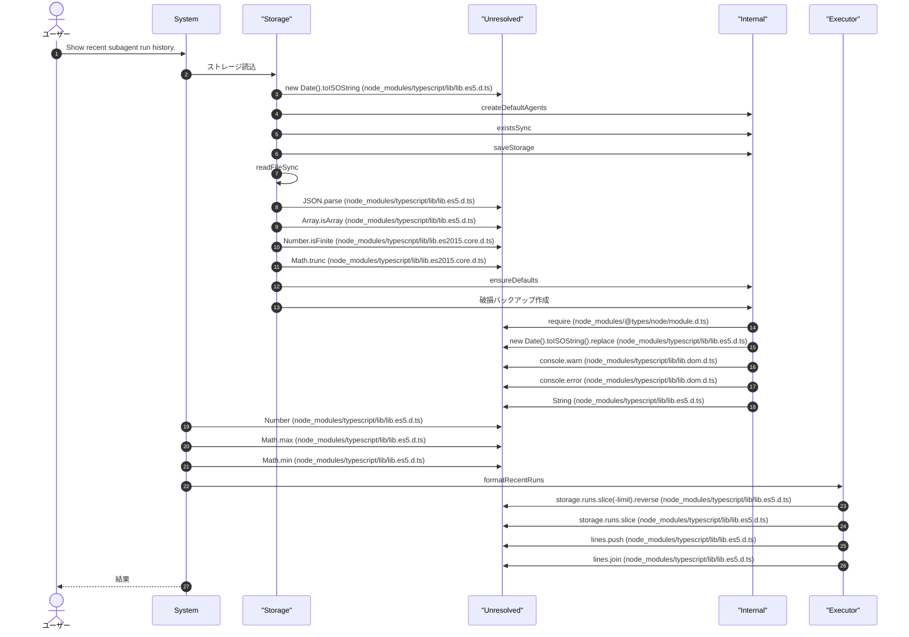
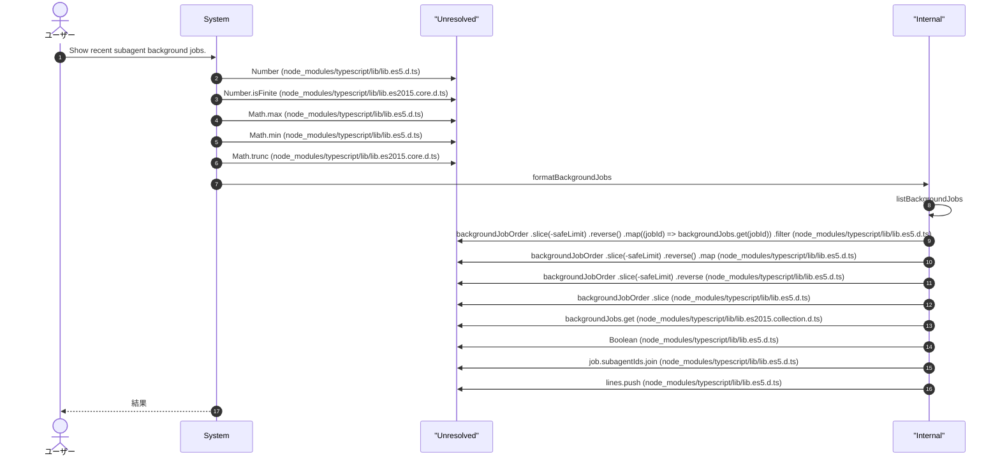
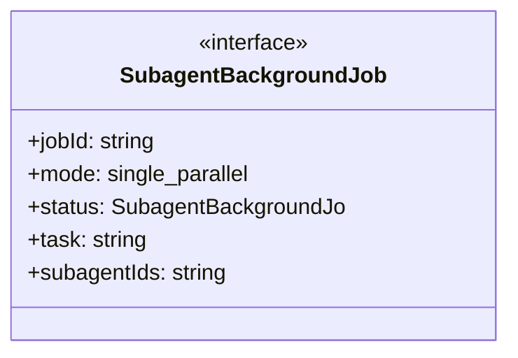
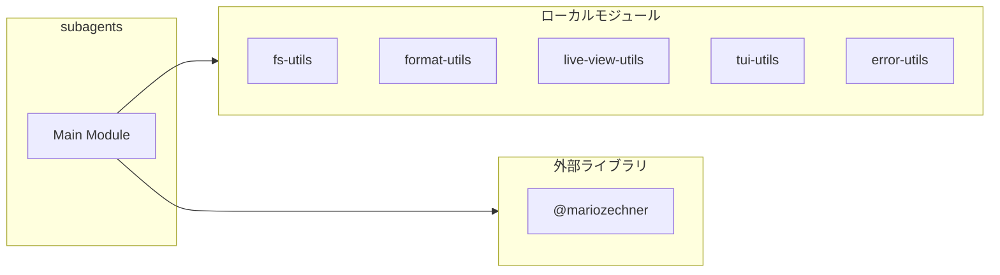
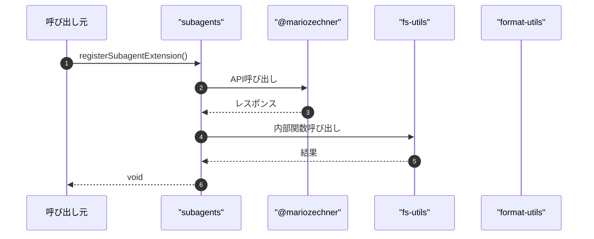

# subagents

## 概要

`subagents` モジュールのAPIリファレンス。

## インポート

```typescript
// from 'node:fs': readdirSync, unlinkSync, writeFileSync
// from 'node:path': basename, join
// from '@mariozechner/pi-ai': Type
// from '@mariozechner/pi-coding-agent': getMarkdownTheme, isToolCallEventType, ExtensionAPI, ...
// from '@mariozechner/pi-tui': Key, Markdown, matchesKey, ...
// ... and 32 more imports
```

## エクスポート一覧

| 種別 | 名前 | 説明 |
|------|------|------|
| 関数 | `registerSubagentExtension` | サブエージェント拡張を登録 |

## ユーザーフロー

このモジュールが提供するツールと、その実行フローを示します。

### subagent_list

List all subagent definitions and the current default subagent.



### subagent_create

Create a custom subagent definition for delegated runs.



### subagent_configure

Update enabled state or set current default subagent.



### subagent_run

Run one focused delegated task with one subagent. Use this as a single-specialist fallback when subagent_run_parallel with 2+ specialists is not needed.

```mermaid
sequenceDiagram
  autonumber
  actor User as ユーザー
  participant System as System
  participant Storage as "Storage"
  participant Unresolved as "Unresolved"
  participant Internal as "Internal"
  participant LLM as "LLM"
  participant Executor as "Executor"
  participant Runtime as "Runtime"
  participant Judge as "Judge"
  participant Team as "Team"

  User->>System: Run one focused delegated task with one subagent. Use thi...
  System->>Storage: ストレージ読込
  Storage->>Unresolved: new Date().toISOString (node_modules/typescript/lib/lib.es5.d.ts)
  Storage->>Internal: createDefaultAgents
  Storage->>Internal: existsSync
  Storage->>Internal: saveStorage
  Storage->>Storage: readFileSync
  Storage->>Unresolved: JSON.parse (node_modules/typescript/lib/lib.es5.d.ts)
  Storage->>Unresolved: Array.isArray (node_modules/typescript/lib/lib.es5.d.ts)
  Storage->>Unresolved: Number.isFinite (node_modules/typescript/lib/lib.es2015.core.d.ts)
  Storage->>Unresolved: Math.trunc (node_modules/typescript/lib/lib.es2015.core.d.ts)
  Storage->>Internal: ensureDefaults
  Storage->>Internal: 破損バックアップ作成
  Internal->>Unresolved: require (node_modules/@types/node/module.d.ts)
  Internal->>Unresolved: new Date().toISOString().replace (node_modules/typescript/lib/lib.es5.d.ts)
  Internal->>Unresolved: console.warn (node_modules/typescript/lib/lib.dom.d.ts)
  Internal->>Unresolved: console.error (node_modules/typescript/lib/lib.dom.d.ts)
  Internal->>Unresolved: String (node_modules/typescript/lib/lib.es5.d.ts)
  System->>LLM: pickAgent
  LLM->>Unresolved: storage.agents.find (node_modules/typescript/lib/lib.es2015.core.d.ts)
  System->>Internal: toRetryOverrides
  System->>Internal: createBackgroundJob
  Internal->>Executor: 一意な実行IDを生成します。
  Executor->>Unresolved: [     String(now.getFullYear()),     String(now.getMonth() + 1).padStart(2, '0'),     String(now.getDate()).padStart(2, '0'),     String(now.getHours()).padStart(2, '0'),     String(now.getMinutes()).padStart(2, '0'),     String(now.getSeconds()).padStart(2, '0'),   ].join (node_modules/typescript/lib/lib.es5.d.ts)
  Executor->>Unresolved: now.getFullYear (node_modules/typescript/lib/lib.es5.d.ts)
  Executor->>Unresolved: String(now.getMonth() + 1).padStart (node_modules/typescript/lib/lib.es2017.string.d.ts)
  Executor->>Unresolved: now.getMonth (node_modules/typescript/lib/lib.es5.d.ts)
  Executor->>Unresolved: now.getDate (node_modules/typescript/lib/lib.es5.d.ts)
  Executor->>Unresolved: now.getHours (node_modules/typescript/lib/lib.es5.d.ts)
  Executor->>Unresolved: now.getMinutes (node_modules/typescript/lib/lib.es5.d.ts)
  Executor->>Unresolved: now.getSeconds (node_modules/typescript/lib/lib.es5.d.ts)
  Executor->>Unresolved: randomBytes(3).toString (node_modules/@types/node/buffer.d.ts)
  Executor->>Internal: randomBytes
  Internal->>Unresolved: backgroundJobs.set (node_modules/typescript/lib/lib.es2015.collection.d.ts)
  Internal->>Unresolved: backgroundJobOrder.push (node_modules/typescript/lib/lib.es5.d.ts)
  Internal->>Unresolved: backgroundJobOrder.shift (node_modules/typescript/lib/lib.es5.d.ts)
  Internal->>Unresolved: backgroundJobs.delete (node_modules/typescript/lib/lib.es2015.collection.d.ts)
  System->>Unresolved: (async () => {         logger.startOperation('subagent_run' as OperationType, agent.id, {           task: params.task,           params: {             subagentId: agent.id,             extraContext: params.extraContext,             timeoutMs: params.timeoutMs,             backgroundJobId: job.jobId,           },         });          let capacityReservation: RuntimeCapacityReservationLease | undefined;         let stopReservationHeartbeat: (() => void) | undefined;         let liveMonitor: SubagentLiveMonitorController | undefined;         try {           const queueSnapshot = getRuntimeSnapshot();           const dispatchPermit = await acquireRuntimeDispatchPermit({             toolName: 'subagent_run',             candidate: {               additionalRequests: 1,               additionalLlm: 1,             },             tenantKey: agent.id,             source: 'background',             estimatedDurationMs: 45_000,             estimatedRounds: 1,             maxWaitMs: queueSnapshot.limits.capacityWaitMs,             pollIntervalMs: queueSnapshot.limits.capacityPollMs,             signal: _signal,           });           if (!dispatchPermit.allowed || !dispatchPermit.lease) {             const errorMessage = buildRuntimeLimitError('subagent_run', dispatchPermit.reasons, {               waitedMs: dispatchPermit.waitedMs,               timedOut: dispatchPermit.timedOut,             });             updateBackgroundJob(job.jobId, (current) => ({               ...current,               status: 'failed',               error: errorMessage,               finishedAt: new Date().toISOString(),             }));             reportBackgroundJobFailure(job.jobId, errorMessage, ctx);             logger.endOperation({               status: 'failure',               tokensUsed: 0,               outputLength: 0,               childOperations: 0,               toolCalls: 0,               error: {                 type: 'capacity_error',                 message: errorMessage,                 stack: '',               },             });             return;           }           capacityReservation = dispatchPermit.lease;           stopReservationHeartbeat = startReservationHeartbeat(capacityReservation);            const timeoutMs = resolveEffectiveTimeoutMs(             params.timeoutMs,             ctx.model?.id,             DEFAULT_AGENT_TIMEOUT_MS,           );            const costEstimate = getCostEstimator().estimate(             'subagent_run',             ctx.model?.provider,             ctx.model?.id,             params.task,           );           debugCostEstimation('subagent_run', {             agent: agent.id,             estimated_ms: costEstimate.estimatedDurationMs,             estimated_tokens: costEstimate.estimatedTokens,             confidence: costEstimate.confidence.toFixed(2),             method: costEstimate.method,           });            liveMonitor = createSubagentLiveMonitor(ctx, {             title: `Subagent Run (background: ${job.jobId})`,             items: [{ id: agent.id, name: agent.name }],           });            runtimeState.activeRunRequests += 1;           notifyRuntimeCapacityChanged();           refreshRuntimeStatus(ctx);           capacityReservation.consume();           updateBackgroundJob(job.jobId, (current) => ({             ...current,             status: 'running',             startedAt: new Date().toISOString(),           }));            const result = await runSubagentTask({             agent,             task: params.task,             extraContext: params.extraContext,             timeoutMs,             cwd: ctx.cwd,             retryOverrides,             modelProvider: ctx.model?.provider,             modelId: ctx.model?.id,             onStart: () => {               liveMonitor?.markStarted(agent.id);               runtimeState.activeAgents += 1;               notifyRuntimeCapacityChanged();               refreshRuntimeStatus(ctx);             },             onEnd: () => {               runtimeState.activeAgents = Math.max(0, runtimeState.activeAgents - 1);               notifyRuntimeCapacityChanged();               refreshRuntimeStatus(ctx);             },             onTextDelta: (delta) => {               liveMonitor?.appendChunk(agent.id, 'stdout', delta);             },             onStderrChunk: (chunk) => {               liveMonitor?.appendChunk(agent.id, 'stderr', chunk);             },           });            liveMonitor?.markFinished(             agent.id,             result.runRecord.status,             result.runRecord.summary,             result.runRecord.error,           );            storage.runs.push(result.runRecord);           await saveStorageWithPatterns(ctx.cwd, storage);           pi.appendEntry('subagent-run', result.runRecord);            if (result.runRecord.status === 'failed') {             const pressureError = classifyPressureError(result.runRecord.error || '');             if (pressureError !== 'other') {               adaptivePenalty.raise(pressureError);             }             const errorMessage = result.runRecord.error || 'subagent run failed';             updateBackgroundJob(job.jobId, (current) => ({               ...current,               status: 'failed',               runIds: [result.runRecord.runId],               summary: result.runRecord.summary,               error: errorMessage,               finishedAt: new Date().toISOString(),             }));             reportBackgroundJobFailure(job.jobId, errorMessage, ctx);             logger.endOperation({               status: 'failure',               tokensUsed: 0,               outputLength: result.output?.length ?? 0,               outputFile: result.runRecord.outputFile,               childOperations: 0,               toolCalls: 0,               error: {                 type: 'subagent_error',                 message: errorMessage,                 stack: '',               },             });           } else {             adaptivePenalty.lower();             updateBackgroundJob(job.jobId, (current) => ({               ...current,               status: 'completed',               runIds: [result.runRecord.runId],               summary: result.runRecord.summary,               finishedAt: new Date().toISOString(),             }));             logger.endOperation({               status: 'success',               tokensUsed: 0,               outputLength: result.output?.length ?? 0,               outputFile: result.runRecord.outputFile,               childOperations: 0,               toolCalls: 0,             });           }         } catch (error) {           updateBackgroundJob(job.jobId, (current) => ({             ...current,             status: 'failed',             error: toErrorMessage(error),             finishedAt: new Date().toISOString(),           }));           reportBackgroundJobFailure(job.jobId, toErrorMessage(error), ctx);           logger.endOperation({             status: 'failure',             tokensUsed: 0,             outputLength: 0,             childOperations: 0,             toolCalls: 0,             error: {               type: 'subagent_error',               message: toErrorMessage(error),               stack: '',             },           });         } finally {           runtimeState.activeRunRequests = Math.max(0, runtimeState.activeRunRequests - 1);           notifyRuntimeCapacityChanged();           refreshRuntimeStatus(ctx);           liveMonitor?.close();           await liveMonitor?.wait();           stopReservationHeartbeat?.();           capacityReservation?.release();           refreshRuntimeStatus(ctx);         }       })().catch (node_modules/typescript/lib/lib.es5.d.ts)
  System->>Unresolved: logger.startOperation (.pi/lib/comprehensive-logger.ts)
  System->>Runtime: スナップショットを取得
  Runtime->>Internal: getSharedRuntimeState
  Runtime->>Internal: cleanupExpiredReservations
  Runtime->>Unresolved: Math.max (node_modules/typescript/lib/lib.es5.d.ts)
  Runtime->>Internal: getLocalRuntimeUsage
  Runtime->>Internal: getClusterUsageSafe
  Runtime->>Unresolved: runtime.queue.pending.slice(0, 16).map (node_modules/typescript/lib/lib.es5.d.ts)
  Runtime->>Unresolved: runtime.queue.pending.slice (node_modules/typescript/lib/lib.es5.d.ts)
  System->>Runtime: acquireRuntimeDispatchPermit
  Runtime->>Internal: normalizePositiveInt
  Runtime->>Internal: clampPlannedCount
  Runtime->>Internal: createRuntimeQueueEntryId
  Runtime->>Internal: runtimeNow
  Runtime->>Internal: 優先度を推論
  Internal->>Unresolved: toolName.toLowerCase (node_modules/typescript/lib/lib.es5.d.ts)
  Internal->>Unresolved: lowerToolName.includes (node_modules/typescript/lib/lib.es2015.core.d.ts)
  Internal->>Unresolved: lowerToolName.startsWith (node_modules/typescript/lib/lib.es2015.core.d.ts)
  Runtime->>Internal: toQueueClass
  Runtime->>Internal: trimPendingQueueToLimit
  Runtime->>Internal: sortQueueByPriority
  Runtime->>Internal: updatePriorityStats
  Runtime->>Internal: notifyRuntimeCapacityChanged
  Runtime->>Unresolved: runtime.queue.pending.findIndex (node_modules/typescript/lib/lib.es2015.core.d.ts)
  Runtime->>Internal: findDispatchableQueueEntry
  Runtime->>Internal: tryReserveRuntimeCapacity
  Runtime->>Internal: removeQueuedEntry
  Runtime->>Unresolved: reservationAttempt.reservation?.consume (.pi/lib/runtime-types.ts)
  Runtime->>Unresolved: reservationAttempt.reservation?.heartbeat (.pi/lib/runtime-types.ts)
  Runtime->>Unresolved: reservationAttempt.reservation?.release (.pi/lib/runtime-types.ts)
  Runtime->>Internal: promoteStarvingEntries
  Runtime->>Internal: checkRuntimeCapacity
  Runtime->>Internal: computeBackoffDelay
  Runtime->>Unresolved: Math.min (node_modules/typescript/lib/lib.es5.d.ts)
  Runtime->>Internal: waitForRuntimeCapacityEvent
  Runtime->>Internal: wait
  System->>Runtime: 実行制限エラー生成
  Runtime->>Unresolved: [     `${toolName} blocked: runtime limit reached.`,     ...reasons.map((reason) => `- ${reason}`),     `現在: requests=${snapshot.totalActiveRequests}, llm=${snapshot.totalActiveLlm}`,     `上限: requests=${snapshot.limits.maxTotalActiveRequests}, llm=${snapshot.limits.maxTotalActiveLlm}`,     waitLine,     'ヒント: 対象数を減らすか、実行中ジョブの完了を待って再実行してください。',   ]     .filter (node_modules/typescript/lib/lib.es5.d.ts)
  Runtime->>Unresolved: Boolean (node_modules/typescript/lib/lib.es5.d.ts)
  System->>Internal: updateBackgroundJob
  Internal->>Unresolved: backgroundJobs.get (node_modules/typescript/lib/lib.es2015.collection.d.ts)
  System->>Internal: reportBackgroundJobFailure
  Internal->>Unresolved: pi.sendMessage (node_modules/@mariozechner/pi-coding-agent/dist/core/extensions/types.d.ts)
  System->>Unresolved: logger.endOperation (.pi/lib/comprehensive-logger.ts)
  System->>Executor: ハートビート開始
  Executor->>Internal: setInterval
  Executor->>Internal: clearInterval
  Executor->>Unresolved: timer.unref (node_modules/@types/node/timers.d.ts)
  Executor->>Unresolved: registry.unregister (node_modules/typescript/lib/lib.es2021.weakref.d.ts)
  Executor->>Internal: doCleanup
  Executor->>Unresolved: registry.register (node_modules/typescript/lib/lib.es2021.weakref.d.ts)
  Executor->>Unresolved: Date.now (node_modules/typescript/lib/lib.es5.d.ts)
  System->>Judge: タイムアウト時間を解決
  Judge->>Internal: モデル別タイムアウト
  Internal->>Internal: getModelBaseTimeoutMs
  Internal->>Unresolved: Object.prototype.hasOwnProperty.call (node_modules/typescript/lib/lib.es5.d.ts)
  Internal->>Unresolved: Math.floor (node_modules/typescript/lib/lib.es5.d.ts)
  Judge->>Internal: タイムアウトを正規化
  Internal->>Unresolved: Number (node_modules/typescript/lib/lib.es5.d.ts)
  System->>Unresolved: getCostEstimator().estimate (.pi/lib/cost-estimator.ts)
  System->>Internal: コスト推定インスタンス取得
  System->>Internal: debugCostEstimation
  Internal->>Unresolved: Object.entries (node_modules/typescript/lib/lib.es2017.object.d.ts)
  System->>Unresolved: costEstimate.confidence.toFixed (node_modules/typescript/lib/lib.es5.d.ts)
  System->>Team: 監視コントローラ作成
  Team->>Internal: clearTimeout
  Team->>Unresolved: items.some (node_modules/typescript/lib/lib.es5.d.ts)
  Team->>Internal: clearPollTimer
  Team->>Internal: hasRunningItems
  Team->>Internal: queueRender
  Team->>Internal: setTimeout
  Team->>Internal: clearRenderTimer
  Team->>Internal: startPolling
  Team->>Internal: renderSubagentLiveView
  Team->>Internal: matchesKey
  Team->>Internal: close
  Team->>Internal: Enterキー判定
  Team->>Internal: 末尾にチャンク追加
  Team->>Unresolved: Buffer.byteLength (node_modules/@types/node/buffer.d.ts)
  Team->>Internal: 出現回数を数える
  Internal->>Unresolved: input.indexOf (node_modules/typescript/lib/lib.es5.d.ts)
  Team->>Unresolved: chunk.endsWith (node_modules/typescript/lib/lib.es2015.core.d.ts)
  System->>Runtime: refreshRuntimeStatus
  System->>Team: サブエージェントタスク実行
  Team->>Unresolved: ensurePaths (.pi/extensions/subagents/storage.ts)
  Team->>Internal: プランモード判定
  Internal->>Unresolved: process.cwd (node_modules/@types/node/process.d.ts)
  Internal->>Internal: validatePlanModeState
  Team->>Internal: buildSubagentPrompt
  Team->>Runtime: レート制限キー生成
  Team->>Unresolved: /429|rate\s*limit|too many requests/i.test (node_modules/typescript/lib/lib.es5.d.ts)
  Team->>Internal: isHighRiskTask
  Team->>Internal: バックオフ再試行実行
  Internal->>Internal: resolveRetryWithBackoffConfig
  Internal->>Internal: toOptionalNonNegativeInt
  Internal->>Internal: toOptionalPositiveInt
  Internal->>Unresolved: options.rateLimitKey.trim (node_modules/typescript/lib/lib.es5.d.ts)
  Internal->>Internal: normalizeRateLimitKey
  Internal->>Internal: createRateLimitKeyScope
  Internal->>Internal: createAbortError
  Internal->>Internal: selectLongestRateLimitGate
  Internal->>Internal: getRateLimitGateSnapshot
  Internal->>Runtime: recordTotalLimitObservation
  Runtime->>Internal: isAdaptiveEnabled
  Runtime->>Internal: withStateWriteLock
  Runtime->>Internal: nowMs
  Runtime->>Internal: updateBaseConstraints
  Runtime->>Internal: getDefaultBaseLimit
  Runtime->>Internal: toSafeObservation
  Runtime->>Internal: trimWindow
  Runtime->>Internal: maybeRunDecision
  Internal->>Internal: createRateLimitFastFailError
  Internal->>Internal: sleepWithAbort
  Internal->>Internal: registerRateLimitGateSuccess
  Internal->>Internal: extractRetryStatusCode
  Internal->>Internal: isNetworkErrorRetryable
  Internal->>Internal: computeBackoffDelayMs
  Internal->>Internal: registerRateLimitGateHit
  Team->>Internal: スキーマ強制生成
  Internal->>Internal: parseStructuredOutput
  Internal->>Internal: validateAgainstSchema
  Internal->>Internal: sleep
  Team->>LLM: runPiPrintMode
  Team->>Internal: emitStderrChunk
  Team->>Internal: processOutputWithThreeLayerPipeline
  Team->>Internal: normalizeSubagentOutput
  Team->>Internal: isRetryableSubagentError
  Team->>Internal: エラーメッセージを整形
  Team->>Internal: メッセージを文字列化
  Internal->>Unresolved: JSON.stringify (node_modules/typescript/lib/lib.es5.d.ts)
  Team->>Internal: extractSummary
  Team->>Unresolved: console.log (node_modules/typescript/lib/lib.dom.d.ts)
  Team->>Storage: writeFileSync
  Team->>Internal: buildFailureSummary
  System->>Unresolved: liveMonitor?.markStarted (.pi/lib/subagent-types.ts)
  System->>Unresolved: liveMonitor?.appendChunk (.pi/lib/subagent-types.ts)
  System->>Unresolved: liveMonitor?.markFinished (.pi/lib/subagent-types.ts)
  System->>Storage: ストレージ保存
  System->>Unresolved: pi.appendEntry (node_modules/@mariozechner/pi-coding-agent/dist/core/extensions/types.d.ts)
  System->>Internal: エラーを圧力関連のカテゴリに分類する
  Internal->>Internal: extractStatusCodeFromMessage
  System->>Internal: raise
  Internal->>Internal: raiseWithReason
  System->>Internal: lower
  Internal->>Internal: decay
  System-->>User: 結果

```

### subagent_run_parallel

Run selected subagents in parallel. Strongly recommended when using subagents; pass explicit subagentIds with 2+ specialists for meaningful fan-out.

```mermaid
sequenceDiagram
  autonumber
  actor User as ユーザー
  participant System as System
  participant Storage as "Storage"
  participant Unresolved as "Unresolved"
  participant Internal as "Internal"
  participant LLM as "LLM"
  participant Executor as "Executor"
  participant Runtime as "Runtime"
  participant Judge as "Judge"
  participant Team as "Team"

  User->>System: Run selected subagents in parallel. Strongly recommended ...
  System->>Storage: ストレージ読込
  Storage->>Unresolved: new Date().toISOString (node_modules/typescript/lib/lib.es5.d.ts)
  Storage->>Internal: createDefaultAgents
  Storage->>Internal: existsSync
  Storage->>Internal: saveStorage
  Storage->>Storage: readFileSync
  Storage->>Unresolved: JSON.parse (node_modules/typescript/lib/lib.es5.d.ts)
  Storage->>Unresolved: Array.isArray (node_modules/typescript/lib/lib.es5.d.ts)
  Storage->>Unresolved: Number.isFinite (node_modules/typescript/lib/lib.es2015.core.d.ts)
  Storage->>Unresolved: Math.trunc (node_modules/typescript/lib/lib.es2015.core.d.ts)
  Storage->>Internal: ensureDefaults
  Storage->>Internal: 破損バックアップ作成
  Internal->>Unresolved: require (node_modules/@types/node/module.d.ts)
  Internal->>Unresolved: new Date().toISOString().replace (node_modules/typescript/lib/lib.es5.d.ts)
  Internal->>Unresolved: console.warn (node_modules/typescript/lib/lib.dom.d.ts)
  Internal->>Unresolved: console.error (node_modules/typescript/lib/lib.dom.d.ts)
  Internal->>Unresolved: String (node_modules/typescript/lib/lib.es5.d.ts)
  System->>Internal: toRetryOverrides
  System->>Unresolved: Array.from (node_modules/typescript/lib/lib.es2015.core.d.ts)
  System->>Unresolved: params.subagentIds.map((id) => String(id).trim()).filter (node_modules/typescript/lib/lib.es5.d.ts)
  System->>Unresolved: params.subagentIds.map (node_modules/typescript/lib/lib.es5.d.ts)
  System->>Unresolved: String(id).trim (node_modules/typescript/lib/lib.es5.d.ts)
  System->>Unresolved: storage.agents.find (node_modules/typescript/lib/lib.es2015.core.d.ts)
  System->>Unresolved: Boolean (node_modules/typescript/lib/lib.es5.d.ts)
  System->>LLM: pickDefaultParallelAgents
  LLM->>Unresolved: String(process.env.PI_SUBAGENT_PARALLEL_DEFAULT || 'current')     .trim()     .toLowerCase (node_modules/typescript/lib/lib.es5.d.ts)
  LLM->>Unresolved: enabledAgents.slice (node_modules/typescript/lib/lib.es5.d.ts)
  System->>Unresolved: storage.agents.some (node_modules/typescript/lib/lib.es5.d.ts)
  System->>Unresolved: missingIds.join (node_modules/typescript/lib/lib.es5.d.ts)
  System->>Internal: createBackgroundJob
  Internal->>Executor: 一意な実行IDを生成します。
  Executor->>Unresolved: now.getFullYear (node_modules/typescript/lib/lib.es5.d.ts)
  Executor->>Unresolved: String(now.getMonth() + 1).padStart (node_modules/typescript/lib/lib.es2017.string.d.ts)
  Executor->>Unresolved: now.getMonth (node_modules/typescript/lib/lib.es5.d.ts)
  Executor->>Unresolved: now.getDate (node_modules/typescript/lib/lib.es5.d.ts)
  Executor->>Unresolved: now.getHours (node_modules/typescript/lib/lib.es5.d.ts)
  Executor->>Unresolved: now.getMinutes (node_modules/typescript/lib/lib.es5.d.ts)
  Executor->>Unresolved: now.getSeconds (node_modules/typescript/lib/lib.es5.d.ts)
  Executor->>Unresolved: randomBytes(3).toString (node_modules/@types/node/buffer.d.ts)
  Executor->>Internal: randomBytes
  Internal->>Unresolved: backgroundJobs.set (node_modules/typescript/lib/lib.es2015.collection.d.ts)
  Internal->>Unresolved: backgroundJobOrder.push (node_modules/typescript/lib/lib.es5.d.ts)
  Internal->>Unresolved: backgroundJobOrder.shift (node_modules/typescript/lib/lib.es5.d.ts)
  Internal->>Unresolved: backgroundJobs.delete (node_modules/typescript/lib/lib.es2015.collection.d.ts)
  System->>Unresolved: (async () => {         logger.startOperation(           'subagent_run_parallel' as OperationType,           activeAgents.map((agent) => agent.id).join(','),           {             task: params.task,             params: {               subagentIds: activeAgents.map((agent) => agent.id),               extraContext: params.extraContext,               timeoutMs: params.timeoutMs,               backgroundJobId: job.jobId,             },           },         );          let capacityReservation: RuntimeCapacityReservationLease | undefined;         let stopReservationHeartbeat: (() => void) | undefined;         let liveMonitor: SubagentLiveMonitorController | undefined;         try {           const snapshot = getRuntimeSnapshot();           const configuredParallelLimit = toConcurrencyLimit(             snapshot.limits.maxParallelSubagentsPerRun,             1,           );           const baselineParallelism = Math.max(             1,             Math.min(               configuredParallelLimit,               activeAgents.length,               Math.max(1, snapshot.limits.maxTotalActiveLlm),               resolveProviderConcurrencyCap(                 activeAgents,                 ctx.model?.provider,                 ctx.model?.id,               ),             ),           );           const effectiveParallelism = adaptivePenalty.applyLimit(baselineParallelism);           const dispatchPermit = await acquireRuntimeDispatchPermit({             toolName: 'subagent_run_parallel',             candidate: {               additionalRequests: 1,               additionalLlm: Math.max(1, effectiveParallelism),             },             tenantKey: activeAgents.map((entry) => entry.id).join(','),             source: 'background',             estimatedDurationMs: 60_000,             estimatedRounds: Math.max(1, activeAgents.length),             maxWaitMs: snapshot.limits.capacityWaitMs,             pollIntervalMs: snapshot.limits.capacityPollMs,             signal: _signal,           });           if (!dispatchPermit.allowed || !dispatchPermit.lease) {             adaptivePenalty.raise('capacity');             const errorText = buildRuntimeLimitError('subagent_run_parallel', dispatchPermit.reasons, {               waitedMs: dispatchPermit.waitedMs,               timedOut: dispatchPermit.timedOut,             });             updateBackgroundJob(job.jobId, (current) => ({               ...current,               status: 'failed',               error: errorText,               finishedAt: new Date().toISOString(),             }));             reportBackgroundJobFailure(job.jobId, errorText, ctx);             logger.endOperation({               status: 'failure',               tokensUsed: 0,               outputLength: 0,               childOperations: 0,               toolCalls: 0,               error: {                 type: 'capacity_error',                 message: errorText,                 stack: '',               },             });             return;           }            capacityReservation = dispatchPermit.lease;           stopReservationHeartbeat = startReservationHeartbeat(capacityReservation);            const timeoutMs = resolveEffectiveTimeoutMs(             params.timeoutMs,             ctx.model?.id,             DEFAULT_AGENT_TIMEOUT_MS,           );            const costEstimate = getCostEstimator().estimate(             'subagent_run_parallel',             ctx.model?.provider,             ctx.model?.id,             params.task,           );           debugCostEstimation('subagent_run_parallel', {             estimated_ms: costEstimate.estimatedDurationMs,             estimated_tokens: costEstimate.estimatedTokens,             agents: activeAgents.length,             applied_parallelism: Math.max(1, effectiveParallelism),             confidence: costEstimate.confidence.toFixed(2),             method: costEstimate.method,           });            liveMonitor = createSubagentLiveMonitor(ctx, {             title: `Subagent Run Parallel (background: ${job.jobId})`,             items: activeAgents.map((agent) => ({ id: agent.id, name: agent.name })),           });            runtimeState.activeRunRequests += 1;           notifyRuntimeCapacityChanged();           refreshRuntimeStatus(ctx);           capacityReservation.consume();           updateBackgroundJob(job.jobId, (current) => ({             ...current,             status: 'running',             startedAt: new Date().toISOString(),           }));            const results = await runWithConcurrencyLimit(             activeAgents,             Math.max(1, effectiveParallelism),             async (agent) => {               const result = await runSubagentTask({                 agent,                 task: params.task,                 extraContext: params.extraContext,                 timeoutMs,                 cwd: ctx.cwd,                 retryOverrides,                 modelProvider: ctx.model?.provider,                 modelId: ctx.model?.id,                 onStart: () => {                   liveMonitor?.markStarted(agent.id);                   runtimeState.activeAgents += 1;                   notifyRuntimeCapacityChanged();                   refreshRuntimeStatus(ctx);                 },                 onEnd: () => {                   runtimeState.activeAgents = Math.max(0, runtimeState.activeAgents - 1);                   notifyRuntimeCapacityChanged();                   refreshRuntimeStatus(ctx);                 },                 onTextDelta: (delta) => {                   liveMonitor?.appendChunk(agent.id, 'stdout', delta);                 },                 onStderrChunk: (chunk) => {                   liveMonitor?.appendChunk(agent.id, 'stderr', chunk);                 },               });               liveMonitor?.markFinished(                 result.runRecord.agentId,                 result.runRecord.status,                 result.runRecord.summary,                 result.runRecord.error,               );               return result;             },           );            for (const result of results) {             storage.runs.push(result.runRecord);             pi.appendEntry('subagent-run', result.runRecord);           }           await saveStorageWithPatterns(ctx.cwd, storage);            const failed = results.filter((result) => result.runRecord.status === 'failed');           if (failed.length > 0) {             const pressureSignals = failed               .map((result) => classifyPressureError(result.runRecord.error || ''))               .filter((signal): signal is 'rate_limit' | 'capacity' => signal !== 'other');             if (pressureSignals.length > 0) {               const hasRateLimit = pressureSignals.includes('rate_limit');               adaptivePenalty.raise(hasRateLimit ? 'rate_limit' : 'capacity');             }             const errorMessage = failed               .map((result) => `${result.runRecord.agentId}:${result.runRecord.error}`)               .join(' | ');             updateBackgroundJob(job.jobId, (current) => ({               ...current,               status: 'failed',               runIds: results.map((result) => result.runRecord.runId),               summary: `${results.length - failed.length}/${results.length} completed`,               error: errorMessage,               finishedAt: new Date().toISOString(),             }));             reportBackgroundJobFailure(job.jobId, errorMessage, ctx);             logger.endOperation({               status: 'partial',               tokensUsed: 0,               outputLength: 0,               childOperations: results.length,               toolCalls: 0,             });           } else {             adaptivePenalty.lower();             updateBackgroundJob(job.jobId, (current) => ({               ...current,               status: 'completed',               runIds: results.map((result) => result.runRecord.runId),               summary: `all ${results.length} subagents completed`,               finishedAt: new Date().toISOString(),             }));             logger.endOperation({               status: 'success',               tokensUsed: 0,               outputLength: 0,               childOperations: results.length,               toolCalls: 0,             });           }         } catch (error) {           updateBackgroundJob(job.jobId, (current) => ({             ...current,             status: 'failed',             error: toErrorMessage(error),             finishedAt: new Date().toISOString(),           }));           reportBackgroundJobFailure(job.jobId, toErrorMessage(error), ctx);           logger.endOperation({             status: 'failure',             tokensUsed: 0,             outputLength: 0,             childOperations: 0,             toolCalls: 0,             error: {               type: 'subagent_parallel_error',               message: toErrorMessage(error),               stack: '',             },           });         } finally {           runtimeState.activeRunRequests = Math.max(0, runtimeState.activeRunRequests - 1);           notifyRuntimeCapacityChanged();           refreshRuntimeStatus(ctx);           liveMonitor?.close();           await liveMonitor?.wait();           stopReservationHeartbeat?.();           capacityReservation?.release();           refreshRuntimeStatus(ctx);         }       })().catch (node_modules/typescript/lib/lib.es5.d.ts)
  System->>Unresolved: logger.startOperation (.pi/lib/comprehensive-logger.ts)
  System->>Runtime: スナップショットを取得
  Runtime->>Internal: getSharedRuntimeState
  Runtime->>Internal: cleanupExpiredReservations
  Runtime->>Unresolved: Math.max (node_modules/typescript/lib/lib.es5.d.ts)
  Runtime->>Internal: getLocalRuntimeUsage
  Runtime->>Internal: getClusterUsageSafe
  System->>Runtime: 並行数リミットを取得
  Runtime->>Unresolved: Number (node_modules/typescript/lib/lib.es5.d.ts)
  System->>Unresolved: Math.min (node_modules/typescript/lib/lib.es5.d.ts)
  System->>Judge: resolveProviderConcurrencyCap
  Judge->>Internal: ティア特定
  Internal->>Unresolved: provider.toUpperCase (node_modules/typescript/lib/lib.es5.d.ts)
  Judge->>Runtime: プロバイダーとモデルの並列処理数上限を取得
  Runtime->>Internal: resolveLimits
  System->>Runtime: applyLimit
  Runtime->>Internal: get
  Runtime->>Unresolved: Math.floor (node_modules/typescript/lib/lib.es5.d.ts)
  System->>Runtime: acquireRuntimeDispatchPermit
  Runtime->>Internal: normalizePositiveInt
  Runtime->>Internal: clampPlannedCount
  Runtime->>Internal: createRuntimeQueueEntryId
  Runtime->>Internal: runtimeNow
  Runtime->>Internal: 優先度を推論
  Internal->>Unresolved: lowerToolName.includes (node_modules/typescript/lib/lib.es2015.core.d.ts)
  Internal->>Unresolved: lowerToolName.startsWith (node_modules/typescript/lib/lib.es2015.core.d.ts)
  Runtime->>Internal: toQueueClass
  Runtime->>Internal: trimPendingQueueToLimit
  Runtime->>Internal: sortQueueByPriority
  Runtime->>Internal: updatePriorityStats
  Runtime->>Internal: notifyRuntimeCapacityChanged
  Runtime->>Unresolved: runtime.queue.pending.findIndex (node_modules/typescript/lib/lib.es2015.core.d.ts)
  Runtime->>Internal: findDispatchableQueueEntry
  Runtime->>Internal: tryReserveRuntimeCapacity
  Runtime->>Internal: removeQueuedEntry
  Runtime->>Unresolved: reservationAttempt.reservation?.consume (.pi/lib/runtime-types.ts)
  Runtime->>Unresolved: reservationAttempt.reservation?.heartbeat (.pi/lib/runtime-types.ts)
  Runtime->>Unresolved: reservationAttempt.reservation?.release (.pi/lib/runtime-types.ts)
  Runtime->>Internal: promoteStarvingEntries
  Runtime->>Internal: checkRuntimeCapacity
  Runtime->>Internal: computeBackoffDelay
  Runtime->>Internal: waitForRuntimeCapacityEvent
  Runtime->>Internal: wait
  System->>Internal: raise
  Internal->>Internal: raiseWithReason
  System->>Runtime: 実行制限エラー生成
  System->>Internal: updateBackgroundJob
  System->>Internal: reportBackgroundJobFailure
  Internal->>Unresolved: pi.sendMessage (node_modules/@mariozechner/pi-coding-agent/dist/core/extensions/types.d.ts)
  System->>Unresolved: logger.endOperation (.pi/lib/comprehensive-logger.ts)
  System->>Executor: ハートビート開始
  Executor->>Internal: setInterval
  Executor->>Internal: clearInterval
  Executor->>Unresolved: timer.unref (node_modules/@types/node/timers.d.ts)
  Executor->>Unresolved: registry.unregister (node_modules/typescript/lib/lib.es2021.weakref.d.ts)
  Executor->>Internal: doCleanup
  Executor->>Unresolved: registry.register (node_modules/typescript/lib/lib.es2021.weakref.d.ts)
  Executor->>Unresolved: Date.now (node_modules/typescript/lib/lib.es5.d.ts)
  System->>Judge: タイムアウト時間を解決
  Judge->>Internal: モデル別タイムアウト
  Internal->>Internal: getModelBaseTimeoutMs
  Internal->>Unresolved: Object.prototype.hasOwnProperty.call (node_modules/typescript/lib/lib.es5.d.ts)
  Judge->>Internal: タイムアウトを正規化
  System->>Unresolved: getCostEstimator().estimate (.pi/lib/cost-estimator.ts)
  System->>Internal: コスト推定インスタンス取得
  System->>Internal: debugCostEstimation
  Internal->>Unresolved: Object.entries (node_modules/typescript/lib/lib.es2017.object.d.ts)
  System->>Unresolved: costEstimate.confidence.toFixed (node_modules/typescript/lib/lib.es5.d.ts)
  System->>Team: 監視コントローラ作成
  Team->>Internal: clearTimeout
  Team->>Internal: clearPollTimer
  Team->>Internal: hasRunningItems
  Team->>Internal: queueRender
  Team->>Internal: setTimeout
  Team->>Internal: clearRenderTimer
  Team->>Internal: startPolling
  Team->>Internal: renderSubagentLiveView
  Team->>Internal: matchesKey
  Team->>Internal: close
  Team->>Internal: Enterキー判定
  Team->>Internal: 末尾にチャンク追加
  Team->>Unresolved: Buffer.byteLength (node_modules/@types/node/buffer.d.ts)
  Team->>Internal: 出現回数を数える
  Internal->>Unresolved: input.indexOf (node_modules/typescript/lib/lib.es5.d.ts)
  Team->>Unresolved: chunk.endsWith (node_modules/typescript/lib/lib.es2015.core.d.ts)
  System->>Runtime: refreshRuntimeStatus
  System->>Runtime: 指定した並行数制限で非同期タスクを実行する
  Runtime->>Internal: toPositiveLimit
  Runtime->>Internal: 親に連動する中止制御
  Internal->>Unresolved: controller.abort (node_modules/typescript/lib/lib.dom.d.ts)
  Internal->>Internal: addEventListener
  Internal->>Internal: removeEventListener
  Runtime->>Internal: ensureNotAborted
  Runtime->>Internal: isPoolAbortError
  Runtime->>Unresolved: Promise.all (node_modules/typescript/lib/lib.es2015.iterable.d.ts)
  Runtime->>Internal: runWorker
  System->>Team: サブエージェントタスク実行
  Team->>Unresolved: ensurePaths (.pi/extensions/subagents/storage.ts)
  Team->>Internal: プランモード判定
  Internal->>Unresolved: process.cwd (node_modules/@types/node/process.d.ts)
  Internal->>Internal: validatePlanModeState
  Team->>Internal: buildSubagentPrompt
  Team->>Runtime: レート制限キー生成
  Team->>Unresolved: /429|rate\s*limit|too many requests/i.test (node_modules/typescript/lib/lib.es5.d.ts)
  Team->>Internal: isHighRiskTask
  Team->>Internal: バックオフ再試行実行
  Internal->>Internal: resolveRetryWithBackoffConfig
  Internal->>Internal: toOptionalNonNegativeInt
  Internal->>Internal: toOptionalPositiveInt
  Internal->>Internal: normalizeRateLimitKey
  Internal->>Internal: createRateLimitKeyScope
  Internal->>Internal: createAbortError
  Internal->>Internal: selectLongestRateLimitGate
  Internal->>Internal: getRateLimitGateSnapshot
  Internal->>Runtime: recordTotalLimitObservation
  Runtime->>Internal: isAdaptiveEnabled
  Runtime->>Internal: withStateWriteLock
  Runtime->>Internal: nowMs
  Runtime->>Internal: updateBaseConstraints
  Runtime->>Internal: getDefaultBaseLimit
  Runtime->>Internal: toSafeObservation
  Runtime->>Internal: trimWindow
  Runtime->>Internal: maybeRunDecision
  Internal->>Internal: createRateLimitFastFailError
  Internal->>Internal: sleepWithAbort
  Internal->>Internal: registerRateLimitGateSuccess
  Internal->>Internal: extractRetryStatusCode
  Internal->>Internal: isNetworkErrorRetryable
  Internal->>Internal: computeBackoffDelayMs
  Internal->>Internal: registerRateLimitGateHit
  Team->>Internal: スキーマ強制生成
  Internal->>Internal: parseStructuredOutput
  Internal->>Internal: validateAgainstSchema
  Internal->>Internal: sleep
  Team->>LLM: runPiPrintMode
  Team->>Internal: emitStderrChunk
  Team->>Internal: processOutputWithThreeLayerPipeline
  Team->>Internal: normalizeSubagentOutput
  Team->>Internal: isRetryableSubagentError
  Team->>Internal: エラーメッセージを整形
  Team->>Internal: メッセージを文字列化
  Internal->>Unresolved: JSON.stringify (node_modules/typescript/lib/lib.es5.d.ts)
  Team->>Internal: extractSummary
  Team->>Unresolved: console.log (node_modules/typescript/lib/lib.dom.d.ts)
  Team->>Storage: writeFileSync
  Team->>Internal: buildFailureSummary
  System->>Unresolved: liveMonitor?.markStarted (.pi/lib/subagent-types.ts)
  System->>Unresolved: liveMonitor?.appendChunk (.pi/lib/subagent-types.ts)
  System->>Unresolved: liveMonitor?.markFinished (.pi/lib/subagent-types.ts)
  System->>Unresolved: pi.appendEntry (node_modules/@mariozechner/pi-coding-agent/dist/core/extensions/types.d.ts)
  System->>Storage: ストレージ保存
  System->>Internal: エラーを圧力関連のカテゴリに分類する
  Internal->>Internal: extractStatusCodeFromMessage
  System->>Internal: lower
  Internal->>Internal: decay
  System-->>User: 結果

```

### subagent_status

Show active subagent request count and active subagent agent count.



### subagent_runs

Show recent subagent run history.



### subagent_jobs

Show recent subagent background jobs.



## 図解

### クラス図



### 依存関係図



### 関数フロー

```mermaid
flowchart TD
  createBackgroundJob["createBackgroundJob()"]
  debugCostEstimation["debugCostEstimation()"]
  formatAgentList["formatAgentList()"]
  formatBackgroundJobs["formatBackgroundJobs()"]
  formatRecentRuns["formatRecentRuns()"]
  listBackgroundJobs["listBackgroundJobs()"]
  pickAgent["pickAgent()"]
  pickDefaultParallelAgents["pickDefaultParallelAgents()"]
  refreshRuntimeStatus["refreshRuntimeStatus()"]
  registerSubagentExtension["registerSubagentExtension()"]
  reportBackgroundJobFailure["reportBackgroundJobFailure()"]
  resolveProviderConcurrencyCap["resolveProviderConcurrencyCap()"]
  toAgentId["toAgentId()"]
  toRetryOverrides["toRetryOverrides()"]
  updateBackgroundJob["updateBackgroundJob()"]
  formatBackgroundJobs --> listBackgroundJobs
  refreshRuntimeStatus --> refreshRuntimeStatus
  registerSubagentExtension --> createBackgroundJob
  registerSubagentExtension --> debugCostEstimation
  registerSubagentExtension --> formatAgentList
  registerSubagentExtension --> formatBackgroundJobs
  registerSubagentExtension --> formatRecentRuns
  registerSubagentExtension --> listBackgroundJobs
  registerSubagentExtension --> pickAgent
  registerSubagentExtension --> pickDefaultParallelAgents
  registerSubagentExtension --> refreshRuntimeStatus
  registerSubagentExtension --> reportBackgroundJobFailure
  registerSubagentExtension --> resolveProviderConcurrencyCap
  registerSubagentExtension --> toAgentId
  registerSubagentExtension --> toRetryOverrides
  registerSubagentExtension --> updateBackgroundJob
```



### シーケンス図



## 関数

### refreshRuntimeStatus

```typescript
refreshRuntimeStatus(ctx: any): void
```

Refresh runtime status display in the UI with subagent-specific parameters.

**パラメータ**

| 名前 | 型 | 必須 |
|------|-----|------|
| ctx | `any` | はい |

**戻り値**: `void`

### debugCostEstimation

```typescript
debugCostEstimation(scope: string, fields: Record<string, unknown>): void
```

**パラメータ**

| 名前 | 型 | 必須 |
|------|-----|------|
| scope | `string` | はい |
| fields | `Record<string, unknown>` | はい |

**戻り値**: `void`

### resolveProviderConcurrencyCap

```typescript
resolveProviderConcurrencyCap(agents: SubagentDefinition[], fallbackProvider?: string, fallbackModel?: string): number
```

**パラメータ**

| 名前 | 型 | 必須 |
|------|-----|------|
| agents | `SubagentDefinition[]` | はい |
| fallbackProvider | `string` | いいえ |
| fallbackModel | `string` | いいえ |

**戻り値**: `number`

### toRetryOverrides

```typescript
toRetryOverrides(value: unknown): RetryWithBackoffOverrides | undefined
```

**パラメータ**

| 名前 | 型 | 必須 |
|------|-----|------|
| value | `unknown` | はい |

**戻り値**: `RetryWithBackoffOverrides | undefined`

### toAgentId

```typescript
toAgentId(input: string): string
```

**パラメータ**

| 名前 | 型 | 必須 |
|------|-----|------|
| input | `string` | はい |

**戻り値**: `string`

### formatAgentList

```typescript
formatAgentList(storage: SubagentStorage): string
```

**パラメータ**

| 名前 | 型 | 必須 |
|------|-----|------|
| storage | `SubagentStorage` | はい |

**戻り値**: `string`

### formatRecentRuns

```typescript
formatRecentRuns(storage: SubagentStorage, limit: any): string
```

**パラメータ**

| 名前 | 型 | 必須 |
|------|-----|------|
| storage | `SubagentStorage` | はい |
| limit | `any` | はい |

**戻り値**: `string`

### createBackgroundJob

```typescript
createBackgroundJob(input: {
  mode: "single" | "parallel";
  task: string;
  subagentIds: string[];
}): SubagentBackgroundJob
```

**パラメータ**

| 名前 | 型 | 必須 |
|------|-----|------|
| input | `object` | はい |
| &nbsp;&nbsp;↳ mode | `"single" | "parallel"` | はい |
| &nbsp;&nbsp;↳ task | `string` | はい |
| &nbsp;&nbsp;↳ subagentIds | `string[]` | はい |

**戻り値**: `SubagentBackgroundJob`

### updateBackgroundJob

```typescript
updateBackgroundJob(jobId: string, updater: (job: SubagentBackgroundJob) => SubagentBackgroundJob): void
```

**パラメータ**

| 名前 | 型 | 必須 |
|------|-----|------|
| jobId | `string` | はい |
| updater | `(job: SubagentBackgroundJob) => SubagentBackgro...` | はい |

**戻り値**: `void`

### listBackgroundJobs

```typescript
listBackgroundJobs(limit: any): SubagentBackgroundJob[]
```

**パラメータ**

| 名前 | 型 | 必須 |
|------|-----|------|
| limit | `any` | はい |

**戻り値**: `SubagentBackgroundJob[]`

### formatBackgroundJobs

```typescript
formatBackgroundJobs(limit: any): string
```

**パラメータ**

| 名前 | 型 | 必須 |
|------|-----|------|
| limit | `any` | はい |

**戻り値**: `string`

### runPiPrintMode

```typescript
async runPiPrintMode(input: {
  provider?: string;
  model?: string;
  prompt: string;
  timeoutMs: number;
  signal?: AbortSignal;
  onTextDelta?: (delta: string) => void;
  onStderrChunk?: (chunk: string) => void;
}): Promise<PrintCommandResult>
```

Merge skill arrays following inheritance rules.
- Empty array [] is treated as unspecified (ignored)
- Non-empty arrays are merged with deduplication

**パラメータ**

| 名前 | 型 | 必須 |
|------|-----|------|
| input | `object` | はい |
| &nbsp;&nbsp;↳ provider | `string` | いいえ |
| &nbsp;&nbsp;↳ model | `string` | いいえ |
| &nbsp;&nbsp;↳ prompt | `string` | はい |
| &nbsp;&nbsp;↳ timeoutMs | `number` | はい |
| &nbsp;&nbsp;↳ signal | `AbortSignal` | いいえ |
| &nbsp;&nbsp;↳ onTextDelta | `(delta: string) => void;  onStderrChunk?: (chunk: string) => void;` | いいえ |

**戻り値**: `Promise<PrintCommandResult>`

### pickAgent

```typescript
pickAgent(storage: SubagentStorage, requestedId?: string): SubagentDefinition | undefined
```

**パラメータ**

| 名前 | 型 | 必須 |
|------|-----|------|
| storage | `SubagentStorage` | はい |
| requestedId | `string` | いいえ |

**戻り値**: `SubagentDefinition | undefined`

### pickDefaultParallelAgents

```typescript
pickDefaultParallelAgents(storage: SubagentStorage): SubagentDefinition[]
```

**パラメータ**

| 名前 | 型 | 必須 |
|------|-----|------|
| storage | `SubagentStorage` | はい |

**戻り値**: `SubagentDefinition[]`

### registerSubagentExtension

```typescript
registerSubagentExtension(pi: ExtensionAPI): void
```

サブエージェント拡張を登録

**パラメータ**

| 名前 | 型 | 必須 |
|------|-----|------|
| pi | `ExtensionAPI` | はい |

**戻り値**: `void`

### reportBackgroundJobFailure

```typescript
reportBackgroundJobFailure(jobId: string, errorMessage: string, ctx: any): void
```

**パラメータ**

| 名前 | 型 | 必須 |
|------|-----|------|
| jobId | `string` | はい |
| errorMessage | `string` | はい |
| ctx | `any` | はい |

**戻り値**: `void`

## インターフェース

### SubagentBackgroundJob

```typescript
interface SubagentBackgroundJob {
  jobId: string;
  mode: "single" | "parallel";
  status: SubagentBackgroundJobStatus;
  task: string;
  subagentIds: string[];
  runIds: string[];
  summary?: string;
  error?: string;
  createdAt: string;
  startedAt?: string;
  finishedAt?: string;
}
```

## 型定義

### SubagentBackgroundJobStatus

```typescript
type SubagentBackgroundJobStatus = | "queued"
  | "running"
  | "completed"
  | "failed"
```

---
*自動生成: 2026-02-22T19:27:00.522Z*
