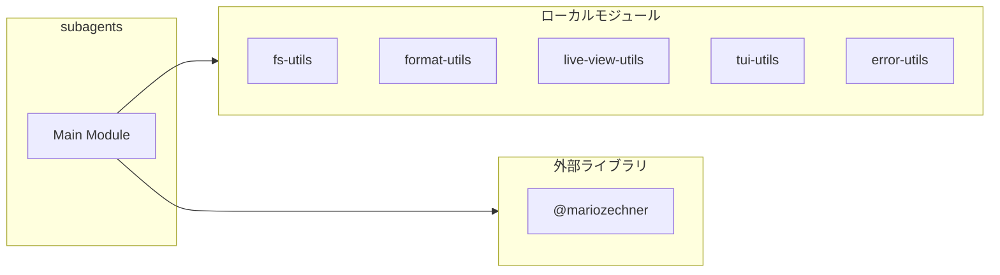
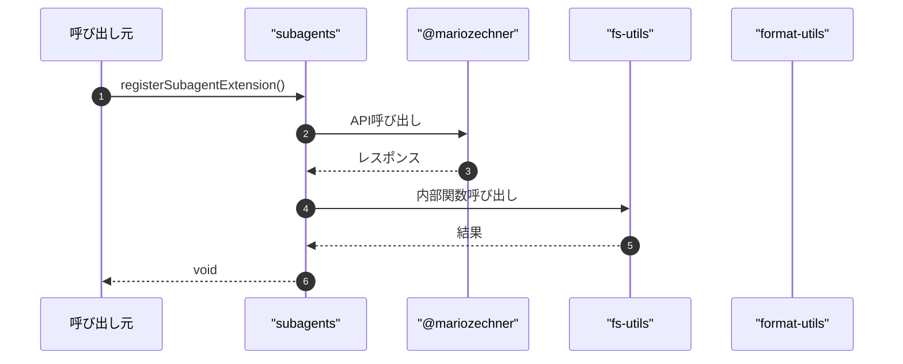

# subagents

## 概要

`subagents` モジュールのAPIリファレンス。

## インポート

```typescript
import { readdirSync, unlinkSync, writeFileSync } from 'node:fs';
import { basename, join } from 'node:path';
import { Type } from '@mariozechner/pi-ai';
import { getMarkdownTheme, isToolCallEventType, ExtensionAPI... } from '@mariozechner/pi-coding-agent';
import { Key, Markdown, matchesKey... } from '@mariozechner/pi-tui';
// ... and 31 more imports
```

## エクスポート一覧

| 種別 | 名前 | 説明 |
|------|------|------|
| 関数 | `registerSubagentExtension` | - |

## 図解

### 依存関係図



### シーケンス図



## 関数

### refreshRuntimeStatus

```typescript
refreshRuntimeStatus(ctx: any): void
```

Refresh runtime status display in the UI with subagent-specific parameters.

**パラメータ**

| 名前 | 型 | 必須 |
|------|-----|------|
| ctx | `any` | はい |

**戻り値**: `void`

### toRetryOverrides

```typescript
toRetryOverrides(value: unknown): RetryWithBackoffOverrides | undefined
```

**パラメータ**

| 名前 | 型 | 必須 |
|------|-----|------|
| value | `unknown` | はい |

**戻り値**: `RetryWithBackoffOverrides | undefined`

### toAgentId

```typescript
toAgentId(input: string): string
```

**パラメータ**

| 名前 | 型 | 必須 |
|------|-----|------|
| input | `string` | はい |

**戻り値**: `string`

### formatAgentList

```typescript
formatAgentList(storage: SubagentStorage): string
```

**パラメータ**

| 名前 | 型 | 必須 |
|------|-----|------|
| storage | `SubagentStorage` | はい |

**戻り値**: `string`

### formatRecentRuns

```typescript
formatRecentRuns(storage: SubagentStorage, limit: any): string
```

**パラメータ**

| 名前 | 型 | 必須 |
|------|-----|------|
| storage | `SubagentStorage` | はい |
| limit | `any` | はい |

**戻り値**: `string`

### runPiPrintMode

```typescript
async runPiPrintMode(input: {
  provider?: string;
  model?: string;
  prompt: string;
  timeoutMs: number;
  signal?: AbortSignal;
  onTextDelta?: (delta: string) => void;
  onStderrChunk?: (chunk: string) => void;
}): Promise<PrintCommandResult>
```

Merge skill arrays following inheritance rules.
- Empty array [] is treated as unspecified (ignored)
- Non-empty arrays are merged with deduplication

**パラメータ**

| 名前 | 型 | 必須 |
|------|-----|------|
| input | `{
  provider?: string;
  model?: string;
  prompt: string;
  timeoutMs: number;
  signal?: AbortSignal;
  onTextDelta?: (delta: string) => void;
  onStderrChunk?: (chunk: string) => void;
}` | はい |

**戻り値**: `Promise<PrintCommandResult>`

### pickAgent

```typescript
pickAgent(storage: SubagentStorage, requestedId?: string): SubagentDefinition | undefined
```

**パラメータ**

| 名前 | 型 | 必須 |
|------|-----|------|
| storage | `SubagentStorage` | はい |
| requestedId | `string` | いいえ |

**戻り値**: `SubagentDefinition | undefined`

### pickDefaultParallelAgents

```typescript
pickDefaultParallelAgents(storage: SubagentStorage): SubagentDefinition[]
```

**パラメータ**

| 名前 | 型 | 必須 |
|------|-----|------|
| storage | `SubagentStorage` | はい |

**戻り値**: `SubagentDefinition[]`

### registerSubagentExtension

```typescript
registerSubagentExtension(pi: ExtensionAPI): void
```

**パラメータ**

| 名前 | 型 | 必須 |
|------|-----|------|
| pi | `ExtensionAPI` | はい |

**戻り値**: `void`

---
*自動生成: 2026-02-18T00:15:35.626Z*
