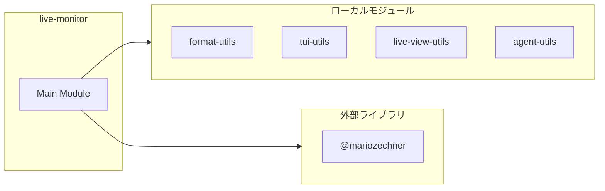
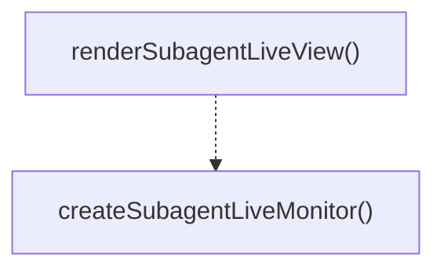
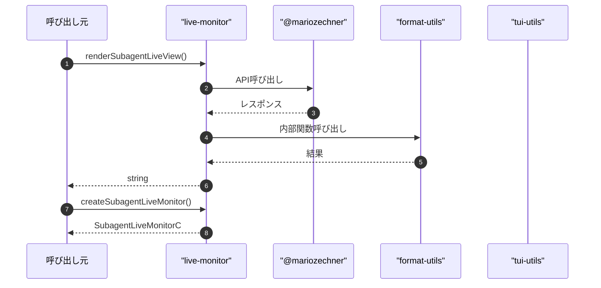

# live-monitor

## 概要

`live-monitor` モジュールのAPIリファレンス。

## インポート

```typescript
import { Key, matchesKey, truncateToWidth } from '@mariozechner/pi-tui';
import { formatDurationMs, formatBytes, formatClockTime } from '../../lib/format-utils.js';
import { appendTail, countOccurrences, estimateLineCount... } from '../../lib/tui/tui-utils.js';
import { toTailLines, looksLikeMarkdown } from '../../lib/live-view-utils.js';
import { computeLiveWindow } from '../../lib/agent-utils.js';
// ... and 2 more imports
```

## エクスポート一覧

| 種別 | 名前 | 説明 |
|------|------|------|
| 関数 | `renderSubagentLiveView` | サブエージェントのライブビューを描画する |
| 関数 | `createSubagentLiveMonitor` | サブエージェントのライブモニターを作成する |

## 図解

### 依存関係図



### 関数フロー



### シーケンス図



## 関数

### renderSubagentLiveView

```typescript
renderSubagentLiveView(input: {
  title: string;
  items: SubagentLiveItem[];
  cursor: number;
  mode: LiveViewMode;
  stream: LiveStreamView;
  width: number;
  height?: number;
  theme: any;
}): string[]
```

サブエージェントのライブビューを描画する

**パラメータ**

| 名前 | 型 | 必須 |
|------|-----|------|
| input | `{
  title: string;
  items: SubagentLiveItem[];
  cursor: number;
  mode: LiveViewMode;
  stream: LiveStreamView;
  width: number;
  height?: number;
  theme: any;
}` | はい |

**戻り値**: `string[]`

### add

```typescript
add(line: any): void
```

**パラメータ**

| 名前 | 型 | 必須 |
|------|-----|------|
| line | `any` | はい |

**戻り値**: `void`

### createSubagentLiveMonitor

```typescript
createSubagentLiveMonitor(ctx: any, input: {
    title: string;
    items: Array<{ id: string; name: string }>;
  }): SubagentLiveMonitorController | undefined
```

サブエージェントのライブモニターを作成する

**パラメータ**

| 名前 | 型 | 必須 |
|------|-----|------|
| ctx | `any` | はい |
| input | `{
    title: string;
    items: Array<{ id: string; name: string }>;
  }` | はい |

**戻り値**: `SubagentLiveMonitorController | undefined`

### clearRenderTimer

```typescript
clearRenderTimer(): void
```

**戻り値**: `void`

### queueRender

```typescript
queueRender(): void
```

**戻り値**: `void`

### close

```typescript
close(): void
```

**戻り値**: `void`

---
*自動生成: 2026-02-18T06:37:19.745Z*
