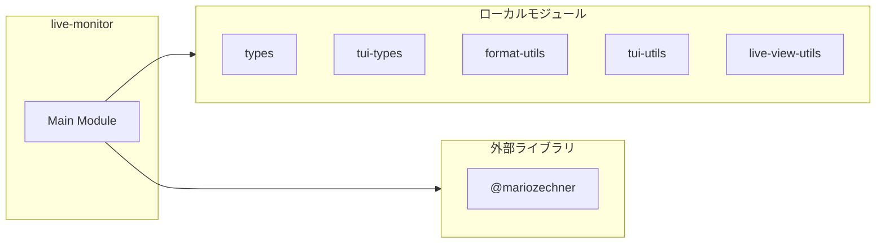
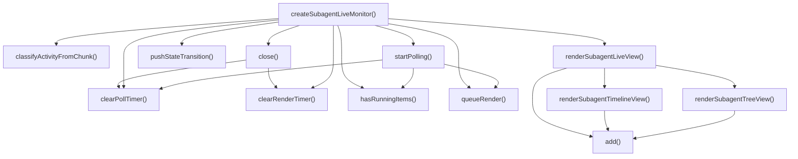
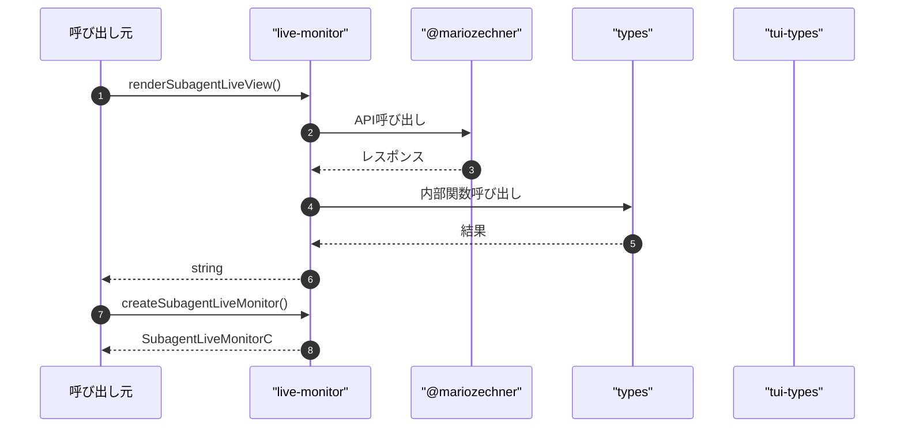

# live-monitor

## 概要

`live-monitor` モジュールのAPIリファレンス。

## インポート

```typescript
// from '@mariozechner/pi-tui': Key, matchesKey
// from '../../lib/tui/types.js': Theme, ThemeColor
// from '../../lib/tui-types.js': TuiInstance, KeybindingMap, LiveMonitorContext
// from '../../lib/format-utils.js': formatDurationMs, formatBytes, formatClockTime, ...
// from '../../lib/tui/tui-utils.js': appendTail, countOccurrences, estimateLineCount, ...
// ... and 6 more imports
```

## エクスポート一覧

| 種別 | 名前 | 説明 |
|------|------|------|
| 関数 | `renderSubagentLiveView` | ライブビューを描画 |
| 関数 | `createSubagentLiveMonitor` | ライブ監視コントローラ作成 |

## 図解

### クラス図


### 依存関係図



### 関数フロー



### シーケンス図



## 関数

### classifyActivityFromChunk

```typescript
classifyActivityFromChunk(chunk: string): NonNullable<StateTransition["activity"]>
```

**パラメータ**

| 名前 | 型 | 必須 |
|------|-----|------|
| chunk | `string` | はい |

**戻り値**: `NonNullable<StateTransition["activity"]>`

### pushStateTransition

```typescript
pushStateTransition(item: SubagentLiveItem, state: StateTransition["state"], activity?: StateTransition["activity"]): void
```

**パラメータ**

| 名前 | 型 | 必須 |
|------|-----|------|
| item | `SubagentLiveItem` | はい |
| state | `StateTransition["state"]` | はい |
| activity | `StateTransition["activity"]` | いいえ |

**戻り値**: `void`

### renderSubagentTreeView

```typescript
renderSubagentTreeView(items: SubagentLiveItem[], cursor: number, width: number, theme: Theme): string[]
```

サブエージェントのツリービューを描画

**パラメータ**

| 名前 | 型 | 必須 |
|------|-----|------|
| items | `SubagentLiveItem[]` | はい |
| cursor | `number` | はい |
| width | `number` | はい |
| theme | `Theme` | はい |

**戻り値**: `string[]`

### add

```typescript
add(line: any): void
```

**パラメータ**

| 名前 | 型 | 必須 |
|------|-----|------|
| line | `any` | はい |

**戻り値**: `void`

### renderSubagentTimelineView

```typescript
renderSubagentTimelineView(items: SubagentLiveItem[], width: number, theme: Theme): string[]
```

サブエージェントのタイムラインビューを描画

**パラメータ**

| 名前 | 型 | 必須 |
|------|-----|------|
| items | `SubagentLiveItem[]` | はい |
| width | `number` | はい |
| theme | `Theme` | はい |

**戻り値**: `string[]`

### add

```typescript
add(line: any): void
```

**パラメータ**

| 名前 | 型 | 必須 |
|------|-----|------|
| line | `any` | はい |

**戻り値**: `void`

### renderSubagentLiveView

```typescript
renderSubagentLiveView(input: {
  title: string;
  items: SubagentLiveItem[];
  cursor: number;
  mode: LiveViewMode;
  stream: LiveStreamView;
  width: number;
  height?: number;
  theme: Theme;
}): string[]
```

ライブビューを描画

**パラメータ**

| 名前 | 型 | 必須 |
|------|-----|------|
| input | `object` | はい |
| &nbsp;&nbsp;↳ title | `string` | はい |
| &nbsp;&nbsp;↳ items | `SubagentLiveItem[]` | はい |
| &nbsp;&nbsp;↳ cursor | `number` | はい |
| &nbsp;&nbsp;↳ mode | `LiveViewMode` | はい |
| &nbsp;&nbsp;↳ stream | `LiveStreamView` | はい |
| &nbsp;&nbsp;↳ width | `number` | はい |
| &nbsp;&nbsp;↳ height | `number` | いいえ |
| &nbsp;&nbsp;↳ theme | `Theme` | はい |

**戻り値**: `string[]`

### add

```typescript
add(line: any): void
```

**パラメータ**

| 名前 | 型 | 必須 |
|------|-----|------|
| line | `any` | はい |

**戻り値**: `void`

### createSubagentLiveMonitor

```typescript
createSubagentLiveMonitor(ctx: LiveMonitorContext, input: {
    title: string;
    items: Array<{ id: string; name: string }>;
  }): SubagentLiveMonitorController | undefined
```

ライブ監視コントローラ作成

**パラメータ**

| 名前 | 型 | 必須 |
|------|-----|------|
| ctx | `LiveMonitorContext` | はい |
| input | `object` | はい |
| &nbsp;&nbsp;↳ title | `string` | はい |
| &nbsp;&nbsp;↳ items | `Array<{ id: string; name: string }>` | はい |

**戻り値**: `SubagentLiveMonitorController | undefined`

### clearRenderTimer

```typescript
clearRenderTimer(): void
```

**戻り値**: `void`

### clearPollTimer

```typescript
clearPollTimer(): void
```

**戻り値**: `void`

### hasRunningItems

```typescript
hasRunningItems(): boolean
```

実行中のアイテムがあるかチェック

**戻り値**: `boolean`

### startPolling

```typescript
startPolling(): void
```

定期ポーリングを開始（ストリーミングがない期間もUIを更新）

**戻り値**: `void`

### queueRender

```typescript
queueRender(): void
```

**戻り値**: `void`

### close

```typescript
close(): void
```

**戻り値**: `void`

## インターフェース

### TimelineEvent

```typescript
interface TimelineEvent {
  time: string;
  agent: string;
  type: "start" | "done" | "fail" | "output";
  content: string;
}
```

---
*自動生成: 2026-02-28T13:55:22.850Z*
